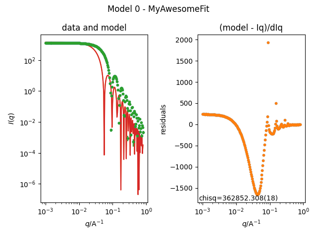

<div align='center'>
    <a href="https://github.com/SasView/sasview/releases/latest"></a>
    <a href="https://github.com/SasView/sasview/commits/main"></a>
    <a href="https://sasview.org"></a>
    <a href="https://opensource.org/licenses/bsd-3-clause"></a>
</div>

---

# General

[SasView](http://www.sasview.org) is a Small Angle Scattering (SAS) analysis package for the analysis of 1D and 2D scattering data directly in inverse space. The focus was originally on neutron data (SANS) but has been used for X-ray’s as well and includes a tool for determining a slit resolution for the SAXSess instrument. SansView also includes PrView to invert SAS data to P(r), a resolution calculator, and a scattering length density calculator among others tools. A simple plugin mechanism is available for users to add custom models.

# Acknowledgement

This project was initiated by the NSF-funded DANSE project, DMR-0520547, a SANS sub-project at the University of Tennessee. Acknowledgement of that original funding would be appreciated in any publications that make use of the software.

This project received funding from the European Union’s Horizon 2020 research and innovation programme under the SINE2020 project, grant agreement No 654000.

[SasView website](http://www.sasview.org)

The latest stable releases of SasView can be found on the website.
The following instructions will focus on providing materials for scripting, developing and would lead you to the most important resources.

# Install instructions

## Users

The required packages can currently be installed

### Install using `pip` inside the working directory:

```shell
python -m venv .venv # create the environment
. .venv/bin/activate # activate the environment on linux and MacOS
# .venv\Scripts\activate & REM Windows: activate environment

python -m pip install sasview

python -m sasview # launch gui
```

### Install using `uv` inside the working directory:

```shell
uv init
uv add sasview

uv run sasview # launch the gui
```

`Note:` Currently to have the python package as an executable model (launch the gui using `python -m sas` or `uv run sas`) it requires to be installed from source.

## Developers

The `pip` installation instructions for developers can be found [here](INSTALL.md).
Installing the dev-verion of SasView with conda is currently not supported.
`NOTE:` In case you want to contribute, please also checkout the [DevlopersNotes](https://github.com/SasView/sasview/wiki/DevNotes_DevGuide_GettingStarted).

## Getting Started

### Scripting

This section is a small scripting example in SasView to check your installation.
We will fit a simple sphere model. For this first lets synthesize input data.

```python
import numpy as np
from sasmodels.bumps_model import Model
from sasmodels.core import load_model
from sasmodels.direct_model import call_kernel

# define q vector
q = np.logspace(-3, -0.1, 200)

# define the model
exp_model = load_model("sphere")
exp_pars = {
    "radius": 50,
    "sld": 1,
    "sld_solvent": 6,
    "scale": 1,
    "background": 0.001,
}

# calculate intensities
Iq = call_kernel(exp_model.make_kernel([q]), exp_pars)

# calculate errors and normalize data
max_counts = 1e7  # approximate number of counts at first q values
norm = Iq[0] / max_counts
counts = np.random.poisson((Iq / norm).astype(int))
errors = np.sqrt(counts) * norm
data = counts * norm
dataset = np.array([q, data, errors]).T

# saving the data
header = (
    "Neutron-like data generated for model "
    + exp_model.info.name
    + " with parameters:\n"
)
for key in exp_pars.keys():
    header += key + " = " + str(exp_pars[key]) + "\n"
header += "Q\t counts\t error"

np.savetxt("scattering.txt", dataset, fmt="%12.6e", delimiter="\t", header=header)
```

...and now let's do the fitting. We will optimize the scale, radius and background starting from an inital values close to the ground truth.

```python
import matplotlib.pyplot as plt
from sasmodels.bumps_model import Model, Experiment
from sasmodels.core import load_model
from sasmodels.data import load_data
from bumps.fitters import fit
from bumps.names import FitProblem

# defining the  model to fit
fit_pars = {
    "radius": 80,
    "sld": 1,
    "sld_solvent": 6,
    "scale": 0.900,
    "background": 0.05,
}
fit_kernel = load_model("sphere")
fit_model = Model(fit_kernel, **fit_pars)

## setting fitting ranges
fit_model.radius.range(10, 1000)
fit_model.scale.range(1e-3, 10)
fit_model.background.range(1e-9, 0.1)

# load the data we synthesized above
exp_data = load_data("scattering.txt")

# Setup the experiments, sharing the same model across all datasets.
M = Experiment(data=exp_data, model=fit_model, name="MyAwsomeFit")

problem = FitProblem(M)

plt.figure()
problem.plot(view=True)

# fit the results
result = fit(problem, method="dream")

print(f"Final chisq {problem.chisq()}\n")
problem.plot()
for k, v, dv in zip(problem.labels(), result.x, result.dx):
    print(f"{k} : {v:.4f} +- {dv:.4f}")
plt.show()
```

This simple fit should results in a $\chi^2$ close to one.



# Resources

In case you are just getting started or you want to contribute please checkout some selected [resources](/RESOURCES.md).
