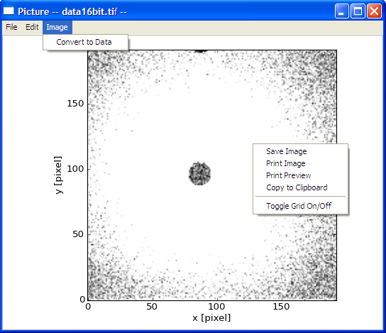

.. image_viewer_help.rst

.. This is a port of the original SasView html help file to ReSTructured text
.. by S King, ISIS, during SasView CodeCamp-III in Feb 2015.

Image Viewer Tool
=================

Description
-----------

This tool loads image files and displays them as 2D (x-y coordinate against 
counts per pixel). The plot can then can be saved, printed, and copied. The 
plot can also be resized by dragging the corner of the panel.

The supported input image formats are:

*  BMP (bitmap format)
*  GIF (graphical interchange format)
*  JPG (joint photographic experts group format)
*  PNG (portable network graphics format)
*  TIF (tagged image format)

.. ZZZZZZZZZZZZZZZZZZZZZZZZZZZZZZZZZZZZZZZZZZZZZZZZZZZZZZZZZZZZZZZZZZZZZZZZZZZZ

Using the tool
--------------

1) Select *Image Viewer* from the *Tool* menu on the SasView toolbar.

2) Select a file and then click *Open*. If the loading is successful the image 
   will be displayed.

.. image:: load_image.bmp

3) To save, print, or copy the image, or to apply a grid overlay, right-click 
   anywhere in the plot.

4. If the image is taken from a 2D detector, SasView can attempt to convert 
   the colour/grey scale into pseudo-intensity 2D data using 

   z = (0.299 x R) + (0.587 x G) + (0.114 x B)

   unless the image is formatted as 8-bit grey-scale TIF.

5. In the *Convert to Data* dialog, set the parameters relevant to the data and 
   then click the OK.

.. image:: pic_convert.bmp

.. ZZZZZZZZZZZZZZZZZZZZZZZZZZZZZZZZZZZZZZZZZZZZZZZZZZZZZZZZZZZZZZZZZZZZZZZZZZZZZ

.. note::  This help document was last changed by Steve King, 01May2015
