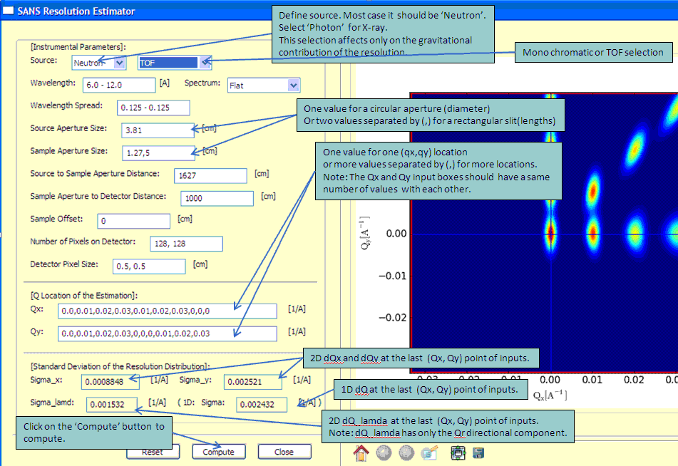
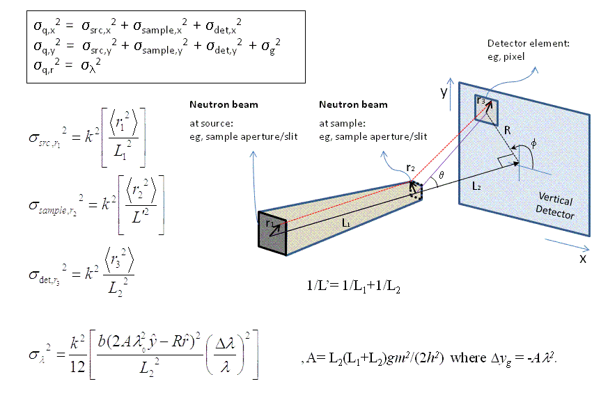

.. resolution_calculator_help.rst

.. This is a port of the original SasView html help file to ReSTructured text
.. by S King, ISIS, during SasView CodeCamp-III in Feb 2015.

Q Resolution Estimator Tool
===========================

Description
-----------

This tool is approximately estimates the resolution of Q from SAS instrumental 
parameter values assuming that the detector is flat and normal to the 
incident beam.

.. ZZZZZZZZZZZZZZZZZZZZZZZZZZZZZZZZZZZZZZZZZZZZZZZZZZZZZZZZZZZZZZZZZZZZZZZZZZZZZ

Using the tool
--------------

1) Select *SAS Resolution Estimator* from the *Tool* menu on the SasView toolbar.

2) Select the source (Neutron or Photon) and source type (Monochromatic or TOF).

   *NOTE! The computational difference between the sources is only the 
   gravitational contribution due to the mass of the particles.*

3) Change the default values of the instrumental parameters as required. Be 
   careful to note that distances are specified in cm!

4) Enter values for the source wavelength(s), |lambda|\ , and its spread (= FWHM/|lambda|\ ).
   
   For monochromatic sources, the inputs are just one value. For TOF sources, 
   the minimum and maximum values should be separated by a '-' to specify a 
   range.
   
   Optionally, the wavelength (BUT NOT of the wavelength spread) can be extended 
   by adding '; nn' where the 'nn' specifies the number of the bins for the 
   numerical integration. The default value is nn = 10. The same number of bins 
   will be used for the corresponding wavelength spread.

5) For TOF, the default wavelength spectrum is flat. A custom spectral 
   distribution file (2-column text: wavelength (|Ang|\) vs Intensity) can also 
   be loaded by selecting *Add new* in the combo box.

6) When ready, click the *Compute* button. Depending on the computation the 
   calculation time will vary.

7) 1D and 2D dQ values will be displayed at the bottom of the panel, and a 2D 
   resolution weight distribution (a 2D elliptical Gaussian function) will also 
   be displayed in the plot panel even if the Q inputs are outside of the 
   detector limit (the red lines indicate the limits of the detector).
   
   TOF only: green lines indicate the limits of the maximum Q range accessible 
   for the longest wavelength due to the size of the detector.
    
   Note that the effect from the beam block/stop is ignored, so in the small Q 
   region near the beam block/stop 

   [ie., Q < 2. |pi|\ .(beam block diameter) / (sample-to-detector distance) / |lambda|\_min] 

   the variance is slightly under estimated.

8) A summary of the calculation is written to the SasView *Console* at the 
   bottom of the main SasView window.

.. ZZZZZZZZZZZZZZZZZZZZZZZZZZZZZZZZZZZZZZZZZZZZZZZZZZZZZZZZZZZZZZZZZZZZZZZZZZZZZ

Theory
------

The scattering wave transfer vector is by definition

.. image:: q.gif

In the small-angle limit, the variance of Q is to a first-order 
approximation

The geometric and gravitational contributions can then be summarised as

.. image:: sigma_table.gif

Finally, a Gaussian function is used to describe the 2D weighting distribution 
of the uncertainty in Q.

.. ZZZZZZZZZZZZZZZZZZZZZZZZZZZZZZZZZZZZZZZZZZZZZZZZZZZZZZZZZZZZZZZZZZZZZZZZZZZZZ

References
----------

D.F.R. Mildner and J.M. Carpenter 
*J. Appl. Cryst.* 17 (1984) 249-256

D.F.R. Mildner, J.M. Carpenter and D.L. Worcester 
*J. Appl. Cryst.* 19 (1986) 311-319

.. ZZZZZZZZZZZZZZZZZZZZZZZZZZZZZZZZZZZZZZZZZZZZZZZZZZZZZZZZZZZZZZZZZZZZZZZZZZZZZ

.. note::  This help document was last changed by Steve King, 01May2015
