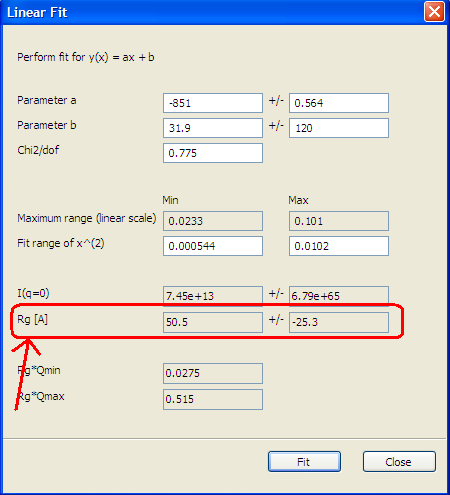

..graph_help.rst

.. This is a port of the original SasView html help file to ReSTructured text
.. by S King, ISIS, during SasView CodeCamp-III in Feb 2015.

Plotting Data/Models
====================

1. Graph Menu_
2. 2D Data Averaging_
3. Key Combinations_

.. ZZZZZZZZZZZZZZZZZZZZZZZZZZZZZZZZZZZZZZZZZZZZZZZZZZZZZZZZZZZZZZZZZZZZZZZZZZZZ

.. _Graph menu:

Graph Menu
----------

Introduction_ 
Reset Graph_ 
Hide/Show/Delete Graph_ 
Data Info_ 
Save Plot Image_ 
Save Data_ 
Drag Plot_ 
Zoom In/Out_ 
Remove Data_ 
Change Scale_ 
Linear Fit_ 
Other Graph Modifications_ 

.. _Introduction: 

Locating the pointer and right-clicking on a data/theory plot will bring a 
context menu. On the menu, select a menu item.

.. _Reset Graph: 

To reset the graph's axis range, right click on the plot and the context menu 
pops-up. Select *Reset Graph*  and the plot will take its initial range. Also 
the 'home' icon in tool bar will do the same.

.. _Hide/Show/Delete Graph: 

To Hide, click the Hide (bar) button in the tool bar.To Show, select the the 
'Show' menu item in the 'Graph' menu in the menu bar.To Delete, click the 'x' 
button in the title bar.

Note: If a residuals graph (in Fitting) is hidden, it will not show up after 
computation.

.. _Save Plot Image: 

Right click on plot. Context menu will pop-up select save image [file name].
A dialog window opens and write a the name of the file to save and click on 
*Save Image.*

.. _Data Info: 

From the context menu, select 'Data Info' to see the data information dialog 
panel.

.. _Save Data: 

From the context menu, select 'Save points as a file' for 1D, or 'Save as a 
file(DAT)' for 2D. Note that two formats, txt and xml, are available in 1D 
saving.

.. _Drag Plot: 

Select the *crossed arrows*  button on the plot panel *toolbar*  to drag the 
plot. To disable dragging mode, unselect the same button on the toolbar.

.. _Remove data from plot: 

Highlight the plot and the context menu appears.Select *remove [file name]*. 
The plot selected will disappear.

.. _Zoom In/Out: 

Select the *rectangle*  button on the plot panel *toolbar*  to zoom in a 
region of the plot.

To disable zoom mode, unselect the same button on the toolbar. After zoom in 
a region, select *left arrow*  or *right arrow*  button on the toolbar to set 
the graph the the previous size. If a mouse wheel button is available, 
*zoom in/out*  by scrolling the mouse wheel (see Key combination_ help for 
details).

.. _Change Scale: 

If the loaded data is a 1-D data changing scale or data representation will 
work as follows. *Right click* on the plot window. A context menu pops-up and 
select *Change Scale* . A dialog window titled *select the scale of the graph* 
will pop-up then change the *x* , the *y*  and the *view*  values as wish. 
The 'view' option includes the axis scale short-cuts such as Linear, Guinier, 
Cross-sectional (XC) Guinier, and Porod plot scale. For a proper data set, 
these axis scales can be used to estimate Rg, Rod diameter, or Background of 
neutron scattering data respectively (via 'Linear Fit'; see below). For a 2D 
image, *Right click*  on the image to pop-up the context menu. Select to 
switch from linear to log scale. The scale selected is printed on the status 
bar.

.. _Linear Fit: 

Linear fit is to perform a line model fitting keeping the scale of the plot. 
Highlight data to fit. From the context menu select *Linear Fit* . A dialog 
window appears. Change model initial parameters, data limits and hit *fit* 
button. New parameters values are displayed and the line with the new 
parameters is added to the plot. Especially for Guinier, XC Guinier, and 
Porod plot scale, this 'Linear Fit' will provides Rg, Rod diameter, and 
background, respectively. The following figure shows an example for the 
Guinier scale.

.. _Change scale

If the loaded data is a 1-D data changing scale or data representation will 
work as follows. *Right click* on the plot window. A context menu pops-up and 
select *Change Scale* . A dialog window titled *select the scale of the graph* 
will pop-up then change the *x* , the *y*  and the *view*  values as wish. 
If the loaded data is an image. *Right click*  on the image to pop-up the 
context menu. Select to switch from linear to log scale. The scale selected is 
printed on the statusbar.

.. _Other Graph Modifications: 

Some custom modifications of the symbols, text, axis, etc of the graph are 
provided

.. ZZZZZZZZZZZZZZZZZZZZZZZZZZZZZZZZZZZZZZZZZZZZZZZZZZZZZZZZZZZZZZZZZZZZZZZZZZZZ

.. _2D data averaging

2D Data Averaging
-----------------

Description_ 
How to Average_ 
Available Averagings_
Perform Circular Average_ 
Masked Circular Average_ 
Sector [Q view]_ 
Annulus [Phi view]_ 
Box Sum_ 
Box Averaging in Qx_ 
Box Averaging in Qy_ 

.. ZZZZZZZZZZZZZZZZZZZZZZZZZZZZZZZZZZZZZZZZZZZZZZZZZZZZZZZZZZZZZZZZZZZZZZZZZZZZ

.. _Description: 

This feature allows you to perform different types of averages on your data, 
and allows you to see what regions of the detector will contribute to the 
average. The region to be averaged will be drown and can be modified by 
dragging the lines around.

.. _How to Average 

Right click on 2D data for the context menu to appear. Select one type of 
averages among *"sector [Q view]", "Annulus [Phi view]", "Box sum", "Box 
averaging in Qx ", "box averaging on Qy","Perform circular Average".*

A slicer will appear except for *"Perform circular Average"*  that you can 
drag by clicking on a slicer 's marker. When the marker is highlighted in red, 
it means that the slicer can change size.You can also move some of the slicer 
by simply drag its side when highlighted in red. the slicer size will be reset 
to its previous size if the user try to select a region greater than the size 
of the data.

The user can also select a region to average when a slicer has been selected 
already by *right clicking*  on the context menu and selecting *Edit Slicer 
Parameters* . The dialog window will appears and the user can enter values to 
selected a region or selected numbers of points to plot *nbins* .

For *Box sum* , when the user selects this option, a new panel is created 
containing the result of average of the sum of every pixels contains on that 
data.The user can also enter values to select a region.

.. _Available Averagings:

???

.. _Perform Circular Average: 

It will perform and average in constant q-rings around the (x,y) pixel 
location of the beam center.

.. _Masked Circular Average: 

This operation is same as 'Perform Circular Average' except that the masked 
region is excluded if masked.

.. _Sector [Q view]: 

It averages in constant q-arcs. The width of the sector is specified in 
degrees (+/- delta phi) each direction from the central angle (phi).

.. _Annulus [Phi view]: 

It performs an average between two q-values centered in (0,0), and averaged 
over a width of a specified number of pixels. The data is returned as a 
function of angle (phi) in degrees. Moving one circle of this slicer to 
radius of zero corresponding to a circular averaging on radius qmax , the 
outer circle. The angle zero starts from the positive x-axis direction.

.. _Box Sum: 

Perform the sum of counts in a 2D region of interest.When editing the slicer, 
the user can enter the length and the width the rectangle slicer and the 
coordinates of the center of this rectangle.

.. _Box Averaging in Qx: 

Computes average I(Qx) for a region of interest. When editing the slicer, the 
user can control the length and the width the rectangle slicer. The averaged 
output is calculated from the constant bins with rectangular shape. The 
resultant q values are nominal values, i.e., the central values of each bins 
on the x-axis.

.. _Box Averaging in Qy: 

Computes average I(Qy) for a region of interest.When editing the slicer, the 
user can control the length and the width the rectangle slicer. The averaged 
output is calculated from the constant bins with rectangular shape. The 
resultant q values are nominal values, i.e., the central values of each bins 
on the y-axis.

.. ZZZZZZZZZZZZZZZZZZZZZZZZZZZZZZZZZZZZZZZZZZZZZZZZZZZZZZZZZZZZZZZZZZZZZZZZZZZZ

.. _Key combination

Key Combination
---------------

Floating Panel_ 
Graph Context Menu_ 
Zoom In and Out_ 

.. ZZZZZZZZZZZZZZZZZZZZZZZZZZZZZZZZZZZZZZZZZZZZZZZZZZZZZZZZZZZZZZZZZZZZZZZZZZZZ

.. _Floating Panel: 

For a graph panel to float on the top of the SV window:

Press the *Ctrl(Cmd on MAC) key*  on dragging and placing a panel. Or if you 
want to make all plot panels float, select 'Float' from Graph/Preperences in 
the menu bar. Otherwise choose 'Dock'.

.. _Graph Context Menu: 

To get the graph context menu to print, copy, save data, (2D)average, etc, 
*locate the mouse point on the plot to highlight and *(Mouse) Right Click* 
to bring up the full menu.

.. _Zoom In and Out: 

To Zoom in or out the full plot, *locate the mouse point inside the graph 
which will be the center of the zooming, then *rotate MouseWheel*.

*To Zoom in or out the plot in x or y direction, *locate (and click) the 
mouse point near x (or y) axis just outside of the graph and then *rotate 
MouseWheel* .* Note that this works only on the 1D plots.
