.. model_functions.rst

.. This is a port of the original SasView model_functions.html to ReSTructured text
.. by S King, ISIS, during and after SasView CodeCamp-II in April 2014.

.. Thanks are due to A Jackson & P Kienzle for advice on RST!

.. The CoreShellEllipsoidXTModel was ported and documented by R K Heenan, ISIS, Apr 2014
.. The RectangularPrism models were coded and documented by M A Gonzalez, ILL, Apr 2014

.. To do:
.. Add example parameters/plots for the CoreShellEllipsoidXTModel
.. Add example parameters/plots for the RectangularPrism models
.. Check the content against the NIST Igor Help File
.. Wordsmith the content for consistency of style, etc

.. ZZZZZZZZZZZZZZZZZZZZZZZZZZZZZZZZZZZZZZZZZZZZZZZZZZZZZZZZZZZZZZZZZZZZZZZZZZZZZZZZZZZZZZZZZZZZZZZZZZZZZZZZZZZZZZZZZZZZZ

.. note::  The contents of this document are presented in good faith and are 
           believed to be mostly correct and accurate, however they have not 
           yet been rigorously checked for errors. June2015

.. Set up some substitutions to make life easier...

.. |alpha| unicode:: U+03B1
.. |beta| unicode:: U+03B2
.. |gamma| unicode:: U+03B3
.. |delta| unicode:: U+03B4
.. |epsilon| unicode:: U+03B5
.. |zeta| unicode:: U+03B6
.. |eta| unicode:: U+03B7
.. |theta| unicode:: U+03B8
.. |iota| unicode:: U+03B9
.. |kappa| unicode:: U+03BA
.. |lambda| unicode:: U+03BB
.. |mu| unicode:: U+03BC
.. |nu| unicode:: U+03BD
.. |xi| unicode:: U+03BE
.. |omicron| unicode:: U+03BF
.. |pi| unicode:: U+03C0
.. |rho| unicode:: U+03C1
.. |sigma| unicode:: U+03C3
.. |tau| unicode:: U+03C4
.. |upsilon| unicode:: U+03C5
.. |phi| unicode:: U+03C6
.. |chi| unicode:: U+03C7
.. |psi| unicode:: U+03C8
.. |omega| unicode:: U+03C9
.. |biggamma| unicode:: U+0393
.. |bigdelta| unicode:: U+0394
.. |bigzeta| unicode:: U+039E
.. |bigpsi| unicode:: U+03A8
.. |drho| replace:: |bigdelta|\ |rho|
.. |Ang| unicode:: U+212B
.. |Ang^-1| replace:: |Ang|\ :sup:`-1`
.. |Ang^2| replace:: |Ang|\ :sup:`2`
.. |Ang^-2| replace:: |Ang|\ :sup:`-2`
.. |Ang^3| replace:: |Ang|\ :sup:`3`
.. |Ang^-3| replace:: |Ang|\ :sup:`-3`
.. |Ang^-4| replace:: |Ang|\ :sup:`-4`
.. |cm^-1| replace:: cm\ :sup:`-1`
.. |cm^2| replace:: cm\ :sup:`2`
.. |cm^-2| replace:: cm\ :sup:`-2`
.. |cm^3| replace:: cm\ :sup:`3`
.. |cm^-3| replace:: cm\ :sup:`-3`
.. |sr^-1| replace:: sr\ :sup:`-1`
.. |P0| replace:: P\ :sub:`0`\
.. |A2| replace:: A\ :sub:`2`\

.. ZZZZZZZZZZZZZZZZZZZZZZZZZZZZZZZZZZZZZZZZZZZZZZZZZZZZZZZZZZZZZZZZZZZZZZZZZZZZZZZZZZZZZZZZZZZZZZZZZZZZZZZZZZZZZZZZZZZZZ

.. Actual document starts here...

.. _SasView_model_functions:

SasView Model Functions
=======================

.. _Background:

1. Background
---------------

Many of our models use the form factor calculations implemented in a c-library provided by the NIST Center for Neutron
Research and thus some content and figures in this document are originated from or shared with the NIST SANS Igor-based
analysis package.

This software provides form factors for various particle shapes. After giving a mathematical definition of each model,
we show the list of parameters available to the user. Validation plots for each model are also presented.

Instructions on how to use SasView itself are available separately.

To easily compare to the scattering intensity measured in experiments, we normalize the form factors by the volume of
the particle

.. image:: img/image001.PNG

with

.. image:: img/image002.PNG

where |P0|\ *(q)* is the un-normalized form factor, |rho|\ *(r)* is the scattering length density at a given
point in space and the integration is done over the volume *V* of the scatterer.

For systems without inter-particle interference, the form factors we provide can be related to the scattering intensity
by the particle volume fraction

.. image:: img/image003.PNG

Our so-called 1D scattering intensity functions provide *P(q)* for the case where the scatterer is randomly oriented. In
that case, the scattering intensity only depends on the length of *q* . The intensity measured on the plane of the SAS
detector will have an azimuthal symmetry around *q*\ =0 .

Our so-called 2D scattering intensity functions provide *P(q,* |phi| *)* for an oriented system as a function of a
q-vector in the plane of the detector. We define the angle |phi| as the angle between the q vector and the horizontal
(x) axis of the plane of the detector.

For information about polarised and magnetic scattering, click here_.

.. _here: polar_mag_help.html

.. ZZZZZZZZZZZZZZZZZZZZZZZZZZZZZZZZZZZZZZZZZZZZZZZZZZZZZZZZZZZZZZZZZZZZZZZZZZZZZZZZZZZZZZZZZZZZZZZZZZZZZZZZZZZZZZZZZZZZZ

.. _Model:

2. Model functions
------------------

.. _Shape-based:

2.1 Shape-based Functions
-------------------------

Sphere-based
------------

- SphereModel_ (including magnetic 2D version)
- BinaryHSModel_
- FuzzySphereModel_
- RaspBerryModel_
- CoreShellModel_ (including magnetic 2D version)
- MicelleSphCoreModel_
- CoreMultiShellModel_ (including magnetic 2D version)
- Core2ndMomentModel_
- MultiShellModel_
- OnionExpShellModel_
- VesicleModel_
- SphericalSLDModel_
- LinearPearlsModel_
- PearlNecklaceModel_

Cylinder-based
--------------

- CylinderModel_ (including magnetic 2D version)
- HollowCylinderModel_
- CappedCylinderModel_
- CoreShellCylinderModel_
- EllipticalCylinderModel_
- FlexibleCylinderModel_
- FlexCylEllipXModel_
- CoreShellBicelleModel_
- BarBellModel_
- StackedDisksModel_
- PringleModel_

Ellipsoid-based
---------------

- EllipsoidModel_
- CoreShellEllipsoidModel_
- CoreShellEllipsoidXTModel_
- TriaxialEllipsoidModel_

Lamellae
--------

- LamellarModel_
- LamellarFFHGModel_
- LamellarPSModel_
- LamellarPSHGModel_

Paracrystals
------------

- LamellarPCrystalModel_
- SCCrystalModel_
- FCCrystalModel_
- BCCrystalModel_

Parallelpipeds
--------------

- ParallelepipedModel_ (including magnetic 2D version)
- CSParallelepipedModel_
- RectangularPrismModel_
- RectangularHollowPrismModel_
- RectangularHollowPrismInfThinWallsModel_

.. _Shape-independent:

2.2 Shape-Independent Functions
-------------------------------

(In alphabetical order)

- AbsolutePower_Law_
- BEPolyelectrolyte_
- BroadPeakModel_
- CorrLength_
- DABModel_
- Debye_
- FractalModel_
- FractalCoreShell_
- GaussLorentzGel_
- GelFitModel_
- Guinier_
- GuinierPorod_
- LineModel_
- Lorentz_
- MassFractalModel_
- MassSurfaceFractal_
- PeakGaussModel_
- PeakLorentzModel_
- Poly_GaussCoil_
- PolyExclVolume_
- PorodModel_
- RPA10Model_
- StarPolymer_
- SurfaceFractalModel_
- TeubnerStrey_
- TwoLorentzian_
- TwoPowerLaw_
- UnifiedPowerRg_
- ReflectivityModel_
- ReflectivityIIModel_

.. _Structure-factor:

2.3 Structure Factor Functions
------------------------------

- HardSphereStructure_
- SquareWellStructure_
- HayterMSAStructure_
- StickyHSStructure_

.. _Customised:

2.4 Customized Functions
------------------------

- testmodel_
- testmodel_2_
- sum_p1_p2_
- sum_Ap1_1_Ap2_
- polynomial5_
- sph_bessel_jn_

Also see the documentation on :ref:`Adding_your_own_models` under Fitting Data. 

.. ZZZZZZZZZZZZZZZZZZZZZZZZZZZZZZZZZZZZZZZZZZZZZZZZZZZZZZZZZZZZZZZZZZZZZZZZZZZZZZZZZZZZZZZZZZZZZZZZZZZZZZZZZZZZZZZZZZZZZ

.. _References:

3. References
-------------

*Small-Angle Scattering of X-Rays*
A Guinier and G Fournet
John Wiley & Sons, New York (1955)

P Stckel, R May, I Strell, Z Cejka, W Hoppe, H Heumann, W Zillig and H Crespi
*Eur. J. Biochem.*, 112, (1980), 411-417

G Porod
in *Small Angle X-ray Scattering*
(editors) O Glatter and O Kratky
Academic Press (1982)

*Structure Analysis by Small-Angle X-Ray and Neutron Scattering*
L.A Feigin and D I Svergun
Plenum Press, New York (1987)

S Hansen
*J. Appl. Cryst.* 23, (1990), 344-346

S J Henderson
*Biophys. J.* 70, (1996), 1618-1627

B C McAlister and B P Grady
*J. Appl. Cryst.* 31, (1998), 594-599

S R Kline
*J Appl. Cryst.* 39(6), (2006), 895

**Also see the references at the end of the each model function descriptions.**

.. ZZZZZZZZZZZZZZZZZZZZZZZZZZZZZZZZZZZZZZZZZZZZZZZZZZZZZZZZZZZZZZZZZZZZZZZZZZZZZZZZZZZZZZZZZZZZZZZZZZZZZZZZZZZZZZZZZZZZZ

Model Definitions
-----------------

.. _SphereModel:

**2.1.1. SphereModel**

This model provides the form factor, *P(q)*, for a monodisperse spherical particle with uniform scattering length
density. The form factor is normalized by the particle volume as described below.

For information about polarised and magnetic scattering, click here_.

.. _here: polar_mag_help.html

*2.1.1.1. Definition*

The 1D scattering intensity is calculated in the following way (Guinier, 1955)

.. image:: img/image004.PNG

where *scale* is a volume fraction, *V* is the volume of the scatterer, *r* is the radius of the sphere, *bkg* is
the background level and *sldXXX* is the scattering length density (SLD) of the scatterer or the solvent.

Note that if your data is in absolute scale, the *scale* should represent the volume fraction (which is unitless) if
you have a good fit. If not, it should represent the volume fraction \* a factor (by which your data might need to be
rescaled).

The 2D scattering intensity is the same as above, regardless of the orientation of the q vector.

The returned value is scaled to units of |cm^-1| and the parameters of the SphereModel are the following:

==============  ========  =============
Parameter name  Units     Default value
==============  ========  =============
scale           None      1
radius          |Ang|     60
sldSph          |Ang^-2|  2.0e-6
sldSolv         |Ang^-2|  1.0e-6
background      |cm^-1|   0
==============  ========  =============

Our model uses the form factor calculations implemented in a c-library provided by the NIST Center for Neutron
Research (Kline, 2006).

REFERENCE

A Guinier and G. Fournet, *Small-Angle Scattering of X-Rays*, John Wiley and Sons, New York, (1955)

*2.1.1.2. Validation of the SphereModel*

Validation of our code was done by comparing the output of the 1D model to the output of the software provided by the
NIST (Kline, 2006). Figure 1 shows a comparison of the output of our model and the output of the NIST software.

.. image:: img/image005.jpg

Figure 1: Comparison of the DANSE scattering intensity for a sphere with the output of the NIST SANS analysis software.
The parameters were set to: Scale=1.0, Radius=60 |Ang|, Contrast=1e-6 |Ang^-2|, and Background=0.01 |cm^-1|.

*2013/09/09 and 2014/01/06 - Description reviewed by S King and P Parker.*

.. _BinaryHSModel:

**2.1.2. BinaryHSModel**

*2.1.2.1. Definition*

This model (binary hard sphere model) provides the scattering intensity, for binary mixture of spheres including hard
sphere interaction between those particles. Using Percus-Yevick closure, the calculation is an exact multi-component
solution

.. image:: img/image006.PNG

where *Sij* are the partial structure factors and *fi* are the scattering amplitudes of the particles. The subscript 1
is for the smaller particle and 2 is for the larger. The number fraction of the larger particle, (*x* = n2/(n1+n2),
where *n* = the number density) is internally calculated based on

.. image:: img/image007.PNG

The 2D scattering intensity is the same as 1D, regardless of the orientation of the *q* vector which is defined as

.. image:: img/image008.PNG

The parameters of the BinaryHSModel are the following (in the names, *l* (or *ls*\ ) stands for larger spheres
while *s* (or *ss*\ ) for the smaller spheres).

==============  ========  =============
Parameter name  Units     Default value
==============  ========  =============
background      |cm^-1|   0.001
l_radius        |Ang|     100.0
ss_sld          |Ang^-2|  0.0
ls_sld          |Ang^-2|  3e-6
solvent_sld     |Ang^-2|  6e-6
s_radius        |Ang|     25.0
vol_frac_ls     None      0.1
vol_frac_ss     None      0.2
==============  ========  =============

.. image:: img/image009.jpg

*Figure. 1D plot using the default values above (w/200 data point).*

Our model uses the form factor calculations implemented in a c-library provided by the NIST Center for Neutron
Research (Kline, 2006).

See the reference for details.

REFERENCE

N W Ashcroft and D C Langreth, *Physical Review*, 156 (1967) 685-692
[Errata found in *Phys. Rev.* 166 (1968) 934]

.. _FuzzySphereModel:

**2.1.3. FuzzySphereModel**

This model is to calculate the scattering from spherical particles with a "fuzzy" interface.

*2.1.3.1. Definition*

The scattering intensity *I(q)* is calculated as:

.. image:: img/image010.PNG

where the amplitude *A(q)* is given as the typical sphere scattering convoluted with a Gaussian to get a gradual
drop-off in the scattering length density

.. image:: img/image011.PNG

Here |A2|\ *(q)* is the form factor, *P(q)*. The scale is equivalent to the volume fraction of spheres, each of
volume, *V*\. Contrast (|drho|) is the difference of scattering length densities of the sphere and the surrounding
solvent.

Poly-dispersion in radius and in fuzziness is provided for.

The returned value is scaled to units of |cm^-1|\ |sr^-1|; ie, absolute scale.

From the reference

  The "fuzziness" of the interface is defined by the parameter |sigma| :sub:`fuzzy`\ . The particle radius *R*
  represents the radius of the particle where the scattering length density profile decreased to 1/2 of the core
  density. The |sigma| :sub:`fuzzy`\ is the width of the smeared particle surface; i.e., the standard deviation
  from the average height of the fuzzy interface. The inner regions of the microgel that display a higher density
  are described by the radial box profile extending to a radius of approximately *Rbox* ~ *R* - 2\ |sigma|\ . The
  profile approaches zero as *Rsans* ~ *R* + 2\ |sigma|\ .

For 2D data: The 2D scattering intensity is calculated in the same way as 1D, where the *q* vector is defined as

.. image:: img/image008.PNG

This example dataset is produced by running the FuzzySphereModel, using 200 data points, *qmin* = 0.001 -1,
*qmax* = 0.7 |Ang^-1| and the default values

==============  ========  =============
Parameter name  Units     Default value
==============  ========  =============
scale           None      1.0
radius          |Ang|     60
fuzziness       |Ang|     10
sldSolv         |Ang^-2|  3e-6
sldSph          |Ang^-2|  1e-6
background      |cm^-1|   0.001
==============  ========  =============

.. image:: img/image012.jpg

*Figure. 1D plot using the default values (w/200 data point).*

REFERENCE

M Stieger, J. S Pedersen, P Lindner, W Richtering, *Langmuir*, 20 (2004) 7283-7292

.. _RaspBerryModel:

**2.1.4. RaspBerryModel**

Calculates the form factor, *P(q)*, for a "Raspberry-like" structure where there are smaller spheres at the surface
of a larger sphere, such as the structure of a Pickering emulsion.

*2.1.4.1. Definition*

The structure is:

.. image:: img/raspberry_pic.jpg

where *Ro* = the radius of the large sphere, *Rp* = the radius of the smaller sphere on the surface, |delta| = the
fractional penetration depth, and surface coverage = fractional coverage of the large sphere surface (0.9 max).

The large and small spheres have their own SLD, as well as the solvent. The surface coverage term is a fractional
coverage (maximum of approximately 0.9 for hexagonally-packed spheres on a surface). Since not all of the small
spheres are necessarily attached to the surface, the excess free (small) spheres scattering is also included in the
calculation. The function calculated follows equations (8)-(12) of the reference below, and the equations are not
reproduced here.

The returned value is scaled to units of |cm^-1|. No inter-particle scattering is included in this model.

For 2D data: The 2D scattering intensity is calculated in the same way as 1D, where the *q* vector is defined as

.. image:: img/image008.PNG

This example dataset is produced by running the RaspBerryModel, using 2000 data points, *qmin* = 0.0001 |Ang^-1|,
*qmax* = 0.2 |Ang^-1| and the default values below, where *Ssph/Lsph* stands for smaller or larger sphere, respectively,
and *surfrac_Ssph* is the surface fraction of the smaller spheres.

==============  ========  =============
Parameter name  Units     Default value
==============  ========  =============
delta_Ssph      None      0
radius_Lsph     |Ang|     5000
radius_Ssph     |Ang|     100
sld_Lsph        |Ang^-2|  -4e-07
sld_Ssph        |Ang^-2|  3.5e-6
sld_solv        |Ang^-2|  6.3e-6
surfrac_Ssph    None      0.4
volf_Lsph       None      0.05
volf_Lsph       None      0.005
background      |cm^-1|   0
==============  ========  =============

.. image:: img/raspberry_plot.jpg

*Figure. 1D plot using the values of /2000 data points.*

REFERENCE

K Larson-Smith, A Jackson, and D C Pozzo, *Small angle scattering model for Pickering emulsions and raspberry*
*particles*, *Journal of Colloid and Interface Science*, 343(1) (2010) 36-41

.. _CoreShellModel:

**2.1.5. CoreShellModel**

This model provides the form factor, *P(q)*, for a spherical particle with a core-shell structure. The form factor is
normalized by the particle volume.

For information about polarised and magnetic scattering, click here_.

*2.1.5.1. Definition*

The 1D scattering intensity is calculated in the following way (Guinier, 1955)

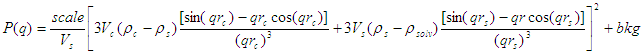

where *scale* is a scale factor, *Vs* is the volume of the outer shell, *Vc* is the volume of the core, *rs* is the
radius of the shell, *rc* is the radius of the core, *c* is the scattering length density of the core, *s* is the
scattering length density of the shell, *solv* is the scattering length density of the solvent, and *bkg* is the
background level.

The 2D scattering intensity is the same as *P(q)* above, regardless of the orientation of the *q* vector.

NB: The outer most radius (ie, = *radius* + *thickness*) is used as the effective radius for *S(Q)* when
*P(Q)* \* *S(Q)* is applied.

The returned value is scaled to units of |cm^-1| and the parameters of the CoreShellModel are the following

==============  ========  =============
Parameter name  Units     Default value
==============  ========  =============
scale           None      1.0
(core) radius   |Ang|     60
thickness       |Ang|     10
core_sld        |Ang^-2|  1e-6
shell_sld       |Ang^-2|  2e-6
solvent_sld     |Ang^-2|  3e-6
background      |cm^-1|   0.001
==============  ========  =============

Here, *radius* = the radius of the core and *thickness* = the thickness of the shell.

Our model uses the form factor calculations implemented in a c-library provided by the NIST Center for Neutron
Research (Kline, 2006).

REFERENCE

A Guinier and G Fournet, *Small-Angle Scattering of X-Rays*, John Wiley and Sons, New York, (1955)

*2.1.5.2. Validation of the core-shell sphere model*

Validation of our code was done by comparing the output of the 1D model to the output of the software provided by
NIST (Kline, 2006). Figure 1 shows a comparison of the output of our model and the output of the NIST software.

.. image:: img/image014.jpg

Figure 1: Comparison of the SasView scattering intensity for a core-shell sphere with the output of the NIST SANS
analysis software. The parameters were set to: *Scale* = 1.0, *Radius* = 60 , *Contrast* = 1e-6 |Ang^-2|, and
*Background* = 0.001 |cm^-1|.

.. _CoreMultiShellModel:

**2.1.6. CoreMultiShellModel**

This model provides the scattering from a spherical core with 1 to 4 concentric shell structures. The SLDs of the core
and each shell are individually specified.

For information about polarised and magnetic scattering, click here_.

*2.1.6.1. Definition*

This model is a trivial extension of the CoreShell function to a larger number of shells. See the CoreShell function
for a diagram and documentation.

The returned value is scaled to units of |cm^-1|\ |sr^-1|, absolute scale.

Be careful! The SLDs and scale can be highly correlated. Hold as many of these parameters fixed as possible.

The 2D scattering intensity is the same as P(q) of 1D, regardless of the orientation of the q vector.

NB: The outer most radius (ie, = *radius* + 4 *thicknesses*) is used as the effective radius for *S(Q)* when
*P(Q)* \* *S(Q)* is applied.

The returned value is scaled to units of |cm^-1| and the parameters of the CoreMultiShell model are the following

==============  ========  =============
Parameter name  Units     Default value
==============  ========  =============
scale           None      1.0
rad_core        |Ang|     60
sld_core        |Ang^-2|  6.4e-6
sld_shell1      |Ang^-2|  1e-6
sld_shell2      |Ang^-2|  2e-6
sld_shell3      |Ang^-2|  3e-6
sld_shell4      |Ang^-2|  4e-6
sld_solv        |Ang^-2|  6.4e-6
thick_shell1    |Ang|     10
thick_shell2    |Ang|     10
thick_shell3    |Ang|     10
thick_shell4    |Ang|     10
background      |cm^-1|   0.001
==============  ========  =============

NB: Here, *rad_core* = the radius of the core, *thick_shelli* = the thickness of the shell *i* and
*sld_shelli* = the SLD of the shell *i*. *sld_core* and the *sld_solv* are the SLD of the core and the solvent,
respectively.

Our model uses the form factor calculations implemented in a c-library provided by the NIST Center for Neutron
Research (Kline, 2006).

This example dataset is produced by running the CoreMultiShellModel using 200 data points, *qmin* = 0.001 -1,
*qmax* = 0.7 -1 and the above default values.

.. image:: img/image015.jpg

*Figure: 1D plot using the default values (w/200 data point).*

The scattering length density profile for the default sld values (w/ 4 shells).

.. image:: img/image016.jpg

*Figure: SLD profile against the radius of the sphere for default SLDs.*

REFERENCE

See the CoreShellModel_ documentation.

.. _Core2ndMomentModel:

**2.1.7. Core2ndMomentModel**

This model describes the scattering from a layer of surfactant or polymer adsorbed on spherical particles under the
conditions that (i) the particles (cores) are contrast-matched to the dispersion medium, (ii) *S(Q)* ~ 1 (ie, the
particle volume fraction is dilute), (iii) the particle radius is >> layer thickness (ie, the interface is locally
flat), and (iv) scattering from excess unadsorbed adsorbate in the bulk medium is absent or has been corrected for.

Unlike a core-shell model, this model does not assume any form for the density distribution of the adsorbed species
normal to the interface (cf, a core-shell model which assumes the density distribution to be a homogeneous
step-function). For comparison, if the thickness of a (core-shell like) step function distribution is *t*, the second
moment, |sigma| = sqrt((*t* :sup:`2` )/12). The |sigma| is the second moment about the mean of the density distribution
(ie, the distance of the centre-of-mass of the distribution from the interface).

*2.1.7.1. Definition*

The *I* :sub:`0` is calculated in the following way (King, 2002)

.. image:: img/secondmeq1.jpg

where *scale* is a scale factor, *poly* is the sld of the polymer (or surfactant) layer, *solv* is the sld of the
solvent/medium and cores, |phi|\ :sub:`cores` is the volume fraction of the core paraticles, and |biggamma| and
|delta| are the adsorbed amount and the bulk density of the polymers respectively. The |sigma| is the second moment
of the thickness distribution.

Note that all parameters except the |sigma| are correlated for fitting so that fitting those with more than one
parameter will generally fail. Also note that unlike other shape models, no volume normalization is applied to this
model (the calculation is exact).

The returned value is scaled to units of |cm^-1| and the parameters are the following

==============  ========  =============
Parameter name  Units     Default value
==============  ========  =============
scale           None      1.0
density_poly    g/cm2     0.7
radius_core     |Ang|     500
ads_amount      mg/m 2    1.9
second_moment   |Ang|     23.0
volf_cores      None      0.14
sld_poly        |Ang^-2|  1.5e-6
sld_solv        |Ang^-2|  6.3e-6
background      |cm^-1|   0.0
==============  ========  =============

.. image:: img/secongm_fig1.jpg

REFERENCE

S King, P Griffiths, J. Hone, and T Cosgrove, *SANS from Adsorbed Polymer Layers*,
*Macromol. Symp.*, 190 (2002) 33-42

.. _MultiShellModel:

**2.1.8. MultiShellModel**

This model provides the form factor, *P(q)*, for a multi-lamellar vesicle with *N* shells where the core is filled with
solvent and the shells are interleaved with layers of solvent. For *N* = 1, this returns the VesicleModel (above).

.. image:: img/image020.jpg

The 2D scattering intensity is the same as 1D, regardless of the orientation of the *q* vector which is defined as

.. image:: img/image008.PNG

NB: The outer most radius (= *core_radius* + *n_pairs* \* *s_thickness* + (*n_pairs* - 1) \* *w_thickness*) is used
as the effective radius for *S(Q)* when *P(Q)* \* *S(Q)* is applied.

The returned value is scaled to units of |cm^-1| and the parameters of the MultiShellModel are the following

==============  ========  =============
Parameter name  Units     Default value
==============  ========  =============
scale           None      1.0
core_radius     |Ang|     60.0
n_pairs         None      2.0
core_sld        |Ang^-2|  6.3e-6
shell_sld       |Ang^-2|  0.0
background      |cm^-1|   0.0
s_thickness     |Ang|     10
w_thickness     |Ang|     10
==============  ========  =============

NB: *s_thickness* is the shell thickness while the *w_thickness* is the solvent thickness, and *n_pair*
is the number of shells.

.. image:: img/image021.jpg

*Figure. 1D plot using the default values (w/200 data point).*

Our model uses the form factor calculations implemented in a c-library provided by the NIST Center for Neutron
Research (Kline, 2006).

REFERENCE

B Cabane, *Small Angle Scattering Methods*, in *Surfactant Solutions: New Methods of Investigation*, Ch.2,
Surfactant Science Series Vol. 22, Ed. R Zana and M Dekker, New York, (1987).

.. _OnionExpShellModel:

**2.1.9. OnionExpShellModel**

This model provides the form factor, *P(q)*, for a multi-shell sphere where the scattering length density (SLD) of the
each shell is described by an exponential (linear, or flat-top) function. The form factor is normalized by the volume
of the sphere where the SLD is not identical to the SLD of the solvent. We currently provide up to 9 shells with this
model.

*2.1.9.1. Definition*

The 1D scattering intensity is calculated in the following way

.. image:: img/image022.gif

.. image:: img/image023.gif

where, for a spherically symmetric particle with a particle density |rho|\ *(r)*

.. image:: img/image024.gif

so that

.. image:: img/image025.gif

.. image:: img/image026.gif

.. image:: img/image027.gif

Here we assumed that the SLDs of the core and solvent are constant against *r*.

Now lets consider the SLD of a shell, *r*\ :sub:`shelli`, defined by

.. image:: img/image028.gif

An example of a possible SLD profile is shown below where *sld_in_shelli* (|rho|\ :sub:`in`\ ) and
*thick_shelli* (|bigdelta|\ *t* :sub:`shelli`\ ) stand for the SLD of the inner side of the *i*\ th shell and the
thickness of the *i*\ th shell in the equation above, respectively.

For \| *A* \| > 0,

.. image:: img/image029.gif

For *A* ~ 0 (eg., *A* = -0.0001), this function converges to that of the linear SLD profile (ie,
|rho|\ :sub:`shelli`\ *(r)* = *A*\ :sup:`'` ( *r* - *r*\ :sub:`shelli` - 1) / |bigdelta|\ *t* :sub:`shelli`) + *B*\ :sup:`'`),
so this case is equivalent to

.. image:: img/image030.gif

.. image:: img/image031.gif

.. image:: img/image032.gif

.. image:: img/image033.gif

For *A* = 0, the exponential function has no dependence on the radius (so that *sld_out_shell* (|rho|\ :sub:`out`) is
ignored this case) and becomes flat. We set the constant to |rho|\ :sub:`in` for convenience, and thus the form
factor contributed by the shells is

.. image:: img/image034.gif

.. image:: img/image035.gif

In the equation

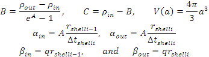

Finally, the form factor can be calculated by

.. image:: img/image037.gif

where

.. image:: img/image038.gif

and

.. image:: img/image039.gif

The 2D scattering intensity is the same as *P(q)* above, regardless of the orientation of the *q* vector which is
defined as

.. image:: img/image040.gif

NB: The outer most radius is used as the effective radius for *S(Q)* when *P(Q)* \* *S(Q)* is applied.

The returned value is scaled to units of |cm^-1| and the parameters of this model (for only one shell) are the following

==============  ========  =============
Parameter name  Units     Default value
==============  ========  =============
A_shell1        None      1
scale           None      1.0
rad_core        |Ang|     200
thick_shell1    |Ang|     50
sld_core        |Ang^-2|  1.0e-06
sld_in_shell1   |Ang^-2|  1.7e-06
sld_out_shell1  |Ang^-2|  2.0e-06
sld_solv        |Ang^-2|  6.4e-06
background      |cm^-1|   0.0
==============  ========  =============

NB: *rad_core* represents the core radius (*R1*) and *thick_shell1* (*R2* - *R1*) is the thickness of the shell1, etc.

.. image:: img/image041.jpg

*Figure. 1D plot using the default values (w/400 point).*

.. image:: img/image042.jpg

*Figure. SLD profile from the default values.*

REFERENCE

L A Feigin and D I Svergun, *Structure Analysis by Small-Angle X-Ray and Neutron Scattering*,
Plenum Press, New York, (1987).

.. _VesicleModel:

**2.1.10. VesicleModel**

This model provides the form factor, *P(q)*, for an unilamellar vesicle. The form factor is normalized by the volume
of the shell.

*2.1.10.1. Definition*

The 1D scattering intensity is calculated in the following way (Guinier, 1955)

.. image:: img/image017.PNG

where *scale* is a scale factor, *Vshell* is the volume of the shell, *V1* is the volume of the core, *V2* is the total
volume, *R1* is the radius of the core, *R2* is the outer radius of the shell, |rho|\ :sub:`1` is the scattering
length density of the core and the solvent, |rho|\ :sub:`2` is the scattering length density of the shell, *bkg* is
the background level, and *J1* = (sin\ *x*- *x* cos\ *x*)/ *x* :sup:`2`\ . The functional form is identical to a
"typical" core-shell structure, except that the scattering is normalized by the volume that is contributing to the
scattering, namely the volume of the shell alone. Also, the vesicle is best defined in terms of a core radius (= *R1*)
and a shell thickness, *t*.

.. image:: img/image018.jpg

The 2D scattering intensity is the same as *P(q)* above, regardless of the orientation of the *q* vector which is
defined as

.. image:: img/image008.PNG

NB: The outer most radius (= *radius* + *thickness*) is used as the effective radius for *S(Q)* when *P(Q)* \* *S(Q)*
is applied.

The returned value is scaled to units of |cm^-1| and the parameters of the VesicleModel are the following

==============  ========  =============
Parameter name  Units     Default value
==============  ========  =============
scale           None      1.0
radius          |Ang|     100
thickness       |Ang|     30
core_sld        |Ang^-2|  6.3e-6
shell_sld       |Ang^-2|  0
background      |cm^-1|   0.0
==============  ========  =============

NB: *radius* represents the core radius (*R1*) and the *thickness* (*R2* - *R1*) is the shell thickness.

.. image:: img/image019.jpg

*Figure. 1D plot using the default values (w/200 data point).*

Our model uses the form factor calculations implemented in a c-library
provided by the NIST Center for Neutron Research (Kline, 2006).

REFERENCE

A Guinier and G. Fournet, *Small-Angle Scattering of X-Rays*, John Wiley and Sons, New York, (1955)

.. _SphericalSLDModel:

**2.1.11. SphericalSLDModel**

Similarly to the OnionExpShellModel, this model provides the form factor, *P(q)*, for a multi-shell sphere, where the
interface between the each neighboring shells can be described by one of a number of functions including error,
power-law, and exponential functions. This model is to calculate the scattering intensity by building a continuous
custom SLD profile against the radius of the particle. The SLD profile is composed of a flat core, a flat solvent,
a number (up to 9 ) flat shells, and the interfacial layers between the adjacent flat shells (or core, and solvent)
(see below). Unlike the OnionExpShellModel (using an analytical integration), the interfacial layers here are
sub-divided and numerically integrated assuming each of the sub-layers are described by a line function. The number
of the sub-layer can be given by users by setting the integer values of *npts_inter* in the GUI. The form factor is
normalized by the total volume of the sphere.

*2.1.11.1. Definition*

The 1D scattering intensity is calculated in the following way:

.. image:: img/image022.gif

.. image:: img/image043.gif

where, for a spherically symmetric particle with a particle density |rho|\ *(r)*

.. image:: img/image024.gif

so that

.. image:: img/image044.gif

.. image:: img/image045.gif

.. image:: img/image046.gif

.. image:: img/image047.gif

.. image:: img/image048.gif

.. image:: img/image027.gif

Here we assumed that the SLDs of the core and solvent are constant against *r*. The SLD at the interface between
shells, |rho|\ :sub:`inter_i`, is calculated with a function chosen by an user, where the functions are

1) Exp

.. image:: img/image049.gif

2) Power-Law

.. image:: img/image050.gif

3) Erf

.. image:: img/image051.gif

The functions are normalized so that they vary between 0 and 1, and they are constrained such that the SLD is
continuous at the boundaries of the interface as well as each sub-layers. Thus *B* and *C* are determined.

Once |rho|\ :sub:`rinter_i` is found at the boundary of the sub-layer of the interface, we can find its contribution
to the form factor *P(q)*

.. image:: img/image052.gif

.. image:: img/image053.gif

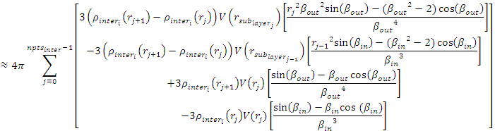

where we assume that |rho|\ :sub:`inter_i`\ *(r)* can be approximately linear within a sub-layer *j*.

In the equation

.. image:: img/image055.gif

Finally, the form factor can be calculated by

.. image:: img/image037.gif

where

.. image:: img/image038.gif

and

.. image:: img/image056.gif

The 2D scattering intensity is the same as *P(q)* above, regardless of the orientation of the *q* vector which is
defined as

.. image:: img/image040.gif

NB: The outer most radius is used as the effective radius for *S(Q)* when *P(Q)* \* *S(Q)* is applied.

The returned value is scaled to units of |cm^-1| and the parameters of this model (for just one shell) are the following

==============  ========  =============
Parameter name  Units     Default value
==============  ========  =============
background      |cm^-1|   0.0
npts_inter      None      35
scale           None      1
sld_solv        |Ang^-2|  1e-006
func_inter1     None      Erf
nu_inter        None      2.5
thick_inter1    |Ang|     50
sld_flat1       |Ang^-2|  4e-006
thick_flat1     |Ang|     100
func_inter0     None      Erf
nu_inter0       None      2.5
rad_core0       |Ang|     50
sld_core0       |Ang^-2|  2.07e-06
thick_core0     |Ang|     50
==============  ========  =============

NB: *rad_core0* represents the core radius (*R1*).

.. image:: img/image057.jpg

*Figure. 1D plot using the default values (w/400 point).*

.. image:: img/image058.jpg

*Figure. SLD profile from the default values.*

REFERENCE

L A Feigin and D I Svergun, *Structure Analysis by Small-Angle X-Ray and Neutron Scattering*,
Plenum Press, New York, (1987)

.. _LinearPearlsModel:

**2.1.12. LinearPearlsModel**

This model provides the form factor for *N* spherical pearls of radius *R* linearly joined by short strings (or segment
length or edge separation) *l* (= *A* - 2\ *R*)). *A* is the center-to-center pearl separation distance. The thickness
of each string is assumed to be negligible.

.. image:: img/linearpearls.jpg

*2.1.12.1. Definition*

The output of the scattering intensity function for the LinearPearlsModel is given by (Dobrynin, 1996)

.. image:: img/linearpearl_eq1.gif

where the mass *m*\ :sub:`p` is (SLD\ :sub:`pearl` - SLD\ :sub:`solvent`) \* (volume of *N* pearls). V is the total
volume.

The 2D scattering intensity is the same as *P(q)* above, regardless of the orientation of the *q* vector.

The returned value is scaled to units of |cm^-1| and the parameters of the LinearPearlsModel are the following

===============  ========  =============
Parameter name   Units     Default value
===============  ========  =============
scale            None      1.0
radius           |Ang|     80.0
edge_separation  |Ang|     350.0
num_pearls       None      3
sld_pearl        |Ang^-2|  1e-6
sld_solv         |Ang^-2|  6.3e-6
background       |cm^-1|   0.0
===============  ========  =============

NB: *num_pearls* must be an integer.

.. image:: img/linearpearl_plot.jpg

REFERENCE

A V Dobrynin, M Rubinstein and S P Obukhov, *Macromol.*, 29 (1996) 2974-2979

.. _PearlNecklaceModel:

**2.1.13. PearlNecklaceModel**

This model provides the form factor for a pearl necklace composed of two elements: *N* pearls (homogeneous spheres
of radius *R*) freely jointed by *M* rods (like strings - with a total mass *Mw* = *M* \* *m*\ :sub:`r` + *N* \* *m*\ :sub:`s`,
and the string segment length (or edge separation) *l* (= *A* - 2\ *R*)). *A* is the center-to-center pearl separation
distance.

.. image:: img/pearl_fig.jpg

*2.1.13.1. Definition*

The output of the scattering intensity function for the PearlNecklaceModel is given by (Schweins, 2004)

.. image:: img/pearl_eq1.gif

where

.. image:: img/pearl_eq2.gif

.. image:: img/pearl_eq3.gif

.. image:: img/pearl_eq4.gif

.. image:: img/pearl_eq5.gif

.. image:: img/pearl_eq6.gif

and

.. image:: img/pearl_eq7.gif

where the mass *m*\ :sub:`i` is (SLD\ :sub:`i` - SLD\ :sub:`solvent`) \* (volume of the *N* pearls/rods). *V* is the
total volume of the necklace.

The 2D scattering intensity is the same as *P(q)* above, regardless of the orientation of the *q* vector.

The returned value is scaled to units of |cm^-1| and the parameters of the PearlNecklaceModel are the following

===============  ========  =============
Parameter name   Units     Default value
===============  ========  =============
scale            None      1.0
radius           |Ang|     80.0
edge_separation  |Ang|     350.0
num_pearls       None      3
sld_pearl        |Ang^-2|  1e-6
sld_solv         |Ang^-2|  6.3e-6
sld_string       |Ang^-2|  1e-6
thick_string
(=rod diameter)  |Ang|     2.5
background       |cm^-1|   0.0
===============  ========  =============

NB: *num_pearls* must be an integer.

.. image:: img/pearl_plot.jpg

REFERENCE

R Schweins and K Huber, *Particle Scattering Factor of Pearl Necklace Chains*, *Macromol. Symp.* 211 (2004) 25-42 2004

.. _CylinderModel:

**2.1.14. CylinderModel**

This model provides the form factor for a right circular cylinder with uniform scattering length density. The form
factor is normalized by the particle volume.

For information about polarised and magnetic scattering, click here_.

*2.1.14.1. Definition*

The output of the 2D scattering intensity function for oriented cylinders is given by (Guinier, 1955)

.. image:: img/image059.PNG

where

.. image:: img/image060.PNG

and |alpha| is the angle between the axis of the cylinder and the *q*-vector, *V* is the volume of the cylinder,
*L* is the length of the cylinder, *r* is the radius of the cylinder, and |drho| (contrast) is the
scattering length density difference between the scatterer and the solvent. *J1* is the first order Bessel function.

To provide easy access to the orientation of the cylinder, we define the axis of the cylinder using two angles |theta|
and |phi|. Those angles are defined in Figure 1.

.. image:: img/image061.jpg

*Figure 1. Definition of the angles for oriented cylinders.*

.. image:: img/image062.jpg

*Figure 2. Examples of the angles for oriented pp against the detector plane.*

NB: The 2nd virial coefficient of the cylinder is calculated based on the radius and length values, and used as the
effective radius for *S(Q)* when *P(Q)* \* *S(Q)* is applied.

The returned value is scaled to units of |cm^-1| and the parameters of the CylinderModel are the following:

==============  ========  =============
Parameter name  Units     Default value
==============  ========  =============
scale           None      1.0
radius          |Ang|     20.0
length          |Ang|     400.0
contrast        |Ang^-2|  3.0e-6
background      |cm^-1|   0.0
cyl_theta       degree    60
cyl_phi         degree    60
==============  ========  =============

The output of the 1D scattering intensity function for randomly oriented cylinders is then given by

.. image:: img/image063.PNG

The *cyl_theta* and *cyl_phi* parameter are not used for the 1D output. Our implementation of the scattering kernel
and the 1D scattering intensity use the c-library from NIST.

*2.1.14.2. Validation of the CylinderModel*

Validation of our code was done by comparing the output of the 1D model to the output of the software provided by the
NIST (Kline, 2006). Figure 3 shows a comparison of the 1D output of our model and the output of the NIST software.

.. image:: img/image065.jpg

*Figure 3: Comparison of the SasView scattering intensity for a cylinder with the output of the NIST SANS analysis*
*software.* The parameters were set to: *Scale* = 1.0, *Radius* = 20 |Ang|, *Length* = 400 |Ang|,
*Contrast* = 3e-6 |Ang^-2|, and *Background* = 0.01 |cm^-1|.

In general, averaging over a distribution of orientations is done by evaluating the following

.. image:: img/image064.PNG

where *p(*\ |theta|,\ |phi|\ *)* is the probability distribution for the orientation and |P0|\ *(q,*\ |alpha|\ *)* is
the scattering intensity for the fully oriented system. Since we have no other software to compare the implementation
of the intensity for fully oriented cylinders, we can compare the result of averaging our 2D output using a uniform
distribution *p(*\ |theta|,\ |phi|\ *)* = 1.0. Figure 4 shows the result of such a cross-check.

.. image:: img/image066.jpg

*Figure 4: Comparison of the intensity for uniformly distributed cylinders calculated from our 2D model and the*
*intensity from the NIST SANS analysis software.* The parameters used were: *Scale* = 1.0, *Radius* = 20 |Ang|,
*Length* = 400 |Ang|, *Contrast* = 3e-6 |Ang^-2|, and *Background* = 0.0 |cm^-1|.

.. _HollowCylinderModel:

**2.1.15. HollowCylinderModel**

This model provides the form factor, *P(q)*, for a monodisperse hollow right angle circular cylinder (tube) where the
form factor is normalized by the volume of the tube

*P(q)* = *scale* \* *<F*\ :sup:`2`\ *>* / *V*\ :sub:`shell` + *background*

where the averaging < > is applied only for the 1D calculation.

The inside and outside of the hollow cylinder are assumed have the same SLD.

*2.1.15.1 Definition*

The 1D scattering intensity is calculated in the following way (Guinier, 1955)

.. image:: img/image072.PNG

where *scale* is a scale factor, *J1* is the 1st order Bessel function, *J1(x)* = (sin *x* - *x* cos *x*)/ *x*\ :sup:`2`.

To provide easy access to the orientation of the core-shell cylinder, we define the axis of the cylinder using two
angles |theta| and |phi|\ . As for the case of the cylinder, those angles are defined in Figure 2 of the CylinderModel.

NB: The 2nd virial coefficient of the cylinder is calculated based on the radius and 2 length values, and used as the
effective radius for *S(Q)* when *P(Q)* \* *S(Q)* is applied.

In the parameters, the contrast represents SLD :sub:`shell` - SLD :sub:`solvent` and the *radius* = *R*\ :sub:`shell`
while *core_radius* = *R*\ :sub:`core`.

==============  ========  =============
Parameter name  Units     Default value
==============  ========  =============
scale           None      1.0
radius          |Ang|     30
length          |Ang|     400
core_radius     |Ang|     20
sldCyl          |Ang^-2|  6.3e-6
sldSolv         |Ang^-2|  5e-06
background      |cm^-1|   0.01
==============  ========  =============

.. image:: img/image074.jpg

*Figure. 1D plot using the default values (w/1000 data point).*

Our model uses the form factor calculations implemented in a c-library provided by the NIST Center for Neutron Research
(Kline, 2006).

.. image:: img/image061.jpg

*Figure. Definition of the angles for the oriented HollowCylinderModel.*

.. image:: img/image062.jpg

*Figure. Examples of the angles for oriented pp against the detector plane.*

REFERENCE

L A Feigin and D I Svergun, *Structure Analysis by Small-Angle X-Ray and Neutron Scattering*, Plenum Press,
New York, (1987)

.. _CappedCylinderModel:

**2.1.16 CappedCylinderModel**

Calculates the scattering from a cylinder with spherical section end-caps. This model simply becomes the ConvexLensModel
when the length of the cylinder *L* = 0, that is, a sphereocylinder with end caps that have a radius larger than that
of the cylinder and the center of the end cap radius lies within the cylinder. See the diagram for the details
of the geometry and restrictions on parameter values.

*2.1.16.1. Definition*

The returned value is scaled to units of |cm^-1|\ |sr^-1|, absolute scale.

The Capped Cylinder geometry is defined as

.. image:: img/image112.jpg

where *r* is the radius of the cylinder. All other parameters are as defined in the diagram. Since the end cap radius
*R* >= *r* and by definition for this geometry *h* < 0, *h* is then defined by *r* and *R* as

*h* = -1 \* sqrt(*R*\ :sup:`2` - *r*\ :sup:`2`)

The scattered intensity *I(q)* is calculated as

.. image:: img/image113.jpg

where the amplitude *A(q)* is given as

.. image:: img/image114.jpg

The < > brackets denote an average of the structure over all orientations. <\ *A*\ :sup:`2`\ *(q)*> is then the form
factor, *P(q)*. The scale factor is equivalent to the volume fraction of cylinders, each of volume, *V*. Contrast is the
difference of scattering length densities of the cylinder and the surrounding solvent.

The volume of the Capped Cylinder is (with *h* as a positive value here)

.. image:: img/image115.jpg

and its radius-of-gyration

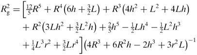

**The requirement that** *R* >= *r* **is not enforced in the model! It is up to you to restrict this during analysis.**

This following example dataset is produced by running the MacroCappedCylinder(), using 200 data points,
*qmin* = 0.001 |Ang^-1|, *qmax* = 0.7 |Ang^-1| and the default values

==============  ========  =============
Parameter name  Units     Default value
==============  ========  =============
scale           None      1.0
len_cyl         |Ang|     400.0
rad_cap         |Ang|     40.0
rad_cyl         |Ang|     20.0
sld_capcyl      |Ang^-2|  1.0e-006
sld_solv        |Ang^-2|  6.3e-006
background      |cm^-1|   0
==============  ========  =============

.. image:: img/image117.jpg

*Figure. 1D plot using the default values (w/256 data point).*

For 2D data: The 2D scattering intensity is calculated similar to the 2D cylinder model. For example, for
|theta| = 45 deg and |phi| =0 deg with default values for other parameters

.. image:: img/image118.jpg

*Figure. 2D plot (w/(256X265) data points).*

.. image:: img/image061.jpg

*Figure. Definition of the angles for oriented 2D cylinders.*

.. image:: img/image062.jpg

*Figure. Examples of the angles for oriented pp against the detector plane.*

REFERENCE

H Kaya, *J. Appl. Cryst.*, 37 (2004) 223-230

H Kaya and N-R deSouza, *J. Appl. Cryst.*, 37 (2004) 508-509 (addenda and errata)

.. _CoreShellCylinderModel:

**2.1.17. CoreShellCylinderModel**

This model provides the form factor for a circular cylinder with a core-shell scattering length density profile. The
form factor is normalized by the particle volume.

*2.1.17.1. Definition*

The output of the 2D scattering intensity function for oriented core-shell cylinders is given by (Kline, 2006)

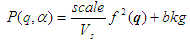

where

.. image:: img/image068.PNG

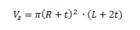

and |alpha| is the angle between the axis of the cylinder and the *q*\ -vector, *Vs* is the volume of the outer shell
(i.e. the total volume, including the shell), *Vc* is the volume of the core, *L* is the length of the core, *r* is the
radius of the core, *t* is the thickness of the shell, |rho|\ :sub:`c` is the scattering length density of the core,
|rho|\ :sub:`s` is the scattering length density of the shell, |rho|\ :sub:`solv` is the scattering length density of
the solvent, and *bkg* is the background level. The outer radius of the shell is given by *r+t* and the total length of
the outer shell is given by *L+2t*. *J1* is the first order Bessel function.

.. image:: img/image069.jpg

To provide easy access to the orientation of the core-shell cylinder, we define the axis of the cylinder using two
angles |theta| and |phi|\ . As for the case of the cylinder, those angles are defined in Figure 2 of the CylinderModel.

NB: The 2nd virial coefficient of the cylinder is calculated based on the radius and 2 length values, and used as the
effective radius for *S(Q)* when *P(Q)* \* *S(Q)* is applied.

The returned value is scaled to units of |cm^-1| and the parameters of the core-shell cylinder model are the following

==============  ========  =============
Parameter name  Units     Default value
==============  ========  =============
scale           None      1.0
radius          |Ang|     20.0
thickness       |Ang|     10.0
length          |Ang|     400.0
core_sld        |Ang^-2|  1e-6
shell_sld       |Ang^-2|  4e-6
solvent_sld     |Ang^-2|  1e-6
background      |cm^-1|   0.0
axis_theta      degree    90
axis_phi        degree    0.0
==============  ========  =============

The output of the 1D scattering intensity function for randomly oriented cylinders is then given by the equation above.

The *axis_theta* and *axis_phi* parameters are not used for the 1D output. Our implementation of the scattering kernel
and the 1D scattering intensity use the c-library from NIST.

*2.1.17.2. Validation of the CoreShellCylinderModel*

Validation of our code was done by comparing the output of the 1D model to the output of the software provided by the
NIST (Kline, 2006). Figure 1 shows a comparison of the 1D output of our model and the output of the NIST software.

.. image:: img/image070.jpg

*Figure 1: Comparison of the SasView scattering intensity for a core-shell cylinder with the output of the NIST SANS*
*analysis software.* The parameters were set to: *Scale* = 1.0, *Radius* = 20 |Ang|, *Thickness* = 10 |Ang|,
*Length* = 400 |Ang|, *Core_sld* = 1e-6 |Ang^-2|, *Shell_sld* = 4e-6 |Ang^-2|, *Solvent_sld* = 1e-6 |Ang^-2|,
and *Background* = 0.01 |cm^-1|.

Averaging over a distribution of orientation is done by evaluating the equation above. Since we have no other software
to compare the implementation of the intensity for fully oriented cylinders, we can compare the result of averaging our
2D output using a uniform distribution *p(*\ |theta|,\ |phi|\ *)* = 1.0. Figure 2 shows the result of such a cross-check.

.. image:: img/image071.jpg

*Figure 2: Comparison of the intensity for uniformly distributed core-shell cylinders calculated from our 2D model and*
*the intensity from the NIST SANS analysis software.* The parameters used were: *Scale* = 1.0, *Radius* = 20 |Ang|,
*Thickness* = 10 |Ang|, *Length* =400 |Ang|, *Core_sld* = 1e-6 |Ang^-2|, *Shell_sld* = 4e-6 |Ang^-2|,
*Solvent_sld* = 1e-6 |Ang^-2|, and *Background* = 0.0 |cm^-1|.

.. image:: img/image061.jpg

*Figure. Definition of the angles for oriented core-shell cylinders.*

.. image:: img/image062.jpg

*Figure. Examples of the angles for oriented pp against the detector plane.*

2013/11/26 - Description reviewed by Heenan, R.

.. _EllipticalCylinderModel:

**2.1.18 EllipticalCylinderModel**

This function calculates the scattering from an elliptical cylinder.

*2.1.18.1 Definition for 2D (orientated system)*

The angles |theta| and |phi| define the orientation of the axis of the cylinder. The angle |bigpsi| is defined as the
orientation of the major axis of the ellipse with respect to the vector *Q*\ . A gaussian polydispersity can be added
to any of the orientation angles, and also for the minor radius and the ratio of the ellipse radii.

.. image:: img/image098.gif

*Figure.* *a* = *r_minor* and |nu|\ :sub:`n` = *r_ratio* (i.e., *r_major* / *r_minor*).

The function calculated is

.. image:: img/image099.PNG

with the functions

.. image:: img/image100.PNG

and the angle |bigpsi| is defined as the orientation of the major axis of the ellipse with respect to the vector *q*\ .

*2.1.18.2 Definition for 1D (no preferred orientation)*

The form factor is averaged over all possible orientation before normalized by the particle volume

*P(q)* = *scale* \* <*F*\ :sup:`2`> / *V*

The returned value is scaled to units of |cm^-1|.

To provide easy access to the orientation of the elliptical cylinder, we define the axis of the cylinder using two
angles |theta|, |phi| and |bigpsi|. As for the case of the cylinder, the angles |theta| and |phi| are defined on
Figure 2 of CylinderModel. The angle |bigpsi| is the rotational angle around its own long_c axis against the *q* plane.
For example, |bigpsi| = 0 when the *r_minor* axis is parallel to the *x*\ -axis of the detector.

All angle parameters are valid and given only for 2D calculation; ie, an oriented system.

.. image:: img/image101.jpg

*Figure. Definition of angles for 2D*

.. image:: img/image062.jpg

*Figure. Examples of the angles for oriented elliptical cylinders against the detector plane.*

NB: The 2nd virial coefficient of the cylinder is calculated based on the averaged radius (= sqrt(*r_minor*\ :sup:`2` \* *r_ratio*))
and length values, and used as the effective radius for *S(Q)* when *P(Q)* \* *S(Q)* is applied.

==============  ========  =============
Parameter name  Units     Default value
==============  ========  =============
scale           None      1.0
r_minor         |Ang|     20.0
r_ratio         |Ang|     1.5
length          |Ang|     400.0
sldCyl          |Ang^-2|  4e-06
sldSolv         |Ang^-2|  1e-06
background      |cm^-1|   0
==============  ========  =============

.. image:: img/image102.jpg

*Figure. 1D plot using the default values (w/1000 data point).*

*2.1.18.3 Validation of the EllipticalCylinderModel*

Validation of our code was done by comparing the output of the 1D calculation to the angular average of the output of
the 2D calculation over all possible angles. The figure below shows the comparison where the solid dot refers to
averaged 2D values while the line represents the result of the 1D calculation (for the 2D averaging, values of 76, 180,
and 76 degrees are taken for the angles of |theta|, |phi|, and |bigpsi| respectively).

.. image:: img/image103.gif

*Figure. Comparison between 1D and averaged 2D.*

In the 2D average, more binning in the angle |phi| is necessary to get the proper result. The following figure shows
the results of the averaging by varying the number of angular bins.

.. image:: img/image104.gif

*Figure. The intensities averaged from 2D over different numbers of bins and angles.*

REFERENCE

L A Feigin and D I Svergun, *Structure Analysis by Small-Angle X-Ray and Neutron Scattering*, Plenum,
New York, (1987)

.. _FlexibleCylinderModel:

**2.1.19. FlexibleCylinderModel**

This model provides the form factor, *P(q)*, for a flexible cylinder where the form factor is normalized by the volume
of the cylinder. **Inter-cylinder interactions are NOT provided for.**

*P(q)* = *scale* \* <*F*\ :sup:`2`> / *V* + *background*

where the averaging < > is applied over all orientations for 1D.

The 2D scattering intensity is the same as 1D, regardless of the orientation of the *q* vector which is defined as

.. image:: img/image040.gif

*2.1.19.1. Definition*

.. image:: img/image075.jpg

The chain of contour length, *L*, (the total length) can be described as a chain of some number of locally stiff
segments of length *l*\ :sub:`p`\ , the persistence length (the length along the cylinder over which the flexible
cylinder can be considered a rigid rod). The Kuhn length (*b* = 2 \* *l* :sub:`p`) is also used to describe the
stiffness of a chain.

The returned value is in units of |cm^-1|, on absolute scale.

In the parameters, the sldCyl and sldSolv represent the SLD of the chain/cylinder and solvent respectively.

==============  ========  =============
Parameter name  Units     Default value
==============  ========  =============
scale           None      1.0
radius          |Ang|     20
length          |Ang|     1000
sldCyl          |Ang^-2|  1e-06
sldSolv         |Ang^-2|  6.3e-06
background      |cm^-1|   0.01
kuhn_length     |Ang|     100
==============  ========  =============

.. image:: img/image076.jpg

*Figure. 1D plot using the default values (w/1000 data point).*

Our model uses the form factor calculations implemented in a c-library provided by the NIST Center for Neutron Research
(Kline, 2006).

From the reference

  "Method 3 With Excluded Volume" is used. The model is a parametrization of simulations of a discrete representation
  of the worm-like chain model of Kratky and Porod applied in the pseudocontinuous limit. See equations (13,26-27) in
  the original reference for the details.

REFERENCE

J S Pedersen and P Schurtenberger. *Scattering functions of semiflexible polymers with and without excluded volume*
*effects*. *Macromolecules*, 29 (1996) 7602-7612

Correction of the formula can be found in

W R Chen, P D Butler and L J Magid, *Incorporating Intermicellar Interactions in the Fitting of SANS Data from*
*Cationic Wormlike Micelles*. *Langmuir*, 22(15) 2006 6539–6548

.. _FlexCylEllipXModel:

**2.1.20 FlexCylEllipXModel**

This model calculates the form factor for a flexible cylinder with an elliptical cross section and a uniform scattering
length density. The non-negligible diameter of the cylinder is included by accounting for excluded volume interactions
within the walk of a single cylinder. The form factor is normalized by the particle volume such that

*P(q)* = *scale* \* <*F*\ :sup:`2`> / *V* + *background*

where < > is an average over all possible orientations of the flexible cylinder.

*2.1.20.1. Definition*

The function calculated is from the reference given below. From that paper, "Method 3 With Excluded Volume" is used.
The model is a parameterization of simulations of a discrete representation of the worm-like chain model of Kratky and
Porod applied in the pseudo-continuous limit. See equations (13, 26-27) in the original reference for the details.

NB: there are several typos in the original reference that have been corrected by WRC. Details of the corrections are
in the reference below. Most notably

- Equation (13): the term (1 - w(QR)) should swap position with w(QR)

- Equations (23) and (24) are incorrect; WRC has entered these into Mathematica and solved analytically. The results
  were then converted to code.

- Equation (27) should be q0 = max(a3/sqrt(RgSquare),3) instead of max(a3*b/sqrt(RgSquare),3)

- The scattering function is negative for a range of parameter values and q-values that are experimentally accessible. A correction function has been added to give the proper behavior.

.. image:: img/image077.jpg

The chain of contour length, *L*, (the total length) can be described as a chain of some number of locally stiff
segments of length *l*\ :sub:`p`\ , the persistence length (the length along the cylinder over which the flexible
cylinder can be considered a rigid rod). The Kuhn length (*b* = 2 \* *l* :sub:`p`) is also used to describe the
stiffness of a chain.

The cross section of the cylinder is elliptical, with minor radius *a*\ . The major radius is larger, so of course,
**the axis ratio (parameter 4) must be greater than one.** Simple constraints should be applied during curve fitting to
maintain this inequality.

The returned value is in units of |cm^-1|, on absolute scale.

In the parameters, *sldCyl* and *sldSolv* represent the SLD of the chain/cylinder and solvent respectively. The
*scale*, and the contrast are both multiplicative factors in the model and are perfectly correlated. One or both of
these parameters must be held fixed during model fitting.

If the scale is set equal to the particle volume fraction, |phi|, the returned value is the scattered intensity per
unit volume, *I(q)* = |phi| \* *P(q)*.

**No inter-cylinder interference effects are included in this calculation.**

For 2D data: The 2D scattering intensity is calculated in the same way as 1D, where the *q* vector is defined as

.. image:: img/image008.PNG

This example dataset is produced by running the Macro FlexCylEllipXModel, using 200 data points, *qmin* = 0.001 |Ang^-1|,
*qmax* = 0.7 |Ang^-1| and the default values below

==============  ========  =============
Parameter name  Units     Default value
==============  ========  =============
axis_ratio      None      1.5
background      |cm^-1|   0.0001
Kuhn_length     |Ang|     100
Contour length  |Ang|     1e+3
radius          |Ang|     20.0
scale           None      1.0
sldCyl          |Ang^-2|  1e-6
sldSolv         |Ang^-2|  6.3e-6
==============  ========  =============

.. image:: img/image078.jpg

*Figure. 1D plot using the default values (w/200 data points).*

REFERENCE

J S Pedersen and P Schurtenberger. *Scattering functions of semiflexible polymers with and without excluded volume*
*effects*. *Macromolecules*, 29 (1996) 7602-7612

Correction of the formula can be found in

W R Chen, P D Butler and L J Magid, *Incorporating Intermicellar Interactions in the Fitting of SANS Data from*
*Cationic Wormlike Micelles*. *Langmuir*, 22(15) 2006 6539–6548

.. _CoreShellBicelleModel:

**2.1.21 CoreShellBicelleModel**

This model provides the form factor for a circular cylinder with a core-shell scattering length density profile. The
form factor is normalized by the particle volume.

This model is a more general case of core-shell cylinder model (see above and reference below) in that the parameters
of the shell are separated into a face-shell and a rim-shell so that users can set different values of the thicknesses
and SLDs.

.. image:: img/image240.png

*(Graphic from DOI: 10.1039/C0NP00002G)*

The returned value is scaled to units of |cm^-1| and the parameters of the CoreShellBicelleModel are the following

==============  ========  =============
Parameter name  Units     Default value
==============  ========  =============
scale           None      1.0
radius          |Ang|     20.0
rim_thick       |Ang|     10.0
face_thick      |Ang|     10.0
length          |Ang|     400.0
core_sld        |Ang^-2|  1e-6
rim_sld         |Ang^-2|  4e-6
face_sld        |Ang^-2|  4e-6
solvent_sld     |Ang^-2|  1e-6
background      |cm^-1|   0.0
axis_theta      degree    90
axis_phi        degree    0.0
==============  ========  =============

The output of the 1D scattering intensity function for randomly oriented cylinders is then given by the equation above.

The *axis_theta* and *axis_phi* parameters are not used for the 1D output. Our implementation of the scattering kernel
and the 1D scattering intensity use the c-library from NIST.

.. image:: img/cscylbicelle_pic.jpg

*Figure. 1D plot using the default values (w/200 data point).*

.. image:: img/image061.jpg

*Figure. Definition of the angles for the oriented CoreShellBicelleModel.*

.. image:: img/image062.jpg

*Figure. Examples of the angles for oriented pp against the detector plane.*

REFERENCE

L A Feigin and D I Svergun, *Structure Analysis by Small-Angle X-Ray and Neutron Scattering*, Plenum Press,
New York, (1987)

.. _BarBellModel:

**2.1.22. BarBellModel**

Calculates the scattering from a barbell-shaped cylinder (This model simply becomes the DumBellModel when the length of
the cylinder, *L*, is set to zero). That is, a sphereocylinder with spherical end caps that have a radius larger than
that of the cylinder and the center of the end cap radius lies outside of the cylinder. All dimensions of the BarBell
are considered to be monodisperse. See the diagram for the details of the geometry and restrictions on parameter values.

*2.1.22.1. Definition*

The returned value is scaled to units of |cm^-1|\ |sr^-1|, absolute scale.

The barbell geometry is defined as

.. image:: img/image105.jpg

where *r* is the radius of the cylinder. All other parameters are as defined in the diagram.

Since the end cap radius
*R* >= *r* and by definition for this geometry *h* < 0, *h* is then defined by *r* and *R* as

*h* = -1 \* sqrt(*R*\ :sup:`2` - *r*\ :sup:`2`)

The scattered intensity *I(q)* is calculated as

.. image:: img/image106.PNG

where the amplitude *A(q)* is given as

.. image:: img/image107.PNG

The < > brackets denote an average of the structure over all orientations. <*A* :sup:`2`\ *(q)*> is then the form
factor, *P(q)*. The scale factor is equivalent to the volume fraction of cylinders, each of volume, *V*. Contrast is
the difference of scattering length densities of the cylinder and the surrounding solvent.

The volume of the barbell is

.. image:: img/image108.jpg

and its radius-of-gyration is

.. image:: img/image109.jpg

**The requirement that** *R* >= *r* **is not enforced in the model!** It is up to you to restrict this during analysis.

This example dataset is produced by running the Macro PlotBarbell(), using 200 data points, *qmin* = 0.001 |Ang^-1|,
*qmax* = 0.7 |Ang^-1| and the following default values

==============  ========  =============
Parameter name  Units     Default value
==============  ========  =============
scale           None      1.0
len_bar         |Ang|     400.0
rad_bar         |Ang|     20.0
rad_bell        |Ang|     40.0
sld_barbell     |Ang^-2|  1.0e-006
sld_solv        |Ang^-2|  6.3e-006
background      |cm^-1|   0
==============  ========  =============

.. image:: img/image110.jpg

*Figure. 1D plot using the default values (w/256 data point).*

For 2D data: The 2D scattering intensity is calculated similar to the 2D cylinder model. For example, for
|theta| = 45 deg and |phi| = 0 deg with default values for other parameters

.. image:: img/image111.jpg

*Figure. 2D plot (w/(256X265) data points).*

.. image:: img/image061.jpg

*Figure. Examples of the angles for oriented pp against the detector plane.*

.. image:: img/image062.jpg

Figure. Definition of the angles for oriented 2D barbells.

REFERENCE

H Kaya, *J. Appl. Cryst.*, 37 (2004) 37 223-230

H Kaya and N R deSouza, *J. Appl. Cryst.*, 37 (2004) 508-509 (addenda and errata)

.. _StackedDisksModel:

**2.1.23. StackedDisksModel**

This model provides the form factor, *P(q)*, for stacked discs (tactoids) with a core/layer structure where the form
factor is normalized by the volume of the cylinder. Assuming the next neighbor distance (d-spacing) in a stack of
parallel discs obeys a Gaussian distribution, a structure factor *S(q)* proposed by Kratky and Porod in 1949 is used
in this function.

Note that the resolution smearing calculation uses 76 Gauss quadrature points to properly smear the model since the
function is HIGHLY oscillatory, especially around the *q*-values that correspond to the repeat distance of the layers.

The 2D scattering intensity is the same as 1D, regardless of the orientation of the *q* vector which is defined as

.. image:: img/image008.PNG

The returned value is in units of |cm^-1| |sr^-1|, on absolute scale.

*2.1.23.1 Definition*

.. image:: img/image079.gif

The scattering intensity *I(q)* is

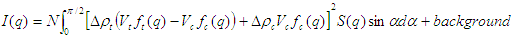

where the contrast

.. image:: img/image082.PNG

and *N* is the number of discs per unit volume, |alpha| is the angle between the axis of the disc and *q*, and *Vt*
and *Vc* are the total volume and the core volume of a single disc, respectively.

.. image:: img/image083.PNG

where *d* = thickness of the layer (*layer_thick*), 2\ *h* = core thickness (*core_thick*), and *R* = radius of the
disc (*radius*).

.. image:: img/image084.PNG

where *n* = the total number of the disc stacked (*n_stacking*), *D* = the next neighbor center-to-center distance
(*d-spacing*), and |sigma|\ D= the Gaussian standard deviation of the d-spacing (*sigma_d*).

To provide easy access to the orientation of the stacked disks, we define the axis of the cylinder using two angles
|theta| and |phi|. These angles are defined on Figure 2 of CylinderModel.

NB: The 2nd virial coefficient of the cylinder is calculated based on the *radius* and *length* = *n_stacking* \*
(*core_thick* + 2 \* *layer_thick*) values, and used as the effective radius for *S(Q)* when *P(Q)* \* *S(Q)* is applied.

==============  ========  =============
Parameter name  Units     Default value
==============  ========  =============
background      |cm^-1|   0.001
core_sld        |Ang^-2|  4e-006
core_thick      |Ang|     10
layer_sld       |Ang^-2|  0
layer_thick     |Ang|     15
n_stacking      None      1
radius          |Ang|     3e+03
scale           None      0.01
sigma_d         |Ang|     0
solvent_sld     |Ang^-2|  5e-06
==============  ========  =============

.. image:: img/image085.jpg

*Figure. 1D plot using the default values (w/1000 data point).*

.. image:: img/image086.jpg

*Figure. Examples of the angles for oriented stackeddisks against the detector plane.*

.. image:: img/image062.jpg

*Figure. Examples of the angles for oriented pp against the detector plane.*

Our model uses the form factor calculations implemented in a c-library provided by the NIST Center for Neutron Research
(Kline, 2006)

REFERENCE

A Guinier and G Fournet, *Small-Angle Scattering of X-Rays*, John Wiley and Sons, New York, 1955

O Kratky and G Porod, *J. Colloid Science*, 4, (1949) 35

J S Higgins and H C Benoit, *Polymers and Neutron Scattering*, Clarendon, Oxford, 1994

.. _PringleModel:

**2.1.24. PringleModel**

This model provides the form factor, *P(q)*, for a 'pringle' or 'saddle-shaped' object (a hyperbolic paraboloid).

.. image:: img/image241.png

*(Graphic from Matt Henderson, matt@matthen.com)*

The returned value is in units of |cm^-1|, on absolute scale.

The form factor calculated is

.. image:: img/pringle_eqn_1.jpg

where

.. image:: img/pringle_eqn_2.jpg

The parameters of the model and a plot comparing the pringle model with the equivalent cylinder are shown below.

==============  ========  =============
Parameter name  Units     Default value
==============  ========  =============
background      |cm^-1|   0.0
alpha           None      0.001
beta            None      0.02
radius          |Ang|     60
scale           None      1
sld_pringle     |Ang^-2|  1e-06
sld_solvent     |Ang^-2|  6.3e-06
thickness       |Ang|     10
==============  ========  =============

.. image:: img/pringle-vs-cylinder.png

*Figure. 1D plot using the default values (w/150 data point).*

REFERENCE

S Alexandru Rautu, Private Communication.

.. _EllipsoidModel:

**2.1.25. EllipsoidModel**

This model provides the form factor for an ellipsoid (ellipsoid of revolution) with uniform scattering length density.
The form factor is normalized by the particle volume.

*2.1.25.1. Definition*

The output of the 2D scattering intensity function for oriented ellipsoids is given by (Feigin, 1987)

.. image:: img/image059.PNG

where

.. image:: img/image119.PNG

and

.. image:: img/image120.PNG

|alpha| is the angle between the axis of the ellipsoid and the *q*\ -vector, *V* is the volume of the ellipsoid, *Ra*
is the radius along the rotational axis of the ellipsoid, *Rb* is the radius perpendicular to the rotational axis of
the ellipsoid and |drho| (contrast) is the scattering length density difference between the scatterer and
the solvent.

To provide easy access to the orientation of the ellipsoid, we define the rotation axis of the ellipsoid using two
angles |theta| and |phi|\ . These angles are defined on Figure 2 of the CylinderModel_. For the ellipsoid, |theta|
is the angle between the rotational axis and the *z*\ -axis.

NB: The 2nd virial coefficient of the solid ellipsoid is calculated based on the *radius_a* and *radius_b* values, and
used as the effective radius for *S(Q)* when *P(Q)* \* *S(Q)* is applied.

The returned value is scaled to units of |cm^-1| and the parameters of the EllipsoidModel are the following

================  ========  =============
Parameter name    Units     Default value
================  ========  =============
scale             None      1.0
radius_a (polar)  |Ang|     20.0
radius_b (equat)  |Ang|     400.0
sldEll            |Ang^-2|  4.0e-6
sldSolv           |Ang^-2|  1.0e-6
background        |cm^-1|   0.0
axis_theta        degree    90
axis_phi          degree    0.0
================  ========  =============

The output of the 1D scattering intensity function for randomly oriented ellipsoids is then given by the equation
above.

.. image:: img/image121.jpg

The *axis_theta* and *axis_phi* parameters are not used for the 1D output. Our implementation of the scattering
kernel and the 1D scattering intensity use the c-library from NIST.

.. image:: img/image122.jpg

*Figure. The angles for oriented ellipsoid.*

*2.1.25.1. Validation of the EllipsoidModel*

Validation of our code was done by comparing the output of the 1D model to the output of the software provided by the
NIST (Kline, 2006). Figure 1 below shows a comparison of the 1D output of our model and the output of the NIST
software.

.. image:: img/image123.jpg

*Figure 1: Comparison of the SasView scattering intensity for an ellipsoid with the output of the NIST SANS analysis*
*software.* The parameters were set to: *Scale* = 1.0, *Radius_a* = 20, *Radius_b* = 400, *Contrast* = 3e-6 |Ang^-2|,
and *Background* = 0.01 |cm^-1|.

Averaging over a distribution of orientation is done by evaluating the equation above. Since we have no other software
to compare the implementation of the intensity for fully oriented ellipsoids, we can compare the result of averaging
our 2D output using a uniform distribution *p(*\ |theta|,\ |phi|\ *)* = 1.0. Figure 2 shows the result of such a
cross-check.

.. image:: img/image124.jpg

*Figure 2: Comparison of the intensity for uniformly distributed ellipsoids calculated from our 2D model and the*
*intensity from the NIST SANS analysis software.* The parameters used were: *Scale* = 1.0, *Radius_a* = 20,
*Radius_b* = 400, *Contrast* = 3e-6 |Ang^-2|, and *Background* = 0.0 |cm^-1|.

The discrepancy above *q* = 0.3 |cm^-1| is due to the way the form factors are calculated in the c-library provided by
NIST. A numerical integration has to be performed to obtain *P(q)* for randomly oriented particles. The NIST software
performs that integration with a 76-point Gaussian quadrature rule, which will become imprecise at high q where the
amplitude varies quickly as a function of *q*. The SasView result shown has been obtained by summing over 501
equidistant points in . Our result was found to be stable over the range of *q* shown for a number of points higher
than 500.

REFERENCE

L A Feigin and D I Svergun. *Structure Analysis by Small-Angle X-Ray and Neutron Scattering*, Plenum,
New York, 1987.

.. _CoreShellEllipsoidModel:

**2.1.26. CoreShellEllipsoidModel**

This model provides the form factor, *P(q)*, for a core shell ellipsoid (below) where the form factor is normalized by
the volume of the cylinder.

*P(q)* = *scale* \* <*f*\ :sup:`2`> / *V* + *background*

where the volume *V* = (4/3)\ |pi| (*r*\ :sub:`maj` *r*\ :sub:`min`\ :sup:`2`) and the averaging < > is applied over
all orientations for 1D.

.. image:: img/image125.gif

The returned value is in units of |cm^-1|, on absolute scale.

*2.1.26.1. Definition*

The form factor calculated is

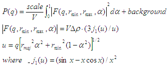

To provide easy access to the orientation of the core-shell ellipsoid, we define the axis of the solid ellipsoid using
two angles |theta| and |phi|\ . These angles are defined on Figure 2 of the CylinderModel_. The contrast is defined as
SLD(core) - SLD(shell) and SLD(shell) - SLD(solvent).

In the parameters, *equat_core* = equatorial core radius, *polar_core* = polar core radius, *equat_shell* =
*r*\ :sub:`min` (or equatorial outer radius), and *polar_shell* = = *r*\ :sub:`maj` (or polar outer radius).

NB: The 2nd virial coefficient of the solid ellipsoid is calculated based on the *radius_a* (= *polar_shell*) and
*radius_b* (= *equat_shell*) values, and used as the effective radius for *S(Q)* when *P(Q)* \* *S(Q)* is applied.

==============  ========  =============
Parameter name  Units     Default value
==============  ========  =============
background      |cm^-1|   0.001
equat_core      |Ang|     200
equat_shell     |Ang|     250
sld_solvent     |Ang^-2|  6e-06
ploar_shell     |Ang|     30
ploar_core      |Ang|     20
scale           None      1
sld_core        |Ang^-2|  2e-06
sld_shell       |Ang^-2|  1e-06
==============  ========  =============

.. image:: img/image127.jpg

*Figure. 1D plot using the default values (w/1000 data point).*

.. image:: img/image122.jpg

*Figure. The angles for oriented CoreShellEllipsoid.*

Our model uses the form factor calculations implemented in a c-library provided by the NIST Center for Neutron Research
(Kline, 2006).

REFERENCE

M Kotlarchyk, S H Chen, *J. Chem. Phys.*, 79 (1983) 2461

S J Berr, *Phys. Chem.*, 91 (1987) 4760

.. _CoreShellEllipsoidXTModel:

**2.1.27. CoreShellEllipsoidXTModel**

An alternative version of *P(q)* for the core-shell ellipsoid (see CoreShellEllipsoidModel), having as parameters the
core axial ratio *X* and a shell thickness, which are more often what we would like to determine.

This model is also better behaved when polydispersity is applied than the four independent radii in
CoreShellEllipsoidModel.

*2.1.27.1. Definition*

.. image:: img/image125.gif

The geometric parameters of this model are

  *equat_core* = equatorial core radius = *Rminor_core*
  
  *X_core* = *polar_core* / *equat_core* = *Rmajor_core* / *Rminor_core*
  
  *T_shell* = *equat_outer* - *equat_core* = *Rminor_outer* - *Rminor_core*
  
  *XpolarShell* = *Tpolar_shell* / *T_shell* = (*Rmajor_outer* - *Rmajor_core*)/(*Rminor_outer* - *Rminor_core*)

In terms of the original radii

  *polar_core* = *equat_core* \* *X_core*
  
  *equat_shell* = *equat_core* + *T_shell*
  
  *polar_shell* = *equat_core* \* *X_core* + *T_shell* \* *XpolarShell*

  (where we note that "shell" perhaps confusingly, relates to the outer radius)

When *X_core* < 1 the core is oblate; when *X_core* > 1  it is prolate. *X_core* = 1 is a spherical core.

For a fixed shell thickness *XpolarShell* = 1, to scale the shell thickness pro-rata with the radius
*XpolarShell* = *X_core*.

When including an *S(q)*, the radius in *S(q)* is calculated to be that of a sphere with the same 2nd virial
coefficient of the **outer** surface of the ellipsoid. This may have some undesirable effects if the aspect ratio of
the ellipsoid is large (ie, if *X* << 1 or *X* >> 1), when the *S(q)* - which assumes spheres - will not in any case
be valid.

If SAS data are in absolute units, and the SLDs are correct, then *scale* should be the total volume fraction of the
"outer particle". When *S(q)* is introduced this moves to the *S(q)* volume fraction, and *scale* should then be 1.0,
or contain some other units conversion factor (for example, if you have SAXS data).

==============  ========  =============
Parameter name  Units     Default value
==============  ========  =============
background      |cm^-1|   0.001
equat_core      |Ang|     20
scale           None      0.05
sld_core        |Ang^-2|  2.0e-6
sld_shell       |Ang^-2|  1.0e-6
sld_solv        |Ang^-2|  6.3e-6
T_shell         |Ang|     30
X_core          None      3.0
XpolarShell     None      1.0
==============  ========  =============

REFERENCE

R K Heenan, Private communication

.. _TriaxialEllipsoidModel:

**2.1.28. TriaxialEllipsoidModel**

This model provides the form factor, *P(q)*, for an ellipsoid (below) where all three axes are of different lengths,
i.e., *Ra* =< *Rb* =< *Rc*\ . **Users should maintain this inequality for all calculations**.

*P(q)* = *scale* \* <*f*\ :sup:`2`> / *V* + *background*

where the volume *V* = (4/3)\ |pi| (*Ra* *Rb* *Rc*), and the averaging < > is applied over all orientations for 1D.

.. image:: img/image128.jpg

The returned value is in units of |cm^-1|, on absolute scale.

*2.1.28.1. Definition*

The form factor calculated is

.. image:: img/image129.PNG

To provide easy access to the orientation of the triaxial ellipsoid, we define the axis of the cylinder using the
angles |theta|, |phi| and |bigpsi|. These angles are defined on Figure 2 of the CylinderModel_. The angle |bigpsi| is
the rotational angle around its own *semi_axisC* axis against the *q* plane. For example, |bigpsi| = 0 when the
*semi_axisA* axis is parallel to the *x*-axis of the detector.

The radius-of-gyration for this system is *Rg*\ :sup:`2` = (*Ra*\ :sup:`2` *Rb*\ :sup:`2` *Rc*\ :sup:`2`)/5.

The contrast is defined as SLD(ellipsoid) - SLD(solvent). In the parameters, *semi_axisA* = *Ra* (or minor equatorial
radius), *semi_axisB* = *Rb* (or major equatorial radius), and *semi_axisC* = *Rc* (or polar radius of the ellipsoid).

NB: The 2nd virial coefficient of the triaxial solid ellipsoid is calculated based on the
*radius_a* (= *semi_axisC*\ ) and *radius_b* (= sqrt(*semi_axisA* \* *semi_axisB*)) values, and used as the effective
radius for *S(Q)* when *P(Q)* \* *S(Q)* is applied.

==============  ========  =============
Parameter name  Units     Default value
==============  ========  =============
background      |cm^-1|   0.0
semi_axisA      |Ang|     35
semi_axisB      |Ang|     100
semi_axisC      |Ang|     400
scale           None      1
sldEll          |Ang^-2|  1.0e-06
sldSolv         |Ang^-2|  6.3e-06
==============  ========  =============

.. image:: img/image130.jpg

*Figure. 1D plot using the default values (w/1000 data point).*

*2.1.28.2.Validation of the TriaxialEllipsoidModel*

Validation of our code was done by comparing the output of the 1D calculation to the angular average of the output of
2D calculation over all possible angles. The Figure below shows the comparison where the solid dot refers to averaged
2D while the line represents the result of 1D calculation (for 2D averaging, 76, 180, and 76 points are taken for the
angles of |theta|, |phi|, and |psi| respectively).

.. image:: img/image131.gif

*Figure. Comparison between 1D and averaged 2D.*

.. image:: img/image132.jpg

*Figure. The angles for oriented ellipsoid.*

Our model uses the form factor calculations implemented in a c-library provided by the NIST Center for Neutron Research
(Kline, 2006)

REFERENCE

L A Feigin and D I Svergun, *Structure Analysis by Small-Angle X-Ray and Neutron Scattering*, Plenum,
New York, 1987.

.. _LamellarModel:

**2.1.29. LamellarModel**

This model provides the scattering intensity, *I(q)*, for a lyotropic lamellar phase where a uniform SLD and random
distribution in solution are assumed. Polydispersity in the bilayer thickness can be applied from the GUI.

*2.1.29.1. Definition*

The scattering intensity *I(q)* is

.. image:: img/image133.PNG

The form factor is

.. image:: img/image134.PNG

where |delta| = bilayer thickness.

The 2D scattering intensity is calculated in the same way as 1D, where the *q* vector is defined as

.. image:: img/image040.gif

The returned value is in units of |cm^-1|, on absolute scale. In the parameters, *sld_bi* = SLD of the bilayer,
*sld_sol* = SLD of the solvent, and *bi_thick* = thickness of the bilayer.

==============  ========  =============
Parameter name  Units     Default value
==============  ========  =============
background      |cm^-1|   0.0
sld_bi          |Ang^-2|  1e-06
bi_thick        |Ang|     50
sld_sol         |Ang^-2|  6e-06
scale           None      1
==============  ========  =============

.. image:: img/image135.jpg

*Figure. 1D plot using the default values (w/1000 data point).*

Our model uses the form factor calculations implemented in a c-library provided by the NIST Center for Neutron Research
(Kline, 2006).

REFERENCE

F Nallet, R Laversanne, and D Roux, J. Phys. II France, 3, (1993) 487-502

also in J. Phys. Chem. B, 105, (2001) 11081-11088

.. _LamellarFFHGModel:

**2.1.30. LamellarFFHGModel**

This model provides the scattering intensity, *I(q)*, for a lyotropic lamellar phase where a random distribution in
solution are assumed. The SLD of the head region is taken to be different from the SLD of the tail region.

*2.1.31.1. Definition*

The scattering intensity *I(q)* is

.. image:: img/image136.PNG

The form factor is

.. image:: img/image137.jpg

where |delta|\ T = tail length (or *t_length*), |delta|\ H = head thickness (or *h_thickness*),
|drho|\ H = SLD(headgroup) - SLD(solvent), and |drho|\ T = SLD(tail) - SLD(solvent). The total thickness is 2(H+T).

The 2D scattering intensity is calculated in the same way as 1D, where the *q* vector is defined as

.. image:: img/image040.gif

The returned value is in units of |cm^-1|, on absolute scale. In the parameters, *sld_tail* = SLD of the tail group,
and *sld_head* = SLD of the head group.

==============  ========  =============
Parameter name  Units     Default value
==============  ========  =============
background      |cm^-1|   0.0
sld_head        |Ang^-2|  3e-06
scale           None      1
sld_solvent     |Ang^-2|  6e-06
h_thickness     |Ang|     10
t_length        |Ang|     15
sld_tail        |Ang^-2|  0
==============  ========  =============

.. image:: img/image138.jpg

*Figure. 1D plot using the default values (w/1000 data point).*

Our model uses the form factor calculations implemented in a c-library provided by the NIST Center for Neutron Research
(Kline, 2006).

REFERENCE

F Nallet, R Laversanne, and D Roux, J. Phys. II France, 3, (1993) 487-502

also in J. Phys. Chem. B, 105, (2001) 11081-11088

*2014/04/17 - Description reviewed by S King and P Butler.*

.. _LamellarPSModel:

**2.1.31. LamellarPSModel**

This model provides the scattering intensity, *I(q)* = *P(q)* \* *S(q)*, for a lyotropic lamellar phase where a random
distribution in solution are assumed.

*2.1.31.1. Definition*

The scattering intensity *I(q)* is

.. image:: img/image139.PNG

The form factor is

.. image:: img/image134.PNG

and the structure factor is

.. image:: img/image140.PNG

where

.. image:: img/image141.PNG

Here *d* = (repeat) spacing, |delta| = bilayer thickness, the contrast |drho| = SLD(headgroup) - SLD(solvent),
K = smectic bending elasticity, B = compression modulus, and N = number of lamellar plates (*n_plates*).

NB: **When the Caille parameter is greater than approximately 0.8 to 1.0, the assumptions of the model are incorrect.**
And due to a complication of the model function, users are responsible for making sure that all the assumptions are
handled accurately (see the original reference below for more details).

The 2D scattering intensity is calculated in the same way as 1D, where the *q* vector is defined as

.. image:: img/image040.gif

The returned value is in units of |cm^-1|, on absolute scale.

==============  ========  =============
Parameter name  Units     Default value
==============  ========  =============
background      |cm^-1|   0.0
contrast        |Ang^-2|  5e-06
scale           None      1
delta           |Ang|     30
n_plates        None      20
spacing         |Ang|     400
caille          |Ang^-2|  0.1
==============  ========  =============

.. image:: img/image142.jpg

*Figure. 1D plot using the default values (w/6000 data point).*

Our model uses the form factor calculations implemented in a c-library provided by the NIST Center for Neutron Research
(Kline, 2006).

REFERENCE

F Nallet, R Laversanne, and D Roux, J. Phys. II France, 3, (1993) 487-502

also in J. Phys. Chem. B, 105, (2001) 11081-11088

.. _LamellarPSHGModel:

**2.1.32. LamellarPSHGModel**

This model provides the scattering intensity, *I(q)* = *P(q)* \* *S(q)*, for a lyotropic lamellar phase where a random
distribution in solution are assumed. The SLD of the head region is taken to be different from the SLD of the tail
region.

*2.1.32.1. Definition*

The scattering intensity *I(q)* is

.. image:: img/image139.PNG

The form factor is

.. image:: img/image143.PNG

The structure factor is

.. image:: img/image140.PNG

where

.. image:: img/image141.PNG

where |delta|\ T = tail length (or *t_length*), |delta|\ H = head thickness (or *h_thickness*),
|drho|\ H = SLD(headgroup) - SLD(solvent), and |drho|\ T = SLD(tail) - SLD(headgroup).
Here *d* = (repeat) spacing, *K* = smectic bending elasticity, *B* = compression modulus, and N = number of lamellar
plates (*n_plates*).

NB: **When the Caille parameter is greater than approximately 0.8 to 1.0, the assumptions of the model are incorrect.**
And due to a complication of the model function, users are responsible for making sure that all the assumptions are
handled accurately (see the original reference below for more details).

The 2D scattering intensity is calculated in the same way as 1D, where the *q* vector is defined as

.. image:: img/image040.gif

The returned value is in units of |cm^-1|, on absolute scale. In the parameters, *sld_tail* = SLD of the tail group,
*sld_head* = SLD of the head group, and *sld_solvent* = SLD of the solvent.

==============  ========  =============
Parameter name  Units     Default value
==============  ========  =============
background      |cm^-1|   0.001
sld_head        |Ang^-2|  2e-06
scale           None      1
sld_solvent     |Ang^-2|  6e-06
deltaH          |Ang|     2
deltaT          |Ang|     10
sld_tail        |Ang^-2|  0
n_plates        None      30
spacing         |Ang|     40
caille          |Ang^-2|  0.001
==============  ========  =============

.. image:: img/image144.jpg

*Figure. 1D plot using the default values (w/6000 data point).*

Our model uses the form factor calculations implemented in a c-library provided by the NIST Center for Neutron Research
(Kline, 2006).

REFERENCE

F Nallet, R Laversanne, and D Roux, J. Phys. II France, 3, (1993) 487-502

also in J. Phys. Chem. B, 105, (2001) 11081-11088

.. _LamellarPCrystalModel:

**2.1.33. LamellarPCrystalModel**

This model calculates the scattering from a stack of repeating lamellar structures. The stacks of lamellae (infinite
in lateral dimension) are treated as a paracrystal to account for the repeating spacing. The repeat distance is further
characterized by a Gaussian polydispersity. **This model can be used for large multilamellar vesicles.**

*2.1.33.1. Definition*

The scattering intensity *I(q)* is calculated as

.. image:: img/image145.jpg

The form factor of the bilayer is approximated as the cross section of an infinite, planar bilayer of thickness *t*

.. image:: img/image146.jpg

Here, the scale factor is used instead of the mass per area of the bilayer (*G*). The scale factor is the volume
fraction of the material in the bilayer, *not* the total excluded volume of the paracrystal. *Z*\ :sub:`N`\ *(q)*
describes the interference effects for aggregates consisting of more than one bilayer. The equations used are (3-5)
from the Bergstrom reference below.

Non-integer numbers of stacks are calculated as a linear combination of the lower and higher values

.. image:: img/image147.jpg

The 2D scattering intensity is the same as 1D, regardless of the orientation of the *q* vector which is defined as

.. image:: img/image040.gif

The parameters of the model are *Nlayers* = no. of layers, and *pd_spacing* = polydispersity of spacing.

==============  ========  =============
Parameter name  Units     Default value
==============  ========  =============
background      |cm^-1|   0
scale           None      1
Nlayers         None      20
pd_spacing      None      0.2
sld_layer       |Ang^-2|  1e-6
sld_solvent     |Ang^-2|  6.34e-6
spacing         |Ang|     250
thickness       |Ang|     33
==============  ========  =============

.. image:: img/image148.jpg

*Figure. 1D plot using the default values above (w/20000 data point).*

Our model uses the form factor calculations implemented in a c-library provided by the NIST Center for Neutron Research
(Kline, 2006).

REFERENCE

M Bergstrom, J S Pedersen, P Schurtenberger, S U Egelhaaf, *J. Phys. Chem. B*, 103 (1999) 9888-9897

.. _SCCrystalModel:

**2.1.34. SCCrystalModel**

Calculates the scattering from a **simple cubic lattice** with paracrystalline distortion. Thermal vibrations are
considered to be negligible, and the size of the paracrystal is infinitely large. Paracrystalline distortion is assumed
to be isotropic and characterized by a Gaussian distribution.

The returned value is scaled to units of |cm^-1|\ |sr^-1|, absolute scale.

*2.1.34.1. Definition*

The scattering intensity *I(q)* is calculated as

.. image:: img/image149.jpg

where *scale* is the volume fraction of spheres, *Vp* is the volume of the primary particle, *V(lattice)* is a volume
correction for the crystal structure, *P(q)* is the form factor of the sphere (normalized), and *Z(q)* is the
paracrystalline structure factor for a simple cubic structure.

Equation (16) of the 1987 reference is used to calculate *Z(q)*, using equations (13)-(15) from the 1987 paper for
*Z1*\ , *Z2*\ , and *Z3*\ .

The lattice correction (the occupied volume of the lattice) for a simple cubic structure of particles of radius *R*
and nearest neighbor separation *D* is

.. image:: img/image150.jpg

The distortion factor (one standard deviation) of the paracrystal is included in the calculation of *Z(q)*

.. image:: img/image151.jpg

where *g* is a fractional distortion based on the nearest neighbor distance.

The simple cubic lattice is

.. image:: img/image152.jpg

For a crystal, diffraction peaks appear at reduced *q*\ -values given by

.. image:: img/image153.jpg

where for a simple cubic lattice any *h*\ , *k*\ , *l* are allowed and none are forbidden. Thus the peak positions
correspond to (just the first 5)

.. image:: img/image154.jpg

**NB: The calculation of** *Z(q)* **is a double numerical integral that must be carried out with a high density of**
**points to properly capture the sharp peaks of the paracrystalline scattering.** So be warned that the calculation is
SLOW. Go get some coffee. Fitting of any experimental data must be resolution smeared for any meaningful fit. This
makes a triple integral. Very, very slow. Go get lunch!

==============  ========  =============
Parameter name  Units     Default value
==============  ========  =============
background      |cm^-1|   0
dnn             |Ang|     220
scale           None      1
sldSolv         |Ang^-2|  6.3e-06
radius          |Ang|     40
sld_Sph         |Ang^-2|  3e-06
d_factor        None      0.06
==============  ========  =============

This example dataset is produced using 200 data points, *qmin* = 0.01 |Ang^-1|, *qmax* = 0.1 |Ang^-1| and the above
default values.

.. image:: img/image155.jpg

*Figure. 1D plot in the linear scale using the default values (w/200 data point).*

The 2D (Anisotropic model) is based on the reference below where *I(q)* is approximated for 1d scattering. Thus the
scattering pattern for 2D may not be accurate. Note that we are not responsible for any incorrectness of the 2D model
computation.

.. image:: img/image156.jpg

.. image:: img/image157.jpg

*Figure. 2D plot using the default values (w/200X200 pixels).*

REFERENCE

Hideki Matsuoka et. al. *Physical Review B*, 36 (1987) 1754-1765
(Original Paper)

Hideki Matsuoka et. al. *Physical Review B*, 41 (1990) 3854 -3856
(Corrections to FCC and BCC lattice structure calculation)

.. _FCCrystalModel:

**2.1.35. FCCrystalModel**

Calculates the scattering from a **face-centered cubic lattice** with paracrystalline distortion. Thermal vibrations
are considered to be negligible, and the size of the paracrystal is infinitely large. Paracrystalline distortion is
assumed to be isotropic and characterized by a Gaussian distribution.

The returned value is scaled to units of |cm^-1|\ |sr^-1|, absolute scale.

*2.1.35.1. Definition*

The scattering intensity *I(q)* is calculated as

.. image:: img/image158.jpg

where *scale* is the volume fraction of spheres, *Vp* is the volume of the primary particle, *V(lattice)* is a volume
correction for the crystal structure, *P(q)* is the form factor of the sphere (normalized), and *Z(q)* is the
paracrystalline structure factor for a face-centered cubic structure.

Equation (1) of the 1990 reference is used to calculate *Z(q)*, using equations (23)-(25) from the 1987 paper for
*Z1*\ , *Z2*\ , and *Z3*\ .

The lattice correction (the occupied volume of the lattice) for a face-centered cubic structure of particles of radius
*R* and nearest neighbor separation *D* is

.. image:: img/image159.jpg

The distortion factor (one standard deviation) of the paracrystal is included in the calculation of *Z(q)*

.. image:: img/image160.jpg

where *g* is a fractional distortion based on the nearest neighbor distance.

The face-centered cubic lattice is

.. image:: img/image161.jpg

For a crystal, diffraction peaks appear at reduced q-values given by

.. image:: img/image162.jpg

where for a face-centered cubic lattice *h*\ , *k*\ , *l* all odd or all even are allowed and reflections where
*h*\ , *k*\ , *l* are mixed odd/even are forbidden. Thus the peak positions correspond to (just the first 5)

.. image:: img/image163.jpg

**NB: The calculation of** *Z(q)* **is a double numerical integral that must be carried out with a high density of**
**points to properly capture the sharp peaks of the paracrystalline scattering.** So be warned that the calculation is
SLOW. Go get some coffee. Fitting of any experimental data must be resolution smeared for any meaningful fit. This
makes a triple integral. Very, very slow. Go get lunch!

==============  ========  =============
Parameter name  Units     Default value
==============  ========  =============
background      |cm^-1|   0
dnn             |Ang|     220
scale           None      1
sldSolv         |Ang^-2|  6.3e-06
radius          |Ang|     40
sld_Sph         |Ang^-2|  3e-06
d_factor        None      0.06
==============  ========  =============

This example dataset is produced using 200 data points, *qmin* = 0.01 |Ang^-1|, *qmax* = 0.1 |Ang^-1| and the above
default values.

.. image:: img/image164.jpg

*Figure. 1D plot in the linear scale using the default values (w/200 data point).*

The 2D (Anisotropic model) is based on the reference below where *I(q)* is approximated for 1d scattering. Thus the
scattering pattern for 2D may not be accurate. Note that we are not responsible for any incorrectness of the 2D model
computation.

.. image:: img/image165.gif

.. image:: img/image166.jpg

*Figure. 2D plot using the default values (w/200X200 pixels).*

REFERENCE

Hideki Matsuoka et. al. *Physical Review B*, 36 (1987) 1754-1765
(Original Paper)

Hideki Matsuoka et. al. *Physical Review B*, 41 (1990) 3854 -3856
(Corrections to FCC and BCC lattice structure calculation)

.. _BCCrystalModel:

**2.1.36. BCCrystalModel**

Calculates the scattering from a **body-centered cubic lattice** with paracrystalline distortion. Thermal vibrations
are considered to be negligible, and the size of the paracrystal is infinitely large. Paracrystalline distortion is
assumed to be isotropic and characterized by a Gaussian distribution.

The returned value is scaled to units of |cm^-1|\ |sr^-1|, absolute scale.

*2.1.36.1. Definition**

The scattering intensity *I(q)* is calculated as

.. image:: img/image167.jpg

where *scale* is the volume fraction of spheres, *Vp* is the volume of the primary particle, *V(lattice)* is a volume
correction for the crystal structure, *P(q)* is the form factor of the sphere (normalized), and *Z(q)* is the
paracrystalline structure factor for a body-centered cubic structure.

Equation (1) of the 1990 reference is used to calculate *Z(q)*, using equations (29)-(31) from the 1987 paper for
*Z1*\ , *Z2*\ , and *Z3*\ .

The lattice correction (the occupied volume of the lattice) for a body-centered cubic structure of particles of radius
*R* and nearest neighbor separation *D* is

.. image:: img/image159.jpg

The distortion factor (one standard deviation) of the paracrystal is included in the calculation of *Z(q)*

.. image:: img/image160.jpg

where *g* is a fractional distortion based on the nearest neighbor distance.

The body-centered cubic lattice is

.. image:: img/image168.jpg

For a crystal, diffraction peaks appear at reduced q-values given by

.. image:: img/image162.jpg

where for a body-centered cubic lattice, only reflections where (\ *h* + *k* + *l*\ ) = even are allowed and
reflections where (\ *h* + *k* + *l*\ ) = odd are forbidden. Thus the peak positions correspond to (just the first 5)

.. image:: img/image169.jpg

**NB: The calculation of** *Z(q)* **is a double numerical integral that must be carried out with a high density of**
**points to properly capture the sharp peaks of the paracrystalline scattering.** So be warned that the calculation is
SLOW. Go get some coffee. Fitting of any experimental data must be resolution smeared for any meaningful fit. This
makes a triple integral. Very, very slow. Go get lunch!

==============  ========  =============
Parameter name  Units     Default value
==============  ========  =============
background      |cm^-1|   0
dnn             |Ang|     220
scale           None      1
sldSolv         |Ang^-2|  6.3e-006
radius          |Ang|     40
sld_Sph         |Ang^-2|  3e-006
d_factor        None      0.06
==============  ========  =============

This example dataset is produced using 200 data points, *qmin* = 0.001 |Ang^-1|, *qmax* = 0.1 |Ang^-1| and the above
default values.

.. image:: img/image170.jpg

*Figure. 1D plot in the linear scale using the default values (w/200 data point).*

The 2D (Anisotropic model) is based on the reference below where *I(q)* is approximated for 1d scattering. Thus the
scattering pattern for 2D may not be accurate. Note that we are not responsible for any incorrectness of the 2D model
computation.

.. image:: img/image165.gif

.. image:: img/image171.jpg

*Figure. 2D plot using the default values (w/200X200 pixels).*

REFERENCE

Hideki Matsuoka et. al. *Physical Review B*, 36 (1987) 1754-1765
(Original Paper)

Hideki Matsuoka et. al. *Physical Review B*, 41 (1990) 3854 -3856
(Corrections to FCC and BCC lattice structure calculation)

.. _ParallelepipedModel:

**2.1.37. ParallelepipedModel**

This model provides the form factor, *P(q)*, for a rectangular cylinder (below) where the form factor is normalized by
the volume of the cylinder. If you need to apply polydispersity, see the RectangularPrismModel_.

*P(q)* = *scale* \* <*f*\ :sup:`2`> / *V* + *background*

where the volume *V* = *A B C* and the averaging < > is applied over all orientations for 1D.

For information about polarised and magnetic scattering, click here_.

.. image:: img/image087.jpg

*2.1.37.1. Definition*

**The edge of the solid must satisfy the condition that** *A* < *B*. Then, assuming *a* = *A* / *B* < 1,
*b* = *B* / *B* = 1, and *c* = *C* / *B* > 1, the form factor is

.. image:: img/image088.PNG

and the contrast is defined as

.. image:: img/image089.PNG

The scattering intensity per unit volume is returned in units of |cm^-1|; ie, *I(q)* = |phi| *P(q)*\ .

NB: The 2nd virial coefficient of the parallelpiped is calculated based on the the averaged effective radius
(= sqrt(*short_a* \* *short_b* / |pi|)) and length(= *long_c*) values, and used as the effective radius for
*S(Q)* when *P(Q)* \* *S(Q)* is applied.

To provide easy access to the orientation of the parallelepiped, we define the axis of the cylinder using three angles
|theta|, |phi| and |bigpsi|. These angles are defined on Figure 2 of the CylinderModel_. The angle |bigpsi| is the
rotational angle around the *long_c* axis against the *q* plane. For example, |bigpsi| = 0 when the *short_b* axis is
parallel to the *x*-axis of the detector.

.. image:: img/image090.jpg

*Figure. Definition of angles for 2D*.

.. image:: img/image091.jpg

*Figure. Examples of the angles for oriented pp against the detector plane.*

==============  ========  =============
Parameter name  Units     Default value
==============  ========  =============
background      |cm^-1|   0.0
contrast        |Ang^-2|  5e-06
long_c          |Ang|     400
short_a         |Ang^-2|  35
short_b         |Ang|     75
scale           None      1
==============  ========  =============

.. image:: img/image092.jpg

*Figure. 1D plot using the default values (w/1000 data point).*

*2.1.37.2. Validation of the parallelepiped 2D model*

Validation of our code was done by comparing the output of the 1D calculation to the angular average of the output of
a 2D calculation over all possible angles. The Figure below shows the comparison where the solid dot refers to averaged
2D while the line represents the result of the 1D calculation (for the averaging, 76, 180, 76 points are taken for the
angles of |theta|, |phi|, and |psi| respectively).

.. image:: img/image093.gif

*Figure. Comparison between 1D and averaged 2D.*

Our model uses the form factor calculations implemented in a c-library provided by the NIST Center for Neutron Research
(Kline, 2006).

REFERENCE

P Mittelbach and G Porod, *Acta Physica Austriaca*, 14 (1961) 185-211
Equations (1), (13-14). (in German)

.. _CSParallelepipedModel:

**2.1.38. CSParallelepipedModel**

Calculates the form factor for a rectangular solid with a core-shell structure. **The thickness and the scattering**
**length density of the shell or "rim" can be different on all three (pairs) of faces.**

The form factor is normalized by the particle volume *V* such that

*P(q)* = *scale* \* <*f*\ :sup:`2`> / *V* + *background*

where < > is an average over all possible orientations of the rectangular solid.

An instrument resolution smeared version of the model is also provided.

*2.1.38.1. Definition*

The function calculated is the form factor of the rectangular solid below. The core of the solid is defined by the
dimensions *A*, *B*, *C* such that *A* < *B* < *C*.

.. image:: img/image087.jpg

There are rectangular "slabs" of thickness *tA* that add to the *A* dimension (on the *BC* faces). There are similar
slabs on the *AC* (= *tB*) and *AB* (= *tC*) faces. The projection in the *AB* plane is then

.. image:: img/image094.jpg

The volume of the solid is

.. image:: img/image095.PNG

**meaning that there are "gaps" at the corners of the solid.**

The intensity calculated follows the ParallelepipedModel_, with the core-shell intensity being calculated as the
square of the sum of the amplitudes of the core and shell, in the same manner as a CoreShellModel_.

**For the calculation of the form factor to be valid, the sides of the solid MUST be chosen such that** *A* < *B* < *C*.
**If this inequality is not satisfied, the model will not report an error, and the calculation will not be correct.**

FITTING NOTES
If the scale is set equal to the particle volume fraction, |phi|, the returned value is the scattered intensity per
unit volume; ie, *I(q)* = |phi| *P(q)*\ . However, **no interparticle interference effects are included in this**
**calculation.**

There are many parameters in this model. Hold as many fixed as possible with known values, or you will certainly end
up at a solution that is unphysical.

Constraints must be applied during fitting to ensure that the inequality *A* < *B* < *C* is not violated. The
calculation will not report an error, but the results will not be correct.

The returned value is in units of |cm^-1|, on absolute scale.

NB: The 2nd virial coefficient of the CSParallelpiped is calculated based on the the averaged effective radius
(= sqrt((*short_a* + 2 *rim_a*) \* (*short_b* + 2 *rim_b*) / |pi|)) and length(= *long_c* + 2 *rim_c*) values, and
used as the effective radius for *S(Q)* when *P(Q)* \* *S(Q)* is applied.

To provide easy access to the orientation of the parallelepiped, we define the axis of the cylinder using three angles
|theta|, |phi| and |bigpsi|. These angles are defined on Figure 2 of the CylinderModel_. The angle |bigpsi| is the
rotational angle around the *long_c* axis against the *q* plane. For example, |bigpsi| = 0 when the *short_b* axis is
parallel to the *x*-axis of the detector.

.. image:: img/image090.jpg

*Figure. Definition of angles for 2D*.

.. image:: img/image091.jpg

*Figure. Examples of the angles for oriented cspp against the detector plane.*

This example dataset was produced by running the Macro Plot_CSParallelepiped(), using 100 data points,
*qmin* = 0.001 |Ang^-1|, *qmax* = 0.7 |Ang^-1| and the default values

==============  ========  =============
Parameter name  Units     Default value
==============  ========  =============
background      |cm^-1|   0.06
sld_pcore       |Ang^-2|  1e-06
sld_rimA        |Ang^-2|  2e-06
sld_rimB        |Ang^-2|  4e-06
sld_rimC        |Ang^-2|  2e-06
sld_solv        |Ang^-2|  6e-06
rimA            |Ang|     10
rimB            |Ang|     10
rimC            |Ang|     10
longC           |Ang|     400
shortA          |Ang|     35
midB            |Ang|     75
scale           None      1
==============  ========  =============

.. image:: img/image096.jpg

*Figure. 1D plot using the default values (w/256 data points).*

.. image:: img/image097.jpg

*Figure. 2D plot using the default values (w/(256X265) data points).*

Our model uses the form factor calculations implemented in a c-library provided by the NIST Center for Neutron Research
(Kline, 2006).

REFERENCE

P Mittelbach and G Porod, *Acta Physica Austriaca*, 14 (1961) 185-211
Equations (1), (13-14). (in German)

.. _RectangularPrismModel:

**2.1.39. RectangularPrismModel**

This model provides the form factor, *P(q)*, for a rectangular prism.

Note that this model is almost totally equivalent to the existing ParallelepipedModel_. The only difference is that the
way the relevant parameters are defined here (*a*, *b/a*, *c/a* instead of *a*, *b*, *c*) allows to use polydispersity
with this model while keeping the shape of the prism (e.g. setting *b/a* = 1 and *c/a* = 1 and applying polydispersity
to *a* will generate a distribution of cubes of different sizes).

*2.1.39.1. Definition*

The 1D scattering intensity for this model was calculated by Mittelbach and Porod (Mittelbach, 1961), but the
implementation here is closer to the equations given by Nayuk and Huber (Nayuk, 2012).

The scattering from a massive parallelepiped with an orientation with respect to the scattering vector given by |theta|
and |phi| is given by

.. math::
  A_P\,(q) =  \frac{\sin \bigl( q \frac{C}{2} \cos\theta \bigr)}{q \frac{C}{2} \cos\theta} \, \times \,
  \frac{\sin \bigl( q \frac{A}{2} \sin\theta \sin\phi \bigr)}{q \frac{A}{2} \sin\theta \sin\phi} \, \times \,
  \frac{\sin \bigl( q \frac{B}{2} \sin\theta \cos\phi \bigr)}{q \frac{B}{2} \sin\theta \cos\phi}

where *A*, *B* and *C* are the sides of the parallelepiped and must fulfill :math:`A \le B \le C`, |theta| is the angle
between the *z* axis and the longest axis of the parallelepiped *C*, and |phi| is the angle between the scattering
vector (lying in the *xy* plane) and the *y* axis.

The normalized form factor in 1D is obtained averaging over all possible orientations

.. math::
  P(q) =  \frac{2}{\pi} \times \, \int_0^{\frac{\pi}{2}} \, \int_0^{\frac{\pi}{2}} A_P^2(q) \, \sin\theta \, d\theta \, d\phi

The 1D scattering intensity is then calculated as

.. math::
  I(q) = \mbox{scale} \times V \times (\rho_{\mbox{pipe}} - \rho_{\mbox{solvent}})^2 \times P(q)

where *V* is the volume of the rectangular prism, :math:`\rho_{\mbox{pipe}}` is the scattering length of the
parallelepiped, :math:`\rho_{\mbox{solvent}}` is the scattering length of the solvent, and (if the data are in absolute
units) *scale* represents the volume fraction (which is unitless).

**The 2D scattering intensity is not computed by this model.**

The returned value is scaled to units of |cm^-1| and the parameters of the RectangularPrismModel are the following

==============  ========  =============
Parameter name  Units     Default value
==============  ========  =============
scale           None      1
short_side      |Ang|     35
b2a_ratio       None      1
c2a_ratio       None      1
sldPipe         |Ang^-2|  6.3e-6
sldSolv         |Ang^-2|  1.0e-6
background      |cm^-1|   0
==============  ========  =============

*2.1.39.2. Validation of the RectangularPrismModel*

Validation of the code was conducted by comparing the output of the 1D model to the output of the existing
parallelepiped model.

REFERENCES

P Mittelbach and G Porod, *Acta Physica Austriaca*, 14 (1961) 185-211

R Nayuk and K Huber, *Z. Phys. Chem.*, 226 (2012) 837-854

.. _RectangularHollowPrismModel:

**2.1.40. RectangularHollowPrismModel**

This model provides the form factor, *P(q)*, for a hollow rectangular parallelepiped with a wall thickness |bigdelta|.

*2.1.40.1. Definition*

The 1D scattering intensity for this model is calculated by forming the difference of the amplitudes of two massive
parallelepipeds differing in their outermost dimensions in each direction by the same length increment 2 |bigdelta|
(Nayuk, 2012).

As in the case of the massive parallelepiped, the scattering amplitude is computed for a particular orientation of the
parallelepiped with respect to the scattering vector and then averaged over all possible orientations, giving

.. math::
  P(q) =  \frac{1}{V^2} \frac{2}{\pi} \times \, \int_0^{\frac{\pi}{2}} \, \int_0^{\frac{\pi}{2}} A_{P\Delta}^2(q) \,
  \sin\theta \, d\theta \, d\phi

where |theta| is the angle between the *z* axis and the longest axis of the parallelepiped, |phi| is the angle between
the scattering vector (lying in the *xy* plane) and the *y* axis, and

.. math::
  A_{P\Delta}\,(q) =  A \, B \, C \, \times
                      \frac{\sin \bigl( q \frac{C}{2} \cos\theta \bigr)}{q \frac{C}{2} \cos\theta} \,
                      \frac{\sin \bigl( q \frac{A}{2} \sin\theta \sin\phi \bigr)}{q \frac{A}{2} \sin\theta \sin\phi} \,
                      \frac{\sin \bigl( q \frac{B}{2} \sin\theta \cos\phi \bigr)}{q \frac{B}{2} \sin\theta \cos\phi} -
                      8 \, \bigl( \frac{A}{2} - \Delta \bigr) \, \bigl( \frac{B}{2} - \Delta \bigr) \,
                      \bigl( \frac{C}{2} - \Delta \bigr) \, \times
                      \frac{\sin \bigl[ q \bigl(\frac{C}{2}-\Delta\bigr) \cos\theta \bigr]}
                      {q \bigl(\frac{C}{2}-\Delta\bigr) \cos\theta} \,
                      \frac{\sin \bigl[ q \bigl(\frac{A}{2}-\Delta\bigr) \sin\theta \sin\phi \bigr]}
                      {q \bigl(\frac{A}{2}-\Delta\bigr) \sin\theta \sin\phi} \,
                      \frac{\sin \bigl[ q \bigl(\frac{B}{2}-\Delta\bigr) \sin\theta \cos\phi \bigr]}
                      {q \bigl(\frac{B}{2}-\Delta\bigr) \sin\theta \cos\phi} \,

where *A*, *B* and *C* are the external sides of the parallelepiped fulfilling :math:`A \le B \le C`, and the volume *V*
of the parallelepiped is

.. math::
  V = A B C \, - \, (A - 2\Delta) (B - 2\Delta) (C - 2\Delta)

The 1D scattering intensity is then calculated as

.. math::
  I(q) = \mbox{scale} \times V \times (\rho_{\mbox{pipe}} - \rho_{\mbox{solvent}})^2 \times P(q)

where :math:`\rho_{\mbox{pipe}}` is the scattering length of the parallelepiped, :math:`\rho_{\mbox{solvent}}` is the
scattering length of the solvent, and (if the data are in absolute units) *scale* represents the volume fraction (which
is unitless).

**The 2D scattering intensity is not computed by this model.**

The returned value is scaled to units of |cm^-1| and the parameters of the RectangularHollowPrismModel are the
following

==============  ========  =============
Parameter name  Units     Default value
==============  ========  =============
scale           None      1
short_side      |Ang|     35
b2a_ratio       None      1
c2a_ratio       None      1
thickness       |Ang|     1
sldPipe         |Ang^-2|  6.3e-6
sldSolv         |Ang^-2|  1.0e-6
background      |cm^-1|   0
==============  ========  =============

*2.1.40.2. Validation of the RectangularHollowPrismModel*

Validation of the code was conducted by qualitatively comparing the output of the 1D model to the curves shown in
(Nayuk, 2012).

REFERENCES

R Nayuk and K Huber, *Z. Phys. Chem.*, 226 (2012) 837-854

.. _RectangularHollowPrismInfThinWallsModel:

**2.1.41. RectangularHollowPrismInfThinWallsModel**

This model provides the form factor, *P(q)*, for a hollow rectangular prism with infinitely thin walls.

*2.1.41.1. Definition*

The 1D scattering intensity for this model is calculated according to the equations given by Nayuk and Huber
(Nayuk, 2012).

Assuming a hollow parallelepiped with infinitely thin walls, edge lengths :math:`A \le B \le C` and presenting an
orientation with respect to the scattering vector given by |theta| and |phi|, where |theta| is the angle between the
*z* axis and the longest axis of the parallelepiped *C*, and |phi| is the angle between the scattering vector
(lying in the *xy* plane) and the *y* axis, the form factor is given by

.. math::
  P(q) =  \frac{1}{V^2} \frac{2}{\pi} \times \, \int_0^{\frac{\pi}{2}} \, \int_0^{\frac{\pi}{2}} [A_L(q)+A_T(q)]^2
  \, \sin\theta \, d\theta \, d\phi

where

.. math::
  V = 2AB + 2AC + 2BC

.. math::
  A_L\,(q) =  8 \times \frac{ \sin \bigl( q \frac{A}{2} \sin\phi \sin\theta \bigr)
                              \sin \bigl( q \frac{B}{2} \cos\phi \sin\theta \bigr)
                              \cos \bigl( q \frac{C}{2} \cos\theta \bigr) }
                            {q^2 \, \sin^2\theta \, \sin\phi \cos\phi}

.. math::
  A_T\,(q) =  A_F\,(q) \times \frac{2 \, \sin \bigl( q \frac{C}{2} \cos\theta \bigr)}{q \, \cos\theta}

and

.. math::
  A_F\,(q) =  4 \frac{ \cos \bigl( q \frac{A}{2} \sin\phi \sin\theta \bigr)
                       \sin \bigl( q \frac{B}{2} \cos\phi \sin\theta \bigr) }
                     {q \, \cos\phi \, \sin\theta} +
              4 \frac{ \sin \bigl( q \frac{A}{2} \sin\phi \sin\theta \bigr)
                       \cos \bigl( q \frac{B}{2} \cos\phi \sin\theta \bigr) }
                     {q \, \sin\phi \, \sin\theta}

The 1D scattering intensity is then calculated as

.. math::
  I(q) = \mbox{scale} \times V \times (\rho_{\mbox{pipe}} - \rho_{\mbox{solvent}})^2 \times P(q)

where *V* is the volume of the rectangular prism, :math:`\rho_{\mbox{pipe}}` is the scattering length of the
parallelepiped, :math:`\rho_{\mbox{solvent}}` is the scattering length of the solvent, and (if the data are in absolute
units) *scale* represents the volume fraction (which is unitless).

**The 2D scattering intensity is not computed by this model.**

The returned value is scaled to units of |cm^-1| and the parameters of the RectangularHollowPrismInfThinWallModel
are the following

==============  ========  =============
Parameter name  Units     Default value
==============  ========  =============
scale           None      1
short_side      |Ang|     35
b2a_ratio       None      1
c2a_ratio       None      1
sldPipe         |Ang^-2|  6.3e-6
sldSolv         |Ang^-2|  1.0e-6
background      |cm^-1|   0
==============  ========  =============

*2.1.41.2. Validation of the RectangularHollowPrismInfThinWallsModel*

Validation of the code was conducted  by qualitatively comparing the output of the 1D model to the curves shown in
(Nayuk, 2012).

REFERENCES

R Nayuk and K Huber, *Z. Phys. Chem.*, 226 (2012) 837-854

.. _MicelleSphCoreModel:

**2.1.42. MicelleSphCoreModel**

This model provides the form factor, *P(q)*, for a micelle with a spherical core 
and Gaussian polymer chains attached to the surface.

*2.1.42.1. Definition*

The 1D scattering intensity for this model is calculated according to the equations given by Pedersen
(Pedersen, 2000).

*2.1.42.2. Validation of the MicelleSphCoreModel*

This model has not yet been validated. Feb2015

REFERENCES

J Pedersen, *J. Appl. Cryst.*, 33 (2000) 637-640

2.2 Shape-independent Functions
-------------------------------

The following are models used for shape-independent SAS analysis.

.. _Debye:

**2.2.1. Debye (Gaussian Coil Model)**

The Debye model is a form factor for a linear polymer chain obeying Gaussian statistics (ie, it is in the theta state).
In addition to the radius-of-gyration, *Rg*, a scale factor *scale*, and a constant background term are included in the
calculation. **NB: No size polydispersity is included in this model, use the** Poly_GaussCoil_ **Model instead**

.. image:: img/image172.PNG

For 2D data: The 2D scattering intensity is calculated in the same way as 1D, where the *q* vector is defined as

.. image:: img/image040.gif

==============  ========  =============
Parameter name  Units     Default value
==============  ========  =============
scale           None      1.0
rg              |Ang|     50.0
background      |cm^-1|   0.0
==============  ========  =============

.. image:: img/image173.jpg

*Figure. 1D plot using the default values (w/200 data point).*

REFERENCE

R J Roe, *Methods of X-Ray and Neutron Scattering in Polymer Science*, Oxford University Press, New York (2000)

.. _BroadPeakModel:

**2.2.2. BroadPeakModel**

This model calculates an empirical functional form for SAS data characterized by a broad scattering peak. Many SAS
spectra are characterized by a broad peak even though they are from amorphous soft materials. For example, soft systems
that show a SAS peak include copolymers, polyelectrolytes, multiphase systems, layered structures, etc.

The d-spacing corresponding to the broad peak is a characteristic distance between the scattering inhomogeneities (such
as in lamellar, cylindrical, or spherical morphologies, or for bicontinuous structures).

The returned value is scaled to units of |cm^-1|, absolute scale.

*2.2.2.1. Definition*

The scattering intensity *I(q)* is calculated as

.. image:: img/image174.jpg

Here the peak position is related to the d-spacing as *Q0* = 2|pi| / *d0*.

For 2D data: The 2D scattering intensity is calculated in the same way as 1D, where the *q* vector is defined as

.. image:: img/image040.gif

==================  ========  =============
Parameter name      Units     Default value
==================  ========  =============
scale_l    (=C)     None      10
scale_p    (=A)     None      1e-05
length_l (= |xi| )  |Ang|     50
q_peak    (=Q0)     |Ang^-1|  0.1
exponent_p (=n)     None      2
exponent_l (=m)     None      3
Background (=B)     |cm^-1|   0.1
==================  ========  =============

.. image:: img/image175.jpg

*Figure. 1D plot using the default values (w/200 data point).*

REFERENCE

None.

*2013/09/09 - Description reviewed by King, S and Parker, P.*

.. _CorrLength:

**2.2.3. CorrLength (Correlation Length Model)**

Calculates an empirical functional form for SAS data characterized by a low-Q signal and a high-Q signal.

The returned value is scaled to units of |cm^-1|, absolute scale.

*2.2.3. Definition*

The scattering intensity *I(q)* is calculated as

.. image:: img/image176.jpg

The first term describes Porod scattering from clusters (exponent = n) and the second term is a Lorentzian function
describing scattering from polymer chains (exponent = *m*). This second term characterizes the polymer/solvent
interactions and therefore the thermodynamics. The two multiplicative factors *A* and *C*, the incoherent
background *B* and the two exponents *n* and *m* are used as fitting parameters. The final parameter |xi| is a
correlation length for the polymer chains. Note that when *m*\ =2 this functional form becomes the familiar Lorentzian
function. 

For 2D data: The 2D scattering intensity is calculated in the same way as 1D, where the *q* vector is defined as

.. image:: img/image040.gif

====================  ========  =============
Parameter name        Units     Default value
====================  ========  =============
scale_l    (=C)       None      10
scale_p    (=A)       None      1e-06
length_l   (= |xi| )  |Ang|     50
exponent_p (=n)       None      2
exponent_l (=m)       None      3
Background (=B)       |cm^-1|   0.1
====================  ========  =============

.. image:: img/image177.jpg

*Figure. 1D plot using the default values (w/500 data points).*

REFERENCE

B Hammouda, D L Ho and S R Kline, *Insight into Clustering in Poly(ethylene oxide) Solutions*, *Macromolecules*, 37
(2004) 6932-6937

*2013/09/09 - Description reviewed by King, S and Parker, P.*

.. _Lorentz:

**2.2.4. Lorentz (Ornstein-Zernicke Model)**

*2.2.4.1. Definition*

The Ornstein-Zernicke model is defined by

.. image:: img/image178.PNG

The parameter *L* is the screening length.

For 2D data: The 2D scattering intensity is calculated in the same way as 1D, where the *q* vector is defined as

.. image:: img/image040.gif

==============  ========  =============
Parameter name  Units     Default value
==============  ========  =============
scale           None      1.0
length          |Ang|     50.0
background      |cm^-1|   0.0
==============  ========  =============

.. image:: img/image179.jpg

* Figure. 1D plot using the default values (w/200 data point).*

REFERENCE

None.

.. _DABModel:

**2.2.5. DABModel (Debye-Anderson-Brumberger Model)**

Calculates the scattering from a randomly distributed, two-phase system based on the Debye-Anderson-Brumberger (DAB)
model for such systems. The two-phase system is characterized by a single length scale, the correlation length, which
is a measure of the average spacing between regions of phase 1 and phase 2. **The model also assumes smooth interfaces**
**between the phases** and hence exhibits Porod behavior (I ~ *q*\ :sup:`-4`) at large *q* (*QL* >> 1).

The DAB model is ostensibly a development of the earlier Debye-Bueche model.

*2.2.5.1. Definition*

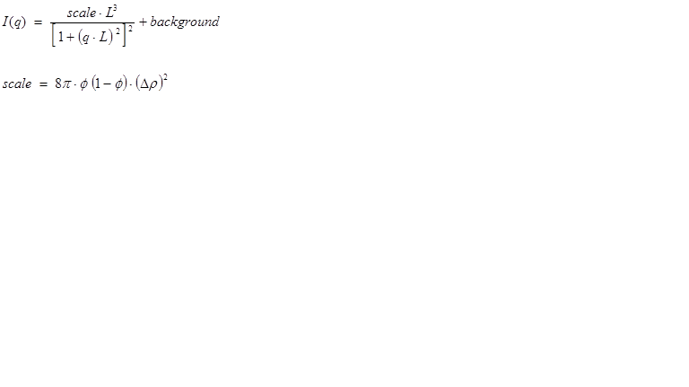

The parameter *L* is the correlation length.

For 2D data: The 2D scattering intensity is calculated in the same way as 1D, where the *q* vector is defined as

.. image:: img/image040.gif

==============  ========  =============
Parameter name  Units     Default value
==============  ========  =============
scale           None      1.0
length          |Ang|     50.0
background      |cm^-1|   0.0
==============  ========  =============

.. image:: img/image181.jpg

* Figure. 1D plot using the default values (w/200 data point).*

REFERENCE

P Debye, H R Anderson, H Brumberger, *Scattering by an Inhomogeneous Solid. II. The Correlation Function*
*and its Application*, *J. Appl. Phys.*, 28(6) (1957) 679

P Debye, A M Bueche, *Scattering by an Inhomogeneous Solid*, *J. Appl. Phys.*, 20 (1949) 518

*2013/09/09 - Description reviewed by King, S and Parker, P.*

.. _AbsolutePower_Law:

**2.2.6. AbsolutePower_Law**

This model describes a simple power law with background.

.. image:: img/image182.PNG

Note the minus sign in front of the exponent. The parameter *m* should therefore be entered as a **positive** number.

==============  ========  =============
Parameter name  Units     Default value
==============  ========  =============
Scale           None      1.0
m               None      4
Background      |cm^-1|   0.0
==============  ========  =============

.. image:: img/image183.jpg

*Figure. 1D plot using the default values (w/200 data point).*

REFERENCE

None.

.. _TeubnerStrey:

**2.2.7. TeubnerStrey (Model)**

This function calculates the scattered intensity of a two-component system using the Teubner-Strey model. Unlike the
DABModel_ this function generates a peak.

*2.2.7.1. Definition*

.. image:: img/image184.PNG

For 2D data: The 2D scattering intensity is calculated in the same way as 1D, where the *q* vector is defined as

.. image:: img/image040.gif

==============  ========  =============
Parameter name  Units     Default value
==============  ========  =============
scale           None      0.1
c1              None      -30.0
c2              None      5000.0
background      |cm^-1|   0.0
==============  ========  =============

.. image:: img/image185.jpg

*Figure. 1D plot using the default values (w/200 data point).*

REFERENCE

M Teubner, R Strey, *J. Chem. Phys.*, 87 (1987) 3195

K V Schubert, R Strey, S R Kline and E W Kaler, *J. Chem. Phys.*, 101 (1994) 5343

.. _FractalModel:

**2.2.8. FractalModel**

Calculates the scattering from fractal-like aggregates built from spherical building blocks following the Texiera
reference.

The value returned is in |cm^-1|\ .

*2.2.8.1. Definition*

.. image:: img/image186.PNG

The *scale* parameter is the volume fraction of the building blocks, *R0* is the radius of the building block, *Df* is
the fractal dimension, |xi| is the correlation length, |rho|\ *solvent* is the scattering length density of the
solvent, and |rho|\ *block* is the scattering length density of the building blocks.

**Polydispersity on the radius is provided for.**

For 2D data: The 2D scattering intensity is calculated in the same way as 1D, where the *q* vector is defined as

.. image:: img/image040.gif

==============  ========  =============
Parameter name  Units     Default value
==============  ========  =============
scale           None      0.05
radius          |Ang|     5.0
fractal_dim     None      2
corr_length     |Ang|     100.0
block_sld       |Ang^-2|  2e-6
solvent_sld     |Ang^-2|  6e-6
background      |cm^-1|   0.0
==============  ========  =============

.. image:: img/image187.jpg

*Figure. 1D plot using the default values (w/200 data point).*

REFERENCE

J Teixeira, *J. Appl. Cryst.*, 21 (1988) 781-785

.. _MassFractalModel:

**2.2.9. MassFractalModel**

Calculates the scattering from fractal-like aggregates based on the Mildner reference.

*2.2.9.1. Definition*

.. image:: img/mass_fractal_eq1.jpg

where *R* is the radius of the building block, *Dm* is the **mass** fractal dimension, |zeta| is the cut-off length,
|rho|\ *solvent* is the scattering length density of the solvent, and |rho|\ *particle* is the scattering length
density of particles.

Note:  The mass fractal dimension *Dm* is only valid if 1 < mass_dim < 6. It is also only valid over a limited
*q* range (see the reference for details).

==============  ========  =============
Parameter name  Units     Default value
==============  ========  =============
scale           None      1
radius          |Ang|     10.0
mass_dim        None      1.9
co_length       |Ang|     100.0
background      |cm^-1|   0.0
==============  ========  =============

.. image:: img/mass_fractal_fig1.jpg

*Figure. 1D plot using default values.*

REFERENCE

D Mildner and P Hall, *J. Phys. D: Appl. Phys.*,  19 (1986) 1535-1545
Equation(9)

*2013/09/09 - Description reviewed by King, S and Parker, P.*

.. _SurfaceFractalModel:

**2.2.10. SurfaceFractalModel**

Calculates the scattering from fractal-like aggregates based on the Mildner reference.

*2.2.10.1. Definition*

.. image:: img/surface_fractal_eq1.gif

where *R* is the radius of the building block, *Ds* is the **surface** fractal dimension, |zeta| is the cut-off length,
|rho|\ *solvent* is the scattering length density of the solvent, and |rho|\ *particle* is the scattering length
density of particles.

Note:  The surface fractal dimension *Ds* is only valid if 1 < surface_dim < 3. It is also only valid over a limited
*q* range (see the reference for details).

==============  ========  =============
Parameter name  Units     Default value
==============  ========  =============
scale           None      1
radius          |Ang|     10.0
surface_dim     None      2.0
co_length       |Ang|     500.0
background      |cm^-1|   0.0
==============  ========  =============

.. image:: img/surface_fractal_fig1.jpg

*Figure. 1D plot using default values.*

REFERENCE

D Mildner and P Hall, *J. Phys. D: Appl. Phys.*,  19 (1986) 1535-1545
Equation(13)

.. _MassSurfaceFractal:

**2.2.11. MassSurfaceFractal (Model)**

A number of natural and commercial processes form high-surface area materials as a result of the vapour-phase
aggregation of primary particles. Examples of such materials include soots, aerosols, and fume or pyrogenic silicas.
These are all characterised by cluster mass distributions (sometimes also cluster size distributions) and internal
surfaces that are fractal in nature. The scattering from such materials displays two distinct breaks in log-log
representation, corresponding to the radius-of-gyration of the primary particles, *rg*, and the radius-of-gyration of
the clusters (aggregates), *Rg*. Between these boundaries the scattering follows a power law related to the mass
fractal dimension, *Dm*, whilst above the high-Q boundary the scattering follows a power law related to the surface
fractal dimension of the primary particles, *Ds*.

*2.2.11.1. Definition*

The scattered intensity *I(q)* is  calculated using a modified Ornstein-Zernicke equation

.. image:: img/masssurface_fractal_eq1.jpg

where *Rg* is the size of the cluster, *rg* is the size of the primary particle, *Ds* is the surface fractal dimension,
*Dm* is the mass fractal dimension, |rho|\ *solvent* is the scattering length density of the solvent, and |rho|\ *p* is
the scattering length density of particles.

Note:  The surface (*Ds*) and mass (*Dm*) fractal dimensions are only valid if 0 < *surface_dim* < 6,
0 < *mass_dim* < 6, and (*surface_dim*+*mass_dim*) < 6. 

==============  ========  =============
Parameter name  Units     Default value
==============  ========  =============
scale           None      1
primary_rg      |Ang|     4000.0
cluster_rg      |Ang|     86.7
surface_dim     None      2.3
mass_dim        None      1.8
background      |cm^-1|   0.0
==============  ========  =============

.. image:: img/masssurface_fractal_fig1.jpg

*Figure. 1D plot using default values.*

REFERENCE

P Schmidt, *J Appl. Cryst.*, 24 (1991) 414-435
Equation(19)

A J Hurd, D W Schaefer, J E Martin, *Phys. Rev. A*, 35 (1987) 2361-2364
Equation(2)

.. _FractalCoreShell:

**2.2.12. FractalCoreShell (Model)**

Calculates the scattering from a fractal structure with a primary building block of core-shell spheres, as opposed to
just homogeneous spheres in the FractalModel_. This model could find use for aggregates of coated particles, or
aggregates of vesicles.

The returned value is scaled to units of |cm^-1|, absolute scale.

*2.2.12.1. Definition*

.. image:: img/fractcore_eq1.gif

The form factor *P(q)* is that from CoreShellModel_ with *bkg* = 0

while the fractal structure factor S(q) is

.. image:: img/fractcore_eq3.gif

where *Df* = frac_dim, |xi| = cor_length, *rc* = (core) radius, and *scale* = volume fraction.

The fractal structure is as documented in the FractalModel_. Polydispersity of radius and thickness is provided for.

For 2D data: The 2D scattering intensity is calculated in the same way as 1D, where the *q* vector is defined as

.. image:: img/image040.gif

==============  ========  =============
Parameter name  Units     Default value
==============  ========  =============
volfraction     None      0.05
frac_dim        None      2
thickness       |Ang|     5.0
radius          |Ang|     20.0
cor_length      |Ang|     100.0
core_sld        |Ang^-2|  3.5e-6
shell_sld       |Ang^-2|  1e-6
solvent_sld     |Ang^-2|  6.35e-6
background      |cm^-1|   0.0
==============  ========  =============

.. image:: img/image188.jpg

*Figure. 1D plot using the default values (w/500 data points).*

REFERENCE

See the CoreShellModel_ and FractalModel_ descriptions.

.. _GaussLorentzGel:

**2.2.13. GaussLorentzGel(Model)**

Calculates the scattering from a gel structure, but typically a physical rather than chemical network. It is modeled as
a sum of a low-*q* exponential decay plus a lorentzian at higher *q*-values.

Also see the GelFitModel_.

The returned value is scaled to units of |cm^-1|, absolute scale.

*2.2.13.1. Definition*

The scattering intensity *I(q)* is calculated as (eqn 5 from the reference)

.. image:: img/image189.jpg

|bigzeta| is the length scale of the static correlations in the gel, which can be attributed to the "frozen-in"
crosslinks. |xi| is the dynamic correlation length, which can be attributed to the fluctuating polymer chains between
crosslinks. *I*\ :sub:`G`\ *(0)* and *I*\ :sub:`L`\ *(0)* are the scaling factors for each of these structures. **Think carefully about how**
**these map to your particular system!**

NB: The peaked structure at higher *q* values (Figure 2 from the reference) is not reproduced by the model. Peaks can
be introduced into the model by summing this model with the PeakGaussModel_ function.

For 2D data: The 2D scattering intensity is calculated in the same way as 1D, where the *q* vector is defined as

.. image:: img/image040.gif

===================================  ========  =============
Parameter name                       Units     Default value
===================================  ========  =============
dyn_colength (=dynamic corr length)  |Ang|     20.0
scale_g       (=Gauss scale factor)  None      100
scale_l  (=Lorentzian scale factor)  None      50
stat_colength (=static corr length)  |Ang|     100.0
background                           |cm^-1|   0.0
===================================  ========  =============

.. image:: img/image190.jpg

*Figure. 1D plot using the default values (w/500 data points).*

REFERENCE

G Evmenenko, E Theunissen, K Mortensen, H Reynaers, *Polymer*, 42 (2001) 2907-2913

.. _BEPolyelectrolyte:

**2.2.14. BEPolyelectrolyte (Model)**

Calculates the structure factor of a polyelectrolyte solution with the RPA expression derived by Borue and Erukhimovich.

The value returned is in |cm^-1|.

*2.2.14.1. Definition*

.. image:: img/image191.PNG

where *K* is the contrast factor for the polymer, *Lb* is the Bjerrum length, *h* is the virial parameter, *b* is the
monomer length, *Cs* is the concentration of monovalent salt, |alpha| is the ionization degree, *Ca* is the polymer
molar concentration, and *background* is the incoherent background.

For 2D data: The 2D scattering intensity is calculated in the same way as 1D, where the *q* vector is defined as

.. image:: img/image040.gif

==============  ========  =============
Parameter name  Units     Default value
==============  ========  =============
K               barns     10
Lb              |Ang|     7.1
h               |Ang^-3|  12
b               |Ang|     10
Cs              mol/L     0
alpha           None      0.05
Ca              mol/L     0.7
background      |cm^-1|   0.0
==============  ========  =============

NB: 1 barn = 10\ :sup:`-24` |cm^2|

REFERENCE

V Y Borue, I Y Erukhimovich, *Macromolecules*, 21 (1988) 3240

J F Joanny, L Leibler, *Journal de Physique*, 51 (1990) 545

A Moussaid, F Schosseler, J P Munch, S Candau, *J. Journal de Physique II France*, 3 (1993) 573

E Raphael, J F Joanny, *Europhysics Letters*, 11 (1990) 179

.. _Guinier:

**2.2.15. Guinier (Model)**

This model fits the Guinier function

.. image:: img/image192.PNG

to the data directly without any need for linearisation (*cf*. Ln *I(q)* vs *q*\ :sup:`2`).

For 2D data: The 2D scattering intensity is calculated in the same way as 1D, where the *q* vector is defined as

.. image:: img/image040.gif

==============  ========  =============
Parameter name  Units     Default value
==============  ========  =============
scale           |cm^-1|   1.0
Rg              |Ang|     0.1
==============  ========  =============

REFERENCE

A Guinier and G Fournet, *Small-Angle Scattering of X-Rays*, John Wiley & Sons, New York (1955)

.. _GuinierPorod:

**2.2.16. GuinierPorod (Model)**

Calculates the scattering for a generalized Guinier/power law object. This is an empirical model that can be used to
determine the size and dimensionality of scattering objects, including asymmetric objects such as rods or platelets, and
shapes intermediate between spheres and rods or between rods and platelets.

The result is in the units of |cm^-1|, absolute scale.

*2.2.16.1 Definition*

The following functional form is used

.. image:: img/image193.jpg

This is based on the generalized Guinier law for such elongated objects (see the Glatter reference below). For 3D
globular objects (such as spheres), *s* = 0 and one recovers the standard Guinier_ formula. For 2D symmetry (such as
for rods) *s* = 1, and for 1D symmetry (such as for lamellae or platelets) *s* = 2. A dimensionality parameter (3-*s*)
is thus defined, and is 3 for spherical objects, 2 for rods, and 1 for plates.

Enforcing the continuity of the Guinier and Porod functions and their derivatives yields

.. image:: img/image194.jpg

and

.. image:: img/image195.jpg

Note that

 the radius-of-gyration for a sphere of radius *R* is given by *Rg* = *R* sqrt(3/5)

 the cross-sectional radius-of-gyration for a randomly oriented cylinder of radius *R* is given by *Rg* = *R* / sqrt(2)

 the cross-sectional radius-of-gyration of a randomly oriented lamella of thickness *T* is given by *Rg* = *T* / sqrt(12)

For 2D data: The 2D scattering intensity is calculated in the same way as 1D, where the *q* vector is defined as

.. image:: img/image008.PNG

==============================  ========  =============
Parameter name                  Units     Default value
==============================  ========  =============
scale      (=Guinier scale, G)  |cm^-1|   1.0
rg                              |Ang|     100
dim (=dimensional variable, s)  None      1
m            (=Porod exponent)  None      3
background                      |cm^-1|   0.1
==============================  ========  =============

.. image:: img/image196.jpg

*Figure. 1D plot using the default values (w/500 data points).*

REFERENCE

A Guinier, G Fournet, *Small-Angle Scattering of X-Rays*, John Wiley and Sons, New York, (1955)

O Glatter, O Kratky, *Small-Angle X-Ray Scattering*, Academic Press (1982)
Check out Chapter 4 on Data Treatment, pages 155-156.

.. _PorodModel:

**2.2.17. PorodModel**

This model fits the Porod function

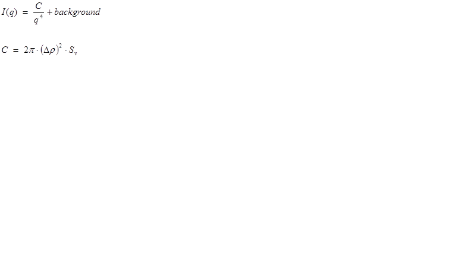

to the data directly without any need for linearisation (*cf*. Log *I(q)* vs Log *q*).

Here *C* is the scale factor and *Sv* is the specific surface area (ie, surface area / volume) of the sample, and
|drho| is the contrast factor.

For 2D data: The 2D scattering intensity is calculated in the same way as 1D, where the *q* vector is defined as

.. image:: img/image040.gif

==============  ========  =============
Parameter name  Units     Default value
==============  ========  =============
scale           |Ang^-4|  0.1
background      |cm^-1|   0
==============  ========  =============

REFERENCE

None.

.. _PeakGaussModel:

**2.2.18. PeakGaussModel**

This model describes a Gaussian shaped peak on a flat background

.. image:: img/image198.PNG

with the peak having height of *I0* centered at *q0* and having a standard deviation of *B*.  The FWHM (full-width
half-maximum) is 2.354 B.  

For 2D data: The 2D scattering intensity is calculated in the same way as 1D, where the *q* vector is defined as

.. image:: img/image040.gif

==============  ========  =============
Parameter name  Units     Default value
==============  ========  =============
scale           |cm^-1|   100
q0              |Ang^-1|  0.05
B               |Ang^-1|  0.005
background      |cm^-1|   1
==============  ========  =============

.. image:: img/image199.jpg

*Figure. 1D plot using the default values (w/500 data points).*

REFERENCE

None.

.. _PeakLorentzModel:

**2.2.19. PeakLorentzModel**

This model describes a Lorentzian shaped peak on a flat background

.. image:: img/image200.PNG

with the peak having height of *I0* centered at *q0* and having a HWHM (half-width half-maximum) of B. 

For 2D data: The 2D scattering intensity is calculated in the same way as 1D, where the *q* vector is defined as

.. image:: img/image040.gif

==============  ========  =============
Parameter name  Units     Default value
==============  ========  =============
scale           |cm^-1|   100
q0              |Ang^-1|  0.05
B               |Ang^-1|  0.005
background      |cm^-1|     1
==============  ========  =============

.. image:: img/image201.jpg

*Figure. 1D plot using the default values (w/500 data points).*

REFERENCE

None.

.. _Poly_GaussCoil:

**2.2.20. Poly_GaussCoil (Model)**

This model calculates an empirical functional form for the scattering from a **polydisperse** polymer chain in the
theta state assuming a Schulz-Zimm type molecular weight distribution. Polydispersity on the radius-of-gyration is also
provided for.

The returned value is scaled to units of |cm^-1|, absolute scale.

*2.2.20.1. Definition*

The scattering intensity *I(q)* is calculated as

.. image:: img/image202.PNG

where the dimensionless chain dimension is

.. image:: img/image203.PNG

and the polydispersity is

.. image:: img/image204.PNG

For 2D data: The 2D scattering intensity is calculated in the same way as 1D, where the *q* vector is defined as

.. image:: img/image040.gif

This example dataset is produced using 200 data points, using 200 data points,
*qmin* = 0.001 |Ang^-1|, *qmax* = 0.7 |Ang^-1| and the default values

==============  ========  =============
Parameter name  Units     Default value
==============  ========  =============
scale           None      1.0
rg              |Ang|     60.0
poly_m (Mw/Mn)  None      2
background      |cm^-1|   0.001
==============  ========  =============

.. image:: img/image205.jpg

*Figure. 1D plot using the default values (w/200 data point).*

REFERENCE

O Glatter and O Kratky (editors), *Small Angle X-ray Scattering*, Academic Press, (1982)
Page 404

J S Higgins, and H C Benoit, Polymers and Neutron Scattering, Oxford Science Publications (1996)

.. _PolyExclVolume:

**2.2.21. PolymerExclVolume (Model)**

This model describes the scattering from polymer chains subject to excluded volume effects, and has been used as a
template for describing mass fractals.

The returned value is scaled to units of |cm^-1|, absolute scale.

*2.2.21.1 Definition*

The form factor  was originally presented in the following integral form (Benoit, 1957)

.. image:: img/image206.jpg

where |nu| is the excluded volume parameter (which is related to the Porod exponent *m* as |nu| = 1 / *m*), *a* is the
statistical segment length of the polymer chain, and *n* is the degree of polymerization. This integral was later put
into an almost analytical form as follows (Hammouda, 1993)

.. image:: img/image207.jpg

where |gamma|\ *(x,U)* is the incomplete gamma function

.. image:: img/image208.jpg

and the variable *U* is given in terms of the scattering vector *Q* as

.. image:: img/image209.jpg

The square of the radius-of-gyration is defined as

.. image:: img/image210.jpg

Note that this model applies only in the mass fractal range (ie, 5/3 <= *m* <= 3) and **does not** apply to surface
fractals (3 < *m* <= 4). It also does not reproduce the rigid rod limit (*m* = 1) because it assumes chain flexibility
from the outset. It may cover a portion of the semi-flexible chain range (1 < *m* < 5/3).

A low-*Q* expansion yields the Guinier form and a high-*Q* expansion yields the Porod form which is given by

.. image:: img/image211.jpg

Here |biggamma|\ *(x)* = |gamma|\ *(x,inf)* is the gamma function.

The asymptotic limit is dominated by the first term

.. image:: img/image212.jpg

The special case when |nu| = 0.5 (or *m* = 1/|nu| = 2) corresponds to Gaussian chains for which the form factor is given
by the familiar Debye_ function.

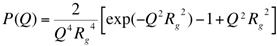

For 2D data: The 2D scattering intensity is calculated in the same way as 1D, where the *q* vector is defined as

.. image:: img/image040.gif

This example dataset is produced using 200 data points, *qmin* = 0.001 |Ang^-1|, *qmax* = 0.2 |Ang^-1| and the default
values

===================  ========  =============
Parameter name       Units     Default value
===================  ========  =============
scale                None      1.0
rg                   |Ang|     60.0
m (=Porod exponent)  None      3
background           |cm^-1|   0.0
===================  ========  =============

.. image:: img/image214.jpg

*Figure. 1D plot using the default values (w/500 data points).*

REFERENCE

H Benoit, *Comptes Rendus*, 245 (1957) 2244-2247

B Hammouda, *SANS from Homogeneous Polymer Mixtures ­ A Unified Overview*, *Advances in Polym. Sci.*, 106 (1993) 87-133

.. _RPA10Model:

**2.2.22. RPA10Model**

Calculates the macroscopic scattering intensity (units of |cm^-1|) for a multicomponent homogeneous mixture of polymers
using the Random Phase Approximation. This general formalism contains 10 specific cases

Case 0: C/D binary mixture of homopolymers

Case 1: C-D diblock copolymer

Case 2: B/C/D ternary mixture of homopolymers

Case 3: C/C-D mixture of a homopolymer B and a diblock copolymer C-D

Case 4: B-C-D triblock copolymer

Case 5: A/B/C/D quaternary mixture of homopolymers

Case 6: A/B/C-D mixture of two homopolymers A/B and a diblock C-D

Case 7: A/B-C-D mixture of a homopolymer A and a triblock B-C-D

Case 8: A-B/C-D mixture of two diblock copolymers A-B and C-D

Case 9: A-B-C-D tetra-block copolymer

**NB: these case numbers are different from those in the NIST SANS package!**

Only one case can be used at any one time.

The returned value is scaled to units of |cm^-1|, absolute scale.

The RPA (mean field) formalism only applies only when the multicomponent polymer mixture is in the homogeneous
mixed-phase region.

**Component D is assumed to be the "background" component (ie, all contrasts are calculated with respect to**
**component D).** So the scattering contrast for a C/D blend = [SLD(component C) - SLD(component D)]\ :sup:`2`.

Depending on which case is being used, the number of fitting parameters - the segment lengths (ba, bb, etc) and |chi|
parameters (Kab, Kac, etc) - vary. The *scale* parameter should be held equal to unity.

The input parameters are the degrees of polymerization, the volume fractions, the specific volumes, and the neutron
scattering length densities for each component.

Fitting parameters for a Case 0 Model

=======================  ========  =============
Parameter name           Units     Default value
=======================  ========  =============
background               |cm^-1|   0.0
scale                    None      1
bc (=segment Length_bc)  **unit**  5
bd (=segment length_bd)  **unit**  5
Kcd (=chi_cd)            **unit**  -0.0004
=======================  ========  =============

Fixed parameters for a Case 0 Model

=======================  ========  =============
Parameter name           Units     Default value
=======================  ========  =============
Lc (=scatter. length_c)  **unit**  1e-12
Ld (=scatter. length_d)  **unit**  0
Nc    (=degree polym_c)  None      1000
Nd    (=degree polym_d)  None      1000
Phic (=vol. fraction_c)  None      0.25
Phid (=vol. fraction_d)  None      0.25
vc (=specific volume_c)  **unit**  100
vd (=specific volume_d)  **unit**  100
=======================  ========  =============

.. image:: img/image215.jpg

*Figure. 1D plot using the default values (w/500 data points).*

REFERENCE

A Z Akcasu, R Klein and B Hammouda, *Macromolecules*, 26 (1993) 4136

.. _TwoLorentzian:

**2.2.23. TwoLorentzian (Model)**

This model calculates an empirical functional form for SAS data characterized by two Lorentzian-type functions.

The returned value is scaled to units of |cm^-1|, absolute scale.

*2.2.23.1. Definition*

The scattering intensity *I(q)* is calculated as

.. image:: img/image216.jpg 

where *A* = Lorentzian scale factor #1, *C* = Lorentzian scale #2, |xi|\ :sub:`1` and |xi|\ :sub:`2` are the
corresponding correlation lengths, and *n* and *m* are the respective power law exponents (set *n* = *m* = 2 for
Ornstein-Zernicke behaviour).

For 2D data: The 2D scattering intensity is calculated in the same way as 1D, where the *q* vector is defined as

.. image:: img/image040.gif

===============================  ========  =============
Parameter name                   Units     Default value
===============================  ========  =============
scale_1 (=A)                     None      10
scale_2 (=C)                     None      1
1ength_1 (=correlation length1)  |Ang|     100
1ength_2 (=correlation length2)  |Ang|     10
exponent_1 (=n)                  None      3
exponent_2 (=m)                  None      2
background (=B)                  |cm^-1|   0.1
===============================  ========  =============

.. image:: img/image217.jpg

*Figure. 1D plot using the default values (w/500 data points).*

REFERENCE

None.

.. _TwoPowerLaw:

**2.2.24. TwoPowerLaw (Model)**

This model calculates an empirical functional form for SAS data characterized by two power laws.

The returned value is scaled to units of |cm^-1|, absolute scale.

*2.2.24.1. Definition*

The scattering intensity *I(q)* is calculated as

.. image:: img/image218.jpg

where *qc* is the location of the crossover from one slope to the other. The scaling *coef_A* sets the overall
intensity of the lower *q* power law region. The scaling of the second power law region is then automatically scaled to
match the first.

**NB: Be sure to enter the power law exponents as positive values!**

For 2D data: The 2D scattering intensity is calculated in the same way as 1D, where the *q* vector is defined as

.. image:: img/image040.gif

==============  ========  =============
Parameter name  Units     Default value
==============  ========  =============
coef_A          None      1.0
qc              |Ang^-1|  0.04
power_1 (=m1)   None      4
power_2 (=m2)   None      4
background      |cm^-1|   0.0
==============  ========  =============

.. image:: img/image219.jpg

*Figure. 1D plot using the default values (w/500 data points).*

REFERENCE

None.

.. _UnifiedPowerRg:

**2.2.25. UnifiedPowerRg (Beaucage Model)**

This model deploys the empirical multiple level unified Exponential/Power-law fit method developed by G Beaucage. Four
functions are included so that 1, 2, 3, or 4 levels can be used. In addition a 0 level has been added which simply
calculates

*I(q)* = *scale* / *q* + *background*

The returned value is scaled to units of |cm^-1|, absolute scale. 

The Beaucage method is able to reasonably approximate the scattering from many different types of particles, including
fractal clusters, random coils (Debye equation), ellipsoidal particles, etc. 

*2.2.25.1 Definition*

The empirical fit function is 

.. image:: img/image220.jpg

For each level, the four parameters *Gi*, *Rg,i*, *Bi* and *Pi* must be chosen. 

For example, to approximate the scattering from random coils (Debye_ equation), set *Rg,i* as the Guinier radius,
*Pi* = 2, and *Bi* = 2 *Gi* / *Rg,i* 

See the references for further information on choosing the parameters.

For 2D data: The 2D scattering intensity is calculated in the same way as 1D, where the *q* vector is defined as

.. image:: img/image040.gif

==============  ========  =============
Parameter name  Units     Default value
==============  ========  =============
scale           None      1.0
Rg2             |Ang|     21
power2          None      2
G2              |cm^-1|   3
B2              |cm^-1|   0.0006
Rg1             |Ang|     15.8
power1          None      4
G1              |cm^-1|   400
B1              |cm^-1|   4.5e-6                |
background      |cm^-1|   0.0
==============  ========  =============

.. image:: img/image221.jpg

*Figure. 1D plot using the default values (w/500 data points).*

REFERENCE

G Beaucage, *J. Appl. Cryst.*, 28 (1995) 717-728

G Beaucage, *J. Appl. Cryst.*, 29 (1996) 134-146

.. _LineModel:

**2.2.26. LineModel**

This calculates the simple linear function

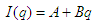

**NB: For 2D plots,** *I(q)* = *I(qx)*\ *\ *I(qy)*, **which is a different definition to other shape independent models.**

==============  ==============  =============
Parameter name  Units           Default value
==============  ==============  =============
A               |cm^-1|         1.0
B               |Ang|\ |cm^-1|  1.0
==============  ==============  =============

REFERENCE

None.

.. _GelFitModel:

**2.2.27. GelFitModel**

*This model was implemented by an interested user!*

Unlike a concentrated polymer solution, the fine-scale polymer distribution in a gel involves at least two
characteristic length scales, a shorter correlation length (*a1*) to describe the rapid fluctuations in the position
of the polymer chains that ensure thermodynamic equilibrium, and a longer distance (denoted here as *a2*) needed to
account for the static accumulations of polymer pinned down by junction points or clusters of such points. The latter
is derived from a simple Guinier function.

Also see the GaussLorentzGel_ Model.

*2.2.27.1. Definition*

The scattered intensity *I(q)* is calculated as

.. image:: img/image233.gif

where

.. image:: img/image234.gif

Note that the first term reduces to the Ornstein-Zernicke equation when *D* = 2; ie, when the Flory exponent is 0.5
(theta conditions). In gels with significant hydrogen bonding *D* has been reported to be ~2.6 to 2.8.

============================  ========  =============
Parameter name                Units     Default value
============================  ========  =============
Background                    |cm^-1|   0.01
Guinier scale    (= *I(0)G*)  |cm^-1|   1.7
Lorentzian scale (= *I(0)L*)  |cm^-1|   3.5
Radius of gyration  (= *Rg*)  |Ang|     104
Fractal exponent     (= *D*)  None      2
Correlation length  (= *a1*)  |Ang|     16
============================  ========  =============

.. image:: img/image235.gif

*Figure. 1D plot using the default values (w/300 data points).*

REFERENCE

Mitsuhiro Shibayama, Toyoichi Tanaka, Charles C Han, J. Chem. Phys. 1992, 97 (9), 6829-6841

Simon Mallam, Ferenc Horkay, Anne-Marie Hecht, Adrian R Rennie, Erik Geissler, Macromolecules 1991, 24, 543-548

.. _StarPolymer:

**2.2.28. Star Polymer with Gaussian Statistics**

This model is also known as the Benoit Star model.

*2.2.28.1. Definition*

For a star with *f* arms:

.. image:: img/star1.png

where

.. image:: img/star2.png

and

.. image:: img/star3.png

is the square of the ensemble average radius-of-gyration of an arm.

REFERENCE

H Benoit,   J. Polymer Science.,  11, 596-599  (1953)

.. _ReflectivityModel:

**2.2.29. ReflectivityModel**

*This model was contributed by an interested user!*

This model calculates **reflectivity** using the Parrett algorithm.

Up to nine film layers are supported between Bottom(substrate) and Medium(Superstrate) where the neutron enters the
first top film. Each of the layers are composed of

[½ of the interface (from the previous layer or substrate) + flat portion + ½ of the interface (to the next layer or medium)]

Two simple functions are provided to describe the interfacial density distribution; a linear function and an error
function. The interfacial thickness is equivalent to (-2.5 |sigma| to +2.5 |sigma| for the error function, where
|sigma| = roughness).

Also see ReflectivityIIModel_.

.. image:: img/image231.bmp

*Figure. Comparison (using the SLD profile below) with the NIST web calculation (circles)*
http://www.ncnr.nist.gov/resources/reflcalc.html

.. image:: img/image232.gif

*Figure. SLD profile used for the calculation (above).*

REFERENCE

None.

.. _ReflectivityIIModel:

**2.2.30. ReflectivityIIModel**

*This model was contributed by an interested user!*

This **reflectivity** model is a more flexible version of ReflectivityModel_. More interfacial density
functions are supported, and the number of points (*npts_inter*) for each interface can be chosen.

The SLD at the interface between layers, |rho|\ *inter_i*, is calculated with a function chosen by a user, where the
available functions are

1) Erf

.. image:: img/image051.gif

2) Power-Law

.. image:: img/image050.gif

3) Exp

.. image:: img/image049.gif

The constant *A* in the expressions above (but the parameter *nu* in the model!) is an input.

REFERENCE

None.

2.3 Structure-factor Functions
------------------------------

The information in this section originated from NIST SANS package.

.. _HardSphereStructure:

**2.3.1. HardSphereStructure Factor**

This calculates the interparticle structure factor for monodisperse spherical particles interacting through hard
sphere (excluded volume) interactions.

The calculation uses the Percus-Yevick closure where the interparticle potential is

.. image:: img/image223.PNG

where *r* is the distance from the center of the sphere of a radius *R*.

For a 2D plot, the wave transfer is defined as

.. image:: img/image040.gif

==============  ========  =============
Parameter name  Units     Default value
==============  ========  =============
effect_radius   |Ang|     50.0
volfraction     None      0.2
==============  ========  =============

.. image:: img/image224.jpg

*Figure. 1D plot using the default values (in linear scale).*

REFERENCE

J K Percus, J Yevick, *J. Phys. Rev.*, 110, (1958) 1

.. _SquareWellStructure:

**2.3.2. SquareWellStructure Factor**

This calculates the interparticle structure factor for a square well fluid spherical particles. The mean spherical
approximation (MSA) closure was used for this calculation, and is not the most appropriate closure for an attractive
interparticle potential. This solution has been compared to Monte Carlo simulations for a square well fluid, showing
this calculation to be limited in applicability to well depths |epsilon| < 1.5 kT and volume fractions |phi| < 0.08.

Positive well depths correspond to an attractive potential well. Negative well depths correspond to a potential
"shoulder", which may or may not be physically reasonable.

The well width (*l*\ ) is defined as multiples of the particle diameter (2\*\ *R*\ )

The interaction potential is:

.. image:: img/image225.PNG

where *r* is the distance from the center of the sphere of a radius *R*.

For 2D data: The 2D scattering intensity is calculated in the same way as 1D, where the *q* vector is defined as

.. image:: img/image040.gif

==============  =========  =============
Parameter name  Units      Default value
==============  =========  =============
effect_radius   |Ang|      50.0
volfraction     None       0.04
welldepth       kT         1.5
wellwidth       diameters  1.2
==============  =========  =============

.. image:: img/image226.jpg

*Figure. 1D plot using the default values (in linear scale).*

REFERENCE

R V Sharma, K C Sharma, *Physica*, 89A (1977) 213

.. _HayterMSAStructure:

**2.3.3. HayterMSAStructure Factor**

This is an implementation of the Rescaled Mean Spherical Approximation which calculates the structure factor (the 
Fourier transform of the pair correlation function *g(r)*) for a system of charged, spheroidal objects in a
dielectric medium. When combined with an appropriate form factor (such as sphere,core+shell, ellipsoid, etc), this
allows for inclusion of the interparticle interference effects due to screened coulomb repulsion between charged particles.

**This routine only works for charged particles**. If the charge is set to zero the routine will self-destruct!
For non-charged particles use a hard sphere potential.

The salt concentration is used to compute the ionic strength of the solution which in turn is used to compute the Debye
screening length. At present there is no provision for entering the ionic strength directly nor for use of any
multivalent salts. The counterions are also assumed to be monovalent.

For 2D data: The 2D scattering intensity is calculated in the same way as 1D, where the *q* vector is defined as

.. image:: img/image040.gif

==============  ========  =============
Parameter name  Units     Default value
==============  ========  =============
effect_radius   |Ang|     20.8
charge          *e*       19
volfraction     None      0.2
temperature     K         318
salt conc       M         0
dielectconst    None      71.1
==============  ========  =============

.. image:: img/image227.jpg

*Figure. 1D plot using the default values (in linear scale).*

REFERENCE

J B Hayter and J Penfold, *Molecular Physics*, 42 (1981) 109-118

J P Hansen and J B Hayter, *Molecular Physics*, 46 (1982) 651-656

.. _StickyHSStructure:

**2.3.4. StickyHSStructure Factor**

This calculates the interparticle structure factor for a hard sphere fluid with a narrow attractive well. A perturbative
solution of the Percus-Yevick closure is used. The strength of the attractive well is described in terms of "stickiness"
as defined below. The returned value is a dimensionless structure factor, *S(q)*.

The perturb (perturbation parameter), |epsilon|, should be held between 0.01 and 0.1. It is best to hold the
perturbation parameter fixed and let the "stickiness" vary to adjust the interaction strength. The stickiness, |tau|,
is defined in the equation below and is a function of both the perturbation parameter and the interaction strength.
|tau| and |epsilon| are defined in terms of the hard sphere diameter (|sigma| = 2\*\ *R*\ ), the width of the square
well, |bigdelta| (same units as *R*), and the depth of the well, *Uo*, in units of kT. From the definition, it is clear
that smaller |tau| means stronger attraction.

.. image:: img/image228.PNG

where the interaction potential is

.. image:: img/image229.PNG

The Percus-Yevick (PY) closure was used for this calculation, and is an adequate closure for an attractive interparticle
potential. This solution has been compared to Monte Carlo simulations for a square well fluid, with good agreement.

The true particle volume fraction, |phi|, is not equal to *h*, which appears in most of the reference. The two are
related in equation (24) of the reference. The reference also describes the relationship between this perturbation
solution and the original sticky hard sphere (or adhesive sphere) model by Baxter.

NB: The calculation can go haywire for certain combinations of the input parameters, producing unphysical solutions - in
this case errors are reported to the command window and the *S(q)* is set to -1 (so it will disappear on a log-log
plot). Use tight bounds to keep the parameters to values that you know are physical (test them) and keep nudging them
until the optimization does not hit the constraints.

For 2D data: The 2D scattering intensity is calculated in the same way as 1D, where the *q* vector is defined as

.. image:: img/image040.gif

==============  ========  =============
Parameter name  Units     Default value
==============  ========  =============
effect_radius   |Ang|     50
perturb         None      0.05
volfraction     None      0.1
stickiness      K         0.2
==============  ========  =============

.. image:: img/image230.jpg

*Figure. 1D plot using the default values (in linear scale).*

REFERENCE

S V G Menon, C Manohar, and K S Rao, *J. Chem. Phys.*, 95(12) (1991) 9186-9190

2.4 Customised Functions
------------------------------

Customized model functions can be redefined or added to by users (See SansView tutorial for details).

.. _testmodel:

**2.4.1. testmodel**

This function, as an example of a user defined function, calculates

*I(q)* = *A* + *B* cos(2\ *q*\ ) + *C* sin(2\ *q*\ )

.. _testmodel_2:

**2.4.2. testmodel_2**

This function, as an example of a user defined function, calculates

*I(q)* = *scale* * sin(*f*\ )/*f*

where

*f* = *A* + *Bq* + *Cq*\ :sup:`2` + *Dq*\ :sup:`3` + *Eq*\ :sup:`4` + *Fq*\ :sup:`5`

.. _sum_p1_p2:

**2.4.3. sum_p1_p2**

This function, as an example of a user defined function, calculates

*I(q)* = *scale_factor* \* (CylinderModel + PolymerExclVolumeModel)

To make your own (*p1 + p2*) model, select 'Easy Custom Sum' from the Fitting menu, or modify and compile the file
named 'sum_p1_p2.py' from 'Edit Custom Model' in the 'Fitting' menu.

NB: Summing models only works only for single functional models (ie, single shell models, two-component RPA models, etc).

.. _sum_Ap1_1_Ap2:

**2.4.4. sum_Ap1_1_Ap2**

This function, as an example of a user defined function, calculates

*I(q)* = (*scale_factor* \* CylinderModel + (1 - *scale_factor*\ ) \* PolymerExclVolume model)

To make your own (*A*\ * *p1* + (1-*A*) \* *p2*) model, modify and compile the file named 'sum_Ap1_1_Ap2.py' from
'Edit Custom Model' in the 'Fitting' menu.

NB: Summing models only works only for single functional models (ie, single shell models, two-component RPA models, etc).

.. _polynomial5:

**2.4.5. polynomial5**

This function, as an example of a user defined function, calculates

*I(q)* = *A* + *Bq* + *Cq*\ :sup:`2` + *Dq*\ :sup:`3` + *Eq*\ :sup:`4` + *Fq*\ :sup:`5`

This model can be modified and compiled from 'Edit Custom Model' in the 'Fitting' menu.

.. _sph_bessel_jn:

**2.4.6. sph_bessel_jn**

This function, as an example of a user defined function, calculates

*I(q)* = *C* \* *sph_jn(Ax+B)+D*

where *sph_jn* is a spherical Bessel function of order *n*.

This model can be modified and compiled from 'Edit Custom Model' in the 'Fitting' menu.