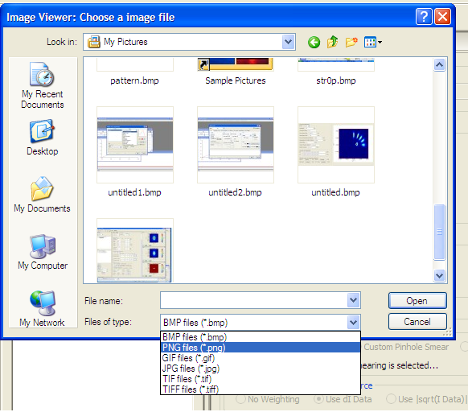

.. image_viewer_help.rst

.. This is a port of the original SasView html help file to ReSTructured text
.. by S King, ISIS, during SasView CodeCamp-III in Feb 2015.

Image Viewer Tool
=================

Description
-----------

This tool loads image files and displays them as 2D (x-y coordinate against 
counts per pixel). The plot can then can be saved, printed, and copied. The 
plot can also be resized by dragging the corner of the panel.

Supported image formats are png, bmp, gif, or jpg. (There is currently a bug in 
the tif loader)

.. ZZZZZZZZZZZZZZZZZZZZZZZZZZZZZZZZZZZZZZZZZZZZZZZZZZZZZZZZZZZZZZZZZZZZZZZZZZZZ

How To
------

1. Select 'Image Viewer' under the 'Tool' menu in the menubar.

2. Select a file type from the drop-box at the bottom of the file dialog panel, 
choose a file of interest, and then click the 'Open' button (see the 
picture below).

3. If the loading is successful, the image will be displayed. The file name 
will be shown in the title bar (see the picture below).

4. Some options such as saving, printing, and copying are available from the 
menubar, or in the context-menu (by right-clicking anywhere in the plot).

.. image:: pic_plot.bmp

5. If the image is taken from a 2D detector, it can be converted into 2D data 
where the z values are computed as 

z = (0.299 x R) + (0.587 x G) + (0.114 x B)

unless the picture file is formatted as 8-bit grey-scale tif.

In the "Convert to Data" dialog, set the parameters relevant to your data and 
then click the OK button.

.. image:: pic_convert.bmp
