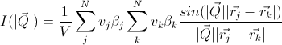

.. sas_calculator_help.rst

.. This is a port of the original SasView html help file to ReSTructured text
.. by S King, ISIS, during SasView CodeCamp-III in Feb 2015.

.. |beta| unicode:: U+03B2
.. |gamma| unicode:: U+03B3
.. |theta| unicode:: U+03B8
.. |mu| unicode:: U+03BC
.. |sigma| unicode:: U+03C3
.. |phi| unicode:: U+03C6

.. |equiv| unicode:: U+2261
.. |noteql| unicode:: U+2260

Generic Scattering Calculator Tool
==================================

Polarization and Magnetic Scattering

Theory_ 
GUI_ 
PDB_Data_ 

.. ZZZZZZZZZZZZZZZZZZZZZZZZZZZZZZZZZZZZZZZZZZZZZZZZZZZZZZZZZZZZZZZZZZZZZZZZZZZZ

.. _Theory:

Theory
------

In general, a particle with a volume V can be described by an ensemble 
containing N 3-dimensional rectangular pixels where each pixels are much 
smaller than V. Assuming that all the pixel sizes are same, the elastic 
scattering intensity by the particle

.. image:: gen_i.gif

where /beta/jand rj are the scattering length density and the position of the 
j'th pixel respectively. And the total volume

.. image:: v_j.gif

for /beta/j/noteql/0 where vj is the volume of the j'th pixel (or the j'th 
natural atomic volume (= atomic mass/natural molar density/Avogadro number) for 
the atomic structures). The total volume V can be corrected by users. This 
correction is useful especially for an atomic structure (taken from a pdb file) 
to get the right normalization. Note that the /beta/j displayed in GUI may be 
incorrect but will not affect the scattering computation if the correction of 
the total volume is made. The scattering length density (SLD) of each pixel 
where the SLD is uniform, is a combination of the nuclear and magnetic SLDs and 
depends on the spin states of the neutrons as follows:For magnetic scattering, 
only the magnetization component, *M*perp, perpendicular to the scattering 
vector *Q* contributes to the the magnetic scattering length. (Figure below).

.. image:: mag_vector.bmp

The magnetic scattering length density is then

.. image:: dm_eq.gif

where /gamma/= -1.913 the gyromagnetic ratio, /mu/B is the Bohr magneton, r0 is 
the classical radius of electron, and */sigma/* is the Pauli spin.

For polarized neutron, the magnetic scattering is depending on the spin states.

Let's consider that the incident neutrons are polarised parallel (+)/ 
anti-parallel (-) to the x' axis (See both Figures above). The possible 
out-coming states then are + and - states for both incident states, where 

- Non-spin flips: (+ +) and (- -)
- Spin flips:     (+ -) and (- +)

.. image:: gen_mag_pic.bmp

Now, let's assume that the angles of the *Q*  vector and the spin-axis (x') 
from x-axis are /phi/ and /theta/up respectively (See Figure above). Then, 
depending upon the polarization (spin) state of neutrons, the scattering 
length densities, including the nuclear scattering length density (/beta/N) 
are given as, for non-spin-flips

.. image:: sld1.gif

and for spin-flips

.. image:: sld2.gif

where

.. image:: mxp.gif

.. image:: myp.gif

.. image:: mzp.gif

.. image:: mqx.gif

.. image:: mqy.gif

Here, the M0x, M0yand M0zare the x, y and z components of the magnetisation 
vector given in the xyz lab frame. 

.. ZZZZZZZZZZZZZZZZZZZZZZZZZZZZZZZZZZZZZZZZZZZZZZZZZZZZZZZZZZZZZZZZZZZZZZZZZZZZ

.. _GUI:

GUI
---

.. image:: gen_gui_help.bmp

After the computation, the result will be listed in the 'Theory' box in the 
data explorer panel on the main window.The 'Up_frac_in' and 'Up_frac_out' are 
the ratio, (spin up) /(spin up + spin down) neutrons before the sample and at 
the analyzer, respectively.

*Note I: The values of 'Up_frac_in' and 'Up_frac_out' must be in the range 
between 0 and 1. For example, both values are 0.5 for unpolarized neutrons.*

*Note II: This computation is totally based on the pixel (or atomic) data 
fixed in the xyz coordinates. Thus no angular orientational averaging is 
considered.*

*Note III: For the nuclear scattering length density, only the real component 
is taken account.*

.. ZZZZZZZZZZZZZZZZZZZZZZZZZZZZZZZZZZZZZZZZZZZZZZZZZZZZZZZZZZZZZZZZZZZZZZZZZZZZ

.. _PDB_Data:

PDB Data
--------

This Generic scattering calculator also supports some pdb files without 
considering polarized/magnetic scattering so that the related parameters 
such as Up_*** will be ignored (see the Picture below). The calculation for 
fixed orientation uses (the first) Equation above resulting in a 2D output, 
whileas the scattering calculation averaged over all the orientations uses 
the Debye equation providing a 1D output

where vj /beta/j /equiv/ bj the scattering length of the j'th atom. The resultant outputs 
will be displayed in the DataExplorer for further uses.

.. image:: pdb_combo.jpg
