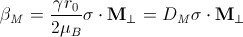
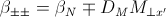

.. fitting_help.rst

.. This is a port of the original SasView html help file to ReSTructured text
.. by S King, ISIS, during SasView CodeCamp-III in Feb 2015.

.. |beta| unicode:: U+03B2
.. |gamma| unicode:: U+03B3
.. |mu| unicode:: U+03BC
.. |sigma| unicode:: U+03C3
.. |phi| unicode:: U+03C6
.. |theta| unicode:: U+03B8
.. |chi| unicode:: U+03C7

.. |inlineimage004| image:: sm_image004.gif
.. |inlineimage005| image:: sm_image005.gif
.. |inlineimage008| image:: sm_image008.gif
.. |inlineimage009| image:: sm_image009.gif
.. |inlineimage010| image:: sm_image010.gif
.. |inlineimage011| image:: sm_image011.gif
.. |inlineimage012| image:: sm_image012.gif
.. |inlineimage018| image:: sm_image018.gif
.. |inlineimage019| image:: sm_image019.gif

Fitting Perspective
===================

Load_a_File_

Single_Fit_

Simultaneous_Fitting_

Batch_Fitting_

Model_Selection_

Model_Category_Manager_

Model_Functions_

Custom_Model_Editor_

Polydispersity_Distributions_

Smearing_Computation_

Polarisation_Magnetic_Scattering_

Key_Combinations_

Status_Bar_Help_

.. ZZZZZZZZZZZZZZZZZZZZZZZZZZZZZZZZZZZZZZZZZZZZZZZZZZZZZZZZZZZZZZZZZZZZZZZZZZZZZ

..  _Load_a_File:

Load a File
-----------

From Menu go to *Data* -> *Load Data File(or Folder)* . Select a file/folder 
from the menu bar and click on Open button. Data contained in the file will be 
displayed. To cancel the loading click on *cancel* . In case a file can not be 
loaded, an error message will be displayed on the statusbar.

.. ZZZZZZZZZZZZZZZZZZZZZZZZZZZZZZZZZZZZZZZZZZZZZZZZZZZZZZZZZZZZZZZZZZZZZZZZZZZZZ

.. _Single_Fit:

Single Fit
----------

One of two fit-engines can be chosen from the Fitting menu bar. The Simple Fit-
engine uses Scipy's leasqr and the Complex Fit-Engine is a custom optimizer 
that provides a better chance to find the global minimum of the |chi| 2 but that
requires longer computation time. In order to set a data to a control panel 
(FitPage), see the "DataLoader Help". Once a data set to the FiPage, select a 
model from the combo box. The default parameters of the model will be display. 
Set initial parameters if need. Check and uncheck parameters to fit/fix. Click 
the *'Fit'*  button. When the fitting is finished, the resultant parameter 
values will be displayed with the errors. If a error is missing, it generally 
means that the corresponding parameter is not very depending on the model. The 
chisq/Npt_fit and the plot associated with the fit operation will be also 
updated.

.. ZZZZZZZZZZZZZZZZZZZZZZZZZZZZZZZZZZZZZZZZZZZZZZZZZZZZZZZZZZZZZZZZZZZZZZZZZZZZZ

..  _Simultaneous_Fitting:

Simultaneous Fitting
--------------------

This fitting option enables to set a number of the constraints between the 
parameters of fitting(s). It requires one or more FitPages with a data and a 
model set for the fitting, and performs multiple fittings given by the 
FitPage(s). The Complex (ParkMC) FitEngine will be used automatically.

Simultaneous Fit without Constraint

Assuming some FitPages are already set up, check the checkboxes of the 
model_data rows to fit. And click the 'Fit' button. The results will return to 
each FitPages.

Note that the chi2/Npts returned is the sum of the chi2/Npts of each fits. If 
one needs the chi2 value only for a page, click the 'Compute' button in the 
FitPage to recalculate.

Simultaneous Fit with Constraint

Enter constraint in the text control next to *constraint fit*  button. 
Constraint should be of type model1 parameter name = f(model2 parameter name) 
for example, M0.radius=2*M1.radius. Many constraints can be entered for a 
single fit. Each of them should be separated by a newline charater or ";" 
The easy setup can generate many constraint inputs easily when the selected 
two models are the same type.

Note that the chi2/Npts returned is the sum of the chi2/Npts of each fits. 
If one needs the chi2 value only for one fit, click the 'Compute' button in 
the FitPage to recalculate.

.. ZZZZZZZZZZZZZZZZZZZZZZZZZZZZZZZZZZZZZZZZZZZZZZZZZZZZZZZZZZZZZZZZZZZZZZZZZZZZZ

..  _Batch_Fitting:

Batch Fitting
-------------

Batch_Fit_

Batch_Window_

Edit_Grid_

Save_Grid_

Open_Batch_Results_

Plot_

View_Column_Cell_

.. _Batch_Fit:

Batch Fit
---------

Create a *Batch Page* by selecting the *Batch* radio button on the DataExplorer
(see figure below) and for a new control page select 'New FitPage' in the 
Fitting menubar.

.. image:: batch_button_area.bmp

Figure 1: MenuBar: 

Load Data to the DataExplorer if not already loaded.

Select one or more data sets by checking the check boxes, and then make sure 
that "Fitting" is selected in the dropdown menu next to the "Send To" button. 
Once ready, click the 'Send To' button to set data to a BatchPage. If already 
an empty batch page exists, it will be set there. Otherwise it will create a 
new Batch Page. Set up the model and the parameter values as same as a single 
fitting (see Single Fit help) <Single_Fit_>. Then use 'Fit' button to 
perform the fitting.

Unlike a single fit, the results of the fittings will not return to the 
BatchPage'. Instead, a Grid window will be provided once the fitting is 
completed. The Grid window is also accessible from the 'View' menu 
(see Figure 2).

Note that only one model is used for all the data. The initial parameter 
values given in the control page will be used all the data fittings. If one 
wants the FitEngine to use the initial values from the results of the 
previous data fitting (if any), choose the 'Chain Fitting' option in the 
Fitting menubar, which will speed up the fitting especially when you have 
lots of, and similar, data sets.

.. _Batch_Window:

Batch Window
------------
Batch Window provides an easy way to view the fit results, i.e., plot data, 
fits, and residuals. Batch window will be automatically shown after a batch 
fit is finished.

Once closed, it can be opened anytime from the "View" menubar item (see 
Figure 2).

.. image:: restore_batch_window.bmp

Figure 2: Edit Menu: 

.. _Edit_Grid:

Edit Grid
---------

Once a batch fit is completed, all fitted and fixed model parameters are 
displayed to the current sheet of the batch window except the errors of the 
parameters. To view the errors, click on a given column then under *Edit*  
menubar item, and insert the desired parameter by selecting a menu item with 
the appropriated label. Empty column can be inserted in the same way. A 
column value can be customized by editing an existing empty column.

To Remove column from the grid, select it, choose edit menu, and click the 
*'remove'*  menu item. Any removed column should reinserted whenever needed.

All above options are also available when right clicking on a given column 
label(see Figure 3).

*Note:*  A column always needs to be selected in order to remove or insert a 
column in the grid.

.. image:: edit_menu.bmp

Figure 3: Edit Menu:

.. _Save_Grid:

Save Grid
---------
To save the current page on the batch window, select the *'File'*  menubar 
item(see Figure 4), then choose the *'Save as'*  menu item to save it as a 
.csv file.

*Note:* The grid doesn't save the data array, fits, and the array residuals.
As a result, the 'View (fit) Results' functionality will be lost when
reloading the saved file.

Warning! To ensure accuracy of saved fit results, it is recommended to save 
the current grid before modifying it .

.. _Open_Batch_Results:

Open Batch Results 
------------------

Any *csv*  file can be opened in the grid by selecting the *'Open'*  under 
the *'File'*  menu in the Grid Window(see Figure 4). All columns in the file 
will be displayed but insertion will not available. Insertion will be 
available only when at least one column will be removed from the grid.

.. image:: file_menu.bmp

Figure 4: MenuBar:

.. _Plot:

Plot
----

To *plot*  a column versus another, select one column at the time, click the 
*'Add'*  button next to the text control of X/Y -axis *Selection Range*  to 
plot the value of this column on the X/Y axis. Alternatively, all available 
range can be selected by clicking the column letter (eg. B). Repeat the same 
procedure the next axis. Finally, click the *'Plot'*  button. When clicking 
on *Add*  button, the grid will automatically fill the axis label, but 
different labels and units can be entered in the correct controls before 
clicking on the plot button.

*X/Y -Axis Selection Range* can be edited manually. These text controls
allow the following types of expression (operation can be + - * /, or pow)
 
1) if the current axis label range is a function of 1 or more columns, write 
this type of expression

constant1  * column_name1 [minimum row index :  maximum  row index] operator 
constant2 * column_name2 [minimum row index :  maximum  row index] 

Example: radius [2 : 5] -3 * scale [2 : 5] 

2) if only some values of a given column are need but the range between the 
first row and the last row used is not continuous, write the following 
expression in the text control

column_name1 [minimum row index1 :  maximum  row index1] , column_name1 
[minimum row index2 :  maximum  row index2] 

Example : radius [2 : 5] , radius [10 : 25] 

Note: Both text controls ( X and Y-axis Selection Ranges) need to be filled 
with valid entries for plotting to work. The dY-bar is optional (see Figure 5).

.. image:: plot_button.bmp

Figure 5: Plotting

.. _View_Column_Cell:

View Column/Cell(s)
-------------------

Select 1 or more cells from the same column, click the 'View Fits' button to 
display available curves. 

For example, select the cells of the  'Chi2'  column, then click the  'View Fits'  
button. The plots generates will represent the residuals  plots. 
 
If you select any cells of the 'Data' column and click the 'View Fits' button. 
It generates both  data and fits in the graph (see Figure 6). 

Alternatively, just click the column letter (eg. B) to choose all the 
available data sets, then simply click the 'View Fits' button to plot the 
data and fits. 

.. image:: view_button.bmp

Figure 6: View Fits

.. ZZZZZZZZZZZZZZZZZZZZZZZZZZZZZZZZZZZZZZZZZZZZZZZZZZZZZZZZZZZZZZZZZZZZZZZZZZZZZ

..  _Model_Selection:

Model_Type_ 

Change_Model_Parameters_

Write_your_Own_Model_

.. _Model_Type:

Model Type
----------

Models are grouped into three classes

*  *Shapes* 
*  *Shape-Independent* 
*  *Uncategorised*
*  *Customized Models* 
*  *Structure Factor*

.. _Change_Model_Parameters:

Change Model Parameters
-----------------------

To visualize model in a different window, from menu click on *Model*. Select 
a type of model and then the name of your model.A new window will appear with 
the plot of your model with default values. Change model's parameters on 
*model view*  tab and view the plotted model with its new parameters.

.. _Write_your_Own_Model:

Write your Own Model
--------------------

The custom model editors are provided from 'Fitting' menu in the menu bar. 
See 'Custom model editor' in the side menu on left. Advanced users can write 
your own model and save it (in .py format) into *plugin_models*  directory in 
.sasview of your home directory (eg., username\.sasview>\plugin_models). Your 
plugin model will be added into "<>Customized Models" on the next model 
selection.

.. ZZZZZZZZZZZZZZZZZZZZZZZZZZZZZZZZZZZZZZZZZZZZZZZZZZZZZZZZZZZZZZZZZZZZZZZZZZZZZ

..  _Model_Category_Manager:

Model Category Manager
----------------------

Our SAS models are, by default, classified into 5 categories; shapes, 
shape-independent, structure factor, and customized models, where these 
categories (except the customized models) can be reassigned, added, and 
removed using 'Category Manager'. Each models can also be enabled(shown)/
disabled(hidden) from the category that they belong. The Category Manager 
panel is accessible from the model category 'Modify' button in the fitting 
panel or the 'View/Category Manager' menu in the menu bar (Fig. 1).

1) Enable/Disable models: Check/uncheck the check boxes to enable/disable the 
models (Fig. 2).

2) Change category: Highlight a model in the list by left-clicking and click 
the 'Modify' button. In the 'Change Category' panel, one can create/use a 
category for the model, then click the 'Add' button. In order to delete a 
category, select a category name and click the 'Remove Selected' button 
(Fig. 3).

3) To apply the changes made, hit the OK button. Otherwise, click the 'Cancel' 
button (Fig. 2).

.. image:: cat_fig0.bmp

Fig.1

.. image:: cat_fig1.bmp

Fig.2

.. image:: cat_fig2.bmp

Fig.3

.. ZZZZZZZZZZZZZZZZZZZZZZZZZZZZZZZZZZZZZZZZZZZZZZZZZZZZZZZZZZZZZZZZZZZZZZZZZZZZZ

..  _Model_Functions:

Model Functions
---------------

Model Documentation <models/model_functions>

.. ZZZZZZZZZZZZZZZZZZZZZZZZZZZZZZZZZZZZZZZZZZZZZZZZZZZZZZZZZZZZZZZZZZZZZZZZZZZZZ

..  _Custom_Model_Editor:

Custom Model Editor
-------------------

Description_ 

New_

Sum_Multi_p1_p2_

Advanced_

Delete_

.. ZZZZZZZZZZZZZZZZZZZZZZZZZZZZZZZZZZZZZZZZZZZZZZZZZZZZZZZZZZZZZZZZZZZZZZZZZZZZ

.. _Description:

Description
-----------

This menu (Fitting/Edit Custom Model in the menu bar) interface is to provide 
you an easy way to write your own custom models. The changes in a model 
function are effective after it is re-selected from the combo-box menu.

.. image:: edit_model_menu.bmp

.. _New:

New
---

This option is used to make a new model. A model code generated by this option 
can be viewed and further modified by the 'Advanced' option below.

.. image:: new_model.bmp

.. _Sum_Multi_p1_p2:

Sum|Multi(p1,p2)
----------------

This option create a new sum (or multiplication) model. Fill up the (sum 
model function) name and the description. The description will show up on 
details button in the application. Then select the p1 or p2 model for the 
sum/multi model, select an operator as necessary and click the Apply button 
for activation. Hit the 'Close' button when it's done.

.. image:: sum_model.bmp

.. _Advanced:

Advanced
--------

The menu option shows all the files in the plugin_models folder. You can edit, 
modify, and save it. It is recommended to modify only the lines with arrow 
(-------). In the end of edit, 'Compile' and 'Run' from the menu bar to
activate or to see the model working properly.

.. _Delete:

Delete
------

The menu option is to delete the custom models. Just select the file name to 
delete.

.. ZZZZZZZZZZZZZZZZZZZZZZZZZZZZZZZZZZZZZZZZZZZZZZZZZZZZZZZZZZZZZZZZZZZZZZZZZZZZZ

..  _Polydispersity_Distributions:

Polydispersity Distributions
----------------------------

Calculates the form factor for a polydisperse and/or angular population of 
particles with uniform scattering length density. The resultant form factor 
is normalized by the average particle volume such that 

P(q) = scale*\<F*F\>/Vol + bkg

where F is the scattering amplitude and the\<\>denote an average over the size 
distribution.  Users should use PD (polydispersity: this definition is 
different from the typical definition in polymer science) for a size 
distribution and Sigma for an angular distribution (see below).

Note that this computation is very time intensive thus applying polydispersion/
angular distrubtion for more than one paramters or increasing Npts values 
might need extensive patience to complete the computation. Also note that 
even though it is time consuming, it is safer to have larger values of Npts 
and Nsigmas.

The following five distribution functions are provided

*  *Rectangular_Distribution_*
*  *Array_Distribution_*
*  *Gaussian_Distribution_*
*  *Lognormal_Distribution_*
*  *Schulz_Distribution_*

.. _Rectangular_Distribution:

Rectangular Distribution
------------------------

.. image:: pd_image001.png

The xmean is the mean of the distribution, w is the half-width, and Norm is a 
normalization factor which is determined during the numerical calculation. 
Note that the Sigma and the half width *w*  are different.

The standard deviation is

.. image:: pd_image002.png

The PD (polydispersity) is

.. image:: pd_image003.png

.. image:: pd_image004.jpg

.. _Array_Distribution:

Array Distribution
------------------

This distribution is to be given by users as a txt file where the array 
should be defined by two columns in the order of x and f(x) values. The f(x) 
will be normalized by SasView during the computation.

Example of an array in the file

30        0.1
32        0.3
35        0.4
36        0.5
37        0.6
39        0.7
41        0.9

We use only these array values in the computation, therefore the mean value 
given in the control panel, for example ‘radius = 60’, will be ignored.

.. _Gaussian_Distribution:

Gaussian Distribution
---------------------

.. image:: pd_image005.png

The xmean is the mean of the distribution and Norm is a normalization factor 
which is determined during the numerical calculation.

The PD (polydispersity) is

.. image:: pd_image003.png

.. image:: pd_image006.jpg

.. _Lognormal_Distribution:

Lognormal Distribution
----------------------

.. image:: pd_image007.png

The /mu/=ln(xmed), xmed is the median value of the distribution, and Norm is a 
normalization factor which will be determined during the numerical calculation. 
The median value is the value given in the size parameter in the control panel, 
for example, “radius = 60�.

The PD (polydispersity) is given by /sigma/

.. image:: pd_image008.png

For the angular distribution

.. image:: pd_image009.png

The mean value is given by xmean=exp(/mu/+p2/2). The peak value is given by 
xpeak=exp(/mu/-p2).

.. image:: pd_image010.jpg

This distribution function spreads more and the peak shifts to the left as the 
p increases, requiring higher values of Nsigmas and Npts.

.. _Schulz_Distribution:

Schulz Distribution
-------------------

.. image:: pd_image011.png

The xmean is the mean of the distribution and Norm is a normalization factor
which is determined during the numerical calculation.

The z = 1/p2– 1.

The PD (polydispersity) is

.. image:: pd_image012.png

Note that the higher PD (polydispersity) might need higher values of Npts and 
Nsigmas. For example, at PD = 0.7 and radisus = 60 A, Npts >= 160, and 
Nsigmas >= 15 at least.

.. image:: pd_image013.jpg

.. ZZZZZZZZZZZZZZZZZZZZZZZZZZZZZZZZZZZZZZZZZZZZZZZZZZZZZZZZZZZZZZZZZZZZZZZZZZZZZ

.. _Smearing_Computation:

Smearing Computation
--------------------

Slit_Smearing_ 

Pinhole_Smearing_

2D_Smearing_

.. _Slit_Smearing:

Slit Smearing
-------------

The sit smeared scattering intensity for SAS is defined by

.. image:: sm_image002.gif

where Norm =

.. image:: sm_image003.gif

Equation 1

The functions |inlineimage004| and |inlineimage005|
refer to the slit width weighting function and the slit height weighting 
determined at the q point, respectively. Here, we assumes that the weighting 
function is described by a rectangular function, i.e.,

.. image:: sm_image006.gif

Equation 2

and

.. image:: sm_image007.gif

Equation 3

so that |inlineimage008| |inlineimage009| for |inlineimage010| and u.

The |inlineimage011| and |inlineimage012| stand for
the slit height (FWHM/2) and the slit width (FWHM/2) in the q space. Now the 
integral of Equation 1 is simplified to

.. image:: sm_image013.gif

Equation 4

Numerical Implementation of Equation 4
--------------------------------------

Case 1
------

For |inlineimage012| = 0 and |inlineimage011| = constant.

.. image:: sm_image016.gif

For discrete q values, at the q values from the data points and at the q 
values extended up to qN= qi + |inlineimage011| the smeared 
intensity can be calculated approximately

.. image:: sm_image017.gif

Equation 5

|inlineimage018| = 0 for *Is* in *j* < *i* or *j* > N-1*.

Case 2
------

For |inlineimage012| = constant and |inlineimage011| = 0.

Similarly to Case 1, we get

|inlineimage019| for qp= qi- |inlineimage012| and qN= qi+ |inlineimage012|. |inlineimage018| = 0
for *Is* in *j* < *p* or *j* > *N-1*.

Case 3
------

For |inlineimage011| = constant and 
|inlineimage011| = constant.

In this case, the best way is to perform the integration, Equation 1, 
numerically for both slit height and width. However, the numerical integration 
is not correct enough unless given a large number of iteration, say at least 
10000 by 10000 for each element of the matrix, W, which will take minutes and 
minutes to finish the calculation for a set of typical SAS data. An 
alternative way which is correct for slit width << slit hight, is used in 
SasView. This method is a mixed method that combines method 1 with the 
numerical integration for the slit width.

.. image:: sm_image020.gif

Equation 7

for qp= qi- |inlineimage012| and
qN= qi+ |inlineimage012|. |inlineimage018| = 0 for
*Is* in *j* < *p* or *j* > *N-1*.

.. _Pinhole_Smearing:

Pinhole Smearing
----------------

The pinhole smearing computation is done similar to the case above except 
that the weight function used is the Gaussian function, so that the Equation 6 
for this case becomes

.. image:: sm_image021.gif

Equation 8

For all the cases above, the weighting matrix *W* is calculated when the 
smearing is called at the first time, and it includes the ~ 60 q values 
(finely binned evenly) below (\>0) and above the q range of data in order 
to cover all data points of the smearing computation for a given model and 
for a given slit size. The *Norm*  factor is found numerically with the 
weighting matrix, and considered on *Is* computation.

.. _2D_Smearing:

2D Smearing
----------- 

The 2D smearing computation is done similar to the 1D pinhole smearing above 
except that the weight function used was the 2D elliptical Gaussian function

.. image:: sm_image022.gif

Equation 9

In Equation 9, x0 = qcos/theta/ and y0 = qsin/theta/, and the primed axes 
are in the coordinate rotated by an angle /theta/ around the z-axis (below) 
so that x’0= x0cos/theta/+y0sin/theta/ and y’0= -x0sin/theta/+y0cos/theta/.

Note that the rotation angle is zero for x-y symmetric elliptical Gaussian 
distribution. The A is a normalization factor.

.. image:: sm_image023.gif

Now we consider a numerical integration where each bins in /theta/ and R are 
*evenly* (this is to simplify the equation below) distributed by /delta//theta/ 
and /delta/R, respectively, and it is assumed that I(x’, y’) is constant 
within the bins which in turn becomes

.. image:: sm_image024.gif

Equation 10

Since we have found the weighting factor on each bin points, it is convenient 
to transform x’-y’ back to x-y coordinate (rotating it by -/theta/ around z 
axis). Then, for the polar symmetric smear

.. image:: sm_image025.gif

Equation 11

where

.. image:: sm_image026.gif

while for the x-y symmetric smear

.. image:: sm_image027.gif

Equation 12

where

.. image:: sm_image028.gif

Here, the current version of the SasView uses Equation 11 for 2D smearing 
assuming that all the Gaussian weighting functions are aligned in the polar 
coordinate.

In the control panel, the higher accuracy indicates more and finer binnng 
points so that it costs more in time.

.. ZZZZZZZZZZZZZZZZZZZZZZZZZZZZZZZZZZZZZZZZZZZZZZZZZZZZZZZZZZZZZZZZZZZZZZZZZZZZZ

.. _Polarisation_Magnetic_Scattering:

Polarisation/Magnetic Scattering
--------------------------------

Magnetic scattering is implemented in five (2D) models 

*  *SphereModel*
*  *CoreShellModel*
*  *CoreMultiShellModel*
*  *CylinderModel*
*  *ParallelepipedModel*

In general, the scattering length density (SLD) in each regions where the 
SLD (=/beta/) is uniform, is a combination of the nuclear and magnetic SLDs and 
depends on the spin states of the neutrons as follows. For magnetic scattering, 
only the magnetization component, *M*perp, perpendicular to the scattering 
vector *Q* contributes to the the magnetic scattering length.

.. image:: mag_vector.bmp

The magnetic scattering length density is then

where /gamma/ = -1.913 the gyromagnetic ratio, /mu/B is the Bohr magneton, r0 
is the classical radius of electron, and */sigma/* is the Pauli spin. For 
polarised neutron, the magnetic scattering is depending on the spin states. 

Let's consider that the incident neutrons are polarized parallel (+)/
anti-parallel (-) to the x' axis (See both Figures above). The possible 
out-coming states then are + and - states for both incident states

Non-spin flips: (+ +) and (- -)
Spin flips:     (+ -) and (- +)

.. image:: M_angles_pic.bmp

Now, let's assume that the angles of the *Q*  vector and the spin-axis (x') 
against x-axis are /phi/ and /theta/up, respectively (See Figure above). Then, 
depending upon the polarisation (spin) state of neutrons, the scattering length 
densities, including the nuclear scattering length density (/beta/N) are given 
as, for non-spin-flips

for spin-flips

.. image:: sld2.gif

where

.. image:: mxp.gif

.. image:: myp.gif

.. image:: mzp.gif

.. image:: mqx.gif

.. image:: mqy.gif

Here, the M0x, M0y and M0z are the x, y and z components of the magnetization 
vector given in the xyz lab frame. The angles of the magnetization, /theta/M 
and /phi/M as defined in the Figure (above)

.. image:: m0x_eq.gif

.. image:: m0y_eq.gif

.. image:: m0z_eq.gif

The user input parameters are M0_sld = DMM0, Up_theta = /theta/up, 
M_theta = /theta/M, and M_phi = /phi/M. The 'Up_frac_i' and 'Up_frac_f' are 
the ratio

(spin up)/(spin up + spin down)

neutrons before the sample and at the analyzer, respectively.

*Note:* The values of the 'Up_frac_i' and 'Up_frac_f' must be in the range
between 0 and 1.

.. ZZZZZZZZZZZZZZZZZZZZZZZZZZZZZZZZZZZZZZZZZZZZZZZZZZZZZZZZZZZZZZZZZZZZZZZZZZZZZ

.. _Key_Combinations:

Key Combinations
----------------

Copy_Paste_

Bookmark_

Graph_Context_Menu_

FTolerance_

.. _Copy_Paste:

Copy & Paste
------------

To copy the parameter values in a Fit(Model) panel to the clipboard:

*Ctrl(Cmd on MAC) + Left(Mouse)Click*  on the panel.

To paste the parameter values to a Fit(Model)panel from the clipboard:

*Ctrl(Cmd on MAC) + Shift + Left(Mouse)Click*  on the panel.

If this operation is successful, it will say so in the info line at the 
bottom of the SasView window.

.. _Bookmark:

Bookmark
--------

Bookmark of a fit-panel or model-panel status:

*(Mouse)Right-Click*  and select the bookmark in the popup list.

.. _Graph_Context_Menu:

Graph Context Menu
------------------

To get the graph context menu to print, copy, save data, (2D)average, etc.:

*Locate the mouse point on the plot to highlight and *(Mouse) Right Click* 
to bring up the full menu.

.. _FTolerance: 

FTolerance (SciPy)
------------------

To change the ftol value of the Scipy FitEngine (leastsq):

First, make sure that the Fit panel has data and a model selected.

*Ctrl(Cmd on MAC) + Shift + Alt + Right(Mouse)Click*  on the panel.

Then, set up the value in the dialog panel.

If this operation is successful, the new ftol value will be displayed in the 
info line at the bottom of the SV window.Note that increasing the ftol value 
may cause for the fitting to terminate with higher |chi| sq.

.. ZZZZZZZZZZZZZZZZZZZZZZZZZZZZZZZZZZZZZZZZZZZZZZZZZZZZZZZZZZZZZZZZZZZZZZZZZZZZZ

.. _Status_Bar_Help:

Status Bar Help
---------------

Message_Warning_Hint_ 

Console_

.. _Message_Warning_Hint:

Message/Warning/Hint
--------------------

The status bar located at the bottom of the application frame, displays 
messages, hints, warnings and errors.

.. _Console:

Console
-------

Select *light bulb/info icon*  button in the status bar at the bottom of the 
application window to display available history. During a long task, the 
console can also help users to understand the status in progressing.
