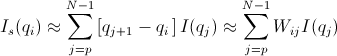
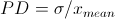
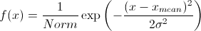
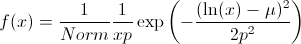
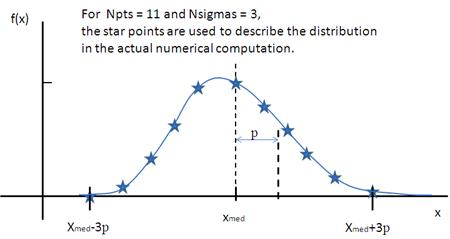

.. pd_help.rst

.. This is a port of the original SasView html help file to ReSTructured text
.. by S King, ISIS, during SasView CodeCamp-III in Feb 2015.

.. |beta| unicode:: U+03B2
.. |gamma| unicode:: U+03B3
.. |mu| unicode:: U+03BC
.. |sigma| unicode:: U+03C3
.. |phi| unicode:: U+03C6
.. |theta| unicode:: U+03B8
.. |chi| unicode:: U+03C7
.. |Ang| unicode:: U+212B

.. |inlineimage004| image:: sm_image004.gif
.. |inlineimage005| image:: sm_image005.gif
.. |inlineimage008| image:: sm_image008.gif
.. |inlineimage009| image:: sm_image009.gif
.. |inlineimage010| image:: sm_image010.gif
.. |inlineimage011| image:: sm_image011.gif
.. |inlineimage012| image:: sm_image012.gif
.. |inlineimage018| image:: sm_image018.gif

.. ZZZZZZZZZZZZZZZZZZZZZZZZZZZZZZZZZZZZZZZZZZZZZZZZZZZZZZZZZZZZZZZZZZZZZZZZZZZZZ

Polydispersity Distributions
----------------------------

With some models SasView can calculate the average form factor for a population
of particles that exhibit size and/or orientational polydispersity. The resultant
form factor is normalized by the average particle volume such that

*P(q) = scale* * \ <F*\F> / *V + bkg*

where F is the scattering amplitude and the \<\> denote an average over the size
distribution.

Users should note that this computation is very intensive. Applying polydispersion
to multiple parameters at the same time, or increasing the number of *Npts* values
in the fit, will require patience! However, the calculations are generally more
robust with more data points or more angles.

SasView uses the term *PD* for a size distribution (and not to be confused with a
molecular weight distributions in polymer science) and the term *Sigma* for an
angular distribution.

The following five distribution functions are provided:

*  *Rectangular Distribution*
*  *Gaussian Distribution*
*  *Lognormal Distribution*
*  *Schulz Distribution*
*  *Array Distribution*

These are all implemented in SasView as *number-average* distributions.

.. ZZZZZZZZZZZZZZZZZZZZZZZZZZZZZZZZZZZZZZZZZZZZZZZZZZZZZZZZZZZZZZZZZZZZZZZZZZZZZ

Rectangular Distribution
^^^^^^^^^^^^^^^^^^^^^^^^

The Rectangular Distribution is defined as

.. image:: pd_image001.png

where *xmean* is the mean of the distribution, *w* is the half-width, and *Norm* is a
normalization factor which is determined during the numerical calculation.

Note that the standard deviation and the half width *w* are different!

The standard deviation is

.. image:: pd_image002.png

whilst the polydispersity is

.. image:: pd_image004.jpg

.. ZZZZZZZZZZZZZZZZZZZZZZZZZZZZZZZZZZZZZZZZZZZZZZZZZZZZZZZZZZZZZZZZZZZZZZZZZZZZZ

Gaussian Distribution
^^^^^^^^^^^^^^^^^^^^^

The Gaussian Distribution is defined as

where *xmean* is the mean of the distribution and *Norm* is a normalization factor
which is determined during the numerical calculation.

The polydispersity is

.. image:: pd_image006.jpg

.. ZZZZZZZZZZZZZZZZZZZZZZZZZZZZZZZZZZZZZZZZZZZZZZZZZZZZZZZZZZZZZZZZZZZZZZZZZZZZZ

Lognormal Distribution
^^^^^^^^^^^^^^^^^^^^^^

The Lognormal Distribution is defined as

where |mu|\ =ln(*xmed*), *xmed* is the median value of the distribution, and
*Norm* is a normalization factor which will be determined during the numerical
calculation.

The median value for the distribution will be the value given for the respective
size parameter in the *Fitting Perspective*, for example, radius = 60.

The polydispersity is given by |sigma|

.. image:: pd_image008.png

For the angular distribution

.. image:: pd_image009.png

The mean value is given by *xmean*\ =exp(|mu|\ +p\ :sup:`2`\ /2). The peak value
is given by *xpeak*\ =exp(|mu|-p\ :sup:`2`\ ).

This distribution function spreads more, and the peak shifts to the left, as *p*
increases, requiring higher values of Nsigmas and Npts.

.. ZZZZZZZZZZZZZZZZZZZZZZZZZZZZZZZZZZZZZZZZZZZZZZZZZZZZZZZZZZZZZZZZZZZZZZZZZZZZZ

Schulz Distribution
^^^^^^^^^^^^^^^^^^^

The Schulz distribution is defined as

.. image:: pd_image011.png

where *xmean* is the mean of the distribution and *Norm* is a normalization factor
which is determined during the numerical calculation, and *z* is a measure of the
width of the distribution such that

z = (1-p\ :sup:`2`\ ) / p\ :sup:`2`

The polydispersity is

.. image:: pd_image012.png

Note that larger values of PD might need larger values of Npts and Nsigmas.
For example, at PD=0.7 and radius=60 |Ang|, Npts>=160 and Nsigmas>=15 at least.

.. image:: pd_image013.jpg

For further information on the Schulz distribution see:
M Kotlarchyk & S-H Chen, *J Chem Phys*, (1983), 79, 2461.

.. ZZZZZZZZZZZZZZZZZZZZZZZZZZZZZZZZZZZZZZZZZZZZZZZZZZZZZZZZZZZZZZZZZZZZZZZZZZZZZ

Array Distribution
^^^^^^^^^^^^^^^^^^

This user-definable distribution should be given as as a simple ASCII text file
where the array is defined by two columns of numbers: *x* and *f(x)*. The *f(x)*
will be normalized by SasView during the computation.

Example of what an array distribution file should look like:

====  =====
 30    0.1
 32    0.3
 35    0.4
 36    0.5
 37    0.6
 39    0.7
 41    0.9
====  =====

SasView only uses these array values during the computation, therefore any mean
value of the parameter represented by *x* present in the *Fitting Perspective*
will be ignored.

.. ZZZZZZZZZZZZZZZZZZZZZZZZZZZZZZZZZZZZZZZZZZZZZZZZZZZZZZZZZZZZZZZZZZZZZZZZZZZZZ

Note about DLS polydispersity
^^^^^^^^^^^^^^^^^^^^^^^^^^^^^

Many commercial Dynamic Light Scattering (DLS) instruments produce a size
polydispersity parameter, sometimes even given the symbol *p*! This parameter is
defined as the relative standard deviation coefficient of variation of the size
distribution and is NOT the same as the polydispersity parameters in the Lognormal
and Schulz distributions above (though they all related) except when the DLS
polydispersity parameter is <0.13.

For more information see:
S King, C Washington & R Heenan, *Phys Chem Chem Phys*, (2005), 7, 143

.. ZZZZZZZZZZZZZZZZZZZZZZZZZZZZZZZZZZZZZZZZZZZZZZZZZZZZZZZZZZZZZZZZZZZZZZZZZZZZZ

.. note::  This help document was last changed by Steve King, 01May2015
