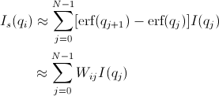

.. sm_help.rst

.. This is a port of the original SasView html help file to ReSTructured text
.. by S King, ISIS, during SasView CodeCamp-III in Feb 2015.

.. |beta| unicode:: U+03B2
.. |gamma| unicode:: U+03B3
.. |mu| unicode:: U+03BC
.. |sigma| unicode:: U+03C3
.. |phi| unicode:: U+03C6
.. |theta| unicode:: U+03B8
.. |chi| unicode:: U+03C7

.. |inlineimage004| image:: sm_image004.gif
.. |inlineimage005| image:: sm_image005.gif
.. |inlineimage008| image:: sm_image008.gif
.. |inlineimage009| image:: sm_image009.gif
.. |inlineimage010| image:: sm_image010.gif
.. |inlineimage011| image:: sm_image011.gif
.. |inlineimage012| image:: sm_image012.gif
.. |inlineimage018| image:: sm_image018.gif
.. |inlineimage019| image:: sm_image019.gif

.. ZZZZZZZZZZZZZZZZZZZZZZZZZZZZZZZZZZZZZZZZZZZZZZZZZZZZZZZZZZZZZZZZZZZZZZZZZZZZZ

.. _Smearing_Computation:

Smearing Computation
--------------------

Slit_Smearing_ 

Pinhole_Smearing_

2D_Smearing_

.. _Slit_Smearing:

Slit Smearing
-------------

The sit smeared scattering intensity for SAS is defined by

.. image:: sm_image002.gif

where Norm =

.. image:: sm_image003.gif

Equation 1

The functions |inlineimage004| and |inlineimage005|
refer to the slit width weighting function and the slit height weighting 
determined at the q point, respectively. Here, we assumes that the weighting 
function is described by a rectangular function, i.e.,

.. image:: sm_image006.gif

Equation 2

and

.. image:: sm_image007.gif

Equation 3

so that |inlineimage008| |inlineimage009| for |inlineimage010| and u.

The |inlineimage011| and |inlineimage012| stand for
the slit height (FWHM/2) and the slit width (FWHM/2) in the q space. Now the 
integral of Equation 1 is simplified to

.. image:: sm_image013.gif

Equation 4

Numerical Implementation of Equation 4
--------------------------------------

Case 1
------

For |inlineimage012| = 0 and |inlineimage011| = constant.

.. image:: sm_image016.gif

For discrete q values, at the q values from the data points and at the q 
values extended up to qN= qi + |inlineimage011| the smeared 
intensity can be calculated approximately

.. image:: sm_image017.gif

Equation 5

|inlineimage018| = 0 for *Is* in *j* < *i* or *j* > N-1*.

Case 2
------

For |inlineimage012| = constant and |inlineimage011| = 0.

Similarly to Case 1, we get

|inlineimage019| for qp= qi- |inlineimage012| and qN= qi+ |inlineimage012|. |inlineimage018| = 0
for *Is* in *j* < *p* or *j* > *N-1*.

Case 3
------

For |inlineimage011| = constant and 
|inlineimage011| = constant.

In this case, the best way is to perform the integration, Equation 1, 
numerically for both slit height and width. However, the numerical integration 
is not correct enough unless given a large number of iteration, say at least 
10000 by 10000 for each element of the matrix, W, which will take minutes and 
minutes to finish the calculation for a set of typical SAS data. An 
alternative way which is correct for slit width << slit hight, is used in 
SasView. This method is a mixed method that combines method 1 with the 
numerical integration for the slit width.

.. image:: sm_image020.gif

Equation 7

for qp= qi- |inlineimage012| and
qN= qi+ |inlineimage012|. |inlineimage018| = 0 for
*Is* in *j* < *p* or *j* > *N-1*.

.. _Pinhole_Smearing:

Pinhole Smearing
----------------

The pinhole smearing computation is done similar to the case above except 
that the weight function used is the Gaussian function, so that the Equation 6 
for this case becomes

Equation 8

For all the cases above, the weighting matrix *W* is calculated when the 
smearing is called at the first time, and it includes the ~ 60 q values 
(finely binned evenly) below (\>0) and above the q range of data in order 
to cover all data points of the smearing computation for a given model and 
for a given slit size. The *Norm*  factor is found numerically with the 
weighting matrix, and considered on *Is* computation.

.. _2D_Smearing:

2D Smearing
----------- 

The 2D smearing computation is done similar to the 1D pinhole smearing above 
except that the weight function used was the 2D elliptical Gaussian function

.. image:: sm_image022.gif

Equation 9

In Equation 9, x0 = qcos/theta/ and y0 = qsin/theta/, and the primed axes 
are in the coordinate rotated by an angle /theta/ around the z-axis (below) 
so that x’0= x0cos/theta/+y0sin/theta/ and y’0= -x0sin/theta/+y0cos/theta/.

Note that the rotation angle is zero for x-y symmetric elliptical Gaussian 
distribution. The A is a normalization factor.

.. image:: sm_image023.gif

Now we consider a numerical integration where each bins in /theta/ and R are 
*evenly* (this is to simplify the equation below) distributed by /delta//theta/ 
and /delta/R, respectively, and it is assumed that I(x’, y’) is constant 
within the bins which in turn becomes

.. image:: sm_image024.gif

Equation 10

Since we have found the weighting factor on each bin points, it is convenient 
to transform x’-y’ back to x-y coordinate (rotating it by -/theta/ around z 
axis). Then, for the polar symmetric smear

.. image:: sm_image025.gif

Equation 11

where

.. image:: sm_image026.gif

while for the x-y symmetric smear

.. image:: sm_image027.gif

Equation 12

where

.. image:: sm_image028.gif

Here, the current version of the SasView uses Equation 11 for 2D smearing 
assuming that all the Gaussian weighting functions are aligned in the polar 
coordinate.

In the control panel, the higher accuracy indicates more and finer binnng 
points so that it costs more in time.

.. ZZZZZZZZZZZZZZZZZZZZZZZZZZZZZZZZZZZZZZZZZZZZZZZZZZZZZZZZZZZZZZZZZZZZZZZZZZZZZ
