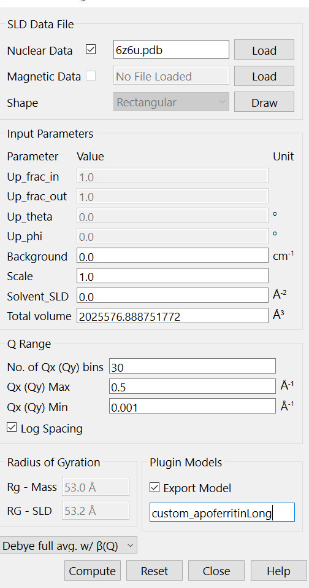
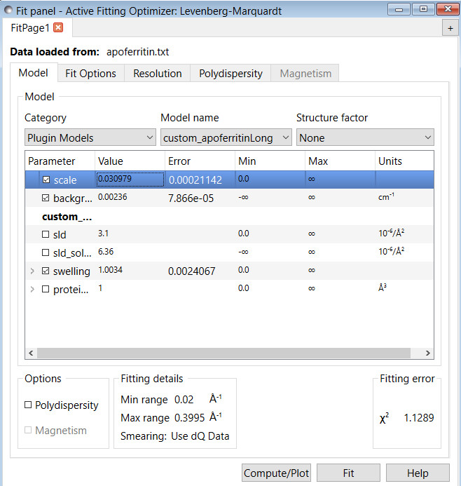
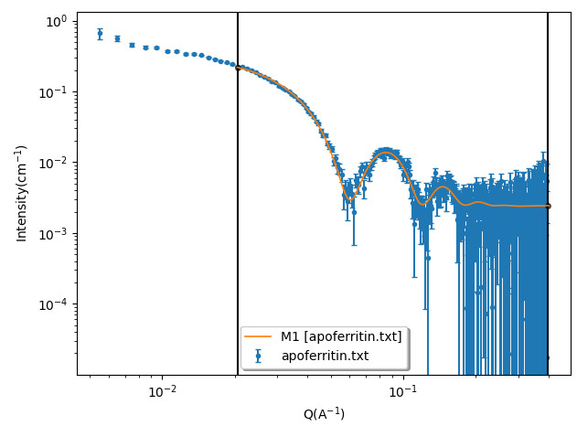

.. gsc_ex_customModel_data.rst

.. _gsc_ex_customModel_data:

Example: Fit the experimental data using the calculated $P(Q)$ from a PDB file 
==================================

(Pictures in this document were generated using SasView 6.0.0.) To calculate $P(Q)$ from a PDB file, use the Generic Scattering Calculator in the Tools menu. In this example, a PDB file for apoferritin was downloaded from the PDB data bank (https://www.rcsb.org/structure/6z6u). The custom model function, custom_apoferritinLong, was obtained from the scattering calculator using the Debye full avg. w/ $\beta(Q)$ option after loading the apoferritin PDB file (see print-screen below). Note that the q-range and the number of data points can be customized. The Export Model box should be checked to enable a file name for the custom plugin model that will be produced (custom_apoferritinLong). Clicking "Compute" launches the calculation of $P(Q)$ and $\beta(Q)$, and generate the file into the plugin model directory of the SasView. Once the computation is finished, the plugin model is ready to use to fit scattering data.

To use the calculated custom apoferritinLong model in Fit panel, one selects "Plugin Models" in the Category box. The custom model should already exist in the SasView directory and can be found in the drop down menu of the "Model name". This custom model, custom_apoferritinLong, returns both the normalized form factor, $\tilde{P}(Q)$, and $\beta(Q)$ caculated using the PDB file. But $\beta(Q)$ is only used if one needs to fit the data with the inter-particle structure factor, $S(Q)$, with the static decoupling approximation.

Warning: when generating the custom plugin model using the Generic Scattering Calculator, please be careful about the following two issues before using it:

1) There should be $enough$ number of data points included in the plugin model. Because the plugin model calculates the theoretical $I(Q)$ by interpolating the data during the fitting, the more data points generated by the Generic Scattering Calculator, the more accurate the theoretical curves is. 

2) Because each instrument has a resolution function for each $Q$ value, the theoretical curve needs to be calculated by considering the resolution function. To make the fitting function working properly, the $Q$ range calculated for the plugin model in the Generic Scattering Calculator should be larger than the $Q$ range of the experimental data. If the $Q$ range of theoretical data is too close to (or smaller than) that of the experimental data, the calculated theoretical values may all return as "NaN". When this happens, the plugin model will not function properly to fit experimental data. 

The following example is to demonstrate how to fit the data with the calculated form factor.  

The scattering pattern, $I(Q)$, is calculated as

.. math::
    I(Q) = \frac{scale}{V}(SLD - SLD_{solvent})^2V_{protein} \tilde{P}(Q\alpha)S_{eff}(Q) + background

$SLD$ is the scattering length density of the protein (or particle). And $SLD\_solvent$ is the scattering length density of solvent. 

$V_{protein}$ is the protein volume. If the scattering length density and protein volume are assigned with correct values, $scale$ is the volume fraction of the protein ( or particle).

$\alpha$ is the swelling factor. In general, $\alpha$ should be one (or close to one). The parameter is introduced just in case that there is a slight swelling of the particle.

$S_{eff}(Q)$ is the effective structure factor with 

.. math::
    S_{eff}(Q) = 1 + \beta(Q\alpha)(S(Q)+1)

And $S(Q)$ is the interparticule structure factor.

For dilute solutions, it is simplified as

.. math::
    I(Q) = \frac{scale}{V}(SLD - SLD_{solvent})^2V_{protein} \tilde{P}(Q\alpha) + background

The following figure shows the comparison between one experimental apoferritin protein SANS data of a dilute sample with the calculated $I(Q)$ using this model.

If one needs to fit concentrated protein solutions, an appropriate structure factor model needs to be chosen. If a protein is anisotropic, one also needs to use the static decoupling approximation. $\beta(Q)$ will be automatially used during the fitting. One fitting parameter to calculate $S(Q)$ using the models available in the SasView is the effective radius that is called radius\_effective in the SasView. One needs to choose how to correlate the effective radius with the size of a protein. Note that the effective radius is related with the interaciton between porteins, and could be different from the radius of a protein/particle. It is therefore ok, and sometimes recommended, to use unconstrained method for the "radius\_effective_mode" since there is no fitting prameter related with the protein size in this custom fitting model. If a protein is nearly spherical such as apoferritin, there is no need to use the static decoupling approximation.

*Document History*

| 2023-10-30 Yun Liu

