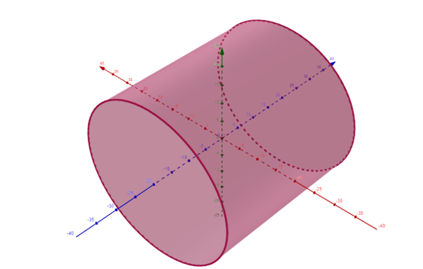
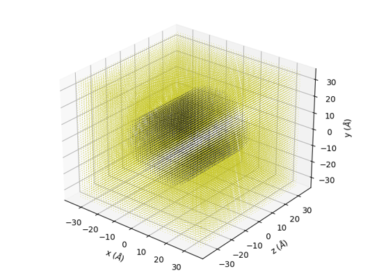
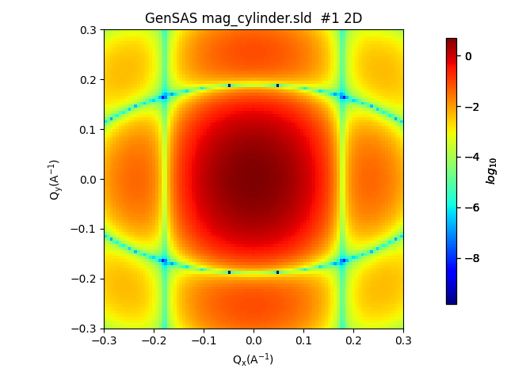
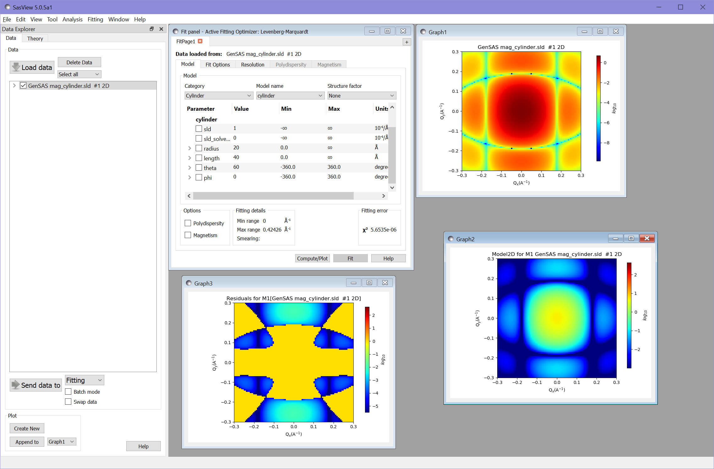
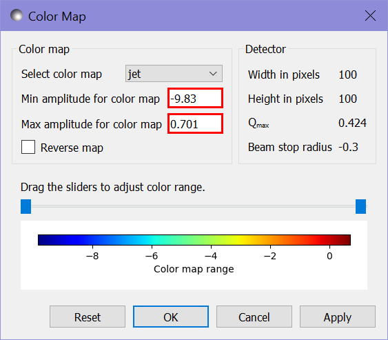
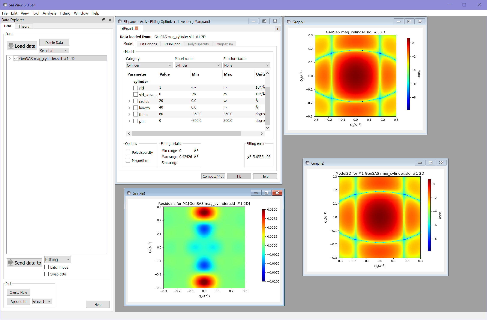
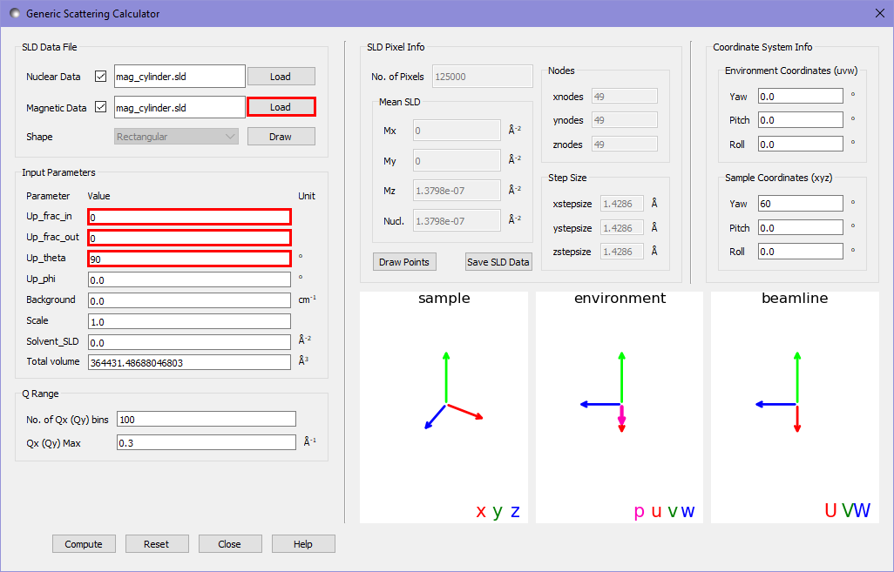
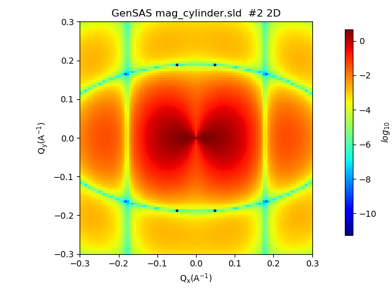
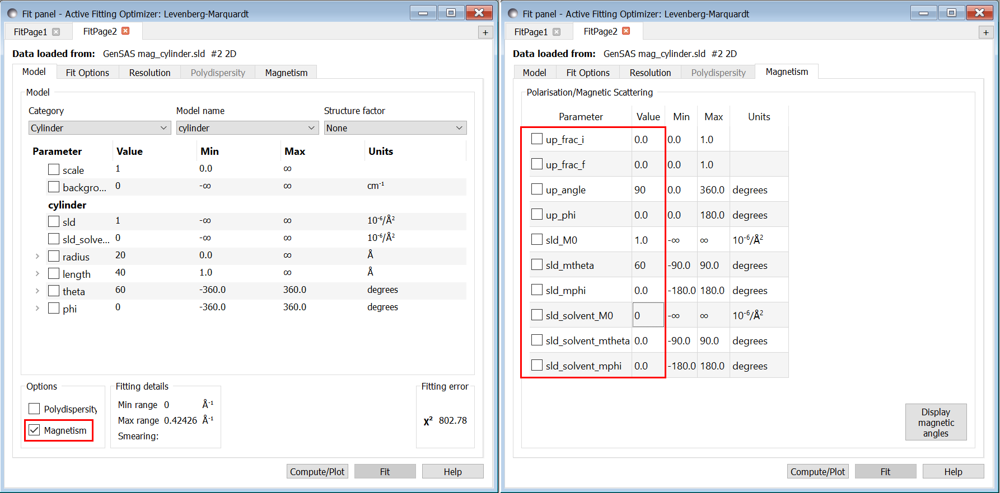
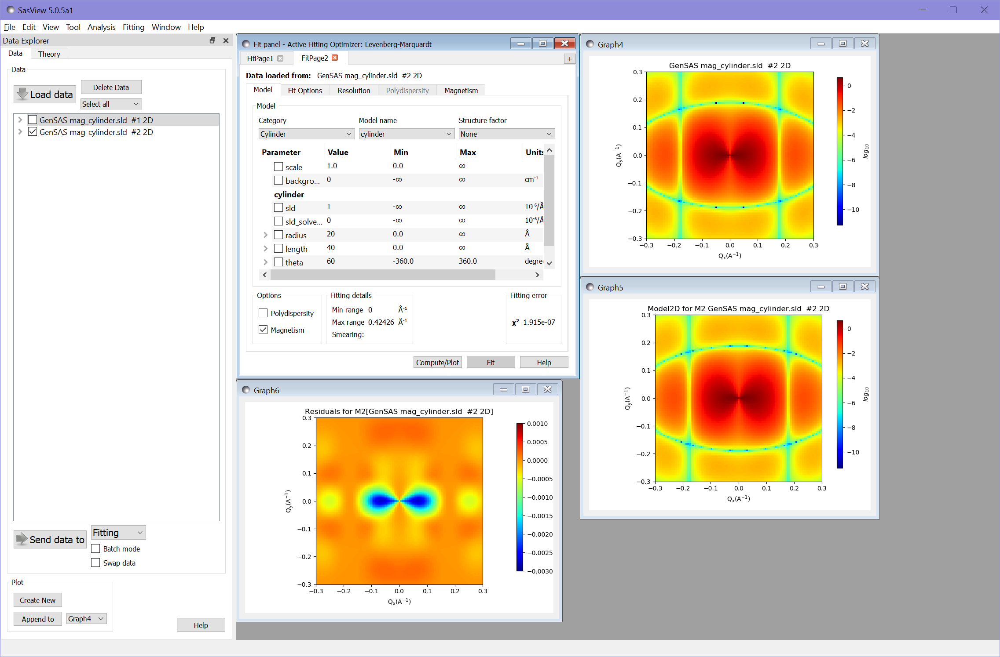

.. gsc_ex_magnetic_cylinder.rst

.. _gsc_ex_magnetic_cylinder:

Example 2: A Magnetic Cylinder
==================================

In this example we will use an SLD file describing a single solid
cylinder, with both nuclear and magnetic scattering length densities (SLDs).
The mag. cylinder SLD file can be found in the test folder for coordinate data.
We will then use the calculator to create scattering intensity patterns for
both a non-magnetised and magnetised cylinder.

Our cylinder will have a radius of 20\ |Ang| and a
length of 40\ |Ang|, with its axis
at a 60° polar angle to the $z$-axis. The cylinder will have equal nuclear and
magnetic SLDs, with the magnetic SLD along the cylinder's axis. 
We will write first an SLD file for an cylinder aligned along the $z$ axis -
and perform the rotation within the calculator.

The file should describe a cylinder as below, with a constant nuclear
scattering length density of
1x10\ :sup:`-6`\ |Ang|:sup:`-2` and
a constant magnetic scattering length density of 
(0, 0, 1x10\ :sup:`-6`)\ |Ang|:sup:`-2`:

For completeness, the following code generates the SLD file
calculator::

        import numpy as np

        size = np.linspace(-35.0, 35.0, 50) # describe each axis of the grid
        # create a full 3D grid
        xs, ys, zs = np.meshgrid(size, size, size)
        xs = xs.flatten()
        ys = ys.flatten()
        zs = zs.flatten()
        # create arrays to hold the SLDs
        N = np.zeros_like(xs)
        Mx = np.zeros_like(xs)
        My = np.zeros_like(xs)
        Mz = np.zeros_like(xs)
        # fill in the values of the non-zero SLDs within the cylinder
        inside_cylinder = np.bitwise_and(np.float_power(xs, 2) + np.float_power(ys, 2) <= 20**2, np.abs(zs) <= 20)
        N[inside_cylinder] = 1e-6
        Mz[inside_cylinder] = 1e-6
        # save the output to an sld file
        output = np.column_stack((xs, ys, zs, N, Mx, My, Mz))
        np.savetxt("mag_cylinder.sld", output, header="x y z N mx my mz")

We do not need to worry that the large number of pixels with zero valued SLD
around the cylinder slows down the computation, as such pixels are
stripped before the calculation begins.

Structural Scattering
^^^^^^^^^^^^^^^^^^^^^

First we consider the scattering pattern of a non-magnetic cylinder. We open
the scattering calculator and use the nuclear datafile `load` button to load
the nuclear SLD for this sample into the calculator.

.. figure:: gsc_ex_magnetic_cylinder_assets/gsc_tool_1.png

By pressing the `draw` button we can see a view of the pixels describing the
sample. Pixels with 0 SLD are coloured in yellow, all others are given a colour
related
to their SLD, which in this case is a constant.

In order to set the cylinder at an angle of 60° to the $z$ axis we use the
sample coordinates highlighted in red below. We also want a 100x100 pixel
binning in $Q$.
Unlike the default data in example 1, this value is not given a warning orange
background, due to the higher discretisation of the real space data for the
cylinder.

Pressing compute gives us the following output in the main window:

This relatively simple system can be compared with the analytical model in the
fitting calculator to test the correctness of our results.
We send the output of the scattering calculator to the fitting panel as in
example 1 :ref:`gsc_ex_default_data` and choose the `cylinder` category and `cylinder` model.
We then set the following settings to match the fitting calculator to the
scattering calculator settings:

 - *scale*: 1.0
 - *background*: 0.0
 - *sld*: 1 ($\times 10^{-6}$ in units)
 - *sld_solvent*: 0
 - *radius*: 20
 - *length*: 40
 - *theta*: 60
 - *phi*: 0

Computing this gives us the model and residual plots:

The value of $\chi^2 = 5.65\times 10^{-6}$ demonstrates that the calculator has
produced very accurate results.

For a better comparison of the results, we can adjust the colour scales by
right-clicking on each of the scattering intensity plots and selecting `2D
Color Map` to set the maximum and minimum ranges of the plots: 

We also need to adjust the scale for the residuals plot. Since the residuals
for this fit include negative values we need to change from a log to a linear
scale
by right clicking the plot and selecting `Toggle Linear/Log Scale`. We can then
adjust the range of the color map as before - in this case to the range from
-0.01 to 0.01.

Magnetic Scattering
^^^^^^^^^^^^^^^^^^^^^

We will now add the magnetic SLD to the cylinder. We load our magnetic cylinder
SLD file into the magnetic datafile slot, and alter the magnetic beamline
settings
to put the polarisation direction along the $U$ axis (the horizontal direction)
and to record the ++ cross-section ("+" state as defined in Moon, Riste, and
Koehler, 1969 [#MRK1969]_ corresponds to 0 in the textbox for up_frac).

Running the calculation gives us the following output in the main window:

Additional to the structural scattering pattern now an angular anisotropy due
to the magnetisation occurs.

Again we can compare our result to the analytic result of the fitting
calculator. We set the same settings as before for the cylinder model but also
check the
`Magnetism` checkbox in the fitting window. We then navigate to the `Magnetism`
tab and set the following settings to match with the scattering calculator:

 - *up_frac_i*: 0
 - *up_frac_f*: 0
 - *up_angle*: 90 (corresponds to up_theta in the calculator)
 - *up_phi*: 0
 - *sld_M0*: 1 (corresponds to sample magnetic SLD)
 - *sld_mtheta*: 60 (gives the direction of the magnetic SLD in polar angles)
 - *sld_mphi*: 0
 - *sld_solvent_M0*: 0 (the magnetic SLD of the solvent)
 - *sld_solvent_mtheta*: 0
 - *sld_solvent_mphi*: 0

  
Carrying out the fitting gives the following results (after adjusting scales to
match):

Again the value of $\chi^2 = 1.92\times 10^{-7}$ shows an excellent fit.

References
----------

    .. [#MRK1969] Polarization Analysis of Thermal-Neutron Scattering
         (1969) R. M. Moon, T. Riste, and W. C. Koehler Phys. Rev. 181, 920 
         `DOI <https://doi.org/10.1103/PhysRev.181.920>`__

*Document History*

| 2021-09-14 Robert Bourne
