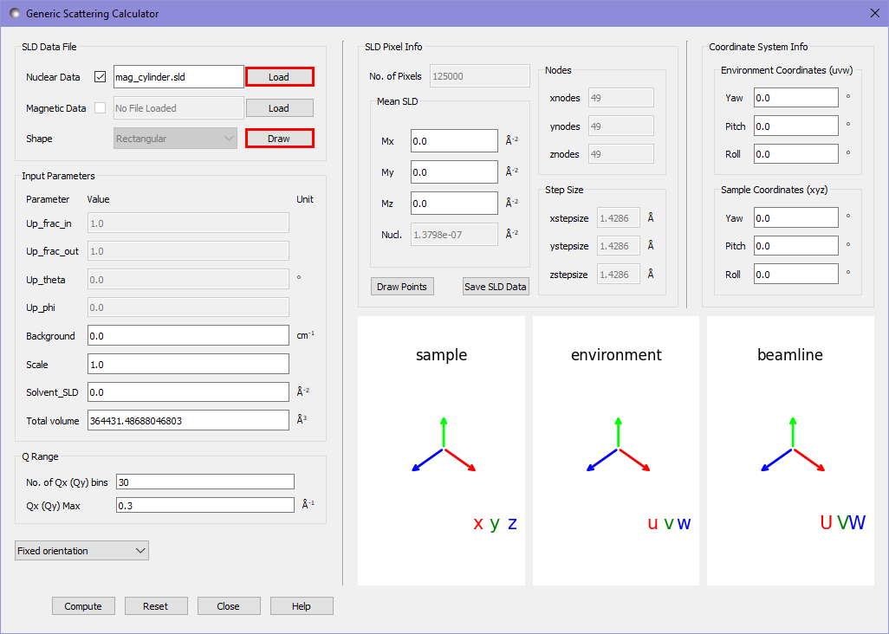
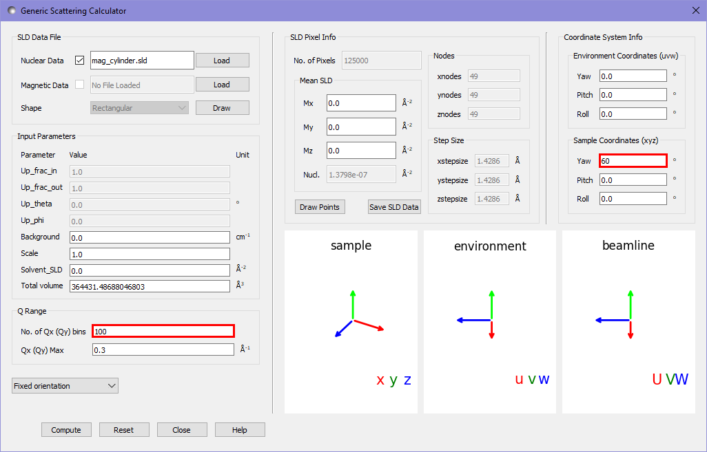
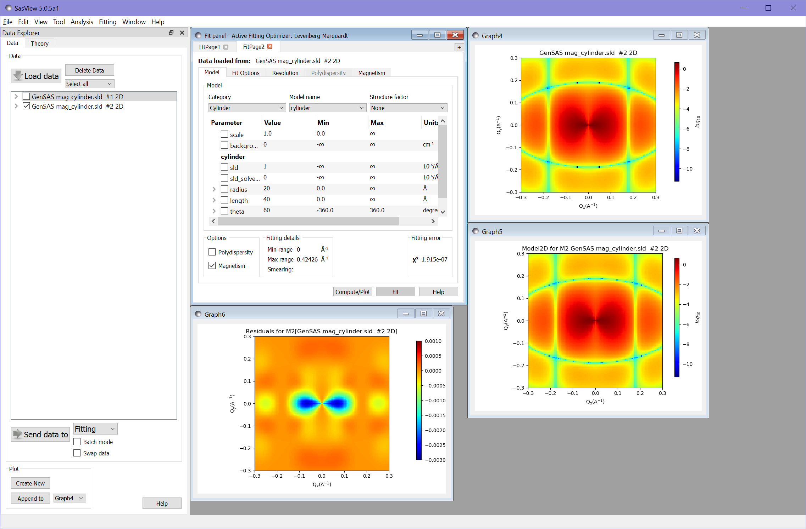

.. gsc_ex_magnetic_cylinder.rst

.. _gsc_ex_magnetic_cylinder:

Example 2: A Magnetic Cylinder
==================================

In this example we will generate an sld file describing a single solid cylinder, with both nuclear and magnetic scattering length densities (SLDs).
We will then use the calculator to create scattering intensity patterns for both a non-magnetised and magnetised cylinder.

Our cylinder will have a radius of $20\require{unicode}\unicode{x212B}$ and a length of $40\require{unicode}\unicode{x212B}$, with it's axis
at a 60° polar angle to the z-axis. The cylinder will have equal nuclear and magnetic SLDs, with the magnetic SLD along the cylinder's axis. 
Rather than write code for this - we will instead an sld file with our cylinder aligned along the z axis - and perform the rotation within the calculator.

Our file should therefore describe a cylinder as below, with a constant nuclear scattering length density of $1\times10^{-6}\require{unicode}\unicode{x212B}^{-2}$ and
a constant magnetic scattering length density of $(0, 0, 1\times10^{-6})\require{unicode}\unicode{x212B}^{-2}$:

.. figure:: gsc_ex_magnetic_cylinder_images/cylinder_graphic.png

The following code generates an sld file describing such a sample, using the sld file format as given in the documentation for the generic scattering calculator::

        import numpy as np

        size = np.linspace(-35.0, 35.0, 50) # describe each axis of the grid
        # create a full 3D grid
        xs, ys, zs = np.meshgrid(size, size, size)
        xs = xs.flatten()
        ys = ys.flatten()
        zs = zs.flatten()
        # create arrays to hold the SLDs
        N = np.zeros_like(xs)
        Mx = np.zeros_like(xs)
        My = np.zeros_like(xs)
        Mz = np.zeros_like(xs)
        # fill in the values of the non-zero SLDs within the cylinder
        inside_cylinder = np.bitwise_and(np.float_power(xs, 2) + np.float_power(ys, 2) <= 20**2, np.abs(zs) <= 20)
        N[inside_cylinder] = 1e-6
        Mz[inside_cylinder] = 1e-6
        # save the output to an sld file
        output = np.column_stack((xs, ys, zs, N, Mx, My, Mz))
        np.savetxt("mag_cylinder.sld", output, header="x y z N mx my mz")

We do not need to worry about the large number of 0 SLD pixels around the edge of the cylinder slowing down the computation, as these are removed before calculation begins.

We will now consider the scattering pattern from a non-magnetic cylinder. We open the scattering calculator and use the nuclear datafile `load` button to load
the nuclear SLD for this sample into the calculator.

By pressing the `draw` button we can see a view of the pixels which make up our sample. Pixels with 0 SLD are coloured in yellow, all others are given a colour related
to their sld, which in this case is a constant.

.. figure:: gsc_ex_magnetic_cylinder_images/cylinder_draw_output.png

In order to set the cylinder at an angle of 60° to the z axis we use the sample coordinates highlighted in red below. We also set the output to be 100x100 pixels.
Unlike the default data in example 1, this value is not given a warning orange background, due to the higher discretisation of real space for the cylinder.

Pressing compute gives us the following output in the main window:

.. figure:: gsc_ex_magnetic_cylinder_images/nuclear_output.png

As a relatively simple system we can use the analytical model in the fitting calculator to test our results, which we expect to be very accurate, given the high
discretisation we have used. We send the output of the scattering calculator to the fitting panel as in example 1 and choose the `cylinder` category and `cylinder` model.
We also then set the following settings to match the fitting calculator to our sample and calculator settings:

 - scale: 1.0
 - background: 0.0
 - sld: 1 ($\times 10^{-6}$ in units)
 - sld_solvent: 0
 - radius: 20
 - length: 40
 - theta: 60
 - phi: 0

Computing this gives us the model and residual plots:

.. figure:: gsc_ex_magnetic_cylinder_images/main_window_3.png

The value of $\chi^2 = 5.65\times 10^{-6}$ shows that the calculator has produced very accurate results.
Unfortunately the scales used give rather difficult graph to interpret. We will adjust these to make comparison more simple.

Firstly we can right click on each of the scattering intensity plots and select `2D Color Map` to see the maximum and minimum ranges of the plots. Setting the
model and scattering calculator output to have the same range makes visual comparison much easier. We set both to the range used for the calculator
output:

.. figure:: gsc_ex_magnetic_cylinder_images/color_map_4.png

We also need to adjust the scale for the residuals plot. Since the residuals for this fit include negative values we need to change from a log to a linear scale
by right clicking the plot and selecting `Toggle Linear/Log Scale`. We can then adjust the range of the color map as before - in this case to the range from -0.01 to 0.01.

.. figure:: gsc_ex_magnetic_cylinder_images/main_window_5.png

We will now add the magnetic SLD to the cylinder. We load our magnetic cylinder sld file into the magnetic datafile slot, and alter the magnetic beamline settings as shown
to put the polarisation direction along the U axis (the horizontal target direction) and to record the ++ cross-section (in Sasview + in the literature corresponds to
a down polarisation, i.e. 0 in the textbox for up_frac).

Running the calculation gives us the following output in the main window:

.. figure:: gsc_ex_magnetic_cylinder_images/magnetic_output.png

The same form as previously, but now with an angular anisotropy due to the magnetisation.

Again we can compare our result to the analytic result of the fitting calculator. We set the same settings as before for the cylinder model but also check the
`Magnetism` checkbox in the fitting window. We then navigate to the `Magnetism` tab and set the following settings to match with the scattering calculator:

 - up_frac_i: 0
 - up_frac_f: 0
 - up_angle: 90 (corresponds to up_theta in the calculator)
 - up_phi: 0
 - sld_M0: 1 (corresponds to sample magnetic sld)
 - sld_mtheta: 60 (gives the direction of the magnetic sld in polar angles)
 - sld_mphi: 0
 - sld_solvent_M0: 0 (the magnetic sld of the solvent)
 - sld_solvent_mtheta: 0
 - sld_solvent_mphi: 0

.. figure:: gsc_ex_magnetic_cylinder_images/magnetism_fitting.png
  
Carrying out the fitting gives the following results (after adjusting scales to match):

Again the value of $\chi^2 = 1.92\times 10^{-7}$ shows an excellent fit.

*Document History*

| 2021-09-14 Robert Bourne
