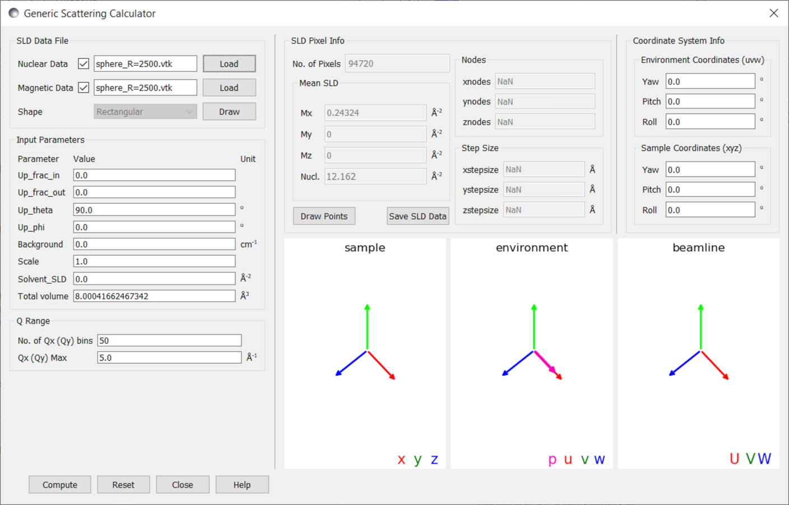

.. gsc_ex_magnetic_spheres.rst

.. _gsc_ex_magnetic_spheres:

Example 3: Magnetic Spheres
==================================

In this example we will use finite element meshes to calculate the
scattering intensity patterns for a sphere with uniform nuclear and
magnetic scattering length densities (SLDs), with the magnetisation 
and polarisation being horizontal and perpendicular to the beamline. 
Specifically we will observe the change in the pattern of the ++ 
cross-section as the ratio of these two SLDs varies, as in this 
paper [#MHDDSH2012]_ (specifically Fig 1).

We define the ratio of the two SLDs as:

.. math::
    R = \frac{\left\|N\right\|^2}{b_H^2\left\|M_x\right\|^2}

Where $N$ is the nuclear SLD and $M_x$ the $x$ component of the magnetisation.
$b_H = 2.70\times 10^{-15}m$

Using the formulas from the paper we can write a python script 
to generate analytical results for the scattering pattern in the ++ cross-section.

.. math::
    I^{++}(\mathbf{q}) = \frac{8\pi^3}{V}\left(
    \left\|\widetilde{N}\right\|^2 + b_H^2\left\|\widetilde{M}_x\right\|^2\sin^4\theta - 
    b_H\left( \widetilde{N}\widetilde{M}_x^* + \widetilde{N}^*\widetilde{M}_x \right)\sin^2\theta \right)

Where $\widetilde{N}$ and $\widetilde{M}_x$ are the fourier transforms of $N$ and $M_x$ respectively.

We will use the same $R$ values as in the paper referenced above and hence require:

 - $R=0.0025$
 - $R=0.2025$
 - $R=4$
 - $R=2500$

The code is as follows::

        import numpy as np
        import math
        from scipy.special import jv, gamma
        import matplotlib.pyplot as plt
        from matplotlib.ticker import MaxNLocator

        def fourier(mag, Q): # F.T. of sphere radius 0.5
            return mag*((4*math.pi/3.0)*gamma(5/2.0) * jv(3/2.0, Q/2.0)/np.float_power(Q/4.0, 3/2.0)/8.0)

        def cross_section(Qx, Qy, n, m): # the result for the ++ cross-section
            theta = math.atan2(Qy, Qx)
            Q = math.sqrt(math.pow(Qx, 2) + math.pow(Qy, 2))
            term = np.square(np.abs(fourier(n, Q)))
            term += np.square(np.abs(fourier(m, Q)))*math.pow(math.sin(theta), 4)
            term += -(fourier(n, Q)*fourier(m, Q).conjugate() + \
                      fourier(m, Q)*fourier(n, Q).conjugate()   ) * math.pow(math.sin(theta), 2)
            # the factor of 1E8 is to correspond with Sasview's intensity units
            return term*1E8/(4*math.pi*math.pow(0.5,3)/3.0)

        WIDTH = 500
        R = 2500

        x = np.linspace(-5, 5, WIDTH)
        y = np.linspace(-5, 5, WIDTH)
        xs, ys = np.meshgrid(x, y)

        vals = np.zeros_like(xs)
        for i in range(WIDTH):
            for j in range(WIDTH):
                vals[i, j] = cross_section(xs[i, j], ys[i, j], n=math.sqrt(R), m=1)

        fig = plt.figure()
        contour_data = plt.contourf(xs, ys, vals, levels=MaxNLocator(nbins=20).tick_values(vals.min(), vals.max()))
        plt.gca().set_aspect('equal')
        cbar = fig.colorbar(contour_data)
        plt.title("Magnetic sphere: R=" + str(R))
        plt.xlabel("$Q_x / Å^{-2}$")
        plt.ylabel("$Q_y / Å^{-2}$")
        plt.show()

This code gives us the following scattering patterns:

Test data (.vtk) with spheres in real space for 4 different ratio between magnetic 
strength and nuclear SLD can be found in the test data folder for coordinate data.
For completeness, we provide the script to generate the .vtk files describing the magnetised
spheres. For this we will use netgen, and the following python script::

        from ngsolve import *
        from ngsolve.comp import *
        from ngsolve.solve import *
        from ngsolve.utils import *
        from netgen.csg import *
        import netgen.gui
        from netgen.meshing import MeshingParameters

        box = OrthoBrick(Pnt(-1,-1,-1),Pnt(1,1,1)).bc("outer")
        magnet = Sphere(Pnt(0.5,0.25,0.5),0.5)
        air = box - magnet
        geo = CSGeometry()
        geo.Add (air.mat("air"), transparent=True)
        geo.Add (magnet.mat("magnet").maxh(3), col=(0.3,0.3,0.1))
        geo.Draw()
        mesh = Mesh(geo.GenerateMesh(maxh=3, curvaturesafety=1))
        mesh.Curve(3)
        mesh.GetMaterials(), mesh.GetBoundaries()
        mur = mesh.MaterialCF({"magnet" : 2}, default=0)
        # alter the nuclear SLD here      ^

        mag = mesh.MaterialCF({"magnet" : (1,0,0)}, default=(0,0,0))
        Draw (mag, mesh, "M-field", draw_surf=False)   
        Draw (mur, mesh, "Nuclear", draw_surf=False)   
        # output as vtk
        vtk = VTKOutput(ma=mesh,coefs=[mur,mag],names=["M-field","Nuclear"],filename="sphere_refined",subdivision=3,legacy=True)
        vtk.Do()

This script sets the nuclear SLD to 2x10\ :sup:`-6`\ |Ang|:sup:`-2`
and the magnetic SLD to (1x10\ :sup:`-6`, 0, 0)\ |Ang|:sup:`-2` giving
$R=4$.Note: The data have been produced with Netgen 6.2, which creates .vtu 
files by default. The key "legacy=True" is used in VTKOutput to produce legacy .vtk files.
For older versions of netgen, this argument may not be required.

To obtain the required $R$ values the code above should be altered where indicated 
to use nuclear SLDs of:

 - $R=0.0025$:  $N=0.05$
 - $R=0.2025$:  $N=0.45$
 - $R=4$:       $N=2$
 - $R=2500$:    $N=50$

Alternatively the generated files can be downloaded here:

| :download:`Sphere with R=0.0025 <gsc_ex_magnetic_spheres_assets/sphere_R=0_0025.vtk>`
| :download:`Sphere with R=0.2025 <gsc_ex_magnetic_spheres_assets/sphere_R=0_2025.vtk>`
| :download:`Sphere with R=4 <gsc_ex_magnetic_spheres_assets/sphere_R=4.vtk>`
| :download:`Sphere with R=2500 <gsc_ex_magnetic_spheres_assets/sphere_R=2500.vtk>`

We load each of these datafiles into the generic scattering calculator and set the following settings:

 - To view the ++ cross-section, with polarisation horizontal to the beamline:
     - *Up_frac_in*: 0.0
     - *Up_frac_out*: 0.0
     - *Up_theta*: 90.0
     - *Up_phi*: 0.0
 - To set the resolution of the detector:
     - *No. of Qx (Qy) bins*: 50
     - *Qx (Qy) Max*: 5.0

The interface for the $R=2500$ sphere is shown below:

For each of the vtk files we press *Compute* to generate the following outputs:

The default output images use a log scale - to compare our results to the analytical model we
adjust the colour scales to be linear - with the same range as our analytical contour plots.
For more detailed instructions on adjusting colour scales see :ref:`example 2 <gsc_ex_magnetic_cylinder>`.

The rescaled outputs are shown below - with a repeat of the analytical results below for comparison.

Qualitatively we see a very good match between the analytical results and the outputs from the
generic scattering calculator. If we wished to make a quantitative analysis we could adapt the
code used to generate the analytical plots to compare the results pixel by pixel. We can save the
output from the scattering calculator by right clicking the plot and selecting `Save Points as a File`,
and then read this data into a python script::

        import numpy as np
        import math
        from scipy.special import jv, gamma
        import matplotlib.pyplot as plt
        from matplotlib.ticker import MaxNLocator

        def fourier(mag, Q): # F.T. of sphere radius 0.5
            return mag*((4*math.pi/3.0)*gamma(5/2.0) * jv(3/2.0, Q/2.0)/np.float_power(Q/4.0, 3/2.0)/8.0)

        def cross_section(Qx, Qy, n, m): # the result for the ++ cross-section
            theta = math.atan2(Qy, Qx)
            Q = math.sqrt(math.pow(Qx, 2) + math.pow(Qy, 2))
            term = np.square(np.abs(fourier(n, Q)))
            term += np.square(np.abs(fourier(m, Q)))*math.pow(math.sin(theta), 4)
            term += -(fourier(n, Q)*fourier(m, Q).conjugate() + \
                      fourier(m, Q)*fourier(n, Q).conjugate()   ) * math.pow(math.sin(theta), 2)
            # the factor of 1E8 is to correspond with Sasview's intensity units
            return term*1E8/(4*math.pi*math.pow(0.5,3)/3.0)

        R = 2500

        file_data = np.loadtxt("filepath to saved data for R=2500 sphere", skiprows = 4)

        vals = np.zeros_like(file_data[:, 2])
        for i in range(len(vals)):
            vals[i] = cross_section(file_data[i, 0], file_data[i, 1], n=math.sqrt(R), m=1)

        errs = ((file_data[:, 2]-vals)/vals)*100

        print("max err:", max(errs), "%")
        print("min err:", min(errs), "%")
        print("max |err|:", max(np.abs(errs)), "%")
        print("min |err|:", min(np.abs(errs)), "%")
        print("mean(|err|): ", np.mean(np.abs(errs)), "%")

We find the following comparison:

================ ================ ================
R                max \|err\|      mean \|err\|
================ ================ ================
0.0025           0.743%           0.165%
0.2025           0.996%           0.167%
4                0.743%           0.165%
2500             0.743%           0.165%
================ ================ ================

References
----------

    .. [#MHDDSH2012] Observation of cross-shaped anisotropy in spin-resolved small-angle neutron scattering
         (2012) 
         Andreas Michels, Dirk Honecker, Frank Döbrich, Charles D. Dewhurst, Kiyonori Suzuki, and André Heinemann
         Phys. Rev. B 85, 184417
         `DOI <https://doi.org/10.1103/PhysRevB.85.184417>`__
