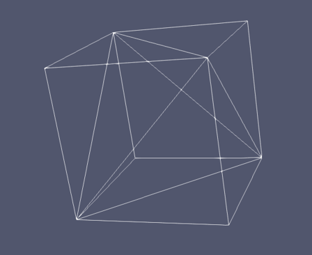
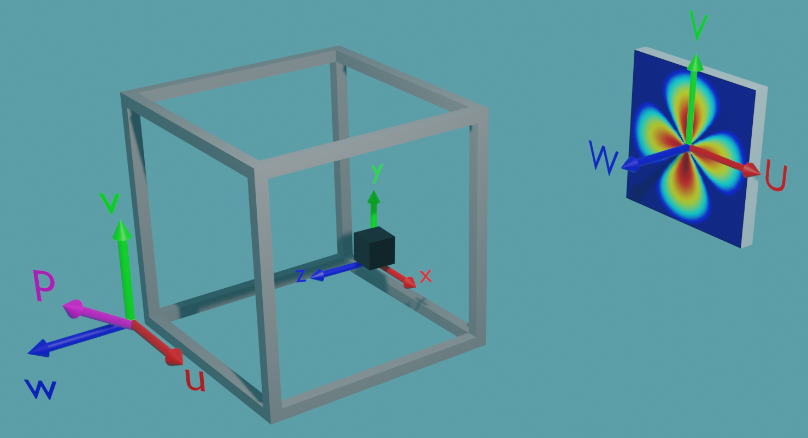
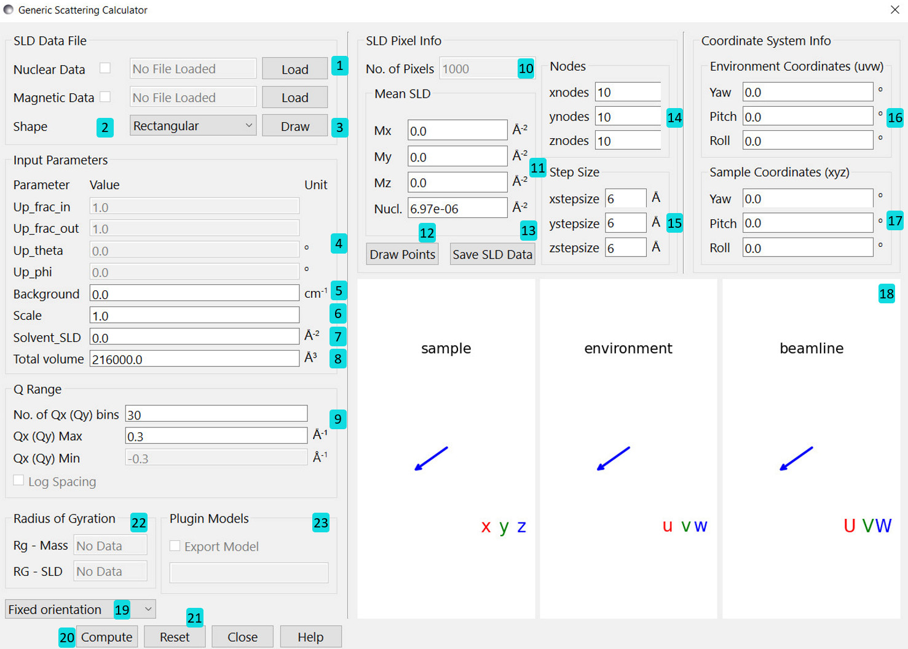

.. sas_calculator_help.rst

.. This is a port of the original SasView html help file to ReSTructured text
.. by S King, ISIS, during SasView CodeCamp-III in Feb 2015.

.. _SANS_Calculator_Tool:

Generic SAS Calculator Tool
============================

Description
-----------

This tool calculates the small angle scattering
cross-section expected from a given real-space 3D shape/structure.
The tool can handle both nuclear and magnetic contributions to the scattering.
It is found selecting Tool>Generic Scattering Calculator from the top menu.

This documentation begins by briefly covering the `two main data structures <Data Structure_>`_ 
which can be used by the calculator, followed by an overview of the three different
`coordinate systems <Coordinate Systems_>`_ used to orient the data and beamline 
parameters. For those unfamiliar with magnetic scattering a link to the 
:ref:`magnetism` documentation is also provided.

Next the `interface to the calculator <How to use the Tool_>`_ is covered, with 
details of each of the settings; both the various `inputs <Inputs_>`_ to the
calculator, and the `information panels <Information Panel_>`_. Finally a 
description of the various `file types <File Types_>`_ which can be used to store
sample data is given.

For those who wish to use the calculator in more advanced ways a brief overview
of the `scripting interface <Scripting_>`_ follows, before the documentation concludes
with links to some `examples <Examples_>`_ and the `references <References_>`_.

Data Structure
--------------

The calculator processes data with the following structure:
either rectangular pixels (grid type data), or finite elements (element type
data), in a variety of shapes, such as tetrahedra, cubes or hexahedra.

The scattering length density (SLD) is assumed uniform for each pixel or
element. Depending on the data format the property is either nuclear (in units
of |Ang|:sup:`-2`) (`PDB <PDB Files_>`_ file) or 
magnetic SLDs (`OMF <OMF Files_>`_ file) or a combination of both 
(`SLD <SLD Files_>`_ and `VTK <VTK Files_>`_ files). For magnetic neutron
scattering, the :ref:`magnetism` documentation gives further details and
describes how to construct the various neutron spin resolved scattering cross
section.

Grid Type Data
^^^^^^^^^^^^^^

In the simplest case, a space (simulation box) with volume $V$ can be
discretized with $N$ 3-dimensional rectangular pixels.

The elastic scattering intensity is defined as

.. math::
    I(\mathbf{Q}) = \frac{1}{V}\left\lvert\sum_j^Nv_j\rho_j\exp(i\mathbf{Q}\cdot\mathbf{r_j})\right\rvert^2

where $\rho_j$ and $\mathbf{r}_j$ are the scattering length density and
the position of the $j^\text{th}$ pixel respectively.

The total volume $V_s$ of structures different than the homogenous media is
equal to

.. math::

    V_s = \sum_j^N v_j

for $\rho_j \ne 0$ where $v_j$ is the volume of the $j^\text{th}$
pixel or natural atomic volume (for .pdb). For atomic structures 
$v_j \rho_j \equiv b_j$ is the scattering length of the $j^\text{th}$ atom and
the natural atomic volume is given by:

   $\frac{\text{atomic mass}}{\text{natural molar density}\times\text{Avogadro number}}$

$V_s$ can be corrected by users (input parameter *Total volume*). This
correction is useful especially for an atomic structure (such as taken from a
PDB file) to get the right normalization.

For non-magnetic, grid-type data the 1D orientationally averaged scatting intensity profile 
can also be calculated using the *Debye full average* option which uses the Debye formula:

.. math::
   I(\left\lvert\mathbf{Q}\right\rvert) = \frac{1}{V}\sum_j^N v_j\rho_j \sum_k^N v_k\rho_k 
   \frac{\sin\left(\left\lvert\mathbf{Q}\right\rvert\left\lvert\mathbf{r_j}-\mathbf{r_k}\right\rvert\right)}
   {\left\lvert\mathbf{Q}\right\rvert\left\lvert\mathbf{r_j}-\mathbf{r_k}\right\rvert}

*NOTE:* $\rho_j$ *displayed in the GUI may be incorrect (input
parameter* solvent_SLD *) but this will not affect the scattering computation if
the correction of the total volume V is made.*

Element Type Data
^^^^^^^^^^^^^^^^^

The simulation box can be described as collection of finite elements forming a mesh. 
For example this cube is formed of five finite elements:

Each element has an associated scattering length
density ($\rho_j$) for the occupied space $V_j$ and the elastic scattering
intensity is calculated as

.. math::
    I(\mathbf{Q}) = \frac{1}{V}\left\lvert\sum_j^N\rho_j\iiint\limits_{V_j}\exp(i\mathbf{Q}\cdot\mathbf{r_j})\text{d}V\right\rvert^2

Note that the Fourier transform is calculated over each element - allowing
regions of space with little variation in $\rho$ to have larger finite
elements, and regions of interest to have much smaller finite elements, and
hence more detail.

In Sasview an algorithm is implemented to calculate the Fourier transform over
polygons utilizing the divergence theorem as described in Maranville
[#MARANVILLE1]_

Coordinate Systems
^^^^^^^^^^^^^^^^^^

The general scattering calculator offers 3 different coordinate systems to
enable any orientation of the sample, the magnetic field and polarisation, as
well as the surrounding sample environment with respect to the instrument
reference frame:

The ${U,V,W}$ coordinates are the beamline coordinates - they define the
coordinate system of the target and source. The Qx and Qy coordinates of the
detector align with the $U$ and $V$ axes, and the $W$ axis points back to the
source.

The ${u,v,w}$ coordinates are the environment coordinates - they define the
coordinate system of the sample environment - such as the cryostat. In this
coordinate system is also the neutron polarisation vector $\mathbf{P}$ located
which is given by the applied magnetic field.
The orientation of $\mathbf{P}$ is set with the values *up_theta* and *up_phi*,
where *up_theta* is the polar angle from the $w$ axis to the $u$-$v$ plane, and
*up_phi* is the azimuthal angle directed anticlockwise in the $u$-$v$ plane from
the positive $u$ axis.

The ${x,y,z}$ coordinates are the sample coordinates - they define the position
vectors and magnetisation vectors of individual pixels or elements in the
sample.

Within the generic scattering calculator all three coordinate systems are
initially aligned. By altering the yaw, pitch and roll values their relative
rotations can be set. The environment is rotated relative to the beamline, and
the sample is rotated relative to the environment. The rotations are carried
out in the order yaw, pitch then roll, intrinsically. For example when rotating
the environment coordinates relative to the beamline:

 * the ${u,v,w}$ and ${U,V,W}$ coordinates are initially aligned
 * a rotation of angle yaw about the $V$ axis takes ${U,V,W} \rightarrow {U',V',W'}$
 * a rotation of angle pitch about the $U'$ axis takes ${U',V',W'} \rightarrow {U'',V'',W''}$
 * a rotation of angle roll about the $W''$ axis takes ${U'',V'',W''} \rightarrow {u,v,w}$

Magnetic Scattering
-------------------

For more information about polarised and magnetic scattering, see
the :ref:`magnetism` documentation.

.. ZZZZZZZZZZZZZZZZZZZZZZZZZZZZZZZZZZZZZZZZZZZZZZZZZZZZZZZZZZZZZZZZZZZZZZZZZZZZ

How to use the Tool
-------------------
Upon loading the calculator we are shown the following interface:

   ..
   
Inputs
^^^^^^  

   1) Load .sld, .pdb, .omf or .vtk datafile. Further description of each file 
      type can be found `here <File Types_>`_. The program can hold up to two files - one to
      describe the nuclear SLDs and one for magnetic SLDs.
      The checkboxes enable or disable a loaded file.
      If both files are enabled they must describe the same pixels/elements in
      real space. 
      The program can only verify that congruent data set are loaded.
      It is up to you to check that structural and magnetic data match and
      describe the same scenario.
   2) Select the default shape of a sample. Mostly interesting for testing
      purposes.
   3) Draw structure and magnetisation with arrows (not recommended for a large
      number of pixels/elements). Pixels with zero valued SLD will appear
      yellow.
   4) Variables describing the instrument setup for polarisation. These options
      are only enabled when magnetic SLDs are non-zero - otherwise they have no
      effect.

        * *up_frac_in* describes the neutron spin state before the sample.
        * *up_frac_out* describes the neutron spin state after the analyser.
  
      *Up_frac_in* and *Up_frac_out* are the ratio 
      $\frac{\text{spin up}}{\text{spin up} + \text{spin down}}$.
      The values of *up_frac_in* and *up_frac_out* must be in the range 0.0 to 1.0, 0
      denotes a "+" state, and 1 the opposite "-" state as defined in Moon, Riste,
      and Koehler, 1969 [#MRK1969]_. An unpolarized neutron beam is associated to a
      value of 0.5.

        * *up_theta* is the polar angle of the polarisation in degrees from the
          $w$ axis to the $u$-$v$ plane.
        * *up_phi* is the azimuthal angle of the polarisation in degrees around
          the $u$-$v$ plane. The coordinate systems of the scattering calculator are
          described `above <Coordinate Systems_>`_.

   5) The background intensity of the detector.
   6) A relative scaling factor for the output intensity.
   7) The SLD of the solvent for the sample.
   8) The default volume calculated from the pixel info
      (or natural density of PDB file).
   9) Set the resolution of the scattering pattern.
        * *No. of Qx (Qy) bins* determines the number of evenly spaced $Q$ bins
          on each axis.
        * *Qx (Qy) Max* is the maximum momentum transfer on each axis.
          In some circumstances these textboxes will be highlighted orange, as a
          warning that with the values chosen numerical artefacts may appear due to
          the Nyquist criterion, or simulation box size.
        * When calculating 1D data, Q values are evenly spaced in the log scale if "Log Spacing" box is checked.
	  
Information Panel
^^^^^^^^^^^^^^^^^   	  
   10) The number of pixels/elements loaded.
   11) The mean SLD, both nuclear SLD and all 3 components of the magnetic SLD.
       If a nuclear/magnetic file is enabled then the nuclear/magnetic SLD
       textboxes are read only. If no file is enabled then the
       respective textboxes can be edited - and the value supplied is taken to
       be a constant across all pixels/elements.
   12) Draw the pixels/atoms without magnetisation arrows.
   13) Save the current data into a SLD file. This combines the currently
       enabled files with any values altered in the GUI, and saves it to a file for
       later reuse. This functionality only works with grid type data.
   14) For grid type data these values specify the number of pixels in the $x$,
       $y$ and $z$ directions respectively.
   15) For grid type data these values specify the spacing between pixels in
       the $x$, $y$ and $z$ directions.
   16) These variables define the yaw, pitch and roll rotation of the
       environment coordinates relative to the beamline coordinates
       (see coordinate description `above <Coordinate Systems_>`_).
   17) These variables define the yaw, pitch and roll rotation of the sample
       coordinates relative to the environment coordinates
       (see coordinate description `above <Coordinate Systems_>`_).
   18) The 3D display shows the relative orientation of the three different
       coordinate systems, with a grey square representing the beamline detector. When
       magnetic SLDs are present a polarisation vector $\mathbf{P}$ is also shown in
       the environment coordinates. The display can be dragged around with the mouse,
       and the mousewheel used to zoom in and out.
   19) This choice appears only for grid type data and without magnetic SLD.
       This tool allows to either compute the fully oriented 2D scattering pattern,
       or calculating the 1D orientational averaged intensity $I(Q)$ by the Debye equation. One can also choose a compuation option, Debye full avg. w/ $\beta(Q)$, to calculate 1D scattering pattern together with $\beta(Q)$. $\beta(Q)$ is needed when fitting scattering patterns of concentrated solutions using the inter-particle structure factor, $S(Q)$, with the static decoupling approximation.
   20) Starts the computation of the scattering pattern.
   21) Reset GUI to the initial state.
   22) If a PDB file is loaded, the radius of gyration is calculated and displayed. "Rg-MASS" is the radius of gyration based on the mass of all atoms in a molecule. "RG-SLD" is the radius of gyration based on the scattering length of all atoms.
   23) If the option, Debye full avg. w/ $\beta(Q)$, is chosen, one has the option to check the box "Export Model". Once checked, one can input a file name in the box below. During the computation, the program then exports the calculated normalized form factor, $P(Q)$, and $\beta(Q)$ into this file that automatically become a model in the "Plugin Models". The model name is the same as the file name given in the blox below "Export Model". 

One example is given here ( Click :ref:`here <gsc_ex_customModel_data>` ) to illustrate how to calculate $P(Q)$ and $\beta(Q)$ using a PDB file of a protein. These are 1D functions after averaging over all orientiations of proteins. The program can generate a custom model function, which can be used to fit the 1D small angle scattering data. 

  
One other example ( Click :ref:`here <gsc_ex_default_data>` ) is a simple demonstration of
the functionality of the Generic scattering calculator to calculate the 2D scattering pattern using the default
starting values with no files loaded.

After computation the result will appear in the
*Data Explorer* panel and can be used further just as any data set in Sasview
for further analysis.

*NOTE: An imaginary nuclear SLD indicates a bound neutron
state. That means the neutron will be either absorbed by an atom (potentially
producing some nuclear decay).
If in any case some neutron is re-emitted, it will happen in a more or less
arbitrary direction. This is the reason for the large incoherent neutron
scattering background with hydrogenous materials.*

.. ZZZZZZZZZZZZZZZZZZZZZZZZZZZZZZZZZZZZZZZZZZZZZZZZZZZZZZZZZZZZZZZZZZZZZZZZZZZZ

File Types
----------

SLD Files
^^^^^^^^^

An SLD file is a text file format capable of storing grid type data with both
nuclear and magnetic
SLDs. The file format for an SLD file is as follows:

   * One line of header information - this is unused by the program and can
     contain any information
   * $N$ lines describing $N$ pixels, of 4, 6, 7 or 8 columns, separated by
     whitespace. All lines must have the same number of columns, and the data
     in each column must be castable to a float.

       * 4 columns describe *x position*, *y position*, *z position*, *nuclear SLD*
       * 6 columns describe *x position*, *y position*, *z position*, *magnetic
         SLD (x, y, z components)*
       * 7 columns describe *x position*, *y position*, *z position*, *nuclear
         SLD*, *magnetic SLD (x, y, z components)*
       * 8 columns describe *x position*, *y position*, *z position*, *nuclear
         SLD*, *magnetic SLD (x, y, z components)*, *pixel volume*

The file specification does not guarantee that the pixels form a rectangular
grid - however this is required for the output of the scattering calculator to
be correct. The program does NOT check this.

PDB Files
^^^^^^^^^

A Protein Data Bank (PDB) file is a text file format which can store atomic
structure data. The specification is given
`here <https://www.wwpdb.org/documentation/file-format>`__. This format is read
as grid type data and can be used
to create nuclear SLDs only.

Note that Sasview only reads ATOM and CONECT records from these files. ATOM
records are used to create suitable nuclear SLDs and pixel volumes using data
from the `periodictable <https://pypi.org/project/periodictable/>`__ Python
package. CONECT records are only used when drawing the structure.

OMF Files
^^^^^^^^^

The file format OMF is designated to store spatial magnetisation vector fields.
The specification can be found
`here
<https://math.nist.gov/oommf/doc/userguide20a2/userguide/Vector_Field_File_Format_OV.html>`__. 
While the OVF 2.0 format could technically also store both nuclear and magnetic
SLD data, Sasview currently reads all OMF files as if they were OVF 1.0 or
lower, and as such OMF files can only be used to read in data to create
magnetic SLDs. Unlike SLD files, OMF files are expected to store the
magnetisation vector $\mathbf{M}$, not the magnetic SLD. Sasview will calculate
the corresponding magnetic SLD based on the magnetisation unit provided with
the OMF file. 

While there is no explicit check within the program only OMF files with
`meshtype: rectangular` can be read into the program  correctly. Additionally
the data must be stored as 'Text' (ASCII format), Sasview cannot read in binary
data.

VTK Files
^^^^^^^^^

The VTK file format is a very broad set of file formats, specifically Sasview
currently reads in "legacy" .vtk files, up to version 3.0.
The file specification is available `here
<https://vtk.org/wp-content/uploads/2015/04/file-formats.pdf>`__. Currently
Sasview only reads in the 'unstructured grid' dataset format, and while any
file of this form can be loaded, only files in which all cells are of the same
type (type=10 (tetrahedron), 11 (voxel), 12 (hexahedron)) can be used to
compute scattering patterns. While this may seem restrictive it merely requires
that every element has the same number of faces, and every face the same number
of vertices.

VTK files are treated as element type data - and can contain magnetic and/or
nuclear SLDs. The nuclear SLD is identified with a set of SCALAR data with one
component. The magnetic SLD is identified with a set of SCALAR data with three
components or as a set of VECTOR data. If the data is provided to the points of
the mesh and not the cells, a weighted average is taken to find an estimate for
the SLD at the centre of each element. This weighted average is given by:

.. math::

   \bar{\rho} = \frac{\sum\limits_j^n \rho_j r_j^{\prime -2}}{\sum\limits_j^nr_j^{\prime -2}}

Where $\bar{\rho}$ is the estimated SLD for an element and $\rho_j$, $r'_j$
are the SLDs and distances from the centre of the element of each of the $n$
vertices of the element respectively. $r'_j$ is taken as:

.. math::

   r^\prime_j = \left\lvert \mathbf{r_j} - \frac{1}{n}\sum_k^n \mathbf{r_k}\right\rvert

where $\mathbf{r_k}$ are the position vectors of the n vertices of the element.

Scripting
---------

For more advanced uses the GUI version of the scattering calculator may not
suffice or can be very cumbersome without scripting, for example the
orientational average of a magnetic structure, or rocking scans around specific
sample axis.
For full details of the Python scripting interface please see the developer
documentation: :py:meth:`sas.sascalc.calculator.sas_gen`.
A short introduction is provided here to the most useful elements of the
general scattering calculator interface.

To begin a Python script we import the sas_gen module of Sasview. If the
location of this module is unknown to python,
it can be imported with::

      import sys
      sys.path.append("filepath to sasview/src")
      from sas.sascalc.calculator import sas_gen

If Python does know the location of the Sasview installation only the final
line is necessary.

The `sas_gen` module contains several useful classes for reading and processing
data. The most important of these are:

 * `GenSAS`: This class provides the actual interface to the calculation of
   scattering patterns. It stores all the required data and parameters, and
   has methods which can return scattering intensities. It will be referred
   to hereafter also as 'the model', since it is the overarching object 
   which models the scattering.
 * `MagSLD`: This class stores all the data associated with a sample, such as
   scattering length densities. An instance of this class is provided to the
   model to set the sample data.
 * `OMFData`: This class stores sample data from OMF files. It is converted via
   an `OMF2SLD` object into a MagSLD object before it can be used by the
   model.
 * `VTKReader`: This class reads in legacy VTK files and returns a MagSLD
   object with the associated data.
 * `PDBReader`: This class reads in PDB files and returns a MagSLD object with
   the associated data.
 * `SLDReader`: This class reads in SLD files and returns a MagSLD object with
   the associated data.
 * `OMFReader`: This class reads in OMF files and returns a OMFData object with
   the associated data.

The general stages in a script are:

 1) Create a `MagSLD` object storing the sample data, either programmatically or
    by loading in a file.
 2) Create a `GenSAS` model, load in the data, and set the parameters along with
    any relevant information about the coordinate systems used.
 3) Generate the scattering intensity data from the model and
    display/process/save it.

1) Data creation
^^^^^^^^^^^^^^^^

Loading data from VTK, PDB or SLD files is easily done with::

      vtkloader = sas_gen.VTKReader()
      vtkData = vtkloader.read("filepath to vtk file") # a MagSLD object

::

      pdbloader = sas_gen.PDBReader()
      pdbData = pdbloader.read("filepath to pdb file") # a MagSLD object

::

      sldloader = sas_gen.SLDReader()
      sldData = sldloader.read("filepath to sld file") # a MagSLD object

Loading data from OMF files requires an extra conversion step::

      omfloader = sas_gen.OMFReader()
      omfIntermediateData = omfloader.read("filepath to omf file") # an OMFData object
      omfConverter = sas_gen.OMF2SLD()
      omfConverter.set_data(omfIntermediateData)
      omfData = OMFConverter.get_output() # a MagSLD object

Alternatively, a `MagSLD` object can be directly created with custom data,
which may have been generated programmatically.
The `MagSLD` object can be created with the following constructor::

      def __init__(self, pos_x, pos_y, pos_z, sld_n=None, sld_mx=None, sld_my=None, sld_mz=None, vol_pix=None):

The arguments are all 1D numpy arrays. For grid type data these should all be
of the same length, or left as `None`. While element type data can be
programatically generated and stored in a `MagSLD` object it is significantly
more complicated and the details are not given here. The arguments are
respectively:

 * The $x$, $y$ and $z$ coordinates of the realspace positions of the pixels
 * The nuclear SLD
 * The $x$, $y$ and $z$ components of the magnetic SLD
 * The volume of each pixel. Note that grid type data is expected to be on a
   regular grid - so if *vol_pix* is None the volumes are all taken to be the
   same.

The following code recreates the default data of the scattering calculator GUI,
a rectangular grid of 10x10x10 pixels, with each pixel being
6x6x6\ |Ang|. Each pixel has a constant
nuclear SLD of 6.97x10\ :sup:`-6`\ |Ang|:sup:`-2` and no
magnetic SLD::

      import numpy as np
      STEPSIZE=6
      NODES=10
      points = np.linspace(0, STEPSIZE*NODES, NODES, endpoint=False)
      pos_x, pos_y, pos_z = np.meshgrid(points, points, points)
      pos_x = pos_x.flatten()
      pos_y = pos_y.flatten()
      pos_z = pos_z.flatten()
      data = sas_gen.MagSLD(pos_x, pos_y, pos_z, np.full_like(pos_x, 6.97e-06))

2) Model creation
^^^^^^^^^^^^^^^^^

Once we have created our data, we create a `GenSAS` model to carry out the
computation.
We can simply create an instance of the `GenSAS` class and load in our `MagSLD`
object::

      model = sas_gen.GenSAS()
      model.set_sld_data(data)

Further, we are free to set a number of experiment parameters stored in a
dictionary as follows::

      model.params["Up_theta"] = 90
      model.params["Up_phi"] = 45
      ...

The parameters correspond exactly to the available input options in the GUI: 

   * *scale* 
   * *background*
   * *solvent_SLD* 
   * *total_volume*
   * *Up_frac_in* 
   * *Up_frac_out*
   * *Up_theta* 
   * *Up_phi* 

The meanings are identical to those given in the GUI description, although the
following should be noted:

 * The *total_volume* parameter will be reset to a calculated value everytime
   the `GenSAS.set_sld_data()` method is called.
   If volume correction is needed then the *total_volume* parameter must be
   reset.
 * *Up_theta* and *Up_phi* remain in degrees as in the GUI - the conversion to
   radians is handled within the model.

The rotations between different coordinate systems can also be set using the
`GenSAS.set_rotations()` method which takes optional arguments *uvw_to_UVW* and
*xyz_to_UVW*, which are the rotations between the $xyz$, $uvw$, and $UVW$
coordinates (see LINK). 
The rotation matrices are given for the COMPONENTS of the vectors - that is
*xyz_to_UVW* transforms the components of a vector from the $xyz$ to the $UVW$
frame. This is the same rotation that transforms the basis vectors from $UVW$
to $xyz$. The rotations are given as instances of
`scipy.spatial.transform.Rotation`, and default to the identity. For example if
we know the rotation of the sample coordinates as (intrinsic $ZYZ$ convention)
euler angles::

      from scipy.spatial.transform import Rotation
      import math
      theta = math.pi/2.0
      phi = math.pi/2.0
      chi = 0.0
      r = Rotation.from_euler("ZYZ", [theta, phi, chi])
      model.set_rotations(xyz_to_UVW=r)

3) Intensity calculation
^^^^^^^^^^^^^^^^^^^^^^^^

As in the GUI two different types of calculation can be carried out. A full 2D
scattering pattern can be calculated in the $UV$ plane with $Q_x$ along the $U$
axis and $Q_y$ along the $V$ axis, or a 1D Debye average can be calculated.
Unlike in the GUI, while scripting we have precise control over which points
are evaluated.

In order to calculate the scattering intensity at a set of $\mathbf{Q}$ values,
we create two lists `Qx = [Q_x1, Q_x2, ...]` and `Qy = [Q_y1, Q_y2, ...]` and
pass these into `model.runXY([Qx, Qy])`.
Note that we are passing a nested list of the two lists, i.e. a list of length
two, where each element is a list of the same length giving Qx and Qy values.
For example to evaluate the scattering intensity on a grid::

      x_vals = np.linspace(-5, 5, 10)
      y_vals = np.linspace(-5, 5, 10)
      xs, ys = np.meshgrid(x_vals, y_vals)
      xs = xs.flatten()
      ys = ys.flatten()
      output = model.runXY([xs, ys])

The output will be the scattering intensities as an array corresponding to the
given $Q$ coordinates.

If we have grid type data with no magnetic component we can calculate the Debye
full average at any magnitude $Q$.
Similarly we pass these magnitudes into the model as a list of lists. The first
element should be a list of magnitudes, and the second element an empty list::

      q_vals = np.linspace(0, 5, 10)
      output = model.run([q_vals, []])

Note the difference between the following two code snippets::

      Qs = np.linspace(0, 5, 10)
      output = model.runXY([Qs, np.zeros_like(Qs)])

::

      Qs = np.linspace(0, 5, 10)
      output = model.runXY([Qs, []])

The first calculates the values of the scattering intensity along the positive
$Q_x$ axis. The second calculates the orientational average intensity at 
various magnitudes of $Q$.

Examples
--------

.. toctree::
   :maxdepth: 1

   Example 1: The Default Data <gsc_ex_default_data>

   Example 2: A Magnetic Cylinder <gsc_ex_magnetic_cylinder>

   Example 3: Magnetic Spheres <gsc_ex_magnetic_spheres>

| :download:`Scripting Example: Orientational Averaging of the Default Data (Jupyter Notebook) <gensas_orientational_average.ipynb>`
| :download:`Scripting Example: Orientational Averaging of the Default Data (PDF) <gensas_orientational_average.pdf>`

References
----------

    .. [#MARANVILLE1] An implementation of an efficient direct Fourier
         transform of polygonal areas and volumes
         (2021) Brian B. Maranville `arXiv:2104.08309 <https://arxiv.org/abs/2104.08309>`__
		 
    .. [#MRK1969] Polarization Analysis of Thermal-Neutron Scattering
         (1969) R. M. Moon, T. Riste, and W. C. Koehler Phys. Rev. 181, 920 
         `DOI <https://doi.org/10.1103/PhysRev.181.920>`__

.. ZZZZZZZZZZZZZZZZZZZZZZZZZZZZZZZZZZZZZZZZZZZZZZZZZZZZZZZZZZZZZZZZZZZZZZZZZZZZZ

*Document History*

| 2015-05-01 Steve King 
| 2021-09-14 Robert Bourne
| 2023-10-30 Yun Liu
