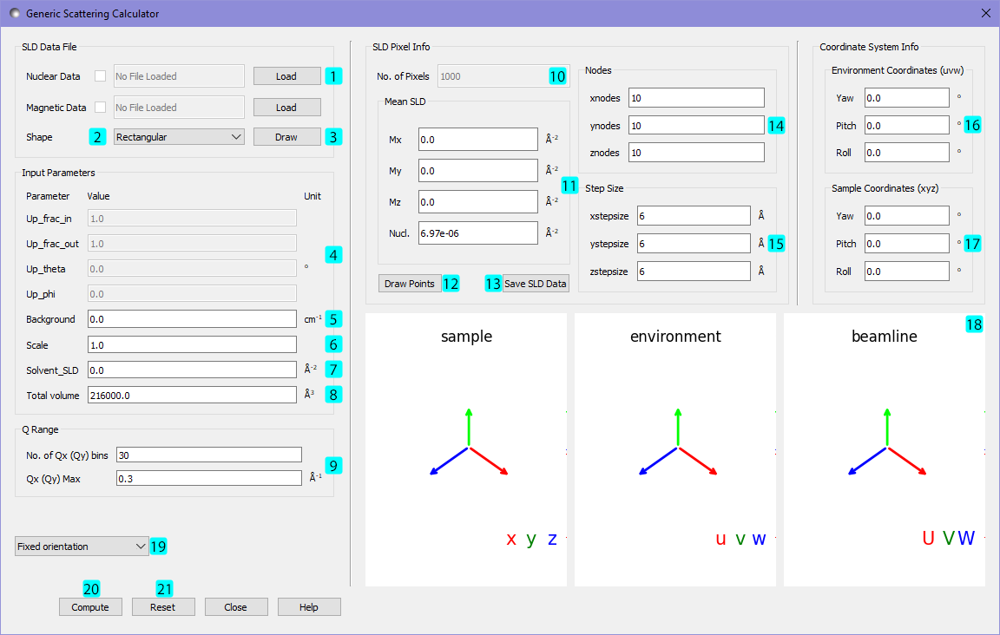

.. sas_calculator_help.rst

.. This is a port of the original SasView html help file to ReSTructured text
.. by S King, ISIS, during SasView CodeCamp-III in Feb 2015.

.. _SANS_Calculator_Tool:

Generic SANS Calculator Tool
============================

Description
-----------

This tool attempts to simulate the SANS expected from a specified
shape/structure or scattering length density profile. The tool can
handle both nuclear and magnetic contributions to the scattering.

Theory
------

A SANS sample can be described (for the purposes of this calculator) in two
different ways, either by rectangular pixels (grid type data), or 
by finite elements (element type data), which can be many shapes, such as 
tetrahedra, cubes or hexahedra.

The scattering length density (SLD) of each pixel or element, where the SLD is
uniform, is a combination of the nuclear and magnetic SLDs and depends on the spin
states of the neutrons as described in the Magnetic Scattering section.

Grid Type Data
^^^^^^^^^^^^^^

In general, a particle with a volume $V$ can be described by an ensemble
containing $N$ 3-dimensional rectangular pixels where each pixel is much
smaller than $V$.

Assuming that all the pixel sizes are the same, the elastic scattering
intensity from the particle is defined as

.. math::

    I(\mathbf{Q}) = \frac{1}{V}\left\lvert\sum_j^N v_j\beta_j\exp(i\mathbf{Q}\cdot\mathbf{r_j})\right\rvert^2\tag{Eq. 1}

where $\beta_j$ and $\mathbf{r_j}$ are the scattering length density and
the position of the $j^\text{th}$ pixel respectively.

The total volume $V$ is equal to

.. math::

    V = \sum_j^N v_j

for $\beta_j \ne 0$ where $v_j$ is the volume of the $j^\text{th}$
pixel or the $j^\text{th}$ natural atomic volume. For atomic structures 
$v_j \beta_j \equiv b_j$ is the scattering length of the $j^\text{th}$ atom and the natural atomic
volume is given by:

   $\frac{\text{atomic mass}}{\text{natural molar density}\times\text{Avogadro number}}$

$V$ can be corrected by users (input parameter *Total volume*). This correction
is useful especially for an atomic structure (such as taken from a PDB file)
to get the right normalization.

*NOTE!* $\beta_j$ *displayed in the GUI may be incorrect (input parameter* solvent_SLD *)
but this will not affect the scattering computation if the
correction of the total volume V is made.*

Element Type Data
^^^^^^^^^^^^^^^^^

The simulation box can be described by a collection of finite elements, forming a
mesh. Each element occupying space $V_j$ has an associated scattering length density 
($\beta_j$) and the elastic scattering intensity is calculated as

.. math::

    I(\mathbf{Q}) = \frac{1}{V}\left\lvert\sum_j^N \beta_j\iiint\limits_{V_j}\exp(i\mathbf{Q}\cdot\mathbf{r_j})\text{d}V\right\rvert^2\tag{Eq. 2}

That is to say a full fourier transform is calculated over each element - allowing
regions of space with little variation in $\beta$ to have larger finite elements,
and other regions to have much smaller finite elements, and hence more detail.

In Sasview this fourier transform is calculated using the divergence theorem, in an
algorithm heavily based on that given by Maranville [#MARANVILLE1]_

Coordinate Systems
^^^^^^^^^^^^^^^^^^

The general scattering calculator deals in 3 different coordinate systems:

.. figure:: gen_coords.png

The {U,V,W} coordinates are the beamline coordinates - they define the coordinate system of the target
and source. The Qx and Qy axes align with the U and V axes, and the W axis points back from the target towards the source.

The {u,v,w} coordinates are the environment coordinates - they define the coordinate system of the sample environment - such
as the cryostat and the neutron polarisation vector (p)

The {x,y,z} coordinates are the sample coordinates - they define the position vectors and magnetisation vectors of
individual pixels or elements in the sample.

Within the generic scattering calculator all three of these coordinate systems are initially aligned. By altering the
yaw, pitch and roll values their relative rotations can be set. The environment is rotated relative to the beamline,
and the sample is rotated relative to the environment. The rotations are carried out in the order yaw, pitch then roll,
intrinsically. For example when rotating the environment coordinates relative to the beamline:
- the {u,v,w} and {U,V,W} coordinates are initially aligned
- a rotation of angle yaw about the V axis takes {U,V,W} -> {U',V',W'}
- a rotation of angle pitch about the U' axis takes {U',V',W'} -> {U'',V'',W''}
- a rotation of angle roll about the W'' axis takes {U'',V'',W''} -> {u,v,w}

The polarisation vector defines the direction of the neutron polarisation. It can be set in the environment coordinates
with the values up_theta and up_phi, where theta is the polar angle from the w axis to the uv plane, and phi is
the azimuthal angle directed anticlockwise in the uv plane from the positive u axis.
   
Magnetic Scattering
^^^^^^^^^^^^^^^^^^^

For information about polarised and magnetic scattering, see
the :ref:`magnetism` documentation.

.. ZZZZZZZZZZZZZZZZZZZZZZZZZZZZZZZZZZZZZZZZZZZZZZZZZZZZZZZZZZZZZZZZZZZZZZZZZZZZ

Using The Tool
--------------

   ..

   1) Load .sld, .pdb, .omf or .vtk datafile. Further description of each file type is below.
      The program can load in up to two files - one to describe the nuclear SLDs and one to
      describe the magnetic SLDs. The checkboxes can be used to enable or disable a loaded file.
      If both files are enabled they must describe the same pixels/elements in real space - this is
      verified by the program.
   2) Select default shape of sample.
   3) Draw magnetisation with arrows (not recommended for a large number of
      pixels/elements).
   4) Variables describing the instrument setup for polarisation. These options are only enabled
      when magnetic SLDs are non-zero - because otherwise they have no effect.
      * up_frac_in describes the fraction of neutrons polarised up (+/total) before the sample
      * up_frac_out describes the fraction of neutrons polarised up (+/total) after the analyser
      * up_theta is the polar angle of the polarisation in degrees from z axis to x-y plane
      * up_phi is the azimuthal angle of the polarisation in degrees around the x-y plane
   5) The background intensity of the detector.
   6) A relative scaling factor for the output intensity.
   7) The SLD of the solvent for the sample.
   8) The default volume calculated from the pixel info
      (or natural density of pdb file).
   9) Set the resolution of the scattering pattern.
      * No. of Qx (Qy) bins is the number of 'pixels' (bins) in Q space on each axis
      * Qx (Qy) Max is the maximum value of Q to calculate on each axis
      In some circumstances these textboxes will be highlighted orange, a warning that with
      the values chosen numerical artifacts may appear due to the Nyquist criterion, or simulation box
      size.
   10) The number of pixels/elements under consideration.
   11) The mean SLD, both nuclear SLD and all 3 components of the magnetic SLD. If a nuclear/magnetic file
       is enabled then the nuclear/magnetic SLD textboxes are read only. If no file is enabled then the
       respective textboxes can be edited - and the value supplied is taken to be a constant across all
       pixels/elements.
   12) Draw the pixels/atoms without magnetisation arrows.
   13) Save the current data into a .sld file. This combines the currently enabled files with any values altered
       in the GUI, and saves it to a file for later reuse. This functionality only works with grid type data.
   14) For grid type data these values specify the number of pixels in the x,y and z directions respectively.
   15) For grid type data these values specify the spacing between pixels in the x,y and z directions.
   16) These variables define the yaw, pitch and roll rotation of the environment coordinates relative to the
       beamline coordinates (see theory section above).
   17) These variables define the yaw, pitch and roll rotation of the sample coordinates relative to the
       environment coordinates (see theory section above).
   18) This 3D display shows the relative orientation of the three different coordinate systems, with a grey square
       representing the beamline target. When magnetic SLDs are present a polarisation vector is also shown in
       the environment coordinates. The display can be dragged around with the mouse, and the mousewheel used to
       zoom in and out.
   19) Whether to compute the full 2D scattering pattern, or calculate the average intensity at magnitude Q. Note
       that the ability to directly produce a 1D average plot with this tool is only available for grid type data 
       with no magnetic SLD.
   20) Compute the scattering pattern.
   21) Reset GUI to initial state.
   
   
As an example the default starting values with no files enabled (as shown) specify a rectangular grid of 10x10x10 pixels, with 
each pixel being $6\times6\times6\require{unicode}\unicode{x212B}$. Each pixel has a constant nuclear SLD of $6.97\times10^{-6}\require{unicode}\unicode{x212B}^{-2}$
and no magnetic SLD.

.. After computation the result will appear in the *Theory* box in the SasView *Data Explorer* panel.

*Up_frac_in* and *Up_frac_out* are the ratio

   $\frac{\text{spin up}}{\text{spin up} + \text{spin down}}$

of neutrons before the sample and at the analyzer, respectively.

*NOTE 1. The values of Up_frac_in and Up_frac_out must be in the range
0.0 to 1.0. Both values are 0.5 for unpolarized neutrons.*

*NOTE 2. This computation is totally based on the pixel (or atomic) data fixed
in xyz coordinates. No angular orientational averaging is considered.*

*NOTE 3. For the nuclear scattering length density, only the real component
is taken into account.*

*NOTE 4. When 1D averaging is enabled (Eq. 1) above is replaced by the Debye equation
(Eq. 3).*

.. math::

   I(\left\lvert\mathbf{Q}\right\rvert) = \frac{1}{V}\sum_j^N v_j\beta_j \sum_k^N v_k\beta_k 
   \frac{\sin\left(\left\lvert\mathbf{Q}\right\rvert\left\lvert\mathbf{r_j}-\mathbf{r_k}\right\rvert\right)}
   {\left\lvert\mathbf{Q}\right\rvert\left\lvert\mathbf{r_j}-\mathbf{r_k}\right\rvert}\tag{Eq. 3}

.. ZZZZZZZZZZZZZZZZZZZZZZZZZZZZZZZZZZZZZZZZZZZZZZZZZZZZZZZZZZZZZZZZZZZZZZZZZZZZ

File Types
----------

SLD Files
^^^^^^^^^

An SLD file is a text file format capable of storing grid type data with both nuclear and magnetic
SLDs. The file format for an SLD file is as follows:

   * One line of header information - this is unused by the program and can contain any information
   * N lines describing N pixels, of 4, 6, 7 or 8 columns, separated by whitespace. All lines must 
      have the same number of columns, and the data in each column must be castable to a float.
       * 4 columns describe *x position*, *y position*, *z position*, *nuclear SLD*
       * 6 columns describe *x position*, *y position*, *z position*, *magnetic SLD (x, y, z components)*
       * 7 columns describe *x position*, *y position*, *z position*, *nuclear SLD*, *magnetic SLD (x, y, z components)*
       * 8 columns describe *x position*, *y position*, *z position*, *nuclear SLD*, *magnetic SLD (x, y, z components)*, *pixel volume*

The file specification does not guarantee that the pixels form a rectangular grid - however this is required for
the output of the scattering calculator to be correct. The program does NOT check this.

PDB Files
^^^^^^^^^

A PDB file is a text file format which can store atomic structure data. The specification is given
`here <https://www.wwpdb.org/documentation/file-format>`__. This format is read as grid type data and can be used
to create nuclear SLDs only.

Note that Sasview only reads ATOM and CONECT records from these files. ATOM records are used to create
suitable nuclear SLDs and pixel volumes using data from the `periodictable <https://pypi.org/project/periodictable/>`__ 
python package. CONECT records are only used when drawing the structure.

OMF Files
^^^^^^^^^

An OMF file is a file format capable of storing spatial fields for grid type data. The specification can be found
`here <https://math.nist.gov/oommf/doc/userguide20a2/userguide/Vector_Field_File_Format_OV.html>`__. While the OVF 2.0
format could technically store both nuclear and magnetic sld data, Sasview currently reads all OMF files as if they were 
OVF 1.0 or lower, and as such OMF files can only be used to read in data to create magnetic SLDs. Unlike SLD files, OMF
files are expected to store the magnetisation vector $\mathbf{M}$, not the magentic SLD. 

While there is no explicit check within the program only OMF files with meshtype: rectangular can be read into the program 
correctly. Additionally the data must be stored as 'Text' (ASCII format), Sasview cannot read in binary data.

VTK Files
^^^^^^^^^

The VTK file format is a very broad set of file formats, specifically Sasview currently reads in "legacy" .vtk files,
up to version 3.0.
The file specification is available `here <https://vtk.org/wp-content/uploads/2015/04/file-formats.pdf>`__. Currently
Sasview only reads in the 'unstructured grid' dataset format, and while any file of this form can be loaded, only
files in which all cells are of the same type (type=10 (tetrahedron), 11 (voxel), 12 (hexahedron)) can be used to
compute scattering patterns. While this may seem restrictive it merely requires that every element has the same number
of faces, and every face the same number of vertices.

VTK files are treated as element type data - and can contain magnetic and/or nuclear SLDs. The nuclear SLD is identified
with a set of SCALAR data with one component. The magnetic SLD is identified with a set of SCALAR data with three
components or as a set of VECTOR data. If the data is provided to the points of the mesh and not the cells, a weighted
average is taken to find an estimate for the SLD at the centre of each element. This weighted average is given by:

.. math::

   \bar{\beta} = \frac{\sum\limits_j^n \beta_j r_j^{\prime -2}}{\sum\limits_j^n r_j^{\prime -2}}

Where $\bar{\beta}$ is the estimated SLD for an element and $\beta_j$, $r'_j$ are the SLDs and distances from the
centre of the element of each of the n vertices of the element respectively. $r'_j$ is taken as:

.. math::

   r^\prime_j = \left\lvert \mathbf{r_j} - \frac{1}{n}\sum_k^n \mathbf{r_k} \right\rvert

where $\mathbf{r_k}$ are the position vectors of the n vertices of the element.

Scripting
---------

For more advanced uses the GUI version of the scattering calculator may not suffice. For example the orientational
average of a magnetic structure, or specific rocking curves. In these cases it maybe desirable to instead use a 
python script to access the functionality of the calculator. For full details of the scripting interface reference
can be made to the developer documentation: :py:meth:`sas.sascalc.calculator.sas_gen`.
Provided here is a short introduction to the most useful elements of this interface.

To begin a python script we must import the sas_gen module of sasview. If python does not know the location of this module
it can be imported as follows::

      import sys
      sys.path.append("filepath to sasview/src")
      from sas.sascalc.calculator import sas_gen

If python does know the location of the sasview installation only the final line is necessary.

The `sas_gen` module contains several useful classes for reading and processing data. The most important of these are:

 - `GenSAS`: This class provides the actual interface to the calculation of scattering patterns. It stores all the required
      data and paramters, and has methods which can return scattering intensities. I will be referred to hereafter also
      as 'the model', since it is the overarching object which models the scattering.
 - `MagSLD`: This class stores all the data associated with a sample, such as scattering length densities. An instance of this class
      is provided to the model to set the sample data.
 - `OMFData`: This class stores sample data from OMF files. It must be converted via an `OMF2SLD` object into a MagSLD object before
      it can be used by the model.
 - `VTKReader`: This class reads in legacy VTK files and returns a MagSLD object with the associated data.
 - `PDBReader`: This class reads in PDB files and returns a MagSLD object with the associated data.
 - `SLDReader`: This class reads in SLD files and returns a MagSLD object with the associated data.
 - `OMFReader`: This class reads in OMF files and returns a OMFData object with the associated data.

The general stages in a script are:

1) Create a `MagSLD` object storing the sample data, either programatically or by loading in a file.
2) Create a `GenSAS` model, load in the data, and set the parameters along with any relevent information
   about the coordinate systems used.
3) Generate the scattering intensity data from the model and display/process/save it.

1) Data creation
^^^^^^^^^^^^^^^^

Loading data from vtk, pdb or sld files is easy::

      vtkloader = sas_gen.VTKReader()
      vtkData = vtkloader.read("filepath to vtk file") # a MagSLD object

::

      pdbloader = sas_gen.PDBReader()
      pdbData = pdbloader.read("filepath to pdb file") # a MagSLD object

::

      sldloader = sas_gen.SLDReader()
      sldData = sldloader.read("filepath to sld file") # a MagSLD object

Loading data from OMF files requires an extra conversion step::

      omfloader = sas_gen.OMFReader()
      omfIntermediateData = omfloader.read("filepath to omf file") # an OMFData object
      omfConverter = sas_gen.OMF2SLD()
      omfConverter.set_data(omfIntermediateData)
      omfData = OMFConverter.get_output() # a MagSLD object

Alternatively a `MagSLD` object can be directly created with custom data, which may have been generated programatically.
The `MagSLD` obejct can be created with the following constructor::

      def __init__(self, pos_x, pos_y, pos_z, sld_n=None, sld_mx=None, sld_my=None, sld_mz=None, vol_pix=None):

The arguments are all 1D numpy arrays. For grid type data these should all be of the same length, or left as None. While
element type data can be programatically generated and stored in a `MagSLD` object it is significantly more complicated
and the details are not given here. The arguments are respectively:

 - The x, y and z coordinates of the realspace positions of the pixels
 - The nuclear SLD
 - The x, y and z components of the magnetic SLD
 - The volume of each pixel. Note that grid type data is expected to be on a regular grid - so if vol_pix is None the
   volumes are all taken to be the same.

The following code recreates the default data of the scattering calculator GUI, a rectangular grid of 10x10x10 pixels, with 
each pixel being $6\times6\times6\require{unicode}\unicode{x212B}$. Each pixel has a constant nuclear SLD of 
$6.97\times10^{-6}\require{unicode}\unicode{x212B}^{-2}$ and no magnetic SLD::

      import numpy as np
      STEPSIZE=6
      NODES=10
      points = np.linspace(0, STEPSIZE*NODES, NODES, endpoint=False)
      pos_x, pos_y, pos_z = np.meshgrid(points, points, points)
      pos_x = pos_x.flatten()
      pos_y = pos_y.flatten()
      pos_z = pos_z.flatten()
      data = sas_gen.MagSLD(pos_x, pos_y, pos_z, np.full_like(pos_x, 6.97e-06))

2) Model creation
^^^^^^^^^^^^^^^^^

Once we have created our data we need to create a `GenSAS` model to carry out the computation. This is very easy.
We can simply create an instance of the `GenSAS` class and load in our `MagSLD` object::

      model = sas_gen.GenSAS()
      model.set_sld_data(data)

We can also set a number of parameters stored in a dictionary as follows::

      model.params["Up_theta"] = 90
      model.params["Up_phi"] = 45
      ...

The parameters available to be set correspond exactly to options in the GUI and are (with their defaults):

   - `"scale"` = 1.0
   - `"background"` = 0.0
   - `"solvent_SLD"` = 0.0
   - `"total_volume"` = 1.0 (but recalculated when data loaded)
   - `"Up_frac_in"` = 1.0
   - `"Up_frac_out"` = 1.0
   - `"Up_theta"` = 0.0
   - `"Up_phi"` = 0.0

The meanings are identical to those given above in the GUI description, although the following should be noted:

 - The `total_volume` parameter will be reset to a calculated value in the `GenSAS.set_sld_data()` method
   described above. If `GenSAS.set_sld_data()` is re-called, and a volume correction is needed then the 
   `total_volume` parameter must be reset.
 - `Up_theta` and `Up_phi` remain in degrees as in the GUI - the conversion to radians is handled within the model.

The rotations between different coordinate systems can also be set using the `GenSAS.set_rotations()` method which takes
optional arguments uvw_to_UVW and xyz_to_UVW, which are the rotations between the xyz, uvw, and UVW coordinates as given
above. The rotation matrices are given for the COMPONENTS of the vectors - that is xyz_to_UVW transforms the components 
of a vector from the xyz to UVW frame. This is the same rotation that transforms the basis vectors from UVW to xyz. The
rotations are given as instances of `scipy.spatial.transform.Rotation`, and default to the identity. For example if we
know the rotation of the sample coordinates as (intrinsic ZYZ convention) euler angles::

      from scipy.spatial.transform import Rotation
      import math
      theta = math.pi/2.0
      phi = math.pi/2.0
      chi = 0.0
      r = Rotation.from_euler("ZYZ", [theta, phi, chi])
      model.set_rotations(xyz_to_UVW=r)

3) Intensity calculation
^^^^^^^^^^^^^^^^^^^^^^^^

As in the GUI two different types of calculation can be carried out. A full 2D scattering pattern can be calculated
in the UV plane with $Q_x$ along the U axis and $Q_y$ along the V axis, or a 1D Debye average can be calculated. Unlike
in the GUI, while scripting we have precise control over which points are evaluated.

In order to calculate the scattering intensity at a set of $\mathbf{Q}$ values (Q_x1, Q_y1), (Q_x2, Q_y2), ...
we create two lists `Qx = [Q_x1, Q_x2, ...]` and `Qy = [Q_y1, Q_y2, ...]` and pass these into `model.runXY([Qx, Qy])`.
Note that we are passing in the two lists as a list. We should pass in a list of length two, where each element is a list
of the same length giving Qx and Qy values. For example to evaluate the scattering intensity on a grid::

      x_vals = np.linspace(-5, 5, 10)
      y_vals = np.linspace(-5, 5, 10)
      xs, ys = np.meshgrid(x_vals, y_vals)
      xs = xs.flatten()
      ys = ys.flatten()
      output = model.runXY([xs, ys])

The output will be the scattering intensities as an array corresponding to the given Q coordinates.

If we have grid type data with no magnetic component we can calculate the Debye full average at any magnitude Q.
Similarly we pass these magnitudes into the model as a list of lists. The first element should be a list of magnitudes,
and the second element an empty list::

      mag_vals = np.linspace(0, 5, 10)
      output = model.run([mag_vals, []])

Note the difference between the following two code snippets::

      Qs = np.linspace(0, 5, 10)
      output = model.runXY([Qs, np.zeros_like(Qs)])

::

      Qs = np.linspace(0, 5, 10)
      output = model.runXY([Qs, []])

The first calculates the values of the scattering intensity along the positive Qx axis. The second calculates
the orientational average intensity at various magnitudes of Q.

Examples
--------

.. toctree::
   :maxdepth: 1

   Example 1: The Default Data <gsc_ex_default_data>

   Example 2: A Magnetic Cylinder <gsc_ex_magnetic_cylinder>

References
----------

    .. [#MARANVILLE1] An implementation of an efficient direct Fourier transform of polygonal areas and volumes
         (2021) `arXiv:2104.08309 <https://arxiv.org/abs/2104.08309>`__

.. ZZZZZZZZZZZZZZZZZZZZZZZZZZZZZZZZZZZZZZZZZZZZZZZZZZZZZZZZZZZZZZZZZZZZZZZZZZZZZ

*Document History*

| 2015-05-01 Steve King 
| 2021-09-14 Robert Bourne
