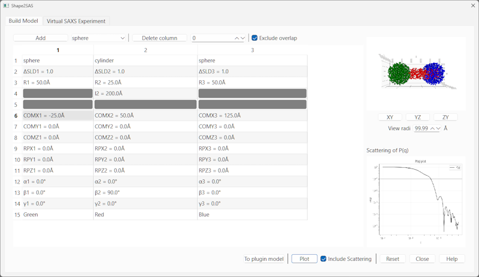
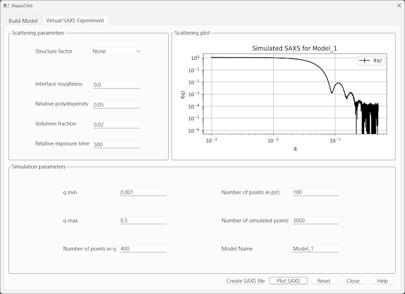

.. shape_2_sas_help.rst

.. by J Krzywon, NIST, May 2025

.. _Shape2SAS_Tool:

Shape2SAS
=========

Description
-----------

This tool allows the user to build particles from a series of predefined shapes. By allowing particles to be placed in
any location, or orientation relative to an origin, many unique structures can be constructed. Once a structure is
created, the user can generate a theoretical data set that can be analysed, or an empirical fitting model can be
generated to compare the structure to real data.

.. note:: The particles are constructed from a series of randomly distributed points within the defined shape.
    Because of this randomness, creating the same particle two different times may result in subtle differences between
    scattering curves and slight differences in the resulting empirical models.

The base shapes available to the user include spheres, cylinders, ellipsoids, elliptical cylinders, disks, cubes, cuboids,
hollow spheres, hollow cubes, and cylindrical rings. Each of the particles can be individually modified in all dimensions,
can be moved to any point in space, and rotated about any point in space. The scattering length density, relative to the
medium the particle is in, can also be defined. If the particle is in air, this should be the scattering length density
of the particle material.

Using the Tool
--------------

When the tool is first selected from the menu option, the 'Build Model' tab will open. The user can select a shape and
'Add' it to the table in the center of the window. The first row of the table is the particle shape, the second row is
the scattering length density relative to the solvent, the next three rows are particle dimensions which vary between
shapes, the sixth through eighth rows are to position the particle in space, the ninth through eleventh rows define
the center of rotation, the 12th through 15th rows define the angles of rotation about the center of rotation and the
last row defines the particle color.

The rotation of particles requires further discussion. As mentioned, each particle can be rotated separately from all
other particles, but the center of rotation does not need to be the center of the particle, or within the particle volume
at all. The RP values define the center of particle rotation. When the alpha, beta, and gamma angles are changed, the
individual particle is rotated about the center of rotation. If the center of rotation is the particle centroid, this will
result in a rotation with no translation. If the center or rotation is outside the particle, both a rotation and
translation of the particle will occur.

Once a series of shapes is defined, the 3D rendering and predicted SAS scattering can be calculated by clicking Plot.
The 'Include Scattering' checkbox must be selected for the SAS data calculation. If the resulting image does not look
as expected, modify the shape table and rerun the calculation until everything is as desired. If two particles overlap in
space, by default, the SLD for the particle first generated will be used in the calculation and any subsequent particles
in that same volume will be ignored. If the 'Exclude overlap' option is unselected, the average SLD within the overlap volume
will be calculated and used for the scattering calculations.

Parameter list for each shape particle:

+-------------+------------------+------------------------------------------------------------------------------------------------------+
| Row         | Parameter        | Description                                                                                          |
+=============+==================+======================================================================================================+
| 1           | Particle name    | The shape selected from the predefined shapes in the combobox.                                       |
+-------------+------------------+------------------------------------------------------------------------------------------------------+
| 2           | ΔSLD             | The SLD of the particle relative to the medium surrounding it. Defaults to 1.0                       |
+-------------+------------------+------------------------------------------------------------------------------------------------------+
| 3, 4, 5     | Size Definitions | The sizes for each major axis of the particle, in Å. The inputs will vary based on the shape.        |
+-------------+------------------+------------------------------------------------------------------------------------------------------+
| 6, 7, 8     | COMX, COMY, COMZ | The particle centroid relative to the coordinate origin, in Å.                                       |
+-------------+------------------+------------------------------------------------------------------------------------------------------+
| 9, 10, 11   | RPX, RPY, RPZ    | The center of rotation, in cartesian space, about which this particle will rotate, in Å.             |
+-------------+------------------+------------------------------------------------------------------------------------------------------+
| 12, 13, 14  | α, β, γ          | The rotation angle from the point of rotation, about each axis, in degrees.                          |
+-------------+------------------+------------------------------------------------------------------------------------------------------+
| 15          | Color            | The color of the points displayed in the particle viewer window. Red, Green, or Blue.                |
+-------------+------------------+------------------------------------------------------------------------------------------------------+

Once the particle is of the expected form, a few more options are available. The first is the option to generate an
empirical model based on the scattering pattern using the 'To plugin model' button. This will open a window where you
you can select the parameters included in the model and then generate the model.
The second option is to run a 'Virtual SAXS Experiment' in the second tab of the window.
In the second tab, set the Q range, the number of Q points, the number of P(r) points, the number of simulated points
within the 3D volume, and any structure factor contributions that may arise. The resulting theoretical curve can be sent
to the data explorer where the data set may be treated as any other data set loaded from a file.

References
----------

This tool has been adapted from the tool available at https://somo.chem.utk.edu/shape2sas/. For more information on the
theoretical basis and calculations performed, please see the paper by Larsen, et. al. https://scripts.iucr.org/cgi-bin/paper?jl5064.

.. note:: This help document was last changed by Jeff Krzywon, 23May2025