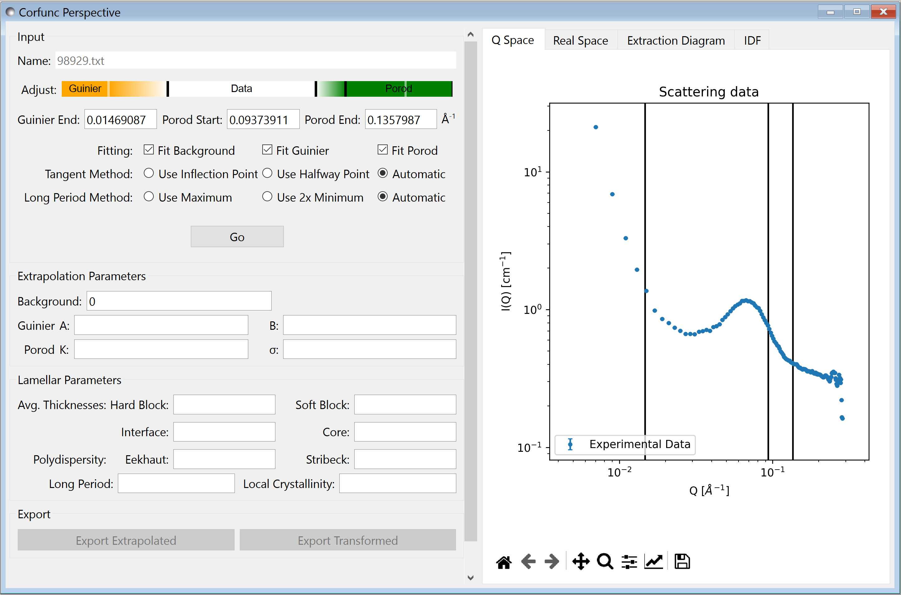
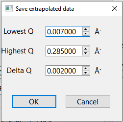

.. _corfunc-how-to:

How To Use Corfunc
==================

Running a Calculation
---------------------

Upon sending data for correlation function analysis, it will be plotted (minus
the background value), along with a bar indicating the upper end of the
low-Q range (used for Guinier back-extrapolation) and 2 bars indicating
the range to be used for Porod forward-extrapolation.

This information is also shown on the orange and green interactive slider on the left.
You can drag bars on this slider (not the plot), or enter values manually.

Once the Q ranges have been set, click the "Go" button to run the analysis.
This will run through the process described in the technical documentation using the
default options shown above the button.

The parameters used along the way can be overriden by changing them in the appropriate text boxes,
and whether or not they are recalculated is controlled by the check boxes.

Options
-------

In addition to the checkboxes that control whether parts of the calculation are executed,
there are options for choosing how the lamellar parameters are extracted.
These are intended to give flexibility to users and allow for manual control in certain edge
cases, or where there are small errors in the transformed data.

Automatic selection is the most robust choice, this will choose the leftmost option
as long as it is feasible.

The extra options are as follows:

1) There is an option to choose how the tangent slope used for calculating lamellar parameters
such as `hard block` are calculated. Usually this is done by finding the inflection point of the
curve. However, in some datasets it is more appropriate to use the point half way between the minimum
and maximum values of :math:`\Gamma_1`;

2) The second option chooses whether to use the first minimum or subsequent maximum to infer the periodicity.
The standard option is to use the maximum, but in some cases, such as where the period is
long compared to experimental data,
it might be necessary to use twice the minimum as a proxy.

The automatic selection should be appropriate for general use.

Output
------

When the calculation is complete, the extrapolated curve will be shown on the Q-space plot.

 .. figure:: tutorial_after_go.png
    :align: center

The `Real Space` tab shows plots of :math:`\Gamma_1` and :math:`\Gamma_3`

 .. figure:: tutorial_real_space.png
    :align: center

To check the extrapolation parameters, a diagram shows the geometric construction used to
derive them in the `Extraction Diagram` tab.

 .. figure:: tutorial_extraction.png
    :align: center

Finally, you can see the interface distribution function in the `IDF` tab

 .. figure:: tutorial_idf.png
    :align: center

The export buttons allow you to produce CSV files containing either the extrapolated
Q-space data, or the transformed data.

The structure of the transformed data file is shown below (note that as this is a 4 column .csv file,
SasView will interpret this as a :math:`I(q)` vs :math:`q` curve if you try to load it from the main
SasView window).

 .. figure:: tutorial_export_data.png
    :align: center

.. note:: If *Export Extrapolated* is selected a dialog box will appear in which the
          bounds and binning of the extrapolated data can be selected. This is pre-populated
          with the values for the experimental data; i.e. using these values would *not*
          actually include any extrapolated data!

