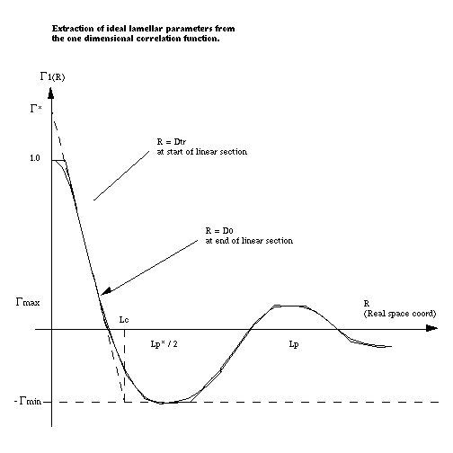

.. _corfunc-technical:

Corfunc Technical Documentation
===============================

In Brief
--------

.. figure:: tutorial_data_loaded.png
   :align: center

The correlation function analysis is performed in **3 steps**.

First, the scattering curve is **extrapolated** to :math:`Q = 0` (Guinier) and toward
:math:`Q = \infty` (Porod), the details of the extrapolation is controlled by
the parameters `Guinier End`, `Porod Start` and `Porod End`, which
are settable by entering text, or by using the `Adjust` slider.
There is a smooth transition from the data to the extrapolation, start and end refer to
the region over which this occurs (see below).
Parameters for the extrapolation can manually entered in `Extrapolation Parameters` and
SasView can be told whether to recalcuate the parameters using the `Fit Background`,
`Fit Guinier` and `Fit Porod` checkboxes.

Secondly, the data is **transformed** to obtain the projected correlation functions.

Finally, the transformed data is **interpreted** in terms of an ideal lamellar morphology

Extrapolation
-------------

Small Q
.......

The scattering data is extrapolated to :math:`q = 0` by fitting a Guinier function, defined as

.. math::
    I(q) = e^{A + Bq^2}

to data up to :math:`q` value specified by `Guinier Start`.

This a Gaussian centred at :math:`q=0` (we only ever see the positive half).
The natural logarithm of the parameter :math:`A` is a constant of proportionality
equal to the scattering intensity at :math:`q=0`.
The parameter :math:`B` describes the width of the function and is related to the
size of the scattering object. For example, in systems of dispersed spherical
particles it is related to the radius of gyration :math:`R_g` by :math:`B = R_g^2 / 3`.

*Note:* The Guinier model makes assumptions that do not hold for all systems
and so this approximation might not always be accurate.
If errors from the Guinier model fit occur, they will manifest as a constant offset in the correlation function,
because low :math:`q` values correspond to a long periodicity in :math:`x`.
Empirically, however, inaccuracies in the Guinier region have a very low impact on the
final analysis, and only some of the lamellar parameters will be affected at all.

Large Q
.......

The data is extrapolated towards :math:`q = \infty` by fitting a Porod model, to the region
between `Porod Start` and `Porod End`. This model is defined by

.. math::
    I(q) = K q^{-4} e^{-q^2\sigma^2} + I_{B}

Where :math:`I_B` is the background intensity, :math:`K` is the Porod constant, and :math:`\sigma` is a
parameter which, in a two phase system, describes the sharpness of the scattering length density
profile at the interface between phases.

This model comprises three components, a constant background intensity, the standard Porod law, so

.. math::
    I(q) - I_B \propto q^{-4}

and a contribution which is attibutable to the sharpness of the boundaries between regions. so

.. math::
    I(q) - I_B \propto e^{-q^2\sigma^2}

SasView will use this formula to extrapolate to very large :math:`q` (100
times the maximum data value). This ensures that the transform used in the
next stage does not contain artefacts (i.e. from treating secular data as periodic)

Merging
.......

In the final step before transformation, the experimental and model data are merged together.
For the Guinier model, this happens on the region between the start of the experimental data and
the value specified by `Guinier End`.
For the Porod model, the merging happens between `Porod Start` and `Porod End`.

+----------------+-------------------+-------------------+
| From           | To                | Data              |
+================+===================+===================+
|| 0             || Start of data    || Guinier Model    |
|| Start of data || *Guinier End*    || Guinier/Data mix |
|| *Guinier End* || *Porod Start*    || Data             |
|| *Porod Start* || *Porod End*      || Data/Porod mix   |
|| *Porod End*   || 100x end of data || Porod model      |
+----------------+-------------------+-------------------+

A smooth transition is achieved with sigmoid weighting defined as follows.
We start with two input functions, :math:`f(x)` on the 'left' and :math:`g(x)` on the 'right', and these
are to be smoothed over the range :math:`[a, b]`.
We use :math:`y(x)` to represent the transition over :math:`[a,b]`. :math:`y(x)` is given by the following convex combination

.. math::
    y(x) = h(x) g(x) + (1-h(x))f(x)

where :math:`h(x)` is a weighting between the two, with a value of zero at :math:`a` and one at :math:`b`, defined as

.. math::
    h(x) = \frac{1}{1 + \frac{(x-b)^2}{(x-a)^2}}

Transformation
--------------

Corfunc uses a discrete cosine transform on the extrapolated data in order to calculate the
1D correlation function as:

.. math::
    \Gamma _{1}(x) = \frac{1}{Q^{*}} \int_{0}^{\infty }I(q) q^{2} cos(qx) dq

where Q\ :sup:`*` is the Scattering (also called Porod) Invariant.

The following algorithm is applied:

.. math::
    \Gamma(x_k) = 2 \sum_{n=0}^{N-1} x_n \cos{\left[ \frac{\pi}{N}
    \left(n + \frac{1}{2} \right) k \right] } \text{ for } k = 0, 1, \ldots,
    N-1, N

The 3D correlation function is calculated as:

.. math::
    \Gamma _{3}(x) = \frac{1}{Q^{*}} \int_{0}^{\infty}I(q) q^{2}
    \frac{sin(qx)}{qx} dq

.. note:: It is always advisable to inspect Γ\ :sub:`1`\ (x) and Γ\ :sub:`3`\ (x)
    for artefacts arising from the extrapolation and transformation processes:

	- do they tend to zero as x tends to :math:`\infty`?
	- do they smoothly curve onto the ordinate at x = 0? (if not check the value
	  of :math:`\sigma` is sensible)
	- are there ripples at x values corresponding to 2 :math:`\pi` over the two
	  q values at which the extrapolated and experimental data are merged?
	- are there any artefacts at x values corresponding to 2 :math:`\pi` / q\ :sub:`max` in
	  the experimental data?
	- and lastly, do the significant features/peaks in the correlation functions
	  actually correspond to anticpated spacings in the sample?!!!

Finally, the program calculates the interface distribution function (IDF) g\ :sub:`1`\ (x) as
the discrete cosine transform of:

.. math::
    q^{4} I(q)

The IDF is proportional to the second derivative of Γ\ :sub:`1`\ (x).

Interpretation
--------------

Once the correlation functions have been calculated *SasView* will
try and interpret Γ\ :sub:`1`\ (x) in terms of an ideal lamellar morphology
as shown below.

**It is for the user to decide if this interpretation has any relevance to their system!**

The structural parameters extracted are:

*   Long Period :math:`= L_p`
*   Average Hard Block Thickness :math:`= L_c`
*   Average Core Thickness :math:`= D_0`
*   Average Interface Thickness :math:`= D_{tr}`
*   Eekhaut Polydispersity :math:`= \Gamma_{\text{min}}/\Gamma_{\text{max}}`
*   Stribeck Polydispersity :math:`= \frac{L_c}{(L_c - L_p)\Gamma_{\text{max}}}`
*   Local Crystallinity :math:`= L_c/L_p`

which lead to:

*   Average Soft Block Thickness :math:`= L_p - L_c = L_a`
*   Average Chord Length :math:`= ((1/L_c) + (1/L_a))^{-1}`
*   Average Crystalline Chord Length :math:`= \frac{L_a L_c}{\Phi_{\text{c}} (L_c + L_a)}`
*   Non-Ideality :math:`= \left(\frac{L_p – L_p*}{L_p}\right)^2`
