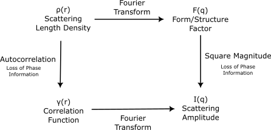

.. _corfunc-theory:

Correlation Function Theory
===========================

Overview
--------

In small angle scattering we measure the tendency for probe particles (neutrons, photons, etc)
to transfer various amounts of momentum to a sample. The momentum is generally inferred from the scattering angle
of probe particles, along with other information about the probe particles (e.g. kinetic energy).
Small angle scattering is assumed to be elastic, which allows the momentum transfer to be directly related to a wavelength, and thus
a spatial distance. The correlation function represents the scattering intensity in terms of this spatial distance,
rather than in terms of momentum transfer.

We can interpret the correlation function in terms of the sample structure by thinking about
pairs of points separated by a given displacement. When, on average over the sample, the pairs of points
have a high scattering length density, then the correlation function has a large value. Similarly,
when the pairs have a low scattering length density, the correlation function is low.
More concretely: the correlation function :math:`\Gamma(\vec{r})` for vector :math:`\vec{r} = (x,y,z)` is proportional to
the pairwise product of scattering length densities for all points separated by the vector :math:`(x,y,z)`
summed over all orientations and locations.

Another way of thinking about the correlation function is as the scattering length
density but with phase information removed. As scattering experiments contain
no phase information, calculating the correlation function
is as close as one can get to calculating the scattering length density from
scattering data without incorporating additional information.

The nature of small angle scattering further limits what spatial information
can be recovered. Whilst in its most general form the correlation
function takes a three dimensional vector input,
small angle scattering measurements are limited to one or two dimensions,
which in turn limits the amount of information about the correlation
function that can be obtained. For this reason, in the correlation function
analysis tool we consider various one dimensional projections of the full
correlation function, labelled :math:`\Gamma_1` and :math:`\Gamma_3` .

The :math:`\Gamma_1` projection looks at changes in a single
direction perpendicular to the beam, with the other directions being averaged.
The direction is typically selected by hand from a 2D measurement prior to analysis.
Theoretically, the correlation function will be fully recoved as long as the system
being looked at is truly one dimensional and properly aligned.
However, one must remember the constraints of a small angle scattering experiment,
we only measure a small range of momentum transfer, and extrapolate the rest,
as such the extrapolation steps must be appropriate for the system.
This is in addition to the usual considerations of resolution and systematic
measurement error.

The :math:`\Gamma_3` projection is motivated by a system of
monodisperse, randomly oriented particles in dilute suspension,
such that there are no spatial correlations between particles.
It is the kind of system described by the Debye equation.
Just as is the case with :math:`\Gamma_1`, as long as one truly
has this kind of system, and with caveats about extrapolation
and experimental constraints, one should be able to fully recover
the correlation function.

Lorentz Correction
------------------

Lorentz corrections are often used in correlation function analysis.
Corfunc uses a Lorentz correction of

.. math::
    I(q) = q^2 I_\text{measured}(q)

In what follows, we assume that appropriate corrections have been made.
:math:`I(q)` here is what would be called :math:`I_1(q)` in :ref:`Stribeck`.

Formal Description
------------------

More formally, the correlation function is a quantity that arises naturally from calculating the square magnitude
of the three dimensional Fourier transform, which is proportional to the scattering amplitude.

.. math::
    \frac{d\sigma}{d\Omega} \propto F(\vec{q}) F^*(\vec{q})

where

.. math::
    F(\vec{q}) = \int \rho(r) e^{i \vec{r}\cdot\vec{q}} \; dr^3

where :math:`dr^3` is the volume element (:math:`dx\;dy\;dz`).

A couple of algebraic steps will bring us to the correlation function: first,
as :math:`\rho` is real, and the conjugate of :math:`e^{ix}` is :math:`e^{-ix}` we
know that the conjugate of :math:`F` is given by

.. math::
    F^*(\vec{q}) = \int \rho(r) e^{-i \vec{r}\cdot\vec{q}}

meaning that, with some renaming of variables (from :math:`r` to :math:`s` and :math:`t`), we have

.. math::
    F(\vec{q}) F^*(\vec{q}) = \left(\int \rho(\vec{t}) e^{i \vec{t}\cdot\vec{q}} \; dt^3\right)\left( \int \rho(\vec{s}) e^{-i \vec{s}\cdot\vec{q}} \; ds^3 \right)

With some rearrangement this becomes

.. math::
    \int\int \rho(\vec{s}) \rho(\vec{t}) e^{i (t-s)\cdot\vec{q}} \; dr^3 \; ds^3

and now letting :math:`\vec{r} = \vec{t} - \vec{s}`
and applying the Fourier translation theorem, we can rewrite the above as
(note this is not the same :math:`\vec{r}` as before, but a new variable):

.. math::
    \int\int \rho(\vec{s}) \rho(\vec{s} + \vec{r}) e^{i \vec{r}\cdot\vec{q}} \; ds^3  \; dr^3

Some final reordering of the integration gives

.. math::
    \int \left[ \int \rho(\vec{s}) \rho(\vec{s} + \vec{r}) \; ds^3 \right] \; e^{i \vec{r}\cdot\vec{q}} \; dr^3

The quantity in square brackets is what is called the correlation function, :math:`\gamma(\vec{r})`, so:

.. math::
    \gamma(\vec{r}) = \int \rho(\vec{s}) \rho(\vec{s} + \vec{r}) \; ds^3

and it is the quantity that is Fourier transformed (with some appropriate scaling)
to get the magnitude of the scattering.

Some useful properties of the Correlation Function
..................................................

As we have mentioned before, the correlation function contains no phase information,
mathematically this is the same as saying (1) that its Fourier transform is purely real,
or (2) that the correlation function is an even function. The consequence of this is
that we can write the Fourier transform of the correlation function using a cosine instead
of a complex exponential.

Demonstrating the evenness of the correlation function is easily done by a change of
the variable of integration from :math:`\vec{s}`
to :math:`\vec{u} = \vec{s} + \vec{r}`.

.. math::
    \gamma(\vec{r}) = \int \rho(\vec{s}) \rho(\vec{s} + \vec{r}) \; ds^3 = \int \rho(\vec{u}-\vec{r}) \rho(\vec{u}) \; du^3 = \gamma(-\vec{r})

and from this we can show that its Fourier transform is real by applying the following
to each dimension in turn (shown here in the 1D case for even :math:`f(x)`).

First, we split the integral into negative and positive :math:`x` parts:

.. math::
    \int_{-\infty}^\infty f(x) e^{i x \xi} dx = \int_{-\infty}^0 f(x) e^{i x \xi} dx + \int_{0}^\infty f(x) e^{i x \xi} dx

Let :math:`u = -x` for the negative part, use the fact that :math:`f(-x)=f(x)` and
recalculate the bounds of integration

.. math::
    = \int_0^\infty f(u) e^{-i u \xi} du + \int_{0}^\infty f(x) e^{i x \xi} dx

Note that :math:`u` only appears within the integral, so we can rename it to :math:`x`
and recombine it with the positive part. We can also multiply the integral by two and
the integrand by two, giving

.. math::
    = 2 \int_0^\infty f(x) \frac{e^{i x \xi} + e^{-i x \xi}}{2} dx

The fractional part of which is the complex definition of cosine.
Applying this definition and using the fact that :math:`f(x)` is even
to restore the original bounds of integration we get

.. math::
    = \int_{-\infty}^{\infty} f(x) cos(x \xi) dx

which shows that the Fourier transform is purely real, reflecting the
fact that there is no phase information (which would be encoded in the imaginary part).

The :math:`\Gamma_1` Projection
...............................

Consider the Fourier transform of the three dimensional correlation function,

.. math::
    \int\int\int \gamma(\vec{r}) e^{i \vec{r} \cdot \vec{q}} \; dx \; dy \; dz

Now let :math:`q_z = q_y = 0`.
The motivation for this is (1) that during small angle scattering :math:`q_z`
is small enough to be neglected, and (2) that we are choosing to measure
in one direction of the :math:`q_x q_y` plane.
We assume, without loss of generality, this to be where :math:`q_y=0`.

This gives us :math:`q \cdot r = x q_x`, and so the transform becomes

.. math::
    I(q) = \int \gamma(\vec{r}) e^{i x q_x} \; dx \; dy \; dz

which we can rewrite as

.. math::
    \int\left( \int\int \gamma(\vec{r}) \; dy\;dz\right) e^{i x q_x} \; dx

the quantity in the brackets is :math:`\Gamma_1(x)`. That is to say

.. math::
    \Gamma_1(x) = \int\int \gamma(\vec{r}) \;dy\;dz

If we now use the fact that :math:`\gamma(\vec{r})` is an even function,
we can use the result above to get

.. math::
    I(q) = \int \Gamma_1(x) \cos(qx) dx

The job of Corfunc is now to invert this. The following operation does the job:

.. math::
    \Gamma_1(x) = \int I(q) \cos(qx) dx

We can check this by showing that

.. math::
    f(y) = \int \left( \int f(x) \cos(qx) dx \right) \cos(qy) dq

Doing this formally requires a fair bit of algebraic legwork,
but there is an informal argument that will get us there.
First note that we can write it as (hand-waving away the convergence issues)

.. math::
    f(y) = \int f(x) \int cos(qx) cos(qy) dq dx

Then the equation corresponds to the identity function if the integral

.. math::
    \int cos(qx) cos(qy) dq

is the delta function. This is the case, because cosine functions form an orthogonal basis.
When :math:`x=y` the integral is non-zero, being an
integral of the always positive :math:`cos^2(qx)`.
Conversely, when :math:`x \neq y` the integral is zero.

The :math:`\Gamma_3` Projection
...............................

The :math:`\Gamma_3` projection is based on spherical symmetry.
It's derivation is essentially that of Debye's formula

We begin with an expression for the scattered intensity as above

.. math::
    I(\vec{q}) = \int_{\mathbb{R}^3} \gamma(\vec{r}) e^{i \vec{r} \cdot \vec{q}} dr^3

now, we want to average this over all angles, i.e. over all :math:`q`-vectors of a given length, and we do so in a coordinate
system relative to :math:`\vec{r}`. This is an unobvious choice of coordinate system, but it simplifies things greatly,
as in such a coordinate system, the dot product :math:`\vec{r}\cdot\vec{q}` becomes :math:`qr \cos\theta`.

For our averaging there is a total of :math:`4\pi` steradians in a sphere, giving a leading factor of :math:`1/4\pi`.

.. math::
    I(\vec{q}) = \frac{1}{4\pi}\int_{\phi=0}^{\phi=2\pi}\int_{\theta=0}^{\theta=\pi}\int_{\vec{r}\in\mathbb{R}} \gamma(\vec{r}) e^{i qr \cos\theta} d r \sin(\theta) d\theta d\phi

The integral is constant with with respect to :math:`\phi`, so drops out as a factor of :math:`2\pi`.

.. math::
    = \frac{1}{2}\int_{\theta=0}^{\theta=\pi}\int_{\vec{r}\in\mathbb{R}^3} \gamma(\vec{r}) e^{i qr \cos\theta} d r \sin(\theta) d\theta

and we can adjust the order of integration, noting that because of our choice of coordinate system, :math:`\gamma(\vec{r})` is
independent of :math:`\theta`.

.. math::
    = \frac{1}{2}\int_{\vec{r}\in\mathbb{R}^3} \gamma(\vec{r}) \int_{\theta=0}^{\theta=\pi} e^{i qr \cos\theta} \sin(\theta) d\theta d r

Now, we can consider the inner integral specifically, firstly by doing a substitution of :math:`u = -\cos\theta`. This
means that :math:`du = \sin\theta d\theta`, the interval :math:`\theta\in[0,\pi]` becomes :math:`u\in[-1, 1]`.

.. math::
    \int_{\theta=0}^{\theta=\pi} e^{i qr \cos\theta} \sin(\theta) d\theta = \int_{u=-1}^{u=1} e^{i q r u} du

which is just an exponential and easily integrated

.. math::
    = \left[ \frac{-i e^{i q r u}}{qr} \right]_{-1}^{1} = \frac{i \left(e^{-i q r} - e^{i q r} \right) }{qr} = 2 \frac{i \sinh(-iqr)}{qr}

which by the relationship between complex trigonometric and hyperbolic functions becomes

.. math::
    = 2 \frac{\sin qr}{qr}

The leading :math:`2` will cancel the leading :math:`1/2` and the value of :math:`I(q)` can be seen to be

.. math::
    I(q) = \int_{r\in\mathbb{R}^3} \gamma(\vec{r}) \frac{\sin qr}{qr} d \vec{r}

Note that this object is not dependent on the angular components of :math:`\vec{r}`, so the integral
over :math:`\mathbb{R}^3` can be written as

.. math::
    = \int_0^\infty \int_\Omega\gamma(\vec{r})d\Omega \frac{\sin qr}{qr} dr

Where :math:`\Omega` is a solid angle element. Letting

.. math::
    \Gamma_3(r) = \int_\Omega \gamma(\vec{r}) d\Omega

we have, finally,

.. math::
    I(q) = \int_0^\infty \Gamma_3(r) \frac{\sin qr}{qr} dr

In corfunc we don't invert this directly, but do so via :math:`\Gamma_1`

Relationship between :math:`\Gamma_1` and :math:`\Gamma_3`
..........................................................

Internally, Corfunc calculates :math:`\Gamma_3` from :math:`\Gamma_1`.
Let's now look at how we can get one from the other, starting with :math:`\Gamma_3`.

.. math::
   \Gamma_3 = \int I(q) \frac{\sin(q x)}{q x} dq

First, multiply by :math:`x`

.. math::
   x \Gamma_3 = x \int I(q) \frac{\sin(q x)}{q x} dq = \int I(q) \frac{\sin(q x)}{q} dq

Now take the derivative with respect to :math:`x`

.. math::
   \frac{d}{dx} x \Gamma_3 = \frac{d}{dx} \int I(q) \frac{\sin(q x)}{q} dq = \int I(q) \cos (q x) dq = \Gamma_1

Which, after expressing in terms of :math:`\Gamma_1` gives us the relation we use in corfunc, for
calculating :math:`\Gamma_3`

.. math::
    \Gamma_3(x) = \int_0^x \frac{\Gamma_1(r)}{r} dr

References
----------

.. [Rutland]
    Ruland, W. *Coll. Polym. Sci.* (1977), 255, 417-427

.. [Strobl]
    Strobl, G. R.; Schneider, M. *J. Polym. Sci.* (1980), 18, 1343-1359

.. [Koberstein]
    Koberstein, J.; Stein R. *J. Polym. Sci. Phys. Ed.* (1983), 21, 2181-2200

.. [Calleja1]
    Baltá Calleja, F. J.; Vonk, C. G. *X-ray Scattering of Synthetic Poylmers*, Elsevier. Amsterdam (1989), 247-251

.. [Calleja2]
    Baltá Calleja, F. J.; Vonk, C. G. *X-ray Scattering of Synthetic Poylmers*, Elsevier. Amsterdam (1989), 257-261

.. [Calleja3]
    Baltá Calleja, F. J.; Vonk, C. G. *X-ray Scattering of Synthetic Poylmers*, Elsevier. Amsterdam (1989), 260-270

.. [Goschel]
    Göschel, U.; Urban, G. *Polymer* (1995), 36, 3633-3639

.. [Stribeck]
    Stribeck, N. *X-Ray Scattering of Soft Matter*, Springer. Berlin (2007), 138-161

:ref:`FDR` (PDF format)
