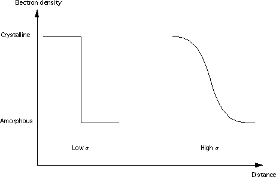
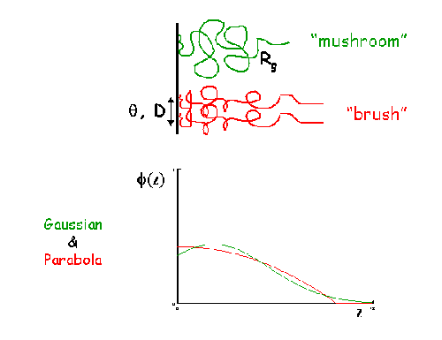
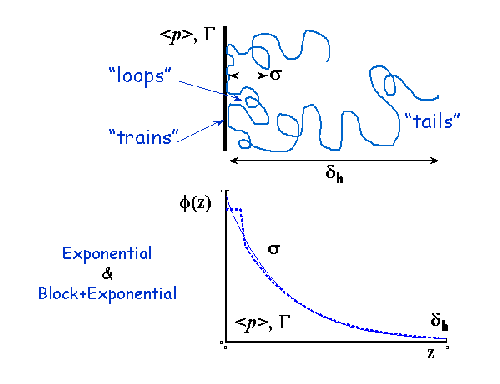

.. corfunc_help.rst

.. _Correlation_Function_Analysis:

Correlation Function Analysis
=============================

Description
-----------

In small angle scattering we measure the tendency for probe particles (neutrons, photons, etc)
to transfer various amounts of momentum to a sample. The momentum is generally inferred from the scattering angle
of probe particles, along with other information about the probe particles (e.g. kinetic energy).
Small angle scattering is assumed to be elastic, which allows the momentum transfer to be directly related to a wavelength, and thus
a spatial distance. The correlation function represents the scattering intensity in terms of this spatial distance,
rather than in terms of momentum transfer.

We can interpret the correlation function in terms of the sample structure by thinking about
pairs of points separated by a given distance. When, on average over the sample, the pair of points
have a high scattering length density, then the correlation function has a large value. Similarly,
when the pairs have a low scattering length density, the correlation function is low.
More concretely: the correlation function :math:`\Gamma(x)` for distance :math:`x` is proportional to
the pairwise product of scattering length densities for all points separated by distance :math:`x`,
summed over all orientations and locations.

A correlation function may be interpreted in terms of an imaginary rod moving
through the structure of the material. Γ(x) is the probability that a rod of 
length x has equal electron/neutron scattering length density at either end. 
Hence a frequently occurring spacing within a structure will manifest itself 
as a peak in Γ(x). *SasView* will return both the one-dimensional ( Γ\ :sub:`1`\ (x) ) 
and three-dimensional ( Γ\ :sub:`3`\ (x) ) correlation functions, the difference 
being that the former is only averaged in the plane of the scattering vector.

A volume fraction profile :math:`\Phi`\ (z) describes how the density of polymer 
segments/surfactant molecules varies with distance, z, normal to an (assumed 
locally flat) interface. The form of :math:`\Phi`\ (z) can provide information 
about the arrangement of polymer/surfactant molecules at the interface. The width 
of the profile provides measures of the layer thickness, and the area under 
the profile is related to the amount of material that is adsorbed.

.. ZZZZZZZZZZZZZZZZZZZZZZZZZZZZZZZZZZZZZZZZZZZZZZZZZZZZZZZZZZZZZZZZZZZZZZZZZZZZ

Interface
=========

The correlation function analysis is performed in **3 steps**.

First, the scattering curve is **Extrapolated** to :math:`Q = 0` (Guinier) and toward
:math:`Q = \infty` (Porod), the details of the extrapolation is controlled by
the parameters `Guinier End`, `Porod Start` and `Porod End`, which
are settable by entering text, or by using the `Adjust` slider.
There is a smooth transition from the data to the extrapolation, start and end refer to
the region over which this occurs (see below).
Parameters for the extrapolation can manually entered in `Extrapolation Parameters` and
SasView can be told whether to recalcuate the parameters using the `Fit Background`,
`Fit Guinier` and `Fit Porod` checkboxes.

Secondly, the data is **Transformed** to obtain the projected correlation functions.

Finally, the transformed data is **Interpreted** in terms of an ideal lamellar morphology

Extrapolation
-------------

Small Q
.......

The data are extrapolated to q = 0 by fitting a Guinier function, defined as

.. math::
    I(q) = e^{A + Bq^2}

The natural logarithm of the parameter :math:`A` is a constant of proportionality
and equal to the scattering intensity at :math:`Q=0`, i.e. the "total scattering".

 parameter :math:`B`, in systems of dispersed particles it is related to the radius-of-gyration of 
a spherical object having the same small-angle scattering in this region.
	
*Note:* As q tends to zero this function tends to a limiting value and is 
therefore less appropriate for use in systems where the form factor does not 
do likewise. However, because of the transform, the correlation functions are 
most affected by the Guinier back-extrapolation at *large* values of x where 
the impact on any extrapolated parameters will be least significant.

Large Q
.......

The data are extrapolated towards q = :math:`\infty` by fitting a Porod model to
the data points in the high-q range and then computing the extrapolation to 100 
times the maximum q value in the experimental dataset. This should be more than 
sufficient to ensure that on transformation any truncation artefacts introduced 
are at such small values of x that they can be safely ignored.

The equation used is:

.. math::
    I(q) = K q^{-4}e^{-q^2\sigma^2} + Bg

Where :math:`Bg` is the background, :math:`K` is the Porod constant, and :math:`\sigma` (which 
must be > 0) describes the width of the electron/neutron scattering length density 
profile at the interface between the crystalline and amorphous regions as shown below.

Merging
.......

The extrapolated data set consists of the Guinier back-extrapolation from q ~ 0
up to the lowest q value in the original data, then the original scattering data, 
and then the Porod tail-fit beyond this. The joins between the original data and 
the Guinier/Porod extrapolations are smoothed using the algorithm below to try 
and avoid the formation of truncation ripples in the transformed data:

Functions :math:`f(x_i)` and :math:`g(x_i)` where :math:`x_i \in \left\{
{x_1, x_2, ..., x_n} \right\}`, are smoothed over the range :math:`[a, b]`
to produce :math:`y(x_i)`, by the following equations:

.. math::
    y(x_i) = h_ig(x_i) + (1-h_i)f(x_i)

where:

.. math::
    h_i = \frac{1}{1 + \frac{(x_i-b)^2}{(x_i-a)^2}}

Transformation
--------------

Corfunc uses a discrete cosine transform on the extrapolated data in order to calculate the
1D correlation function as:

.. math::
    \Gamma _{1}(x) = \frac{1}{Q^{*}} \int_{0}^{\infty }I(q) q^{2} cos(qx) dq

where Q\ :sup:`*` is the Scattering (also called Porod) Invariant.

The following algorithm is applied:

.. math::
    \Gamma(x_k) = 2 \sum_{n=0}^{N-1} x_n \cos{\left[ \frac{\pi}{N}
    \left(n + \frac{1}{2} \right) k \right] } \text{ for } k = 0, 1, \ldots,
    N-1, N

The 3D correlation function is calculated as:

.. math::
    \Gamma _{3}(x) = \frac{1}{Q^{*}} \int_{0}^{\infty}I(q) q^{2}
    \frac{sin(qx)}{qx} dq

.. note:: It is always advisable to inspect Γ\ :sub:`1`\ (x) and Γ\ :sub:`3`\ (x) 
    for artefacts arising from the extrapolation and transformation processes:
	
	- do they tend to zero as x tends to :math:`\infty`?
	- do they smoothly curve onto the ordinate at x = 0? (if not check the value 
	  of :math:`\sigma` is sensible)
	- are there ripples at x values corresponding to (2 :math:`pi` over) the two 
	  q values at which the extrapolated and experimental data are merged?
	- are there any artefacts at x values corresponding to 2 :math:`pi` / q\ :sub:`max` in 
	  the experimental data? 
	- and lastly, do the significant features/peaks in the correlation functions 
	  actually correspond to anticpated spacings in the sample?!!!

Finally, the program calculates the interface distribution function (IDF) g\ :sub:`1`\ (x) as 
the discrete cosine transform of:

.. math::
    -q^{4} I(q)

The IDF is proportional to the second derivative of Γ\ :sub:`1`\ (x).

Interpretation
--------------

Correlation Function
....................

Once the correlation functions have been calculated *SasView* can be asked to 
try and interpret Γ\ :sub:`1`\ (x) in terms of an ideal lamellar morphology 
as shown below.

.. figure:: fig2.png
   :align: center

The structural parameters extracted are:

*   Long Period :math:`= L_p`
*   Average Hard Block Thickness :math:`= L_c`
*   Average Core Thickness :math:`= D_0`
*   Average Interface Thickness :math:`\text{} = D_{tr}`
*   Polydispersity :math:`= \Gamma_{\text{min}}/\Gamma_{\text{max}}`
*   Local Crystallinity :math:`= L_c/L_p`

Volume Fraction Profile
.......................

SasView does not provide any automatic interpretation of volume fraction profiles 
in the same way that it does for correlation functions. However, a number of 
structural parameters are obtainable by other means:

*   Surface Coverage :math:`=\theta`
*   Anchor Separation :math:`= D`
*   Bound Fraction :math:`= 
`
*   Second Moment :math:`= \sigma`
*   Maximum Extent :math:`= \delta_{\text{h}}`
*   Adsorbed Amount :math:`= \Gamma`

The reader is directed to the references for information on these parameters.

References
----------

Correlation Function
....................

Ruland, W. *Coll. Polym. Sci.* (1977), 255, 417-427

Strobl, G. R.; Schneider, M. *J. Polym. Sci.* (1980), 18, 1343-1359

Koberstein, J.; Stein R. *J. Polym. Sci. Phys. Ed.* (1983), 21, 2181-2200

Baltá Calleja, F. J.; Vonk, C. G. *X-ray Scattering of Synthetic Poylmers*, Elsevier. Amsterdam (1989), 247-251

Baltá Calleja, F. J.; Vonk, C. G. *X-ray Scattering of Synthetic Poylmers*, Elsevier. Amsterdam (1989), 257-261

Baltá Calleja, F. J.; Vonk, C. G. *X-ray Scattering of Synthetic Poylmers*, Elsevier. Amsterdam (1989), 260-270

Göschel, U.; Urban, G. *Polymer* (1995), 36, 3633-3639

Stribeck, N. *X-Ray Scattering of Soft Matter*, Springer. Berlin (2007), 138-161

:ref:`FDR` (PDF format)

Volume Fraction Profile
.......................

Washington, C.; King, S. M. *J. Phys. Chem.*, (1996), 100, 7603-7609

Cosgrove, T.; King, S. M.; Griffiths, P. C. *Colloid-Polymer Interactions: From Fundamentals to Practice*, Wiley. New York (1999), 193-204

King, S. M.; Griffiths, P. C.; Cosgrove, T. *Applications of Neutron Scattering to Soft Condensed Matter*, Gordon & Breach. Amsterdam (2000), 77-105

King, S.; Griffiths, P.; Hone, J.; Cosgrove, T. *Macromol. Symp.* (2002), 190, 33-42

.. ZZZZZZZZZZZZZZZZZZZZZZZZZZZZZZZZZZZZZZZZZZZZZZZZZZZZZZZZZZZZZZZZZZZZZZZZZZZZ

Usage
-----
Upon sending data for correlation function analysis, it will be plotted (minus
the background value), along with a bar indicating the *upper end of the
low-Q range* (used for Guinier back-extrapolation), and 2 bars indicating 
the range to be used for Porod forward-extrapolation. These bars may be moved by 
entering appropriate values in the Q range input boxes or by clicking on them and
dragging them to the desired location..

.. figure:: tutorial1.png
   :align: center

Once the Q ranges have been set, click the "Calculate" button in the *Background* section
of the dialog to determine the background level.
Alternatively, enter your own value into the box. If the box turns 
yellow this indicates that background subtraction has created some negative intensities.

Now click the "Extrapolate" button to extrapolate the data. The graph window will update 
to show the extrapolated data, and the values of the parameters used for the Guinier and 
Porod extrapolations will appear in the "Extrapolation Parameters" section of the Corfunc 
GUI.

.. figure:: tutorial2.png
   :align: center

Now click the "Transform" button to perform the Fourier transform and plot
the results. The lower graph will display the 1D and 3D-averaged correlation functions.
The Interface Distribution Function (or IDF) is also computed, but is not displayed
for clarity. How to access the IDF, and the correlation functions themselves, is
explained shortly.

 .. figure:: tutorial3.png
    :align: center

*If* the sample morphology can be adequately described as an ideal lamellar morphology
the Corfunc GUI can attempt to derive morphological characterization parameters from the
1D correlation function. To do this, click the "Extract Parameters" button.

 .. figure:: tutorial4.png
    :align: center

Finally, it is possible to save the values of the real-space distance axis, the 1D and 3D
correlation functions, and the IDF to a simple ASCII text file by clicking on the "Save"
button. The file is given the unique file descriptor *.crf*.

 .. figure:: tutorial5.png
    :align: center

The structure of the file is shown below.

 .. figure:: tutorial6.png
    :align: center

.. note:: At the time of writing SasView will not load these *.crf* files, but they can
   be easily loaded and displayed in most spreadsheet applications.

.. note::
    This help document was last changed by Steve King, 21May2020
