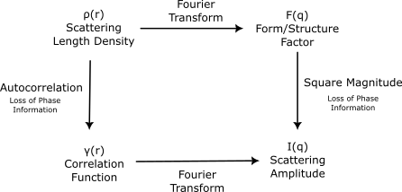

.. corfunc_help.rst

.. _Correlation_Function_Analysis:

Correlation Function Analysis
=============================

Description
-----------

In small angle scattering we measure the tendency for probe particles (neutrons, photons, etc)
to transfer various amounts of momentum to a sample. The momentum is generally inferred from the scattering angle
of probe particles, along with other information about the probe particles (e.g. kinetic energy).
Small angle scattering is assumed to be elastic, which allows the momentum transfer to be directly related to a wavelength, and thus
a spatial distance. The correlation function represents the scattering intensity in terms of this spatial distance,
rather than in terms of momentum transfer.

We can interpret the correlation function in terms of the sample structure by thinking about
pairs of points separated by a given displacement. When, on average over the sample, the pairs of points
have a high scattering length density, then the correlation function has a large value. Similarly,
when the pairs have a low scattering length density, the correlation function is low.
More concretely: the correlation function :math:`\Gamma(\vec{r})` for vector :math:`\vec{r} = (x,y,z)` is proportional to
the pairwise product of scattering length densities for all points separated by the vector :math:`(x,y,z)`
summed over all orientations and locations.

Another way of thinking about the correlation function is as the scattering length 
density but with phase information removed. As scattering experiments contain
no phase information, calculating the correlation function
is as close as one can get to calculating the scattering length density from
scattering data without incorporating additional information.

The nature of small angle scattering further limits what spatial information
can be recovered. Whilst in its most general form the correlation 
function takes a three dimensional vector input, 
small angle scattering measurements are limited to one or two dimensions,
which in turn limits the amount of information about the correlation 
function that can be obtained. For this reason, in the correlation function 
analysis tool we consider various one dimensional projections of the full 
correlation function, labelled :math:`\Gamma_1` and :math:`\Gamma_3` .

The :math:`\Gamma_1` projection looks at changes in a single 
direction perpendicular to the beam, with the other directions being averaged.
The direction is typically selected by hand from a 2D measurement prior to analysis.
Theoretically, the correlation function will be fully recoved as long as the system 
being looked at is truly one dimensional and properly aligned.
However, one must remember the constraints of a small angle scattering experiment,
we only measure a small range of momentum transfer, and extrapolate the rest,
as such the extrapolation steps must be appropriate for the system.
This is in addition to the usual considerations of resultion and systematic
measurement error.

The :math:`\Gamma_3` projection is motivated by a system of
monodisperse, randomly oriented particles in dilute suspension, 
such that there is no spatial correlations between particles. 
It is the kind of system described by the Debye equation.
Just as is the case with :math:`\Gamma_1`, as long as one truely
has this kind of system, and with caveats about extrapolation
and experimental constraints, one should be able to fully recover
the correlation function.

More formally...
----------------

More formally, the correlation function is a quantity that arrises naturally from calculating the square magnitude
of the three dimensional fourier transform, which is proportional to the scattering amplitude.

.. math:: 
    \frac{d\sigma}{d\Omega} \propto F(\vec{q}) F^*(\vec{q})

where 

.. math:: 
    F(\vec{q}) = \int \rho(r) e^{i \vec{r}\cdot\vec{q}} \; dr^3

where :math:`dr^3` is the volume element (:math:`dx\;dy\;dz`).

A couple of algebraic steps will bring us to the correlation function: first,
as :math:`\rho` is real, and the conjugate of :math:`e^{ix}` is :math:`e^{-ix}` we
know that the conjugate of :math:`F` is given by

.. math:: 
    F^*(\vec{q}) = \int \rho(r) e^{-i \vec{r}\cdot\vec{q}} 

meaning that, with some renaming of variables, we have

.. math:: 
    F(\vec{q}) F^*(\vec{q}) = \left(\int \rho(\vec{t}) e^{i \vec{t}\cdot\vec{q}} \; dt^3\right)\left( \int \rho(\vec{s}) e^{-i \vec{s}\cdot\vec{q}} \; ds^3 \right)

And letting  some rearrangement becomes

.. math::
    \int\int \rho(\vec{s}) \rho(\vec{t}) e^{i (t-s)\cdot\vec{q}} \; dr^3 \; ds^3

and now letting :math:`\vec{r} = \vec{t} - \vec{s}` 
and applying the Fourier translation theorem, we can rewrite the above as
(note this is not the same :math:`\vec{r}` as before, but a new variable):

.. math::
    \int\int \rho(\vec{s}) \rho(\vec{s} + \vec{r}) e^{i \vec{r}\cdot\vec{q}} \; ds^3  \; dr^3

Some final reording of the integration gives 

.. math::
    \int \left[ \int \rho(\vec{s}) \rho(\vec{s} + \vec{r}) \; ds^3 \right] \; e^{i \vec{r}\cdot\vec{q}} \; dr^3

The quantity in square brackets what we call the correlation function, :math:`\gamma(\vec{r})`, so:

.. math::
    \gamma(\vec{r}) = \int \rho(\vec{s}) \rho(\vec{s} + \vec{r}) \; ds^3

and it is the quantity that is Fouier transformed (with some appropriate scaling) 
to get the magnitude of scattering.

Some useful properties of the Correlation Function
..................................................

As we have mentioned before, the correlation function contains no phase information,
mathematically this is the same as saying (1) that its Fourier transform is purely real,
or (2) that the correlation function is an even function. The consequence of this is 
that we can write the Fourier transform of the correlation function using a cosine instead
of a complex exponential.

Demonstrating the evenness of the correlation function is easily done by a change of
the variable of integration from :math:`\vec{s}` 
to :math:`\vec{u} = \vec{s} + \vec{r}`.

.. math::
    \gamma(\vec{r}) = \int \rho(\vec{s}) \rho(\vec{s} + \vec{r}) \; ds^3 = \int \rho(\vec{u}-\vec{r}) \rho(\vec{u}) \; du^3 = \gamma(-\vec{r})

and from this we can show that its Fourier transform is real by applying the following
to each dimension in turn (shown here in the 1D case for even :math:`f(x)`).

First, we split the integral into negative and positive :math:`x` parts:

.. math::
    \int_{-\infty}^\infty f(x) e^{i x \xi} dx = \int_{-\infty}^0 f(x) e^{i x \xi} dx + \int_{0}^\infty f(x) e^{i x \xi} dx

Let :math:`u = -x` for the negative part, use the fact that :math:`f(-x)=f(x)` and
recalculate the bounds of integration

.. math:: 
    = \int_0^\infty f(u) e^{-i u \xi} du + \int_{0}^\inf f(x) e^{i x \xi} dx

Note that :math:`u` only appears within the integral, so we can rename it to :math:`x`
and recombine it with the positive part. We can also multiply the integral by two and
the integrand by two, giving

.. math::
    =2 \int_0^\infty f(x) \frac{e^{i x \xi} + e^{-i x \xi}{2} dx

The fractional part is the complex definition of cosine. 
Applying this definition and using the fact that :math:`f(x)` is even
to restore the original bounds of integration we get

.. math::
    = \int_{-\infty}^{\infty} f(x) cos(x \xi) dx

which shows that the Fourier transform is purely real, reflecting the
fact that there is no phase information (which would be encoded in the imaginary part).

:math:`\Gamma_1` Projection 
...........................

Consider the Fourier transform of the three dimensional correlation function,

.. math::
    \int\int\int \gamma(\vec{r}) e^{i \vec{r} \cdot \vec{q}} \; dx \; dy \; dz

Now let :math:`q_z = q_y = 0`. 
The motivation for this is (1) that during small angle of scattering :math:`q_z` 
and so is small enough to be neglected, and (2) that we are choosing to measure 
in one direction of the :math:`q_x q_y` plane.
We assume, without loss of generality, to be where :math:`q_y=0`. 

This gives us :math:`q \cdot r = x q_x`, and so the transform becomes

.. math::
    \int \gamma(\vec{r}) e^{i x q_x} \; dx \; dy \; dz

which we can rewrite as

.. math:: 
    \int\left( \int\int \gamma(\vec{r}) \; dy\;dz\right) e^{i x q_x} \; dx

the quantity in the brackets is :math:`\Gamma_1(x)`. That is to say

.. math::
    \Gamma_1(x) = \int\int \gamma(\vec{r}) \;dy\;dz

If we now use the fact that :math:`\gamma(\vec{r})` is an even function,

:math:`\Gamma_3` Projection
...........................

The :math:`\Gamma_3` projection inverts the 

.. ZZZZZZZZZZZZZZZZZZZZZZZZZZZZZZZZZZZZZZZZZZZZZZZZZZZZZZZZZZZZZZZZZZZZZZZZZZZZ

The Corfunc Tool
================

The correlation function analysis is performed in **3 steps**.

First, the scattering curve is **Extrapolated** to :math:`Q = 0` (Guinier) and toward
:math:`Q = \infty` (Porod), the details of the extrapolation is controlled by
the parameters `Guinier End`, `Porod Start` and `Porod End`, which
are settable by entering text, or by using the `Adjust` slider.
There is a smooth transition from the data to the extrapolation, start and end refer to
the region over which this occurs (see below).
Parameters for the extrapolation can manually entered in `Extrapolation Parameters` and
SasView can be told whether to recalcuate the parameters using the `Fit Background`,
`Fit Guinier` and `Fit Porod` checkboxes.

Secondly, the data is **Transformed** to obtain the projected correlation functions.

Finally, the transformed data is **Interpreted** in terms of an ideal lamellar morphology

Extrapolation
-------------

Small Q
.......

The scattering data is extrapolated to :math:`q = 0`` by fitting a Guinier function, defined as

.. math::
    I(q) = e^{A + Bq^2}

to data up to :math:`q` value specified by `Guinier Start`.

This a Gaussian centred at :math:`q=0` (we only ever see the positive half).
The natural logarithm of the parameter :math:`A` is a constant of proportionality
equal to the scattering intensity at :math:`q=0`, i.e. the "total scattering".
The parameter :math:`B` describes the narrowness of the Gaussian, and in systems 
of dispersed spherical particles it is related to the radius of gyration :math:`R_g` by :math:`B = R_g^2 / 3`.
	
*Note:* The Guinier model makes assumptions that do not hold for all systems
and so this approximation might not always be accurate.
If errors from the Guinier model fit occur, they will manifest as a constant offset in the correlation function,
because low :math:`q` values correspond a to long period length in :math:`x`.
Empirically, however, innacuracies in the Guinier region have a very low impact on the
final analysis, and only a some of the lamellar parameters will be affected at all.

Large Q
.......

The data is extrapolated towards :math:`q = \infty` by fitting a Porod model, to the region 
between `Porod Start` and `Porod End`. This model is defined by

.. math::
    I(q) = K q^{-4} e^{-q^2\sigma^2} + I_{B}

Where :math:`I_B` is the background intensity, :math:`K` is the Porod constant, and :math:`\sigma` is a 
contrast parameter which, in a two phase system, describes 
the sharpness of the scattering length density 
profile at the interface between phases.

The model contains three components, a constant background intesity, the standard Porod law

.. math::
    I(q) - I_B \propto q^{-4}

and a contribution which is attibutable to the sharpness of the boundaries between regions

.. math::
    I(q) - I_B \propto e^{-q^2\sigma^2}

SasView will use this formula to extrapolate to very large :math:`q` (100 
times the data's maximum). This assures that the transform used in the
next stage does not contain artefacts (i.e. from treating secular data as periodic)
  

Merging
.......

In the final step before transformation, the experimental and model data are merged together.
For the Guinier model, this happens on the region between the start of the experimental data and
the value specified by `Guinier End`. 
For the Porod model, the merging happens between `Porod Start` and `Porod End`.

+----------------+-------------------+-------------------+
| From           | To                | Data              |
+================+===================+===================+
|| 0             || Start of data    || Guinier Model    |
|| Start of data || *Guinier End*    || Guinier/Data mix |
|| *Guinier End* || *Porod Start*    || Data             |
|| *Porod Start* || *Porod End*      || Data/Porod mix   |
|| *Porod End*   || 100x end of data || Porod model      |
+----------------+-------------------+-------------------+

A smooth transition is achieved with sigmoid weighting defined as follows.
We start with two input functions, :math:`f(x)` on the 'left' and :math:`g(x)` on the 'right', and these 
are to be smoothed over the range :math:`[a, b]`. 
We use :math:`y(x)` to represent the transition over :math:`[a,b]`. :math:`y(x)` is given by the following convex combination

.. math::
    y(x) = h(x) g(x) + (1-h(x))f(x)

where :math:`h(x)` is a weighing between the two, with a value of zero at :math:`a` and one at :math:`b`, defined as

.. math::
    h(x) = \frac{1}{1 + \frac{(x-b)^2}{(x-a)^2}}

Transformation
--------------

Corfunc uses a discrete cosine transform on the extrapolated data in order to calculate the
1D correlation function as:

.. math::
    \Gamma _{1}(x) = \frac{1}{Q^{*}} \int_{0}^{\infty }I(q) q^{2} cos(qx) dq

where Q\ :sup:`*` is the Scattering (also called Porod) Invariant.

The following algorithm is applied:

.. math::
    \Gamma(x_k) = 2 \sum_{n=0}^{N-1} x_n \cos{\left[ \frac{\pi}{N}
    \left(n + \frac{1}{2} \right) k \right] } \text{ for } k = 0, 1, \ldots,
    N-1, N

The 3D correlation function is calculated as:

.. math::
    \Gamma _{3}(x) = \frac{1}{Q^{*}} \int_{0}^{\infty}I(q) q^{2}
    \frac{sin(qx)}{qx} dq

.. note:: It is always advisable to inspect Γ\ :sub:`1`\ (x) and Γ\ :sub:`3`\ (x) 
    for artefacts arising from the extrapolation and transformation processes:
	
	- do they tend to zero as x tends to :math:`\infty`?
	- do they smoothly curve onto the ordinate at x = 0? (if not check the value 
	  of :math:`\sigma` is sensible)
	- are there ripples at x values corresponding to (2 :math:`pi` over) the two 
	  q values at which the extrapolated and experimental data are merged?
	- are there any artefacts at x values corresponding to 2 :math:`pi` / q\ :sub:`max` in 
	  the experimental data? 
	- and lastly, do the significant features/peaks in the correlation functions 
	  actually correspond to anticpated spacings in the sample?!!!

Finally, the program calculates the interface distribution function (IDF) g\ :sub:`1`\ (x) as 
the discrete cosine transform of:

.. math::
    -q^{4} I(q)

The IDF is proportional to the second derivative of Γ\ :sub:`1`\ (x).

Interpretation
--------------

Correlation Function
....................

Once the correlation functions have been calculated *SasView* can be asked to 
try and interpret Γ\ :sub:`1`\ (x) in terms of an ideal lamellar morphology 
as shown below.

.. figure:: fig2.png
   :align: center

The structural parameters extracted are:

*   Long Period :math:`= L_p`
*   Average Hard Block Thickness :math:`= L_c`
*   Average Core Thickness :math:`= D_0`
*   Average Interface Thickness :math:`\text{} = D_{tr}`
*   Polydispersity :math:`= \Gamma_{\text{min}}/\Gamma_{\text{max}}`
*   Local Crystallinity :math:`= L_c/L_p`

.. ZZZZZZZZZZZZZZZZZZZZZZZZZZZZZZZZZZZZZZZZZZZZZZZZZZZZZZZZZZZZZZZZZZZZZZZZZZZZ

Usage
-----
Upon sending data for correlation function analysis, it will be plotted (minus
the background value), along with a bar indicating the *upper end of the
low-Q range* (used for Guinier back-extrapolation), and 2 bars indicating 
the range to be used for Porod forward-extrapolation. These bars may be moved by 
entering appropriate values in the Q range input boxes or by clicking on them and
dragging them to the desired location..

.. figure:: tutorial1.png
   :align: center

Once the Q ranges have been set, click the "Calculate" button in the *Background* section
of the dialog to determine the background level.
Alternatively, enter your own value into the box. If the box turns 
yellow this indicates that background subtraction has created some negative intensities.

Now click the "Extrapolate" button to extrapolate the data. The graph window will update 
to show the extrapolated data, and the values of the parameters used for the Guinier and 
Porod extrapolations will appear in the "Extrapolation Parameters" section of the Corfunc 
GUI.

.. figure:: tutorial2.png
   :align: center

Now click the "Transform" button to perform the Fourier transform and plot
the results. The lower graph will display the 1D and 3D-averaged correlation functions.
The Interface Distribution Function (or IDF) is also computed, but is not displayed
for clarity. How to access the IDF, and the correlation functions themselves, is
explained shortly.

 .. figure:: tutorial3.png
    :align: center

*If* the sample morphology can be adequately described as an ideal lamellar morphology
the Corfunc GUI can attempt to derive morphological characterization parameters from the
1D correlation function. To do this, click the "Extract Parameters" button.

 .. figure:: tutorial4.png
    :align: center

Finally, it is possible to save the values of the real-space distance axis, the 1D and 3D
correlation functions, and the IDF to a simple ASCII text file by clicking on the "Save"
button. The file is given the unique file descriptor *.crf*.

 .. figure:: tutorial5.png
    :align: center

The structure of the file is shown below.

 .. figure:: tutorial6.png
    :align: center

.. note:: At the time of writing SasView will not load these *.crf* files, but they can
   be easily loaded and displayed in most spreadsheet applications.

.. note::
    This help document was last changed by Steve King, 21May2020

References
----------

Correlation Function
....................

Ruland, W. *Coll. Polym. Sci.* (1977), 255, 417-427

Strobl, G. R.; Schneider, M. *J. Polym. Sci.* (1980), 18, 1343-1359

Koberstein, J.; Stein R. *J. Polym. Sci. Phys. Ed.* (1983), 21, 2181-2200

Baltá Calleja, F. J.; Vonk, C. G. *X-ray Scattering of Synthetic Poylmers*, Elsevier. Amsterdam (1989), 247-251

Baltá Calleja, F. J.; Vonk, C. G. *X-ray Scattering of Synthetic Poylmers*, Elsevier. Amsterdam (1989), 257-261

Baltá Calleja, F. J.; Vonk, C. G. *X-ray Scattering of Synthetic Poylmers*, Elsevier. Amsterdam (1989), 260-270

Göschel, U.; Urban, G. *Polymer* (1995), 36, 3633-3639

Stribeck, N. *X-Ray Scattering of Soft Matter*, Springer. Berlin (2007), 138-161

:ref:`FDR` (PDF format)

Volume Fraction Profile
.......................

Washington, C.; King, S. M. *J. Phys. Chem.*, (1996), 100, 7603-7609

Cosgrove, T.; King, S. M.; Griffiths, P. C. *Colloid-Polymer Interactions: From Fundamentals to Practice*, Wiley. New York (1999), 193-204

King, S. M.; Griffiths, P. C.; Cosgrove, T. *Applications of Neutron Scattering to Soft Condensed Matter*, Gordon & Breach. Amsterdam (2000), 77-105

King, S.; Griffiths, P.; Hone, J.; Cosgrove, T. *Macromol. Symp.* (2002), 190, 33-42
