.. fitting_help.rst

.. This is a port of the original SasView html help file to ReSTructured text
.. by S King, ISIS, during SasView CodeCamp-III in Feb 2015.

Fitting
=======

.. note:: If some code blocks are not readable, expand the documentation window

.. ZZZZZZZZZZZZZZZZZZZZZZZZZZZZZZZZZZZZZZZZZZZZZZZZZZZZZZZZZZZZZZZZZZZZZZZZZZZZZ

Preparing to fit data
---------------------

To fit some data you must first load some data, activate one or more data sets,
send those data sets to fitting, and select a model to fit to each data set.

Instructions on how to load and activate data are in the section :ref:`Loading_data`.

SasView can fit data in one of three ways:

*  in *Single* fit mode - individual data sets are fitted independently one-by-one

*  in *Simultaneous* fit mode - multiple data sets are fitted simultaneously to
   the *same* model with/without constrained parameters (this might be useful,
   for example, if you have measured the same sample at different contrasts)

*  in *Batch* fit mode - multiple data sets are fitted sequentially to the
   *same* model (this might be useful, for example, if you have performed
   a kinetic or time-resolved experiment and have *lots* of data sets!)

.. ZZZZZZZZZZZZZZZZZZZZZZZZZZZZZZZZZZZZZZZZZZZZZZZZZZZZZZZZZZZZZZZZZZZZZZZZZZZZZ

Selecting a model
-----------------

The models in SasView are grouped into categories. By default these consist of:

*  *Cylinder* - cylindrical shapes (disc, right cylinder, cylinder with end-caps
   etc)
*  *Ellipsoid* - ellipsoidal shapes (oblate, prolate, core shell, etc)
*  *Parallelepiped* - as the name implies
*  *Sphere* - spheroidal shapes (sphere, core multishell, vesicle, etc)
*  *Lamellae* - lamellar shapes (lamellar, core shell lamellar, stacked
   lamellar, etc)
*  *Shape-Independent* - models describing structure in terms of density
   correlation functions, fractals, peaks, power laws, etc
*  *Paracrystal* - semi ordered structures (bcc, fcc, etc)
*  *Structure Factor* - S(Q) models
*  *Plugin Models* - User-created (custom/non-library) Python models

Use the *Category* drop-down menu to chose a category of model, then select
a model from the drop-down menu to the right. The "Show Plot" button on the
bottom of the dialog will become active. If you click on it, 
a graph of the chosen model, calculated using default parameter values, will appear.
The graph will update dynamically as the parameter values are changed.

You can decide your own model categorizations using the :ref:`Category_Manager`.

Once you have selected a model you can read its help documentation by clicking
on the *Help* button. Additionally, right clicking on the empty space in the
parameter table will display a short description of the model.

.. image:: descr_fig.png

.. _Interaction_and_Mixture_Models:

Interaction Models
^^^^^^^^^^^^^^^^^^

Structure factor S(Q) models can be combined with many form factor P(Q) models
in the other categories to generate what SasView calls "interaction models"
(previously "product models"). The combination can be done by one of two
methods, but how they behave is slightly different.

The first, most straightforward, method is simply to use the S(Q) drop-down in
the FitPage:

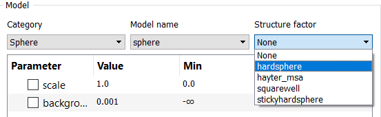

This example would then generate an interaction model with the following
parameters:

.. figure:: p_and_s_buttons_parameters.png

The other method is to use the :ref:`Add/Multiply_Models` tool under Fitting menu:

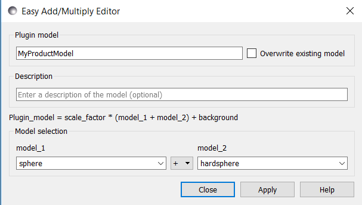

This creates an interaction model with the following parameters:

.. figure:: p_and_s_sum_model_parameters.png

As can be seen, the second method has produced an interaction model with an
extra parameter: *radius_effective*. This is the radial distance determining the
range of the $S(Q)$ interaction and may, or may not, be the same as the
*radius*, in this example, depending on the concentration of the system. In
other systems, *radius_effective* may depend on the particle form (shape).
SasView offers the flexibility to automatically constrain (tie) some of these
parameters together so that, for example, *radius_effective* = *radius*. See
:ref:`Add/Multiply_Models`.

Also see :ref:`Interaction_Models` for further information.

.. note::

    SasView v5.0.4 incorporated a technical change to how the volume
    normalisation is incorporated in the interaction calculator that computes
    $I(Q)$ from $P(Q) S(Q)$. The change will affect all future versions of
    SasView. For more details, please see the :ref:`Release_Notes`.

Mixture Models
^^^^^^^^^^^^^^

SasView "mixture models" (previously called "sum models") are summations of
form factor models, or even of form factor models and an "interaction model"
(see above), and are used to describe mixed-phase systems where the scattering
is proportional to the volume fraction of each contributing phase.

Show 1D/2D
^^^^^^^^^^

Models are normally fitted to 1D (ie, I(Q) vs Q) data sets, but some models in
SasView can also be fitted to 2D (ie, I(Qx,Qy) vs Qx vs Qy) data sets.

*NB: Magnetic scattering can only be fitted in SasView in 2D.*

To activate 2D fitting mode, select the *2D view* checkbox on the *Fit Page*. To
return to 1D fitting model, de-select the same checkbox.

.. ZZZZZZZZZZZZZZZZZZZZZZZZZZZZZZZZZZZZZZZZZZZZZZZZZZZZZZZZZZZZZZZZZZZZZZZZZZZZZ

.. _Category_Manager:

Category Manager
----------------

To change the model categorizations, either choose *Category Manager* from the
*View* option on the menu bar, or click on the *Modify* button on the *Fit Page*.

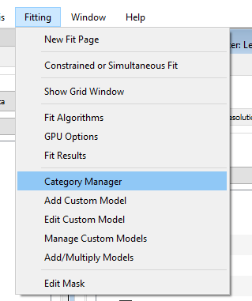

The categorization of all models except the user supplied Plugin Models can be
reassigned, added to, and removed using *Category Manager*. Models can also be
hidden from view in the drop-down menus.

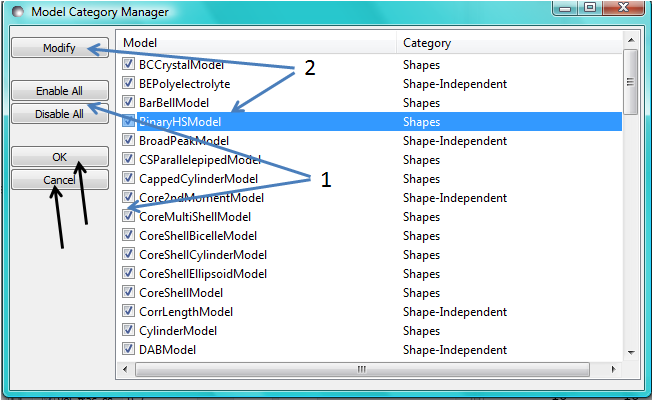

Changing category
^^^^^^^^^^^^^^^^^

To change category, highlight a model in the list by left-clicking on its entry
and then click the *Modify* button. Use the *Change Category* panel that appears
to make the required changes.

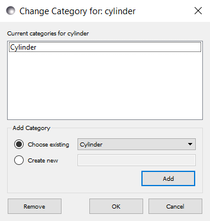

To create a category for the selected model, click the *Add* button. In order
to delete a category, select the category name and click the *Remove*
button. Then click *OK*.

Showing/hiding models
^^^^^^^^^^^^^^^^^^^^^

Use the *Enable / Disable All* buttons and the check boxes beside each model
to select the models to show/hide. To apply the selection, click *OK*.

..
.. ZZZZZZZZZZZZZZZZZZZZZZZZZZZZZZZZZZZZZZZZZZZZZZZZZZZZZZZZZZZZZZZZZZZZZZZZZZZZZ

Model Functions
---------------

For a complete list of all the library models available in SasView, see
the `Model Documentation <models/index.html>`_ .

It is also possible to add your own models.

.. ZZZZZZZZZZZZZZZZZZZZZZZZZZZZZZZZZZZZZZZZZZZZZZZZZZZZZZZZZZZZZZZZZZZZZZZZZZZZZ

.. _Adding_your_own_models:

Adding your own Models
----------------------

There are essentially four ways to generate new fitting models for SasView:

*  Using the SasView :ref:`Add/Multiply_Models` dialog to sum/multiply
   together *two existing models* in the model library (best for
   beginners - provided the required models are in the model library!)
*  Using the SasView :ref:`New_Plugin_Model` helper dialog (aimed at those with
   little programming experience but works best for relatively simple models)
*  By copying/editing an existing model (this can include models generated by
   the *New Plugin Model* dialog) in the :ref:`Python_shell` or
   :ref:`Model_Editor` (suitable for all use cases)
*  By writing a model from scratch outside of SasView (only recommended for 
   experienced Python users)

In the last two cases, please read the guidance on :ref:`Writing_a_Plugin`
before proceeding.

**For your model to be found by SasView it must reside in the *~\\.sasview\\plugin_models* folder.**

.. ZZZZZZZZZZZZZZZZZZZZZZZZZZZZZZZZZZZZZZZZZZZZZZZZZZZZZZZZZZZZZZZZZZZZZZZZZZZZZ

.. _Plugin_Model_Operations:

Plugin Model Operations
-----------------------

From the *Fitting* option in the menu bar, select one of the options:

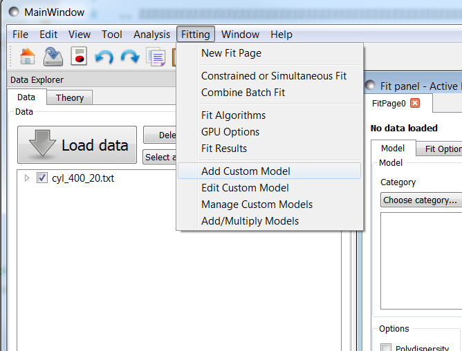

*  *Add Custom Model* - to create a plugin model template with a helper dialog
*  *Edit Custom Model* - to edit a plugin model in an editor window
*  *Manage Custom Models* - to list available plugin models, add one you have
   written, duplicate a model, edit a model, or delete a model
*  *Add/Multiply Models* - to create a plugin model by summing/multiplying *two
   existing models* in the model library

.. _New_Plugin_Model:

Add Custom Model
^^^^^^^^^^^^^^^^

Relatively straightforward models can be programmed directly from the SasView
GUI using the *Plugin Definition* Function.

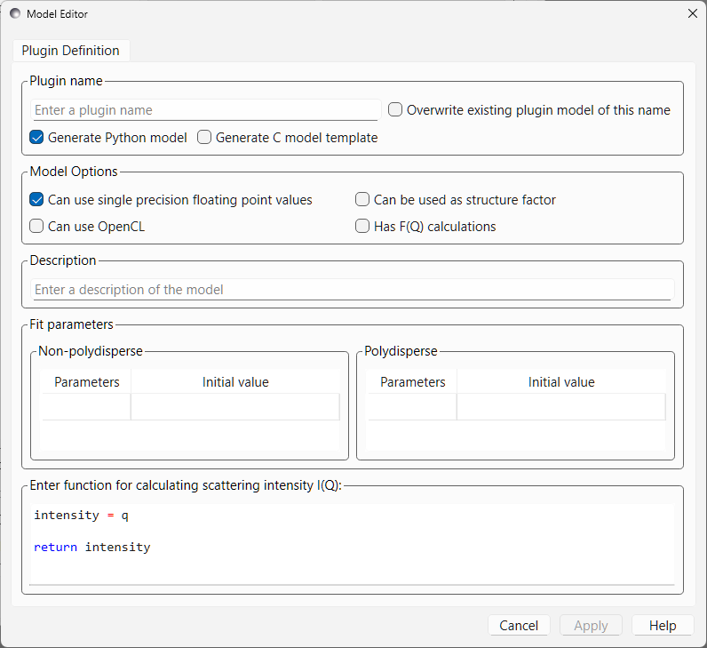

When using this feature, be aware that even if your code has errors, including
syntax errors, a model file is still generated. When you then correct the errors
and click 'Apply' again to re-compile you will get an error informing you that
the model already exists if the 'Overwrite' box is not checked. In this case you
will need to supply a new model function name. By default the 'Overwrite' box is
not *checked*\ .

Also note that the 'Fit Parameters' have been split into two sections: those
which can be polydisperse (shape and orientation parameters) and those which are
not (eg, scattering length densities).

A model file generated by this option can be viewed and further modified using
the :ref:`Model_Editor`.

A number of options are available to be directly set using check boxes.

- 'Generate Python model': Specifies if a new python model file should be generated when clicking Apply. If the model has not been written, this cannot be unselected. *If the python model exists, unchecking this will only allow for a new C model file to be generated and any settings changed in the editor will be ignored.*

- 'Generate C model template': Specifies if a new C model *template* file should be generated when clicking Apply. *NOTE: This will only generate a template C file that includes instructions to enable it. A full C file generation is planned for a future release of SasView.* Default: Unchecked.

- 'Can use single precision floating point values': An option to allow single precision calculations within your model. This allows for faster calculations with OpenCL. Default: Checked

- 'Can use OpenCL': This allows a model to take advantage of GPU acceleration for faster calculations. Please note, this option requires a working C model. Default: Unchecked

- 'Has F(Q) Calculations': This enables the model to use be used as a form factor and be coupled with a structure factor model. Default: Unchecked

- 'Can be used as structure factor': Specify whether the new plugin can be used as a structure factor S(Q). If the this flag is set, two values are added to the parameter list. The model writer must add the parameters to the declarations of the functions Iq and Iqxy. Such a plugin should then be available in the S(Q) drop-down box on a FitPage (once a P(Q) model has been selected). Default: Unchecked::

     parameters = [
                     ['radius_effective', '', 1, [0.0, numpy.inf], 'volume', ''],
                     ['volfraction', '', 1, [0.0, 1.0], '', ''],
                     [...],

     def Iq(x , radius_effective, volfraction, ...):

     def Iqxy(x, y, radius_effective, volfraction, ...):

.. _Add/Multiply_Models:

Add / Multiply Models
^^^^^^^^^^^^^^^^^^^^^

Choosing the *Add/Multiply models* item from the *Fitting* menu

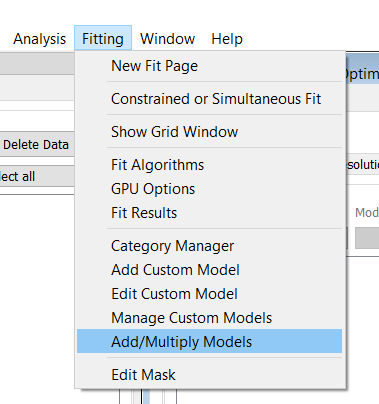

displays the *Easy Add/Multiply Editor* dialog.

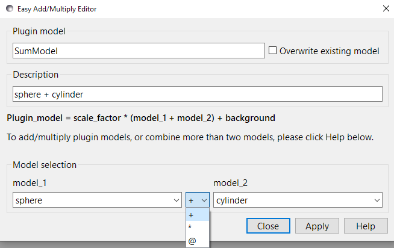

This editor allows the creation of combined custom Plugin Models.
Give the new model a name (which will appear in the list of plugin models on the *FitPage*)
and brief description (to appear under the *Details* button on the *FitPage*). The model name must not contain
spaces (use underscores to separate words if necessary) and if it is longer
than ~25 characters the name will not display in full in the list of models.
Now select two models, as model_1 (or p1) and model_2 (or p2), and the
required operator, '+', '*', or '@'  between them. Finally, click the *Apply* button
to generate and test the model.

The `+` operator sums the individual I(Q) calculations and introduces a third scale factor::

     Plugin Model = scale_factor * {(scale_1 * model_1) +/- (scale_2 * model_2)} + background

the `*` operator multiplies the individual I(Q) calculations::

     Plugin Model = scale_factor * (model1 * model2) + background

and the `@` operator treats the combination as a form factor [F(Q)] for model_1 and a structure factor [S(Q)] for
model_2. The scale and background for F(Q) and S(Q) are set to 1 and 0 respectively and the combined model should
support the beta approximation::

    Plugin Model = scale_factor * vol_fraction * <FF> * S(Q) + background :: No beta
    Plugin Model = scale_factor * (vol_fraction / form_volume) * (<FF> + <F>^2 * (S(Q) - 1)) + background :: beta

**All Versions** Changes made to a plugin model are not applied to models actively in use on fit pages.
To apply plugin model changes, re-select the model from the drop-down menu on the FitPage.

**In SasView 6.x**, multiplicity models cannot be combined. If a model with any layer or conditional parameter is
selected, similar models are removed from the other combo box.

**In SasView 4.x**, if the model is not listed on a fit page you can try and force a
recompilation of the plugins by selecting *Fitting* > *Plugin Model Operations*
> *Load Plugin Models*. **In SasView 5.0.2 and earlier**, you may need to restart the
program. **In SasView 5.0.3 and later**, the new model should appear in the list as soon as
the model is saved.

.. warning::

   **SasView versions 4.2.x, 5.0.0 and 5.0.1**
   The *Easy Add/Multiply Editor* dialog should *not* be used to combine a
   plugin model with a built-in model, or to combine two plugin models. The
   operation will appear to work in 4.2.x but may generate a faulty plugin
   model. In 5.0.0 the operation will fail (generating an error message in the
   Log Explorer). Whilst in 5.0.1 the operation has been blocked.
   
   If you need to generate a plugin model from more than two built-in models,
   please read the sub-sections :ref:`Model_Structure` and :ref:`Combining_multiple_models`
   below.

.. _Model_Structure:

Model Structure
^^^^^^^^^^^^^^^

**SasView version 4.2** introduced a much simplified and more extensible
structure for plugin models generated through the Easy Sum/Multi Editor. For
example, the code for a combination of a sphere model with a power law model
now looks like this::

     from sasmodels.core import load_model_info
     from sasmodels.sasview_model import make_model_from_info

     model_info = load_model_info('sphere+power_law')
     model_info.name = 'MyPluginModel'
     model_info.description = 'sphere + power_law'
     Model = make_model_from_info(model_info)

To change the models or operators contributing to this plugin it is only
necessary to edit the string in the brackets after *load_model_info*, though it
would also be a good idea to update the model name and description too!!!

The model specification string can handle multiple models and combinations of
operators ('+' or '*') which are processed according to normal conventions. Thus
'model1+model2*\model3' would be valid and would multiply model2 by model3
before adding model1. In this example, parameters in the *FitPage* would be
prefixed A (for model2), B (for model3) and C (for model1). Whilst this might
appear a little confusing, unless you were creating a plugin model from
multiple instances of the same model the parameter assignments ought to be
obvious when you load the plugin.

.. SMK 05/02/2020
.. I've commented out the lines below for now because it is not clear from
.. using SasView that it is still (ever was!) a requirement for including
.. plugin models in the new model structure.

.. If you need to include another plugin model in the model specification string,
.. just prefix the name of that model with *custom*. For instance::

..     sphere+custom.MyPluginModel

This streamlined approach to building complex plugin models from existing 
library models, or models available on the *Model Marketplace*, also permits
the creation of P(Q)*\S(Q) plugin models, something that was not possible in
earlier versions of SasView. Also see :ref:`Interaction_and_Mixture_Models`
above.

.. note::

   **Interaction Models**
   
   When the *Easy Sum/Multi Editor* creates a P(Q)*\S(Q) model it will use
   the * symbol like this::

     sphere*hardsphere

   However, it is probably advisable to edit the model file and use the @
   symbol instead, for example::

     sphere@hardsphere

   This is because * and @ confer different behavior on the model

   *  *with @* - the radius and volume fraction in the S(Q) model are
      constrained to have the *same* values as the radius and volume fraction
      in the P(Q) model.
   *  *with ** - the radii and volume fractions in the P(Q) and S(Q) models are
      unconstrained. 

.. warning::

   If combining P(Q) models with S(Q) models, *particularly if combining
   multiple instances of such models* (eg, $(P(Q)_1$ * $S(Q)_1$) + $(P(Q)_2$ * $S(Q)_2)$
   or similar), pay careful attention to the behaviour of the scale and volume
   fraction parameters and test your model thoroughly, preferably on
   well-characterised data.

.. _Combining_multiple_models:

Combining more than two models
^^^^^^^^^^^^^^^^^^^^^^^^^^^^^^

If you need generate a plugin model from more than two other models, it is
tempting to think that the way to do so is simply to use the
*Easy Add/Multiply Editor* dialog to combine the first two models into a
plugin, then generate a new plugin using that first plugin as one of the
selected models, combine it with the third model, and repeat as required.

This does not currently work properly (although it *may appear to* in SasView
4.2.x).

Instead, use the *Easy Add/Multiply Editor* dialog to combine the first two
models, then navigate to the plugin folder (~\\.sasview\\plugin_models on 
Windows) and open the plugin Python file (eg, MyPluginModel.py) in a text
editor.

Now edit the Python to specify all the models to contribute to the expanded
plugin (the text string in the brackets after *load_model_info*). Make sure you
specify the model names correctly, including any capitalisation (if in doubt
use the model name dropdown on a *FitPage*)! Finally, update the model name and
description, and save the file.

So, as an example, one could take the MyPluginModel example in the preceding
section, change it to::

     from sasmodels.core import load_model_info
     from sasmodels.sasview_model import make_model_from_info

     model_info = load_model_info('power_law+fractal+gaussian_peak+gaussian_peak')
     model_info.name = 'MyBigPluginModel'
     model_info.description = 'For fitting pores in crystalline framework'
     Model = make_model_from_info(model_info)

and re-save it as MyBigPluginModel.py. When loaded into a *FitPage*, the 
parameters for the four models in the *load_model_info* string are then all
present and prefixed by A\_, B\_, C\_, and D\_, respectively.

.. _Model_Editor:

Model Editor
^^^^^^^^^^^^

Selecting "Edit Custom Model" option opens the editor window.

.. image :: model_editor_empty.png

Initially, the editor is empty. A custom model can be loaded by clicking on the
*Load plugin...* button and choosing one of the existing custom plugins.

Once the model is loaded, it can be edited and saved with *Save* button.
Saving the model will perform the validation and only when the model is correct
it will be saved to a file. Successful model check is indicated by a SasView
status bar message.

When *Cancel* is clicked, any changes to the model are discarded and the window
is closed.

For details of the SasView plugin model format see :ref:`Writing_a_Plugin` .

To use the model, go to the relevant *Fit Page*, select the *Plugin Models*
category and then select the model from the drop-down menu.

.. Plugin_Manager:

Plugin Manager
^^^^^^^^^^^^^^

Selecting the *Manage Custom Models* option shows a list of all the plugin
models in the plugin model folder, on Windows this is

  *C:\\Users\\{username}\\.sasview\\plugin_models*

You can add, edit, duplicate and delete these models using buttons on the right
side of the list.

.. image:: plugin_manager.png

Add a model
^^^^^^^^^^^

Clicking the "Add" button opens the Model Editor window, allowing you to create
a new plugin as described above.

Duplicate a model
^^^^^^^^^^^^^^^^^

Clicking the "Duplicate" button will create a copy of the selected model(s).
Naming of the duplicate follows the standard, with an *n* added to the
plugin model name, where *n* is the first unused integer.

Edit a model
^^^^^^^^^^^^

When a single model is selected, clicking this button will open the Advanced
*Model Editor* allowing you to edit the Python code of the model. If no models
or multiple models are selected, the *Edit* button is disabled.

Delete Plugin Models
^^^^^^^^^^^^^^^^^^^^

Simply highlight the plugin model(s) to be removed and click on the "Delete"
button. The operation is final.

*NB: Models shipped with SasView cannot be removed in this way.*

.. ZZZZZZZZZZZZZZZZZZZZZZZZZZZZZZZZZZZZZZZZZZZZZZZZZZZZZZZZZZZZZZZZZZZZZZZZZZZZZ

.. _Fitting_Options:

Fit Algorithms
---------------

It is possible to specify which optimiser SasView should use to fit the data, and
to modify some of the configurational parameters for each optimiser.

From *Fitting* in the menu bar select *Fit Algorithms*, then select one of the
following optimisers:

*  DREAM
*  Levenberg-Marquardt
*  Quasi-Newton BFGS
*  Differential Evolution
*  Nelder-Mead Simplex

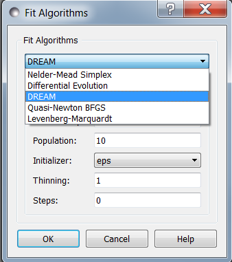

The DREAM optimiser is the most sophisticated, but may not necessarily be the best
option for fitting simple models. If uncertain, try the Levenberg-Marquardt optimiser
initially.

These optimisers form the *Bumps* package written by P Kienzle. For more information
on each optimiser, see the :ref:`Fitting_Documentation`.

.. ZZZZZZZZZZZZZZZZZZZZZZZZZZZZZZZZZZZZZZZZZZZZZZZZZZZZZZZZZZZZZZZZZZZZZZZZZZZZZ

Fitting Limits
--------------

By default, *SasView* will attempt to model fit the full range of the data; ie,
across all *Q* values. If necessary, however, it is possible to specify only a
sub-region of the data for fitting.

In a *FitPage* or *BatchPage* change the tab to *Fit Options* and then change 
the *Q* values in the *Min* and/or *Max*
text boxes. 

..
  Vertical coloured bars will appear on the graph with the data and
  'theory' indicating the current *Q* limits (red = *Qmin*, purple = *Qmax*).

To return to including all data in the fit, click the *Reset* button.

.. ZZZZZZZZZZZZZZZZZZZZZZZZZZZZZZZZZZZZZZZZZZZZZZZZZZZZZZZZZZZZZZZZZZZZZZZZZZZZZ

Shortcuts
---------

Copy/Paste Parameters
^^^^^^^^^^^^^^^^^^^^^

It is possible to copy the parameters from one *Fit Page* and to paste them into
another *Fit Page* using the same model.

To *copy* parameters, either:

*  Select *Edit -> Copy Params* from the menu bar, or
*  Use Ctrl(Cmd on Mac) + Left Mouse Click on the *Fit Page*.

To *paste* parameters, either:

*  Select *Edit -> Paste Params* from the menu bar, or
*  Use Ctrl(Cmd on Mac) + Shift + Left-click on the *Fit Page*.

If either operation is successful a message will appear in the info line at the
bottom of the SasView window.

.. _Status_bar:

Status Bar & Log Explorer
-------------------------

The status bar is located at the bottom of the SasView window and displays
messages, warnings and errors.

.. image:: log_explorer.png

The bottom part of the SasView application window contains the *Log Explorer*.
The *Log Explorer* displays available message history and run-time traceback
information.

.. ZZZZZZZZZZZZZZZZZZZZZZZZZZZZZZZZZZZZZZZZZZZZZZZZZZZZZZZZZZZZZZZZZZZZZZZZZZZZZ

.. _Single_Fit_Mode:

Single Fit Mode
---------------

*NB: Before proceeding, ensure that the Batch mode checkbox at the bottom of*
*the Data Explorer is unchecked (see the section* :ref:`Loading_data` *).*

This mode fits one data set.

.. When data is sent to the fitting it is plotted in a graph window as markers.

When data is sent to the fitting, the Fit Page will show the dataset name.

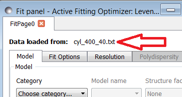

Clicking on the *Show Plot* will cause the data can be plotted in a graph window
as markers.

If a graph does not appear, or a graph window appears but is empty, then the data
has not loaded correctly. Check to see if there is a message in the :ref:`Status_Bar`
or in the *Console* window.

Assuming the data has loaded correctly, when a model is selected a blue model
calculation (or what SasView calls a 'Theory') line will appear in the earlier graph
window, and a second graph window will appear displaying the residuals (the
difference between the experimental data and the theory) at the same X-data values.
See :ref:`Assessing_Fit_Quality`.

The objective of model-fitting is to find a *physically-plausible* model, and set
of model parameters, that generate a theory that reproduces the experimental data
and gives residual values as close to zero as possible.

Change the default values of the model parameters by hand until the theory line
starts to represent the experimental data. Then uncheck the tick boxes alongside
all parameters *except* the 'background' and the 'scale'. Click the *Fit* button.
SasView will optimise the values of the 'background' and 'scale' and also display
the corresponding uncertainties on the optimised values.

*NB: If no uncertainty is shown it generally means that the model is not very*
*dependent on the corresponding parameter (or that one or more parameters are*
*'correlated').*

In the bottom right corner of the *Fit Page* is a box displaying the normalised value
of the statistical $\chi^2$ parameter returned by the optimiser.

Now check the box for another model parameter and click *Fit* again. Repeat this
process until most or all parameters are checked and have been optimised. As the
fit of the theory to the experimental data improves the value of 'chi2/Npts' will
decrease. A good model fit should easily produce values of 'chi2/Npts' that are
close to one, and certainly <100. See :ref:`Assessing_Fit_Quality`.

SasView has a number of different optimisers (see the section :ref:`Fitting_Options`).
The DREAM optimiser is the most sophisticated, but may not necessarily be the best
option for fitting simple models. If uncertain, try the Levenberg-Marquardt optimiser
initially.

Polydisperse Parameters
^^^^^^^^^^^^^^^^^^^^^^^

Some model parameters, for example, radii/lengths or orientation angles can be
polydisperse; i.e. they can have a distribution of possible values. Polydisperse
parameters are defined as such when the model is coded, and can be activated by
clicking the *Polydispersity* checkbox on the *Fit Page*.

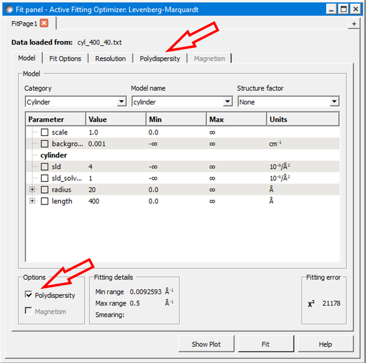

Clicking on the *Polydispersity* tab then provides access to these polydisperse
parameters and allows the type (i.e. the *function* to be used) and 'width'
(the *PD[ratio]*) to be adjusted. If necessary the 'step size' (*Npts*) and
'range' (*Nsigs*) of the function can also be adjusted.

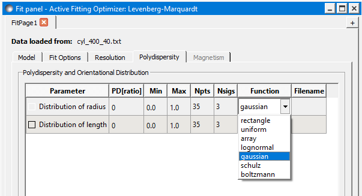

For more information, see the descriptions of :ref:`polydispersityhelp`. In
particular, pay attention to the Suggested Applications and Usage Notes therein.
The detail of how SasView computes the scattering from polydisperse systems is
described in the :ref:`PStheory` section.

Note that SasView defaults to Gaussian distributions, but these will not always
be the best choice. Also, the definitions of the centre (e.g. whether it is the
mean or median value, for example) and the actual width of the function will
vary depending on the chosen distribution! For orientation distributions the
*PD[ratio]* parameter is absolute. But for distributions applied to 'volume'
(size) parameters the *PD[ratio]* parameter will always be relative to the
current centre value.

.. note:: **Polydispersity distributions in SasView define the number density
           of the given population of scatterers. The resulting scattering is
           then the number average over the distribution.**

It is possible to optimise a *PD[ratio]* parameter during fitting by checking
the accompanying checkbox. However, this is usually only effective in the
latter stages of a converging fit.

.. note:: Neither the *PD[ratio]*, or the parameter to which it is applied, can
          be optimised if using an Array Distribution. See
          :ref:`polydispersityhelp`.

.. _Reparameterization_Editor:

Reparameterizing Models
^^^^^^^^^^^^^^^^^^^^^^^

It is possible to change model parameters of an existing model, without writing an entirely
new model using the reparameterization editor available from the Fitting menu. The editor
allows a user to select a model, plugins included, and to define a series of new parameters that are
mathematically related to existing parameters.

Within the editor, select the model you wish to modify, and its parameters will be displayed once the
model is selected. A second input allows you to define new parameters that will replace existing
parameters. The text box near the bottom of the window allows free-form inputs to redefine
existing parameters as a function of new parameters.

More information on reparameterization, the process to create a reparametereized model,
and the model file that results from this editor can be found at :ref:`Reparameterized_Models`.

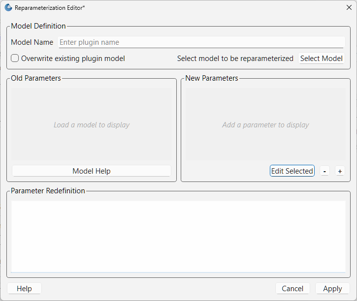

It is also possible to reparameterize a particle model, for instance, to give
greater control over polydispersity due to intra-particle constraints.
If the particles aspect ratio is constrained but not its volume, or if its volume must be
preserved but a range of aspect ratios are permitted for each volume. This may require a
User-Defined distribution function to fully describe the model (see :ref:`polydispersityhelp`).

Using a GPU
^^^^^^^^^^^

Incoporating polydispersity in a fit can certainly improve the overall solution
and add a dose of realism to it (few real systems are monodisperse!). But doing
so will slow the fitting process, sometimes quite dramatically. In these
circumstances enabling a GPU, if present, will help.

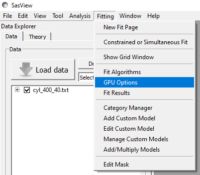

If a *potential* GPU device is present the dialog will show it. The *Test*
button can then be used to check if your system has the necessary drivers to
use it. But also see :ref:`gpu-setup` .

.. ZZZZZZZZZZZZZZZZZZZZZZZZZZZZZZZZZZZZZZZZZZZZZZZZZZZZZZZZZZZZZZZZZZZZZZZZZZZZZ

.. _Simultaneous_Fit_Mode:

Simultaneous Fit Mode
---------------------

*NB: Before proceeding, ensure that the Batch Mode check button at the bottom of*
*the Data Explorer is unchecked (see the section* :ref:`Loading_data` *).*

This mode is an extension of the :ref:`Single_Fit_Mode` that fits two or more data
sets *to the same model* simultaneously. If necessary it is possible to constrain
fit parameters between data sets (eg, to fix a background level, or radius, etc).

If the data to be fit are in multiple files, load each file, then select each file
in the *Data Explorer*, and *Send To Fitting*. If multiple data sets are in one file,
load that file, *Unselect All Data*, select just those data sets to be fitted, and
*Send To Fitting*. Either way, the result should be that for *n* data sets you have
2\ *n* graphs (*n* of the data and model fit, and *n* of the resulting residuals). But
it may be helpful to minimise the residuals plots for clarity. Also see
:ref:`Assessing_Fit_Quality`.

*NB: If you need to use a custom Plugin Model, you must ensure that model is
available first (see* :ref:`Adding_your_own_models` *).*

Method
^^^^^^

Now go to each *FitPage* in turn and:

*  Select the required category and model;
*  Unselect all the model parameters;
*  Enter some starting guesses for the parameters;
*  Enter any parameter limits (recommended);
*  Select which parameters will refine (selecting all is generally a bad idea...);

When done, select *Constrained or Simultaneous Fit* under *Fitting* in the menu
bar.

In the *Const & Simul Fit* page that appears, select which data sets are to be
simultaneously fitted (this will probably be all of them or you would not have
loaded them in the first place!).

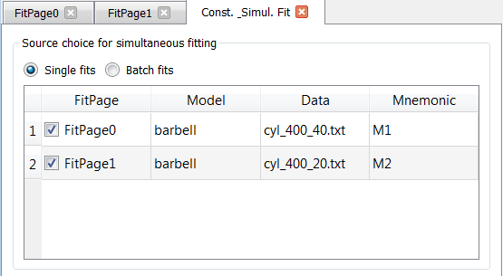

To tie parameters between the data sets with constraints, select the data sets
and right click. From the menu choose *Mutual constraint of parameters in
selected models*

.. image:: constraint_menu.png

When ready, click the *Fit* button on the *Const & Simul Fit* page, NOT the *Fit*
button on the individual *FitPage*'s.

Simultaneous Fits without Constraints
^^^^^^^^^^^^^^^^^^^^^^^^^^^^^^^^^^^^^

The results of the model-fitting will be returned to each of the individual
*FitPage*'s. Also see :ref:`Assessing_Fit_Quality`.

Simultaneous Fits with Constraints
^^^^^^^^^^^^^^^^^^^^^^^^^^^^^^^^^^

In the *Const. & Simul. Fit* page make sure that at least two fitpages are present.
Then, click the *Add constraints* button

.. image:: add_constraint.png

Alternatively, right clicking on two selected fitpages in the
*Source choice for simultaneous fitting* area will bring up the context menu:

.. image:: constraint_menu.png

Here you can choose datasets for fitting and define constraints between parameters in
both datasets.

Clicking the *Add constraints* button or choosing the *Mutual constraint of
parameters in selected models...* option will bring up the *Complex Constraint*
dialog.

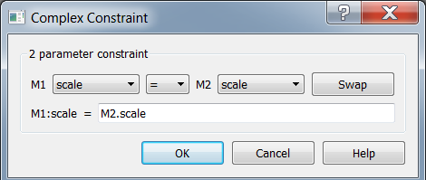

Constraints will generally be of the form

  Mi:Parameter1 = Mj.Parameter1

however the text box after the '=' sign can be used to adjust this
relationship; for example

  Mi:Parameter1 = scalar \* Mj.Parameter1

A 'free-form' constraint box is also provided.

Many constraints can be entered for a single fit.

The results of the model-fitting will be returned to each of the individual
*FitPage*'s. Also see :ref:`Assessing_Fit_Quality`.

Simultaneous Fits with a Modified Weighting
^^^^^^^^^^^^^^^^^^^^^^^^^^^^^^^^^^^^^^^^^^^

When simultaneously fitting different data sets, the degree of influence that each
of them has on the final fit is defined by their statistical weight, i.e. mainly
the number of points and their uncertainty in each data set.
The SasView fitting engine tries to minimize the total $\chi^2$, where the difference
between the data and the model for each data point is added quadratically using a
weight that by default is inversely proportional to the y axis error. As a consequence,
datasets with more points and smaller errors will exert a greater influence on
the fit. While the weighting scheme can be modified in the *Fit Options* tab,
even setting the weighting to None (i.e. all data points from all data sets have
the same weight, equal to 1) will not solve the potential issue of having disparate
number of data points in different sets. In this case, if one data set has much
more (less) points than the remaining data sets, it will have a much larger (smaller)
influence in the global fit.

This is especially true for data gathered using different methods with different
associated errors. For example attempting to fit SANS and SAXS data often leads to the
SAXS data dominating the fit. The *Modify Weighting* option provides a way of getting
around this issue by allowing the user to multiply the individual weights by a global
factor that can be adjusted for each data set.

Checking the *Modify Weighting* box reveals a fifth column in the source choice
dialog called Weighting. This is depicted in the screenshot below.

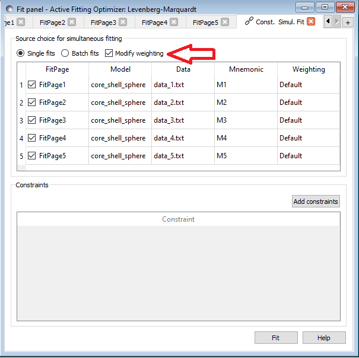

The pre-filled option in the weighting column is 1.0, and only numerical inputs
(integer or floating point numbers) are allowed. It is important to understand
that when the *Modify Weighting* box is checked, **the weights of each data set
will be modified, even when all the weights in the weighting column are equal
to 1.** Actually, when all the user weights are equal to 1, SasView will try to
calculate appropriate weights in order to ensure that all the data sets have
approximately a similar influence in the total fit. This is done by estimating the
statistical weight of each data set *j* as $W_j = \sum_i^{N_j} (1/e_i)^2$, where at present
$e_i$ is the relative error of point *i*, i.e. $e_i = \sigma_i / |I_i|$, and then
the weight to apply to each data set is computed as $Min(W_j)/W_j$. Thus, the weight of the
initially "lighter" set remains equal to 1, while the remaining sets will be scaled down by
a factor < 1. Then the user weighting factors multiply this scaling factor, giving the
final weight for each data set that will be sent to the fitting engine. The final weights
used in the simultaneous fit are given in the *Log Explorer* window and can provide a useful
indication of how much each data set has been "modified" with respect to the original data.

**Warning:** This option gives the user the flexibility to play with the data sets, in order
to drive the global fit in a desired direction. It can be useful when a particular set contains
important information to determine one or several model parameters, but it is ignored in the
global fit because of statistical issues. However, ideally this option should never be needed,
as difficulties when trying to fit simultaneously several sets are often an indication of
other problems such as systematic errors, inadequate error/resolution estimation, etc.
Therefore, users are advised to be extremely careful when using this option and to
carefully check any result obtained using modified weights.

.. ZZZZZZZZZZZZZZZZZZZZZZZZZZZZZZZZZZZZZZZZZZZZZZZZZZZZZZZZZZZZZZZZZZZZZZZZZZZZZ

.. _Batch_Fit_Mode:

Batch Fit Mode
--------------

*NB: Before proceeding, ensure that the Batch Mode check button at the bottom of*
*the Data Explorer is unchecked (see the section* :ref:`Loading_data` *). The Batch*
*Mode button will be used later on!*

This mode *sequentially* fits two or more data sets *to the same model*. Unlike in
simultaneous fitting, in batch fitting it is not possible to constrain fit parameters
between data sets.

If the data to be fit are in multiple files, load each file in the *Data Explorer*.
If multiple data sets are in one file, load just that file. *Unselect All Data*, then
select a single initial data set to be fitted. Fit that selected data set as described
above under :ref:`Single_Fit_Mode`.

*NB: If you need to use a custom Plugin Model, you must ensure that model is
available first (see* :ref:`Adding_your_own_models` *).*

Method
^^^^^^

Now *Select All Data* in the *Data Explorer*, check the *Batch Mode* check button
at the bottom of that panel and *Send To Fitting*. A *BatchPage* will be created.

.. image:: batch_button_area.png

*NB: The Batch Page can also be created by checking the Batch Mode check button*
*and selecting New Fit Page under Fitting in the menu bar.*

Using the drop-down menus in the *BatchPage*, now set up the *same* data set
with the *same* model that you just fitted in single fit mode. A quick way to
set the model parameter values is to just copy them from the earlier Single
Fit. To do this, go back to the Single Fit *FitPage*, select *Copy Params*
under *Edit* in the menu bar, then go back to the *BatchPage* and *Paste Params*.

When ready, use the *Fit* button on the *BatchPage* to perform the fitting, NOT
the *Fit* button on the individual *FitPage*'s.

Unlike in single fit mode, the results of batch fits are not returned to
the *BatchPage*. Instead, a spreadsheet-like :ref:`Grid_Window` will appear.

If you want to visually check a graph of a particular fit, click on the name of
a *Data set* in the *Grid Window* and then click the *Plot* button. The
data and the model fit will be displayed.

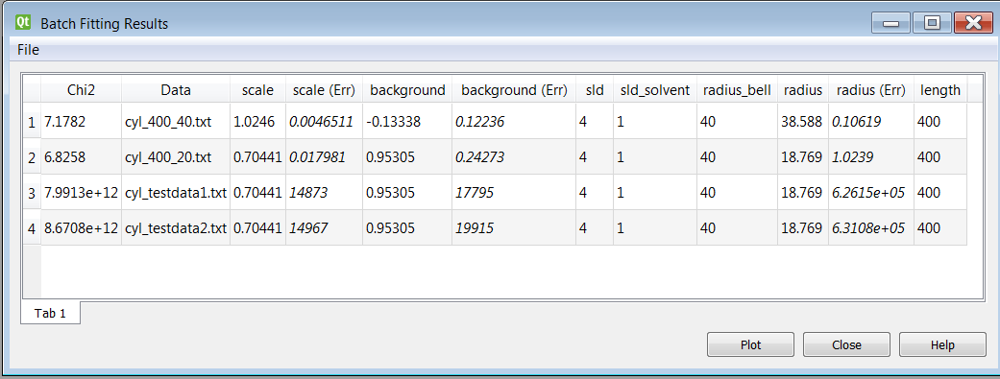

*NB: In theory, returning to the BatchPage and changing the name of the I(Q)*
*data source should also work, but at the moment whilst this does change the*
*data set displayed it always superimposes the 'theory' corresponding to the*
*starting parameters.*

Chain Fitting
^^^^^^^^^^^^^

By default, the *same* parameter values copied from the initial single fit into
the *BatchPage* will be used as the starting parameters for all batch fits. It
is, however, possible to get *SasView* to use the results of a fit to a preceding
data set as the starting parameters for the next fit in the sequence. This
variation of batch fitting is called *Chain Fitting*, and will considerably speed
up model-fitting if you have lots of very similar data sets where a few parameters
are gradually changing. Do not use chain fitting on disparate data sets.

To use chain fitting, select *Chain Fitting* under *Fitting* in the menu bar. It
toggles on/off, so selecting it again will switch back to normal batch fitting.

To choose the order of the fitpages in the fitting process, drag and drop rows in the
*Source choice for simultaneous fitting* table. The order of the table determines
the order of the chain fitting performed.

.. _Grid_Window:

Grid Window
^^^^^^^^^^^

The *Grid Window* provides an easy way to view the results from batch fitting.
It will be displayed automatically when a batch fit completes, but may be
opened at any time by selecting *Show Grid Window* under *View* in the menu
bar.

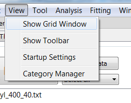

..
  Once a batch fit is completed, all model parameters are displayed but *not*
  their uncertainties. To view the uncertainties, click on a given column then
  go to *Edit* in the menu bar, select *Insert Column Before* and choose the
  required data from the list. An empty column can be inserted in the same way.

  To remove a column from the grid, click on the column header and choose
  *Remove Column* under *Edit* in the menu bar. The same functionality also
  allows you to re-order columns.

  *NB: You cannot insert/remove/re-order the rows in the Grid Window.*

  All of the above functions are also available by right-clicking on a column
  label.

  .. image:: edit_menu.png
..

If there is an existing Grid Window and another batch fit is performed,*
*an additional 'Table' tab will be added to the Grid Window.*

The parameter values in the *currently selected* table of the *Grid Window*
can be output to a CSV file by choosing *Save As* under *File* in the (*Grid*
*Window*) menu bar. The default filename includes the date and time that the
batch fit was performed.

Saved CSV files can be reloaded by choosing *Open* under *File* in the *Grid*
*Window* menu bar. The loaded parameters will appear in a new table tab.

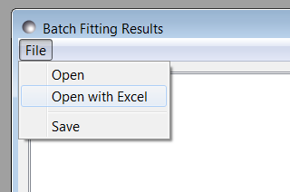

*NB: Saving the Grid Window does not save any experimental data, residuals*
*or actual model fits. Consequently if you reload a saved CSV file the*
*ability to View Fits will be lost.*

Parameter Plots
^^^^^^^^^^^^^^^

..
  Any column of *numeric* parameter values can be plotted against another using
  the *Grid Window*. Simply select one column at the time and click the *Add*
  button next to the required *X/Y-axis Selection Range* text box. When both
  the X and Y axis boxes have been completed, click the *Plot* button.

  When the *Add* button is clicked, *SasView* also automatically completes the
  *X/Y-axis Label* text box with the heading from Row 1 of the selected table,
  but different labels and units can be entered manually.

  .. image:: plot_button.png

  The *X/Y-axis Selection Range* can be edited manually. The text control box
  recognises the operators +, -, \*, /, or 'pow', and allows the following
  types of expression :

    1) if an axis label range is a function of 1 or more *columns*, write
      this type of expression

      constant1 * column_name1 [minimum row index :  maximum  row index]
      operator constant2 * column_name2 [minimum row index :  maximum  row index]

      Example: radius [2 : 5] -3 * scale [2 : 5]

    2) if only some *values* of a given column are needed but the range between
      the first row and the last row used is not continuous, write this type of
      expression

      column_name1 [minimum row index1 :  maximum  row index1] , column_name1
      [minimum row index2 :  maximum  row index2]

      Example: radius [2 : 5] , radius [10 : 25]
..

Any row (dataset) can be plotted by selecting it and either right-clicking and
choosing *Plot selected fits* menu item or by clicking on the *Plot* button.

.. ZZZZZZZZZZZZZZZZZZZZZZZZZZZZZZZZZZZZZZZZZZZZZZZZZZZZZZZZZZZZZZZZZZZZZZZZZZZZZ

Combined Batch Fit Mode
-----------------------

The purpose of the Combined Batch Fit is to allow running two or more batch
fits in sequence without overwriting the output table of results.  This may be
of interest for example if one is fitting a series of data sets where there is
a shape change occurring in the series that requires changing the model part
way through the series; for example a sphere to rod transition.  Indeed the
regular batch mode does not allow for multiple models and requires all the
files in the series to be fit with single model and set of parameters.  While
it is of course possible to just run part of the series as a batch fit using
model one followed by running another batch fit on the rest of the series with
model two (and/or model three etc), doing so will overwrite the table of
outputs from the previous batch fit(s).  This may not be desirable if one is
interested in comparing the parameters: for example the sphere radius of set
one and the cylinder radius of set two.

Method
^^^^^^

In order to use the *Combined Batch Fit*, first load all the data needed as
described in :ref:`Loading_data`. Next start up two or more *BatchPage* fits
following the instructions in :ref:`Batch_Fit_Mode` but **DO NOT PRESS FIT**.

When done, select *Constrained or Simultaneous Fit* under *Fitting* in the menu bar.

In the *Const & Simul Fit* page that appears, choose *Batch fits* radio button and
select which data sets are to be  fitted.

.. image:: simult_batch.png

Once all are selected, click the Fit button on
the *Const. Simult. Fitting* to run each batch fit in *sequence*

The batch table will then pop up at the end as for the case of the simple Batch
Fitting with the following caveats:

.. note::
   The order matters.  The parameters in the table will be taken from the model
   used in the first *BatchPage* of the list.  Any parameters from the
   second and later *BatchPage* s that have the same name as a parameter in the
   first will show up allowing for plotting of that parameter across the
   models. The other parameters will not be available in the grid.
   To choose the order of the fitpages in the fitting process, drag and drop
   rows in the *Source choice for simultaneous fitting* table.

.. note::
   a corollary of the above is that currently models created as a sum|multiply
   model will not work as desired because the generated model parameters have a
   p#_ appended to the beginning and thus radius and p1_radius will not be
   recognized as the same parameter.

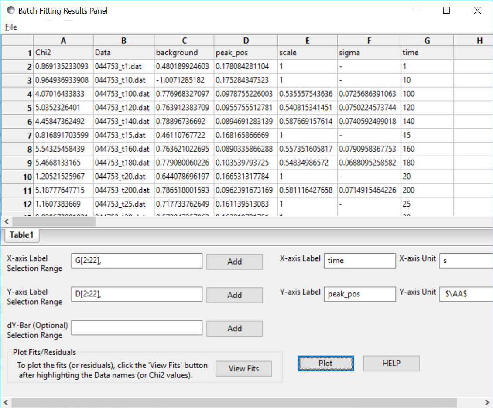

In the example shown above the data is a time series with a shifting peak.
The first part of the series was fitted using the *broad_peak* model, while
the rest of the data were fit using the *gaussian_peak* model. Unfortunately the
time is not listed in the file but the file name contains the information. As
described in :ref:`Grid_Window`, a column can be added manually, in this case
called time, and the peak position plotted against time.

.. image:: combine_batch_plot.png

Note the discontinuity in the peak position.  This reflects the fact that the
Gaussian fit is a rather poor model for the data and is not actually
finding the peak.

.. ZZZZZZZZZZZZZZZZZZZZZZZZZZZZZZZZZZZZZZZZZZZZZZZZZZZZZZZZZZZZZZZZZZZZZZZZZZZZZ

.. _fitting_sesans:

Fitting SESANS Data
-------------------

Since SasView version 4.1.1 it has been possible to fit SESANS data using
the same fitting perspective as used to fit SANS data. This is accomplished
using an on-the-fly :ref:`SESANS` from *Q*-space to real-space.

To use this functionality it is important that the SESANS data file has
the extension .ses to distinguish it from *Q*-space data. The SESANS user
community is gradually refining the structure and content of its data files.
Some current examples can be found in the \\sesans_data folder
in your :ref:`Example_data` directory. For more information about the contents
of .ses files, see :ref:`Formats`.

Load the .ses file and Send to Fitting as normal.

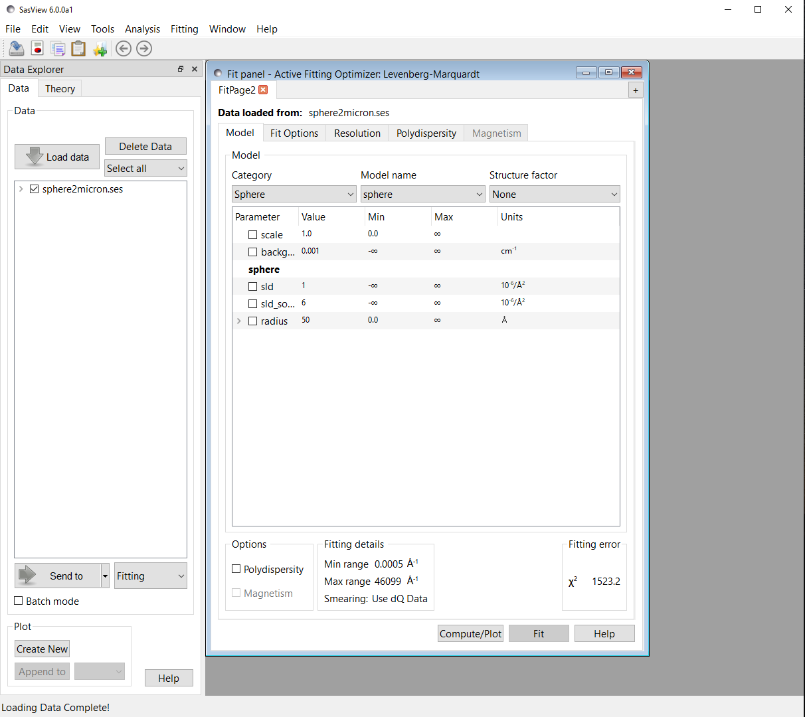

The first true indication that the data are not SANS data comes when the
data are plotted. Instead of *Intensity* vs *Q*, the data are displayed
as a normalised depolarisation (*P*) vs spin-echo length (:math:`{\delta}`).

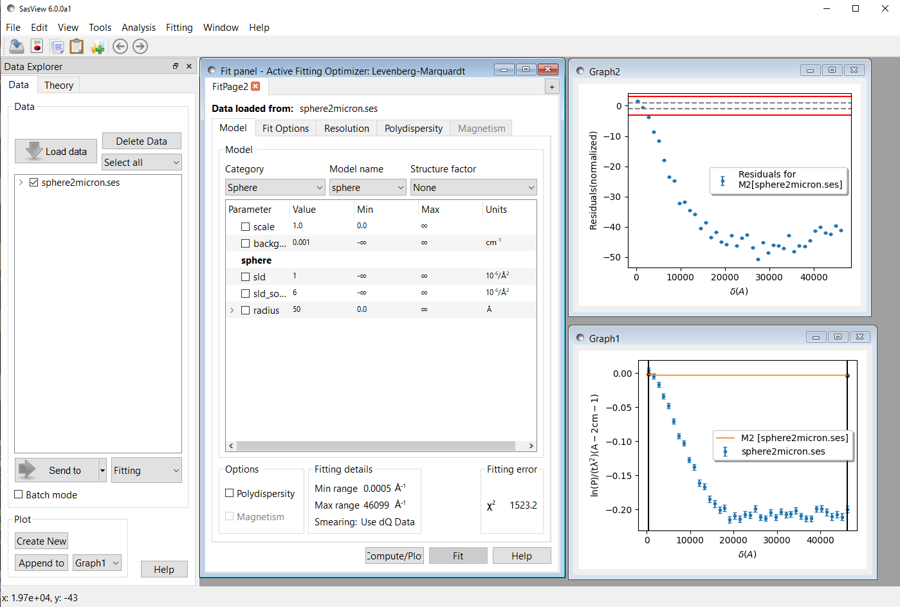

Since SESANS data normally represent much longer length scales than SANS
data, it will likely be necessary to significantly increase key size
parameters in a model before attempting any fitting. In the screenshot
above for example, the radius of the sphere could be increased from its default
value of 50 |Ang| to 5000 |Ang| in order to get the transform to show
something more sensible.

The model parameters can then be optimised by checking them as required
and clicking the Fit button as is normal.

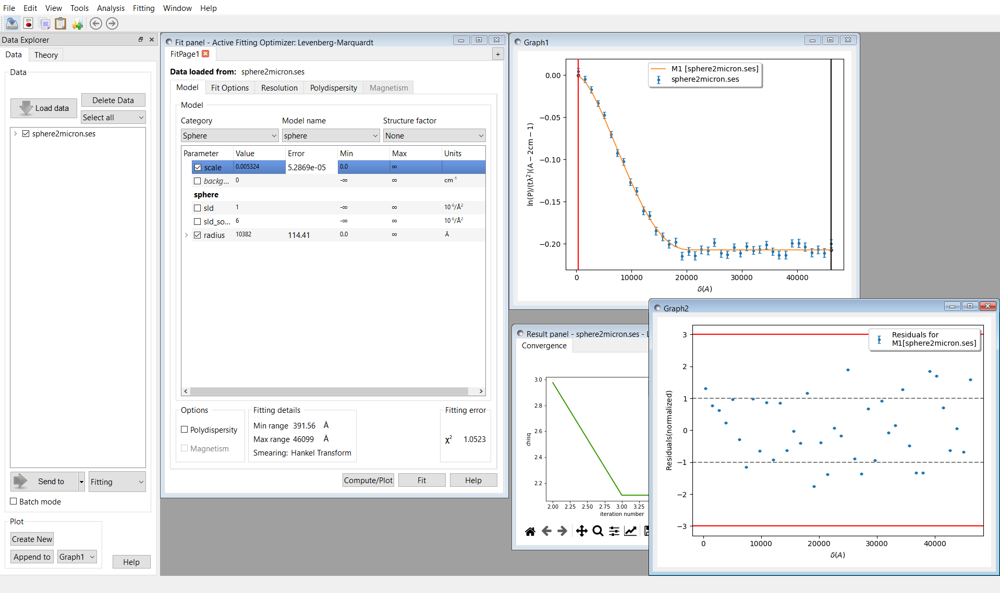

Note that SESANS data is not subject to an incoherent background signal in the
way that normal SANS data is. For this reason the *background* parameter in
any model being used to fit SESANS data should be fixed at zero.

The procedure just described supersedes the original procedure using the
command line interpreter, see :ref:`sesans_fitting`.

.. ZZZZZZZZZZZZZZZZZZZZZZZZZZZZZZZZZZZZZZZZZZZZZZZZZZZZZZZZZZZZZZZZZZZZZZZZZZZZZ

.. note::  This help document was last changed by Caitlyn Wolf, 20March2024
