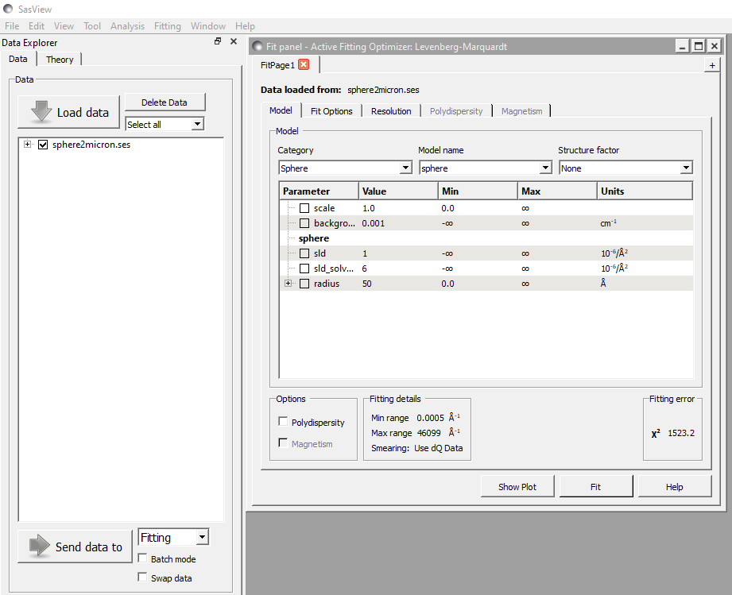
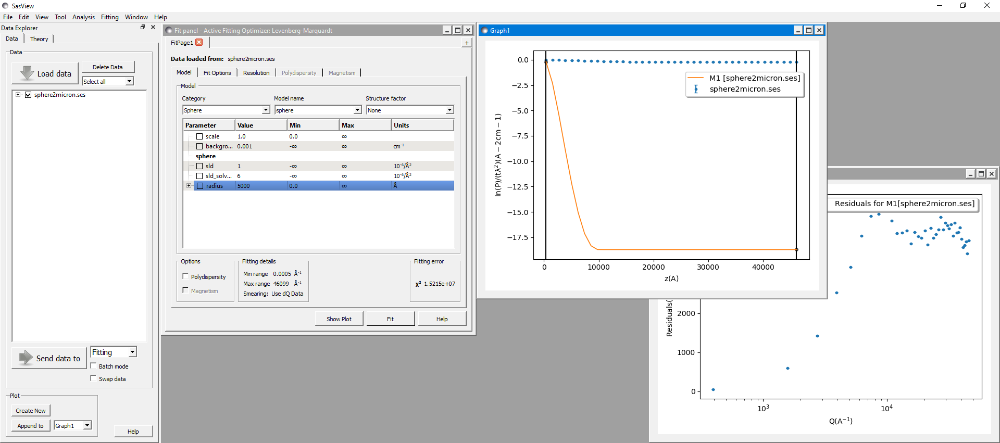
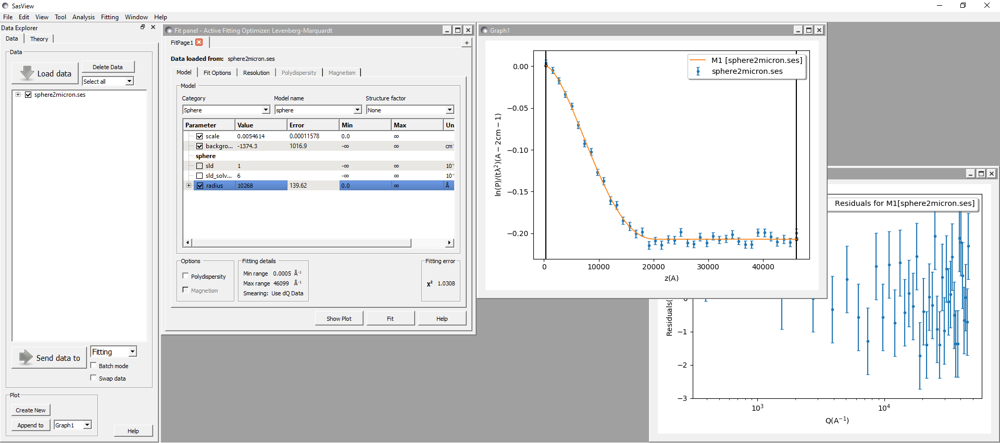

.. currentmodule:: sasview

.. _fitting_sesans:

Fitting SESANS Data in SasView
==============================

.. note::

    To fit SESANS data from the command line in Python,
    please see :ref:`sesans_fitting`.

From SasView version 4.1.1 it has been possible to fit SESANS data using
the same fitting perspective as used to fit SANS data. This is accomplished
using an on-the-fly :ref:`SESANS` from *Q*-space to real-space.

To use this functionality it is important that the SESANS data file has
the extension .ses to distinguish it from *Q*-space data. The SESANS user
community is gradually refining the structure and content of its data files.
Some current examples can be found in the \\test\\sesans_data folder within
the SasView installation folder. For more information about the contents
of .ses files, see :ref:`Formats`.

Load the .ses file and Send to Fitting as normal.

The first true indication that the data are not SANS data comes when the
data are plotted. Instead of *Intensity* vs *Q*, the data are displayed
as a normalised depolarisation (*P*) vs spin-echo length (*z*).

Since SESANS data normally represent much longer length scales than SANS
data, it will likely be necessary to significantly increase key size
parameters in a model before attempting any fitting. In the screenshot
above, the radius of the sphere has been increased from its default
value of 50 |Ang| to 5000 |Ang| in order to get the transform to show
something sensible.

The model parameters can then be optimised by checking them as required
and clicking the Fit button as is normal.

.. ZZZZZZZZZZZZZZZZZZZZZZZZZZZZZZZZZZZZZZZZZZZZZZZZZZZZZZZZZZZZZZZZZZZZZZ

.. note::  This help document was last changed by Steve King, 25 Oct 2021
