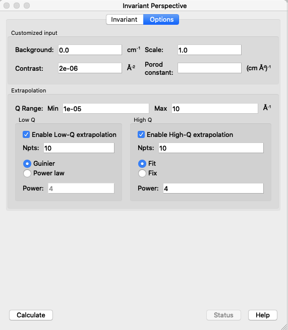
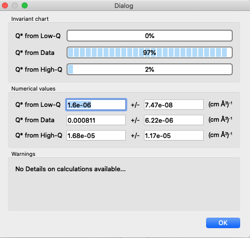

.. invariant_help.rst

.. 5.x version

.. This help file was ported from the original HTML to ReSTructured text by
.. S King, ISIS, during SasView CodeCamp-III in Feb 2015. It was subsequently
.. updated in January 2020 following the realisation that there were issues
.. with both the text below and the underlying calculation. See SasView GitHub
.. Issues #1434, #1461 and #1574.

Invariant Calculation
=====================

Principle
---------

For any multi-phase system, i.e. any system that contains regions with
different scattering length densities (SLD), the integral over all $\vec{q}$
of the appropriately dimensionally-weighted scattering cross-section (ie,
'intensity', $I(\vec{q})$ in absolute units) is a *constant* directly
proportional to the mean-square average fluctuation in SLD and the phase
composition. Usefully, this value is *independent* of the sizes, shapes, or
interactions, or, more generally, the arrangement, of the phase
domains (i.e. it is **invariant**) *provided the system is incompressible*
(i.e, the relative volume fractions of the phases do not change). For the
purposes of this discussion, a phase is any portion of the material which
has a SLD that is distinctly different from the average SLD of the material.
This constant is known as the *Scattering Invariant*, the *Porod Invariant*,
or simply as the *Invariant*, $Q^*$.

.. note::
   In this document we shall denote the invariant by the often encountered
   symbol $Q^*$. But the reader should be aware that other symbols can be
   encountered in the literature. Glatter & Kratky\ [#Glatter_Kratky]_, and
   Stribeck\ [#Stribeck]_, for example,both use $Q$, the same symbol we use to
   denote the scattering vector in SasView(!), whilst
   Melnichenko\ [#Melnichenko]_ uses $Z$. Other variations include $Q_I$.

As the invariant is a fundamental law of scattering, it can be used for sanity
checks (for example, scattering patterns from the same sample that may look
very different *should* have the same invariant *if* the hypothesis of what
is going on in the sample is correct), to cross-calibrate different SAS
instruments, and, as explained below, can yield an independent estimate of
volume fractions or contrast terms.

Implementation
--------------

Calculation
^^^^^^^^^^^
Assuming isotropic scattering, acquired on a typical 'pinhole geometry'
instrument, the invariant integral can be computed from the 1D reduced data
(assuming the reduced data has removed all background from sample
holders,incoherent scattering in the case of neutrons, etc.) as:

.. math::

    Q^* = \int_0^\infty q^2I(q)\,dq

.. warning:: SasView, and to our knowlege most, if not all, other software
    implementations of this calculation, does not include the effects of
    instrumental resolution on the equation above. This means that for data
    with very significant resolution smearing (more likely to be encountered
    with SANS than with SAXS data) the calculated invariant will be somewhat
    high (though in most real cases this will probably not be the dominant
    uncertainty).

.. note::
    The observant reader may notice the lack of a $4 \pi$ prefactor in the
    above equation which would be required for an integral over all $q$ stated
    at the beginning. This seems to be the convention historically adopted and
    is only important when extracting terms from the invariant as below. As
    long as the same convention is applied in their derivation all is consistent.

.. note::
    Also note that if some residual flat background remains in the data, it can
    be corrected for if the amount can be estimated as disucussed in the usage
    section below.

In the extreme case of "infinite" slit smearing, the above equation reduces to:

.. math::

    Q^* = \Delta q_v \int_0^\infty qI(q)\,dq

where $\Delta q_v$ is the slit height, and should be valid as long as
$\Delta q_v$ is large enough to include most, if not all, the scattering.
This limit is applicable, for example, to most data taken on Bonse-Hart
type instruments. SasView *does* implement this limit so that, in contrast to
above, the invariant calculated from such slit-smeared data could be more
accurate than for normal pinhole SANS data which typically has sigificant
$\Delta q / q$.

The slit smeared expression above has also been used to compute the invariant
from unidirectional cuts through 2D scattering patterns such as, for example,
those arising from oriented fibers (see the Crawshaw\ [#Crawshaw]_ and
Shioya\ [#Shioya]_ references). However, in order to use the Invariant analysis
window to do this, it would first be necessary to put the cuts in a data format
that SasView recognises as slit-smeared by properly including the value of
$q_v$ in the data file.

.. note::

    Currently SasView will only account for slit smearing if the data being
    processed by the Invariant analysis are recognized as slit smeared. It does
    not allow for manually inputing a slit value. Currently, only the canSAS
    \*.XML and NIST \*.ABS formats facilitate slit smeared data. The easiest
    way to include $\Delta q_v$ in simple ASCII column data in a way recognizable
    by SasView is to mimic the \*.ABS format. The data must follow the normal
    rules for general ASCII files but include 6 columns. The SasView general
    ASCII reader assumes the first four columns are $q$, $I(q)$, $dI$, $\sigma(q)$.
    If the data does not contain any $dI$ information, these can be faked by
    making them ~1% (or less) of the $I$ data. The fourth column **must** contain
    the $q_v$ value, in |Ang^-1|, but as a **negative number**. Each row of
    data should have the same value. The 5th column **must** be a duplicate of
    column 1. **Column 6 can have any value but cannot be empty**. Finally,
    the line immediately preceding the actual columnar data **must** begin
    with: "The 6 columns". For an example, see the example data set
    1umSlitSmearSphere.ABS in the *\\test\\1d* folder).

Data Extrapolation
^^^^^^^^^^^^^^^^^^
The difficulty with using $Q^*$  arises from the fact that experimental data is
never measured over the range $0 \le q \le \infty$ and it is thus usually
necessary to extrapolate the experimental data to both low and high $q$.
Currently, SasView allows extrapolation to any user-defined low and high $q$.
The default range is $10^{-5} \le q \le 10$ |Ang^-1|. Note that the integrals
above are weighted by $q^2$ or $q$. Thus the high-$q$ extrapolation is weighted
far more heavily than the low-$q$ extrapolation so that having data measured to
as large a value of $q_{max}$ as possible can be surprisingly important.

Low-\ $q$ region (<= $q_{min}$ in data):

*  The Guinier function $I_0.exp(-q^2 R_g^2/3)$ can be used, where $I_0$
   and $R_g$ are obtained by fitting the data within the range $q_{min}$ to
   $q_{min+j}$ where $j$ is the user-chosen number of points from which to
   extrapolate. The default is the first 10 points. Alternatively a power
   law, similar to the high $q$ extrapolation, can be used but this is not
   recommended!
   
High-\ $q$ region (>= $q_{max}$ in data):

*  The power law function $A/q^m$ is used where the power law constant
   $m$ can be fixed to some value by the user or fit along with the constant
   $A$. $m$ will typically be between 3 and 4 for pinhole resolution with
   4 indicating sharp interfaces and smaller values more diffuse interfaces.
   In real systems this may not always hold of course, but the user should
   think about what a deviation means and to what extent it is valid to use
   such an extrapolation. The fitted constant(s) $A$ ($m$) is/are obtained by
   fitting the data within the range $q_{max-j}$ to $q_{max}$ where, again,
   $j$ is the user chosen number of points from which to extrapolate, the
   default again being the last 10 points.

.. note:: While the high $q$ exponent should generally be close to 4 for a
    system with sharp interfaces, in the special case of *infinite* slit
    smearing that power law should be 3 for the same sharp interfaces.

Invariant
^^^^^^^^^
SasView implements the invariant calculation for a two-phase (or pseudo
two-phase) system, which represents the most commonly encountered situation.
The invariant for this is

.. math::

    Q^* = {2 \pi^2 (\Delta\rho)^2 \phi_1 \phi_2}

where $\Delta\rho = (\rho_1 - \rho_2)$ is the SLD contrast and $\phi_1$ and
$\phi_2$ are the volume fractions of the two phases ($\phi_1 + \phi_2 = 1$).
Thus from the invariant one can either calculate the volume fractions of the
two phases given the contrast or, calculate the contrast given the volume
fraction. However, the current implementation in SasView only allows for the
former: extracting the volume fraction given a known contrast factor.

Volume Fraction
^^^^^^^^^^^^^^^
In some cases, especially in non-particulate systems for which no good
analytical model description exists (as then the scale factor of such a model
would return the volume fraction information), if the contrast term can be
reasonably estimated then the invariant can provide an estimate of the volume
fraction. This is quite common, for example, in the Geosciences and Materials
Science where the amount of porosity in a sample (the second phase) is of
vital interest.

Rearranging the above expression for $Q^*$ yields

.. math::

    \phi_1 \phi_2 = \frac{Q^*}{2 \pi^2 (\Delta\rho)^2} \equiv A

and thus, if $\phi_1 < \phi_2$

.. math::

    &\phi_1 = \frac{1 - \sqrt{1 - 4A}}{2} \\
    &\phi_2 = \frac{1 + \sqrt{1-4A}}{2}

where $\phi_1$ (the volume fraction of the *minority phase*) is reported as the
the volume fraction in the Invariant analysis window.

.. note::

    If A>0.25 then the program is obviously unable to compute :math:`\phi_1`.
    In these circumstances the Invariant window will show the volume fraction
    as ERROR. Possible reasons for this are that the contrast has been
    incorrectly entered, or that the dataset is simply not suitable for
    invariant analysis.

Specific Surface Area
^^^^^^^^^^^^^^^^^^^^^
The total surface area per unit volume is an important quantity for a variety of
applications, for example, to understand the absorption capacity, reactivity, or
catalytic activity of a material. This value, known as the specific surface area
$S_v$, is reflected in the scattering of the material. Indeed, any interfaces in
the material separating regions of different scattering length densities
contribute to the overall scattering.

For a two phase system, $S_v$ can be computed from the scattering data as:

.. math::

    S_v = \frac{C_p}{2 \pi (\Delta\rho)^2}

where $C_p$, the *Porod Constant*, is given by Porod's Law:

.. math::

    Cp = \lim_{q \to \infty}I(q) q^4
 
which can be estimated from a Porod model fit to the an appropriately high-$q$
portion of the data or from the intercept of a linear fit to the high-$q$
portion of a Porod Plot: $I(q)*q^4$ vs $q^4$ (see the Porod model
documentation in the Models Documentation for more details).

**This calculation is unrelated to the Invariant** other than to obtain the
contrast term if it is not known (and the volume fraction is known), and depends
only on two values - the contrast and Porod Constant - *which must be provided*.

Extension to Three or More Phases
^^^^^^^^^^^^^^^^^^^^^^^^^^^^^^^^^
In principle, as suggested in the Introduction, the invariant is a completely
general concept and not limited to two phases.  Extending the formalism to more
phases, so that useful information can be extracted from the invariant
is, however, more difficult.  

We note here that in the more generalized formalism the contrast term is
replaced by a quantity called the *SLD fluctuation*, $\eta$, so that:

.. math::

    Q^* = {2 \pi^2 \langle \eta^2 \rangle}

where $\eta$ represents the deviation in SLD from the weighted-average value,
$\langle (\rho^*) \rangle$, at any given point in the system. The mean-square
average of the SLD fluctuations, $<\eta^2>$, is:

.. math::

    \langle \eta^2 \rangle = \langle (\rho^*)^2 \rangle -
    \langle (\rho^*) \rangle^2

Returning to the simplest case of a two-phase system, this formalism can be
shown to reduce to the same results given above:

.. math::

    \langle (\rho^*)^2 \rangle = \phi_1 \rho_1^2 + \phi_2 \rho_2^2

.. math::
    
    \langle (\rho^*) \rangle = \phi_1 \rho_1 + \phi_2 \rho_2

Setting

.. math::

    \eta_1 = \phi_2 (\rho_1 - \rho_2)
    
.. math::

    \eta_2 = \phi_1 (\rho_2 - \rho_1)

then yields:

.. math::

    \langle \eta^2 \rangle = \phi_1 \eta_1^2 + \phi_2 \eta_2^2 \equiv \phi_1 \phi_2
    (\rho_1 - \rho_2)^2

and thus for the two phase system we recover:

.. math::

    Q^* = {2 \pi^2 (\Delta\rho)^2 \phi_1 \phi_2}

.. note:: For a fuller discussion of the extension of Invariant Analysis to
    three phases, see the Melnichenko reference\ [#Melnichenko]_, Chapter 6,
    Section 6.9, and the Shioya reference\ [#Crawshaw]_.

.. ZZZZZZZZZZZZZZZZZZZZZZZZZZZZZZZZZZZZZZZZZZZZZZZZZZZZZZZZZZZZZZZZZZZZZZZZZZZZ

Using invariant analysis
------------------------

Load some data with the *Data Explorer*.

Select a dataset and use the *Send To* button on the *Data Explorer* to load
the dataset into the *Invariant* panel. Or select *Invariant* from the
*Analysis* category in the menu bar.

.. image:: image_invariant_load_data.png

A first estimate of $Q^*$ should be computed automatically but should be
ignored as it will be incorect until the proper contrast term is specified.

Use the box on the *Options* tab to specify the contrast term(i.e. difference
in SLDs). Note this must be specified for the eventual value of $Q^*$ to be on
an absolute scale and to therefore have any meaning).

.. warning:: **The user must provide the correct SLD contrast** for the data
    they are analysing in the *Options* tab of the Invariant window **and then**
    click on *Compute* before examining/using any displayed value of the
    invariant or volume fraction. **The default contrast has been deliberately
    set to the unlikley-to-be-realistic value of 8e-06** |Ang^-2|\ . 

Optional: Also in this tab a background term to subtract from the data can be
specified (if the data is not already properly background subtracted), the data
can be rescaled if necessary (e.g. to be on an absolute scale) and a value for 
$C_p$ can be specified (required if the specific surface area $S_v$ is desired).

Adjust the extrapolation types as necessary by checking the relevant *Enable
Extrapolate* check boxes. If power law extrapolations are chosen, the exponent
can be either held fixed or fitted. The number of points, $Npts$, to be used
for the basis of the extrapolation can also be specified.

In most cases the default values will suffice. Click the *Compute* button.

.. note:: As mentioned above in the `Data Extrapolation`_ section, the 
    extrapolation ranges are currently fixed and not adjustable. They are
    designed to keep the computation time reasonable while including as
    much of the total $q$ range as should be necessary for any SAS data.

The details of the calculation are available by clicking the *Status*
button at the bottom right of the panel.

If more than 10% of the computed $Q^*$ value comes from the areas under
the extrapolated curves, proceed with caution.

.. ZZZZZZZZZZZZZZZZZZZZZZZZZZZZZZZZZZZZZZZZZZZZZZZZZZZZZZZZZZZZZZZZZZZZZZZZZZZZ

References
----------

.. [#Glatter_Kratky] O. Glatter and O. Kratky Chapter 2 and Chapter 14 in
    *Small Angle X-Ray Scattering*; Academic Press, New York, 1982.
    Available at:
    http://web.archive.org/web/20110824105537/http://physchem.kfunigraz.ac.at/sm/Service/Glatter_Kratky_SAXS_1982.zip.

.. [#Stribeck] N. Stribeck Chapter 8 in *X-Ray Scattering of Soft Matter*
    Springer, 2007.

.. [#Melnichenko] Y.B. Melnichenko Chapter 6 in *Small-Angle Scattering from 
    Confined and Interfacial Fluids*; Springer, 2016.

.. [#Crawshaw] J. Crawshaw, M.E. Vickers, N.P. Briggs, R.K. Heenan,
    R.E. Cameron *Polymer*, 41 1873-1881 (2000).

.. [#Shioya] M. Shioya and A. Takaku *J. Appl. Phys.*, 58 4074  (1985).

.. ZZZZZZZZZZZZZZZZZZZZZZZZZZZZZZZZZZZZZZZZZZZZZZZZZZZZZZZZZZZZZZZZZZZZZZZZZZZZ

.. note::  This help document was last changed (completely re-written) by Paul
    Butler and Steve King, March-July 2020
