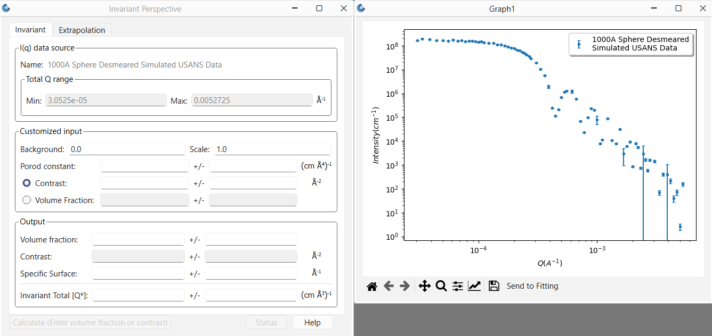

.. invariant_help.rst

.. This is a port of the original SasView html help file to ReSTructured text
.. by S King, ISIS, during SasView CodeCamp-III in Feb 2015.

Invariant Calculation
=====================

Description
-----------

The scattering, or Porod, invariant (:math:`Q^*`) is a model-independent quantity that
can be easily calculated from scattering data.

For two phase systems, the scattering invariant is defined as the integral of
the square of the wavevector transfer (:math:`Q`) multiplied by the scattering cross section
over the full range of :math:`Q` from zero to infinity, that is

.. math::

    Q^* = \int_0^ \infty q^2 I(q)\,dq

in the case of pinhole geometry (SAS).

For slit geometry (USAS) the invariant is given by

.. math::

    Q^* =  \int_0^\infty \Delta q_v \, qI(q)\,dq

where :math:`\Delta q_v` is the slit height.

The worth of :math:`Q^*` is that it can be used to determine the volume fraction
and the specific area of a sample. Whilst these quantities are useful in their
own right, they can also be used in further analysis.

The difficulty with using :math:`Q^*`  arises from the fact that experimental
data is never measured over the range :math:`0 \le Q \le \infty`. At best,
combining USAS and WAS data might cover the range
:math:`10^{-5} \le Q \le 10`|Ang|:math:`^{-1}`. Thus it is usually
necessary to extrapolate the experimental data to low and high :math:`Q`.
For this

High-\ :math:`Q` region (>= *Qmax* in data)

*  The power law function :math:`C/Q^4` is used where the constant
   :math:`C = 2 \pi \Delta\rho\, S_v` with
   :math:`\Delta\rho`, the scattering length density (SLD) contrast and
   :math:`S_v`, the specific surface area. The value of :math:`C` is to be found
   by fitting part of data within the range :math:`Q_{N-m}` to :math:`Q_N`
   (where :math:`m < N`), .

Low-\ :math:`Q` region (<= *Qmin* in data)

*  The Guinier function :math:`I(Q)=I(0) \exp (-R_g^2 Q^2/3)` where :math:`R_g`
   is the radius of gyration. The values of :math:`I(0)` and :math:`R_g` are
   obtained by fitting as for the high-\ :math:`Q` region above.
   Alternatively a power law can be used.

.. ZZZZZZZZZZZZZZZZZZZZZZZZZZZZZZZZZZZZZZZZZZZZZZZZZZZZZZZZZZZZZZZZZZZZZZZZZZZZ

Using invariant analysis
------------------------

1) Select *Invariant* from the *Analysis* menu on the SasView toolbar.

2) Load some data with the *Data Explorer*.

3) Select a dataset and use the *Send To* button on the *Data Explorer* to load
   the dataset into the *Invariant* panel.

4) Use the *Customised Input* box on the *Options* tab to subtract any
   background, specify the contrast (i.e. difference in SLDs - this must be
   specified for the eventual value of :math:`Q^*` to be on an absolute scale),
   or to rescale the data.

5) Adjust the extrapolation range in the *Options* tab as necessary. In most
   cases the default values will suffice.

6) Click the *Calculate* button.

7) To include a lower and/or higher :math:`Q` range, check the relevant *Enable
   Extrapolate* check boxes.

   .. figure:: image_invariant_option_tab.png

       ..

       *Option tab of the Invariant panel.*

   If power law extrapolations are chosen, the exponent can be either held
   fixed or fitted. The number of points, Npts, to be used for the basis of the
   extrapolation can also be specified in the related *Power* box(es).

   .. figure:: image_invariant_outplot_plot.png
       :width: 300pt

       ..

       *Output plot generated after calculations.*

8) If the value of :math:`Q^*` calculated with the extrapolated regions is
   invalid, the related box will be highlighted in red.

   The details of the calculation are available by clicking the *Status*
   button at the bottom of the panel.

   .. image:: image_invariant_details.png
      :width: 300pt

.. ZZZZZZZZZZZZZZZZZZZZZZZZZZZZZZZZZZZZZZZZZZZZZZZZZZZZZZZZZZZZZZZZZZZZZZZZZZZZ

Parameters
----------

Volume Fraction
^^^^^^^^^^^^^^^

The volume fraction :math:`\phi` is related to :math:`Q^*`  by

.. math::

    \phi(1 - \phi) = \frac{Q^*}{2\pi^2(\Delta\rho)^2} \equiv A

where :math:`\Delta\rho` is the SLD contrast.

.. math::

    \phi = \frac{1 \pm \sqrt{1 - 4A}}{2}

.. ZZZZZZZZZZZZZZZZZZZZZZZZZZZZZZZZZZZZZZZZZZZZZZZZZZZZZZZZZZZZZZZZZZZZZZZZZZZZ

Specific Surface Area
^^^^^^^^^^^^^^^^^^^^^

The specific surface area :math:`S_v` is related to :math:`Q^*`  by

.. math::

    S_v = \frac{2\pi\phi(1-\phi)C_p}{Q^*} = \frac{2\pi A C_p}{Q^*}

where :math:`C_p` is the Porod constant.

.. ZZZZZZZZZZZZZZZZZZZZZZZZZZZZZZZZZZZZZZZZZZZZZZZZZZZZZZZZZZZZZZZZZZZZZZZZZZZZ

Reference
---------

O. Glatter and O. Kratky
Chapter 2 in *Small Angle X-Ray Scattering*
Academic Press, New York, 1982

http://web.archive.org/web/20110824105537/http://physchem.kfunigraz.ac.at/sm/Service/Glatter_Kratky_SAXS_1982.zip

.. ZZZZZZZZZZZZZZZZZZZZZZZZZZZZZZZZZZZZZZZZZZZZZZZZZZZZZZZZZZZZZZZZZZZZZZZZZZZZZ

.. note::  This help document was last changed by Steve King, 01May2015
