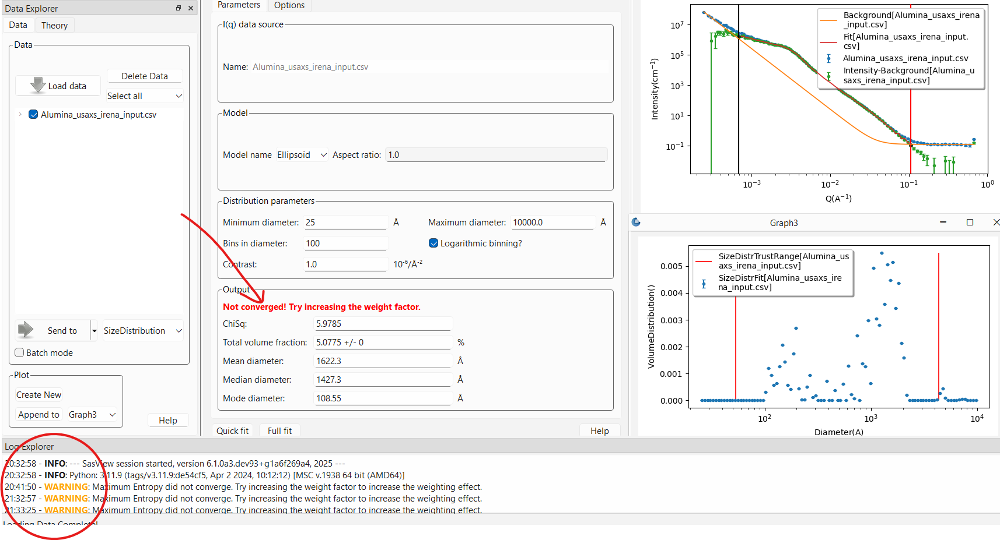

.. sizedistribution_help.rst

.. _Size_Distribution:

Size Distribution
=================

Principle
^^^^^^^^^

Size distribution analysis is a technique for extracting information from
scattering of a nominally two phase material where the shape of the domains
of the minority phase are assumed to be known, but the size distribution is
completely unknown. It is most often used in materials where the domain sizes
have an extremely large variation, such as pores in rocks, hence the oft used
term “pore size distribution” for this type of analysis. The scattered
intensity in this case is given by the integral of the scattering intensity
from every size present in the system. Basically a polydispersity integral of
the monodisperse I(Q) but where the shape of the distribution can be anything
and is most likely not possible to put in a parameterized analytical form. Thus
the equation to fit is:

.. math::
    I(Q)= \Delta \rho^2 \int N_p(r) P(Q,r) dr

Where $N_p(r)$ is the number density of particles of characteristic dimension
$r$, and $P(Q,r)$ is the form factor for that characteristic dimension. The
exact meaning of $r$ will of course depend on the model being used.For a
sphere $r$ is simply the radius of the sphere and the $P(Q,r)$ in this case
is given by:

.. math::
    P(Q,r) = \left[
        3V_p(\Delta\rho) \cdot \frac{\sin(Qr) - Qr\cos(Qr))}{(Qr)^3}
        \right]^2

SasView is using the sasmodels package which automatically scales to volume
fraction rather than number density using:

.. math::
    N_p = \phi/V_p

The current implementation uses an ellipsoid of revolution. Here $r$ in the
above equations is the equatorial radius. The default is for an ellipsoid with
polar radius = equatorial radius and thus an axial ratio of 1 which is a
sphere. The equation for an ellipsoid of revolution is given in the sasmodels
documentation and $r = R_{eq}$ with an eccentricity (aspect ratio) fixed by the
user which is $Ecc = R_{polar}/R_{eq}$. Other shapes are expected to be
added in the future.

The “fitting parameter” in this approach then is the distribution function.
In order to calculate this practically over a finite $Q$ range, we replace the
integral equation with the following sum, where $r_{min}$ and $r_{max}$ should
be within the range that will significantly affect the scattering in the $Q$
range being used.

.. math::
    I(Q)= \Delta \rho^2 \sum_{r_{min}}^{r_{max}} N_p(r) P(Q,r)

Even so, fitting is over determined, particularly given the noise in any real
data. Essentially, this is an ill posed problem. In order
to provide a reasonably robust solution, a regularization technique is generally
used. Here we implement only the most common MaxEnt (Maximum Entropy) method,
used for example by the famous CONTIN algorithm employed in light scattering.

.. note::
    The assumptions inherent in this method are:

    * The system can be approximated as a two phase system
    * The scattering length density of each phase is known
    * The minor phase is made up of domains of varying sizes but a fixed shape
    * The minor phase is sufficiently “dilute” as to not have any interdomain
      interference terms (i.e. no S(Q)}

Maximum Entropy
^^^^^^^^^^^^^^^
The concept of statistical entropy was first introduced by Claude Shannon in
1948 in his famous treatise, *A Mathematical Theory of Communication*,
considered the foundation of information theory [#Shannon1]_, [#Shannon2]_,
[#Shannon3]_. Later, in 1957, E. T. Jaynes introduced the principle of **maximum entropy** in
two key papers [#Jaynes1]_, [#Jaynes2]_ where he emphasized a natural
correspondence between statistical mechanics and information theory. In this
framework, the best solution to an optimization problem is the solution that
leads to the **Maximum Entropy** where the Shannon Entropy is defined as:

.. math::
    H(X) = - \sum_{i} p(x_i) ln p(x_i)

Where $p(x_i)$ is the probability of the ith distribution.

In a nutshell, the idea of the maximum entropy method is that the most probable
distribution that satisfies all the known constraints is the best answer to the
optimization problem. Also known as the “maximum ignorance” answer, and is the
solution with the maximum “entropy.” In other words, the answer that makes the
fewest assumptions beyond what is known.

Here, the known constraint is that $\chi^2$ between the scattering data and the
scattered intensity expected from a system of the chosen shape, with the
solution distribution of sizes, must be minimized.  In other words, of all the
distributions that would satisfy the $\chi^2$ constraint, we find the one with
the maximum entropy. The size distribution problem however is too complex to be
conducive to an analytical solution and so an iterative process is employed.
Here we employ an  algorithm due to Skillings and Bryan [#SkillingsAndBryan]_
as implemented in GSAS II [#GSAS]_.

Using the Size Distribution Analysis
^^^^^^^^^^^^^^^^^^^^^^^^^^^^^^^^^^^^
Load some data with the *Data Explorer.*

Select a dataset and use the *Send To* button on the *Data Explorer* to load
the dataset into the *Size Distribution* panel.

This will open the panel on the *Parameters* tab and plot the data to fit.
The most important parameters to adjust at this point are the minimum and
maximum diameters of the distribution. The calculation will only explore
diameters in this range. It is important that the range of diameters be
sufficient to fit the full $Q$ range of the data (within the minimum and
maximum bounds set, if any). For example, if the largest diameter will be in the
Guinier region in a $Q$ range where the data is stil showing growth, the fit
will never be able to converge. Likewise, if the smallest diameter allowed
is larger than can be "seen" at the highest $Q$ in the data, it may also be
hard for the fit to converge. On the other hand, it is best not to excessively
exceed the limits imposed by the $Q$ range being fit.

If the data is on absolute scale and a quantitative volume fraction is desired the
contrast factor between the domain of interest and the matrix must be set
correctly. Otherwise, the value is not important and can be left alone.

The number of bins sets the number of sizes within the size range that will be
calculated.

The models section default is usually appropriate. Currently, only the ellipsoid
model is implemented. This may be expanded in the future to include cylinders
for example. The aspect ratio for the ellipsoid however can be changed. The
default of 1 is for a sphere. An aspect ratio greater than 1 will yield a
prolate ellipsoid while a value smaller than 1 is for an oblate ellipsoid.

.. Warning::

   The Size Distribution analysis assumes the data is properly background
   subtracted. The smaller sizes in particular will be very sensitive to that.
   If this is not the case for your data, proceed to the options tab as
   described below and ensure that the background subtraction is set correctly.

At this point, one can run a fit.  There are two buttons at the bottom of the
panel: *Qick fit* and *Full fit*. One should always start with the
*Quick fit*. The only difference between the two is that the first will only
run the calculation once and produce the result.

After a short time, the graph will be updated with the fit to the data using
the resulting distribution, while a second plot will pop up showing the final
distribution of sizes that are returned, giving the volume fraction (true or
relative depending on whether the data are on absolute scale or not) of each
size. Finally the *Output* section of the *Parameters* tab will show the
results including whether or not the fitting converged, the reduced
$\chi^2$, the percent volume fraction of domains (assuming absolute scaled
data and correct contrast term) along with statistics on the diameter such
as the mean and median.

.. note::

   Currently the diameter averages are given in terms of the volume
   distribution not the number distribution. Thus the mean diameter
   is essentially weighted towards the largest sizes. The number
   distribution may be given in future versions.

In the plot representing the distribution of sizes there are also two red
vertical lines. These lines represent a conservative estimate of the sizes that
are well within the $Q$ range of the fit and thus "trustable." Any amount of
sizes outside that range should be considered highly suspect!

.. note::

   This is usually a fairly ill posed problem and the fitting may not converge.
   This will pop up a ``WARNING:`` in the log explorer warning that this is
   the case. The results panel will also note in **bold red font** that the
   fitting did not converge. The algorithm will return the values from the last
   iteration that was run but should be viewed with suspicion. One should
   **never** report values from an unconverged fit!

Once one is happy with the *Quick fit* results, it is recommended to finish by
running a *Full fit*. This will run the same fit ten times over. However, each
time the input data will be "randomized" within the data's error bars to
account for the noise in the data. The sigma on the resulting distribution
magnitudes provides an estimate of the uncertainties on those values and the
resulting total volume fraction.

Refining the fit
^^^^^^^^^^^^^^^^
In order to get a more reasonable fit, and in particular one that converges, it
will often be necessary to adjust the parameters on the *Options* tab.

The first thing to worry about, as noted above, is the background subtraction.
The usual high Q background can be entered if known. It can also
be estimated using a Porod Plot (available using the linearized fits in
SasView). This is probably the most accurate way to determine the background
if it is not known. Alternatively, if there are sufficient points in the data
that are clearly in the flat background region, the background can be estimated
by providing the minimum and maximum $Q$ where the data is flat and then
pressing the ``Fit flat background`` button in the *Options* tab. The values to
use for the $Q$ limits can be read off the plot by moving the cursor over the
points at the extremes and reading off the x value given in the bottom right of
the plot.

At times the data may also have a low $Q$ background due for example to the
interface scattering from a powder sample. In most cases this should be a -4
power law expected from sharp interfaces (the Porod Law for smooth surfaces
at the length scales being probed) though there may be times when a different
power law is appropriate. However the scale factor will certainly need
adjusting. This can be done by first checking the ``Subtract Low-Q power law``
check box. At this point, once again it can be done manually. The plot will
update each time enter is pressed after changing a background value to show
both the background curve and the subtracted data. The user can then iterate
to find the best values. Alternatively, and again giving the minimum and
maximum $Q$ values that are 100% dominated by the low $Q$ background term and
pressing ``Fit power law``, the program will estimate the values by fitting a
power law to the region of data indicated. Here one can choose to fix the
power law exponent to a known value (the default) and only the scale factor
will be estimated, or, by checking the ``Fit`` radio button next to the
``power`` text entry box, both the power law exponent and scale factor will
be estimated.

Once the backgrounds are subtracted properly, the range of $Q$ to be fit can
also be limited using either the range sliders in the plot or entering the
values in the ``Fitting range`` box of the *Options* tab. Remember that these
$Q$ bounds define the range of diameters that can be probed using this method.

Next the ``Weighting`` box parameters can be adjusted. SasView automatically
sets the fitting to use the uncertainty data associated with the data, or,
if no uncertainties are given with the data (which should never be the case),
will set it to 1% of the intensity value for each data point. No uncertainty
on the data points will almost always fail to converge. There are a couple of
other options, neither great choices, to mitigate this. But to be very clear,
it is **HIGHLY** discouraged to use data without uncertainties.

That said, scattering data never accounts for anything but counting statistics.
When the uncertainty is dominated by those this can be reasonable. However, if
it is not, then the uncertainties can be far too small. This will have a huge
impact on the ability of this analyis to converge. This is often a problem
with X-ray data for example, but is true for most data and a particular problem
here because one of the criteria for convergence is that $\chi^2$ be within 1\%
of 1.0 (so 0.99 < $\chi^2$ < 1.01). A first order correction is made available
here in the ``Weight factor`` box. The value entered here effectivly increases
the size of the uncertainties sent to the fitting routine by that factor.
Larger error bars will decrease $\chi^2$ thus making convergence easier.

Finally, there is a ``Method parameters`` box which contains two adjustable
parameters:

* ``MaxEnt Sky Background``. This is a value that should be small and probably
  never adjusted unless one knows what one is doing. Basically it adds a level
  of *inherent* background.
* ``Iterations``. This sets the maximum number of iterations the Maximum
  Entropy optimization routine will perform before it stops and returns a
  "not converged" error. In general, if the routine does not converge in 100
  iterations it probably won't. Typical numbers of iterations for convergence
  range from 5 to 30. It is possible to increase the limit to whatever number
  one has patience for.

.. ZZZZZZZZZZZZZZZZZZZZZZZZZZZZZZZZZZZZZZZZZZZZZZZZZZZZZZZZZZZZZZZZZZZZZZZZZZZZZ

Reference
---------
.. [#Shannon1] C. E. Shannon "A mathematical theory of communication" in *The
   Bell System Technical Journal* **27**, 379-423 (1948).
   `DOI: 10.1002/j.1538-7305.1948.tb01338.x <https://doi.org/10.1002/j.1538-7305.1948.tb01338.x>`_

.. [#Shannon2] C. E. Shannon "A mathematical theory of communication" in *The
   Bell System Technical Journal* **27**, 623-656 (1948).
   `DOI: 10.1002/j.1538-7305.1948.tb00917.x. <https://doi.org/10.1002/j.1538-7305.1948.tb00917.x>`_

.. [#Shannon3] https://web.archive.org/web/19980715013250/http://cm.bell-labs.com/cm/ms/what/shannonday/shannon1948.pdf

.. [#Jaynes1] E. T. Jaynes "Information Theory and Statistical Mechanics" *Phys. Rev.* **106**, 620 (1957)
   `DOI: 10.1103/PhysRev.106.620 <https://doi.org/10.1103/PhysRev.106.620>`_

.. [#Jaynes2] E. T. Jaynes "Information Theory and Statistical Mechanics. II" *Phys. Rev.* **108**, 171 (1957)
   `DOI: 10.1103/PhysRev.108.171 <https://doi.org/10.1103/PhysRev.108.171>`_

.. [#SkillingsAndBryan] J. Skilling and R. K. Bryan Monthly *Notices of the Royal Astronomical Society*
   **211**, 111–124 (1984).
   `DOI: 10.1093/mnras/211.1.111 <https://doi.org/10.1093/mnras/211.1.111>`_

.. [#GSAS] https://advancedphotonsource.github.io/GSAS-II-tutorials/. The size
   distribution code is mostly in the `GSASIIsasd.py module <https://subversion.xray.aps.anl.gov/pyGSAS/trunk/GSASIIsasd.py>`_

.. ZZZZZZZZZZZZZZZZZZZZZZZZZZZZZZZZZZZZZZZZZZZZZZZZZZZZZZZZZZZZZZZZZZZZZZZZZZZZZ

.. note::  This help document was last modified by Paul Butler on May 30, 2025
