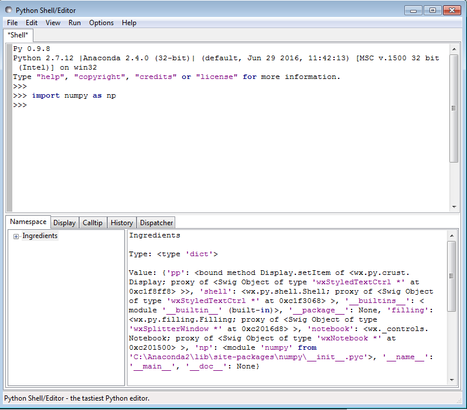

.. python_shell_help.rst

.. This is a port of the original SasView html help file to ReSTructured text
.. by S King, ISIS, during SasView CodeCamp-III in Feb 2015.
.. Text revised during Code Camp V in Oct 2016.

.. _Python_shell:

Python Shell-Editor Tool
========================

Description 
-----------

This is a Python shell/editor provided with WxPython.

For the help about Python, visit the website http://docs.python.org/tutorial/

.. note:: This shell/editor has its own help, but the Help() and Credits() calls do not work on Macs.

The NumPy, SciPy, and Matplotlib, etc, libraries are shipped with SasView and so functions from these can be imported into the shell/editor, however, some functionality may not work.

When a Python file, for example a fitting model, is created or loaded with the *New* or *Open* options from the menu, a new tab opens with an editing notebook.

.. image:: new_pycrust_example_2.png
   :align: center

If a Python (.py) model has a linked C (.c) subroutine *in the same folder* then the shell/editor will open both! However input focus is usually transferred to the tab with the .c file.

To compile a model, select *Run* > *Check Model* from the shell/editor menu. If the model contains a unit test (which it should!!!) then this will also run and a popup window will report the success/failure of the test.

.. ZZZZZZZZZZZZZZZZZZZZZZZZZZZZZZZZZZZZZZZZZZZZZZZZZZZZZZZZZZZZZZZZZZZZZZZZZZZZZ

.. note::  This help document was last changed by Steve King, 10Oct2015
