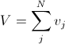
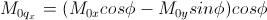
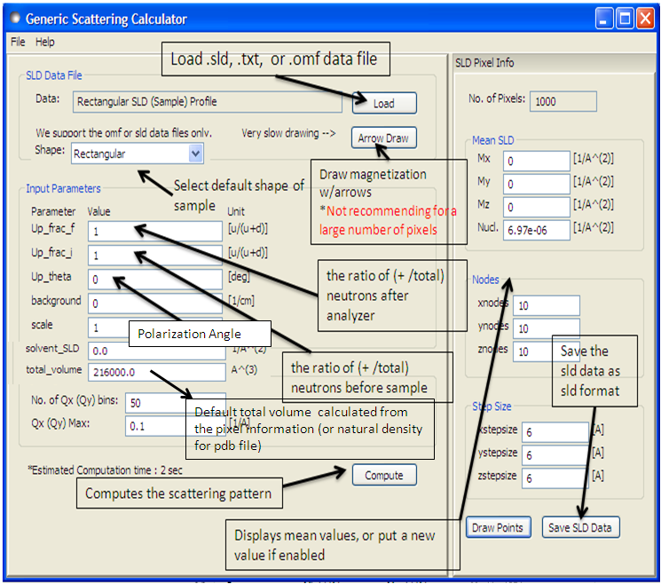

.. sas_calculator_help.rst

.. This is a port of the original SasView html help file to ReSTructured text
.. by S King, ISIS, during SasView CodeCamp-III in Feb 2015.

Generic SANS Calculator Tool
============================

Description
-----------

This tool attempts to simulate the SANS expected from a specified
shape/structure or scattering length density profile. The tool can
handle both nuclear and magnetic contributions to the scattering.

Theory
------

In general, a particle with a volume *V* can be described by an ensemble 
containing *N* 3-dimensional rectangular pixels where each pixel is much 
smaller than *V*.

Assuming that all the pixel sizes are the same, the elastic scattering 
intensity from the particle is

.. image:: gen_i.gif

Equation 1.

where |beta|\ :sub:`j` and *r*\ :sub:`j` are the scattering length density and 
the position of the j'th pixel respectively.

The total volume *V*

for |beta|\ :sub:`j` |noteql|\0 where *v*\ :sub:`j` is the volume of the j'th 
pixel (or the j'th natural atomic volume (= atomic mass / (natural molar 
density * Avogadro number) for the atomic structures).

*V* can be corrected by users. This correction is useful especially for an 
atomic structure (such as taken from a PDB file) to get the right normalization. 

*NOTE!* |beta|\ :sub:`j` *displayed in the GUI may be incorrect but this will not 
affect the scattering computation if the correction of the total volume V is made.*

The scattering length density (SLD) of each pixel, where the SLD is uniform, is 
a combination of the nuclear and magnetic SLDs and depends on the spin states 
of the neutrons as follows.

Magnetic Scattering
^^^^^^^^^^^^^^^^^^^

For magnetic scattering, only the magnetization component, *M*\ :sub:`perp`\ , 
perpendicular to the scattering vector *Q* contributes to the magnetic 
scattering length.

.. image:: mag_vector.bmp

The magnetic scattering length density is then

.. image:: dm_eq.gif

where the gyromagnetic ratio |gamma| = -1.913, |mu|\ :sub:`B` is the Bohr 
magneton, *r*\ :sub:`0` is the classical radius of electron, and |sigma| is the 
Pauli spin.

For a polarized neutron, the magnetic scattering is depending on the spin states.

Let us consider that the incident neutrons are polarised both parallel (+) and  
anti-parallel (-) to the x' axis (see below). The possible states after 
scattering from the sample are then 

*  Non-spin flips: (+ +) and (- -)
*  Spin flips:     (+ -) and (- +)

.. image:: gen_mag_pic.bmp

Now let us assume that the angles of the *Q* vector and the spin-axis (x') 
to the x-axis are |phi| and |theta|\ :sub:`up` respectively (see above). Then, 
depending upon the polarization (spin) state of neutrons, the scattering 
length densities, including the nuclear scattering length density (|beta|\ :sub:`N`\ ) 
are given as

*  for non-spin-flips

   .. image:: sld1.gif

*  for spin-flips

   .. image:: sld2.gif

where

.. image:: mxp.gif

.. image:: myp.gif

.. image:: mzp.gif

.. image:: mqy.gif

Here the *M0*\ :sub:`x`\ , *M0*\ :sub:`y` and *M0*\ :sub:`z` are the x, y and z 
components of the magnetisation vector in the laboratory xyz frame. 

.. ZZZZZZZZZZZZZZZZZZZZZZZZZZZZZZZZZZZZZZZZZZZZZZZZZZZZZZZZZZZZZZZZZZZZZZZZZZZZ

Using the tool
--------------

After computation the result will appear in the *Theory* box in the SasView  
*Data Explorer* panel.

*Up_frac_in* and *Up_frac_out* are the ratio 

   (spin up) / (spin up + spin down)
   
of neutrons before the sample and at the analyzer, respectively.

*NOTE 1. The values of* Up_frac_in *and* Up_frac_out *must be in the range 
0.0 to 1.0. Both values are 0.5 for unpolarized neutrons.*

*NOTE 2. This computation is totally based on the pixel (or atomic) data fixed 
in xyz coordinates. No angular orientational averaging is considered.*

*NOTE 3. For the nuclear scattering length density, only the real component 
is taken account.*

.. ZZZZZZZZZZZZZZZZZZZZZZZZZZZZZZZZZZZZZZZZZZZZZZZZZZZZZZZZZZZZZZZZZZZZZZZZZZZZ

Using PDB/OMF or SLD files
--------------------------

The SANS Calculator tool can read some PDB, OMF or SLD files but ignores
polarized/magnetic scattering when doing so, thus related parameters such as 
*Up_frac_in*, etc, will be ignored.

The calculation for fixed orientation uses Equation 1 above resulting in a 2D 
output, whereas the scattering calculation averaged over all the orientations 
uses the Debye equation below providing a 1D output

.. image:: gen_debye_eq.gif

where *v*\ :sub:`j` |beta|\ :sub:`j` |equiv| *b*\ :sub:`j` is the scattering 
length of the j'th atom. The calculation output is passed to the *Data Explorer* 
for further use.

.. image:: pdb_combo.jpg

.. ZZZZZZZZZZZZZZZZZZZZZZZZZZZZZZZZZZZZZZZZZZZZZZZZZZZZZZZZZZZZZZZZZZZZZZZZZZZZZ

.. note::  This help document was last changed by Steve King, 01May2015
