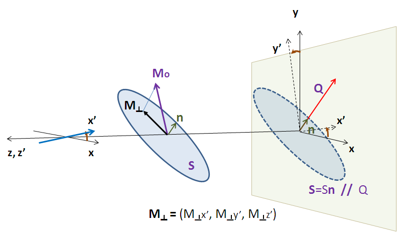

.. sas_calculator_help.rst

.. This is a port of the original SasView html help file to ReSTructured text
.. by S King, ISIS, during SasView CodeCamp-III in Feb 2015.

.. _SANS_Calculator_Tool:

Generic SANS Calculator Tool
============================

Description
-----------

This tool attempts to simulate the SANS expected from a specified
shape/structure or scattering length density profile. The tool can
handle both nuclear and magnetic contributions to the scattering.

Theory
------

In general, a particle with a volume $V$ can be described by an ensemble
containing $N$ 3-dimensional rectangular pixels where each pixel is much
smaller than $V$.

Assuming that all the pixel sizes are the same, the elastic scattering
intensity from the particle is

.. math::

    I(\vec Q) = \frac{1}{V}\left|
        \sum_j^N v_j \beta_j \exp(i\vec Q \cdot \vec r_j)\right|^2

Equation 1.

where $\beta_j$ and $r_j$ are the scattering length density and
the position of the $j^\text{th}$ pixel respectively.

The total volume $V$

.. math::

    V = \sum_j^N v_j

for $\beta_j \ne 0$ where $v_j$ is the volume of the $j^\text{th}$
pixel (or the $j^\text{th}$ natural atomic volume (= atomic mass / (natural molar
density * Avogadro number) for the atomic structures).

$V$ can be corrected by users. This correction is useful especially for an
atomic structure (such as taken from a PDB file) to get the right normalization.

*NOTE!* $\beta_j$ *displayed in the GUI may be incorrect but this will not
affect the scattering computation if the correction of the total volume V is made.*

The scattering length density (SLD) of each pixel, where the SLD is uniform, is
a combination of the nuclear and magnetic SLDs and depends on the spin states
of the neutrons as follows.

Magnetic Scattering
^^^^^^^^^^^^^^^^^^^

For magnetic scattering, only the magnetization component, $\mathbf{M}_\perp$,
perpendicular to the scattering vector $\vec Q$ contributes to the magnetic
scattering length.

The magnetic scattering length density is then

.. math::

    \beta_M = \frac{\gamma r_0}{2 \mu_B}\sigma \cdot \mathbf{M}_\perp
        = D_M\sigma \cdot \mathbf{M}_\perp

where the gyromagnetic ratio is $\gamma = -1.913$, $\mu_B$ is the Bohr
magneton, $r_0$ is the classical radius of electron, and $\sigma$ is the
Pauli spin.

For a polarized neutron, the magnetic scattering is depending on the spin states.

Let us consider that the incident neutrons are polarised both parallel (+) and
anti-parallel (-) to the x' axis (see below). The possible states after
scattering from the sample are then

*  Non-spin flips: (+ +) and (- -)
*  Spin flips:     (+ -) and (- +)

Now let us assume that the angles of the $\vec Q$ vector and the spin-axis ($x'$)
to the $x$-axis are $\phi$ and $\theta_\mathrm{up}$ respectively (see above). Then,
depending upon the polarization (spin) state of neutrons, the scattering
length densities, including the nuclear scattering length density ($\beta_N$)
are given as

*  for non-spin-flips

.. math::
    \beta_{\pm\pm} = \beta_N \mp D_M M_{\perp x'}

*  for spin-flips

.. math::
    \beta_{\pm\mp} = - D_M(M_{\perp y'} \pm i M_{\perp z'})

where

.. math::

    M_{\perp x'} &= M_{0q_x}\cos\theta_\mathrm{up} + M_{0q_y}\sin\theta_\mathrm{up} \\
    M_{\perp y'} &= M_{0q_y}\cos\theta_\mathrm{up} - M_{0q_x}\sin\theta_\mathrm{up} \\
    M_{\perp z'} &= M_{0z} \\
    M_{0q_x} &= (M_{0x}\cos\phi - M_{0y}\sin\phi)\cos\phi \\
    M_{0q_y} &= (M_{0y}\sin\phi - M_{0y}\cos\phi)\sin\phi

Here the $M_{0x}$, $M_{0y}$ and $M_{0z}$ are
the $x$, $y$ and $z$ components of the magnetisation vector in the
laboratory $x$-$y$-$z$ frame.

.. ZZZZZZZZZZZZZZZZZZZZZZZZZZZZZZZZZZZZZZZZZZZZZZZZZZZZZZZZZZZZZZZZZZZZZZZZZZZZ

Using the tool
--------------

After computation the result will appear in the *Theory* box in the SasView
*Data Explorer* panel.

*Up_frac_in* and *Up_frac_out* are the ratio

   (spin up) / (spin up + spin down)

of neutrons before the sample and at the analyzer, respectively.

*NOTE 1. The values of* Up_frac_in *and* Up_frac_out *must be in the range
0.0 to 1.0. Both values are 0.5 for unpolarized neutrons.*

*NOTE 2. This computation is totally based on the pixel (or atomic) data fixed
in xyz coordinates. No angular orientational averaging is considered.*

*NOTE 3. For the nuclear scattering length density, only the real component
is taken account.*

.. ZZZZZZZZZZZZZZZZZZZZZZZZZZZZZZZZZZZZZZZZZZZZZZZZZZZZZZZZZZZZZZZZZZZZZZZZZZZZ

Using PDB/OMF or SLD files
--------------------------

The SANS Calculator tool can read some PDB, OMF or SLD files but ignores
polarized/magnetic scattering when doing so, thus related parameters such as
*Up_frac_in*, etc, will be ignored.

The calculation for fixed orientation uses Equation 1 above resulting in a 2D
output, whereas the scattering calculation averaged over all the orientations
uses the Debye equation below providing a 1D output

.. math::

    I(|\vec Q|) = \frac{1}{V}\sum_j^N v_j\beta_j \sum_k^N v_k \beta_k
        \frac{\sin(|\vec Q||\vec r_j - \vec r_k|)}{|\vec Q||\vec r_j - \vec r_k|}

where $v_j \beta_j \equiv b_j$ is the scattering
length of the $j^\text{th}$ atom. The calculation output is passed to the *Data Explorer*
for further use.

.. image:: pdb_combo.jpg

.. ZZZZZZZZZZZZZZZZZZZZZZZZZZZZZZZZZZZZZZZZZZZZZZZZZZZZZZZZZZZZZZZZZZZZZZZZZZZZZ

.. note::  This help document was last changed by Steve King, 01May2015
