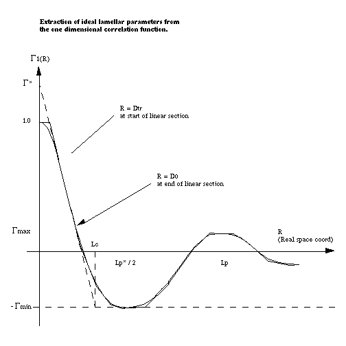

.. corfunc_help.rst

.. _Correlation_Function_Analysis:

Correlation Function Analysis
=============================

Description
-----------

This currently performs correlation function analysis on SAXS/SANS data, 
but in the the future is also planned to generate model-independent volume 
fraction profiles from the SANS from adsorbed polymer/surfactant layers. 
The two types of analyses differ in the mathematical transform that is 
applied to the data (Fourier vs Hilbert). However, both functions are 
returned in *real space*.

A correlation function may be interpreted in terms of an imaginary rod moving
through the structure of the material. Γ(x) is the probability that a rod of 
length x has equal electron/neutron scattering length density at either end. 
Hence a frequently occurring spacing within a structure will manifest itself 
as a peak in Γ(x). *SasView* will return both the one-dimensional ( Γ\ :sub:`1`\ (x) ) 
and three-dimensional ( Γ\ :sub:`3`\ (x) ) correlation functions, the difference 
being that the former is only averaged in the plane of the scattering vector.

A volume fraction profile :math:`\Phi`\ (z) describes how the density of polymer 
segments/surfactant molecules varies with distance, z, normal to an (assumed 
locally flat) interface. The form of :math:`\Phi`\ (z) can provide information 
about the arrangement of polymer/surfactant molecules at the interface. The width 
of the profile provides measures of the layer thickness, and the area under 
the profile is related to the amount of material that is adsorbed.

Both analyses are performed in 3 stages:

*  Extrapolation of the scattering curve to :math:`q = 0` and toward 
   :math:`q = \infty`
*  Smoothed merging of the two extrapolations into the original data
*  Fourier / Hilbert Transform of the smoothed data to give the correlation
   function or volume fraction profile, respectively
*  (Optional) Interpretation of Γ\ :sub:`1`\ (x) assuming the sample conforms 
   to an ideal lamellar morphology

.. ZZZZZZZZZZZZZZZZZZZZZZZZZZZZZZZZZZZZZZZZZZZZZZZZZZZZZZZZZZZZZZZZZZZZZZZZZZZZ

Extrapolation
-------------

To :math:`q = 0`
................

The data are extrapolated to q = 0 by fitting a Guinier function to the data
points in the low-q range.

The equation used is:

.. math::
    I(q) = A e^{Bq^2}

Where the parameter :math:`B` is related to the effective radius-of-gyration of 
a spherical object having the same small-angle scattering in this region.
	
Note that as q tends to zero this function tends to a limiting value and is 
therefore less appropriate for use in systems where the form factor does not 
do likewise. However, because of the transform, the correlation functions are 
most affected by the Guinier back-extrapolation at *large* values of x where 
the impact on any extrapolated parameters will be least significant.

To :math:`q = \infty`
.....................

The data are extrapolated towards q = :math:`\infty` by fitting a Porod model to
the data points in the high-q range and then computing the extrapolation to 100 
times the maximum q value in the experimental dataset. This should be more than 
sufficient to ensure that on transformation any truncation artefacts introduced 
are at such small values of x that they can be safely ignored.

The equation used is:

.. math::
    I(q) = K q^{-4}e^{-q^2\sigma^2} + Bg

Where :math:`Bg` is the background, :math:`K` is the Porod constant, and :math:`\sigma` (which 
must be > 0) describes the width of the electron/neutron scattering length density 
profile at the interface between the crystalline and amorphous regions as shown below.

.. figure:: fig1.png
   :align: center

Smoothing
---------

The extrapolated data set consists of the Guinier back-extrapolation from q ~ 0
up to the lowest q value in the original data, then the original scattering data, 
and then the Porod tail-fit beyond this. The joins between the original data and 
the Guinier/Porod extrapolations are smoothed using the algorithm below to try 
and avoid the formation of truncation ripples in the transformed data:

Functions :math:`f(x_i)` and :math:`g(x_i)` where :math:`x_i \in \left\{
{x_1, x_2, ..., x_n} \right\}`, are smoothed over the range :math:`[a, b]`
to produce :math:`y(x_i)`, by the following equations:

.. math::
    y(x_i) = h_ig(x_i) + (1-h_i)f(x_i)

where:

.. math::
    h_i = \frac{1}{1 + \frac{(x_i-b)^2}{(x_i-a)^2}}

Transformation
--------------

Fourier
.......

If "Fourier" is selected for the transform type, *SasView* will perform a
discrete cosine transform on the extrapolated data in order to calculate the
1D correlation function as:

.. math::
    \Gamma _{1}(x) = \frac{1}{Q^{*}} \int_{0}^{\infty }I(q) q^{2} cos(qx) dq

where Q\ :sup:`*` is the Scattering (also called Porod) Invariant.

The following algorithm is applied:

.. math::
    \Gamma(x_k) = 2 \sum_{n=0}^{N-1} x_n \cos{\left[ \frac{\pi}{N}
    \left(n + \frac{1}{2} \right) k \right] } \text{ for } k = 0, 1, \ldots,
    N-1, N

The 3D correlation function is calculated as:

.. math::
    \Gamma _{3}(x) = \frac{1}{Q^{*}} \int_{0}^{\infty}I(q) q^{2}
    \frac{sin(qx)}{qx} dq

.. note:: It is always advisable to inspect Γ\ :sub:`1`\ (x) and Γ\ :sub:`3`\ (x) 
    for artefacts arising from the extrapolation and transformation processes:
	
	- do they tend to zero as x tends to :math:`\infty`?
	- do they smoothly curve onto the ordinate at x = 0? (if not check the value 
	  of :math:`\sigma` is sensible)
	- are there ripples at x values corresponding to (2 :math:`\pi` over) the two 
	  q values at which the extrapolated and experimental data are merged?
	- are there any artefacts at x values corresponding to 2 :math:`\pi` / q\ :sub:`max` in 
	  the experimental data? 
	- and lastly, do the significant features/peaks in the correlation functions 
	  actually correspond to anticpated spacings in the sample?!!!

Finally, the program calculates the interface distribution function (IDF) g\ :sub:`1`\ (x) as 
the discrete cosine transform of:

.. math::
    -q^{4} I(q)

The IDF is proportional to the second derivative of Γ\ :sub:`1`\ (x) and represents a 
superposition of thickness distributions from all the contributing lamellae. 

Hilbert
.......
	
If "Hilbert" is selected for the transform type, the analysis will perform a
Hilbert transform on the extrapolated data in order to calculate the Volume
Fraction Profile.

.. note:: The Hilbert transform functionality is not yet implemented in SasView.

Interpretation
--------------

Correlation Function
....................

Once the correlation functions have been calculated *SasView* can be asked to 
try and interpret Γ\ :sub:`1`\ (x) in terms of an ideal lamellar morphology 
as shown below.

The structural parameters extracted are:

*   Long Period :math:`= L_p`
*   Average Hard Block Thickness :math:`= L_c`
*   Average Core Thickness :math:`= D_0`
*   Average Interface Thickness :math:`= D_{tr}`
*   Polydispersity :math:`= \Gamma_{\mathrm{min}}/\Gamma_{\mathrm{max}}`
*   Local Crystallinity :math:`= L_c/L_p`

.. warning:: If the sample does not possess lamellar morphology then "Compute 
    Parameters" will return garbage!
	

Volume Fraction Profile
.......................

SasView does not provide any automatic interpretation of volume fraction profiles 
in the same way that it does for correlation functions. However, a number of 
structural parameters are obtainable by other means:

*   Surface Coverage :math:`=\theta`
*   Anchor Separation :math:`= D`
*   Bound Fraction :math:`= 
`
*   Second Moment :math:`= \sigma`
*   Maximum Extent :math:`= \delta_{\mathrm{h}}`
*   Adsorbed Amount :math:`= \Gamma`

.. figure:: profile1.png
   :align: center

.. figure:: profile2.png
   :align: center

The reader is directed to the references for information on these parameters.

References
----------

Correlation Function
....................

Strobl, G. R.; Schneider, M. *J. Polym. Sci.* (1980), 18, 1343-1359

Koberstein, J.; Stein R. *J. Polym. Sci. Phys. Ed.* (1983), 21, 2181-2200

Baltá Calleja, F. J.; Vonk, C. G. *X-ray Scattering of Synthetic Poylmers*, Elsevier. Amsterdam (1989), 247-251

Baltá Calleja, F. J.; Vonk, C. G. *X-ray Scattering of Synthetic Poylmers*, Elsevier. Amsterdam (1989), 257-261

Baltá Calleja, F. J.; Vonk, C. G. *X-ray Scattering of Synthetic Poylmers*, Elsevier. Amsterdam (1989), 260-270

Göschel, U.; Urban, G. *Polymer* (1995), 36, 3633-3639

Stribeck, N. *X-Ray Scattering of Soft Matter*, Springer. Berlin (2007), 138-161

:ref:`FDR` (PDF format)

Volume Fraction Profile
.......................

Washington, C.; King, S. M. *J. Phys. Chem.*, (1996), 100, 7603-7609

Cosgrove, T.; King, S. M.; Griffiths, P. C. *Colloid-Polymer Interactions: From Fundamentals to Practice*, Wiley. New York (1999), 193-204

King, S. M.; Griffiths, P. C.; Cosgrove, T. *Applications of Neutron Scattering to Soft Condensed Matter*, Gordon & Breach. Amsterdam (2000), 77-105

King, S.; Griffiths, P.; Hone, J.; Cosgrove, T. *Macromol. Symp.* (2002), 190, 33-42

.. ZZZZZZZZZZZZZZZZZZZZZZZZZZZZZZZZZZZZZZZZZZZZZZZZZZZZZZZZZZZZZZZZZZZZZZZZZZZZ

Usage
-----
Upon sending data for correlation function analysis, it will be plotted (minus
the background value), along with a *red* bar indicating the *upper end of the
low-Q range* (used for Guinier back-extrapolation), and 2 *purple* bars indicating 
the range to be used for Porod forward-extrapolation. These bars may be moved by 
grabbing and dragging, or by entering appropriate values in the Q range input boxes.

.. figure:: tutorial1.png
   :align: center

Once the Q ranges have been set, click the "Calculate Bg" button to determine the 
background level. Alternatively, enter your own value into the box. If the box turns 
yellow this indicates that background subtraction has created some negative intensities. 
This may still be fine provided the peak intensity is very much greater than the 
background level. The important point is that the extrapolated dataset must approach 
zero at high-q.

Now click the "Extrapolate" button to extrapolate the data. The graph window will update 
to show the extrapolated data, and the values of the parameters used for the Guinier and 
Porod extrapolations will appear in the "Extrapolation Parameters" section of the SasView 
GUI.

.. figure:: tutorial2.png
   :align: center

Now select which type of transform you would like to perform, using the radio
buttons:

*   **Fourier**: to perform a Fourier Transform to calculate the correlation
    functions
*   **Hilbert**: to perform a Hilbert Transform to calculate the volume fraction
    profile

and click the "Transform" button to perform the selected transform and plot
the results.

 .. figure:: tutorial3.png
    :align: center

If a Fourier Transform was performed, the "Compute Parameters" button can now be 
clicked to interpret the correlation function as described earlier. The parameters 
will appear in the "Output Parameters" section of the SasView GUI.

 .. figure:: tutorial4.png
    :align: center

.. note::
    This help document was last changed by Steve King, 28Sep2017
