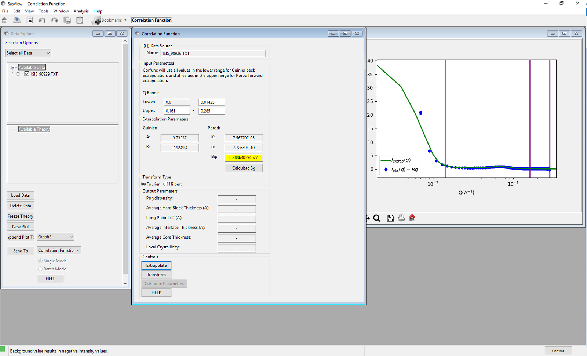

.. corfunc_help.rst

Correlation Function Perspective
================================

Description
-----------

This perspective performs a correlation function analysis of one-dimensional
SANS data, or generates a model-independent volume fraction profile from a
one-dimensional SANS pattern of an adsorbed layer.

The correlation function analysis is performed in 3 stages:

*  Extrapolation of the scattering curve to :math:`Q = 0` and
   :math:`Q = \infty`
*  Fourier/Hilbert Transform of the extrapolated data to give the correlation
   function/volume fraction profile
*  Interpretation of the 1D correlation function based on an ideal lamellar
   morphology

.. ZZZZZZZZZZZZZZZZZZZZZZZZZZZZZZZZZZZZZZZZZZZZZZZZZZZZZZZZZZZZZZZZZZZZZZZZZZZZ

Extrapolation
-------------

To :math:`Q = 0`
^^^^^^^^^^^^^^^^

The data are extrapolated to Q = 0 by fitting a Guinier model to the data
points in the lower Q range.
The equation used is:

.. math::
    I(Q) = Ae^{Bq^2}

The Guinier model assumes that the small angle scattering arises from particles
and that parameter :math:`B` is related to the radius of gyration of those
particles. This has dubious applicability to polymer systems. However, the
correlation function is affected by the Guinier back-extrapolation to the
greatest extent at large values of R and so the back-extrapolation only has a
small effect on the analysis.

To :math:`Q = \infty`
^^^^^^^^^^^^^^^^^^^^^

The data are extrapolated to Q = :math:`\infty` by fitting a Porod model to
the data points in the upper Q range.

The equation used is:

.. math::
    I(Q) = B + KQ^{-4}e^{-Q^2\sigma^2}

Where :math:`B` is the Bonart thermal background, :math:`K` is the Porod
constant, and :math:`\sigma` describes the electron (or neutron scattering
length) density profile at the interface between crystalline and amorphous
regions (see figure 1).

.. figure:: fig1.gif
   :align: center

   **Figure 1** The value of :math:`\sigma` is a measure of the electron
   density profile at the interface between crystalline and amorphous regions.

Smoothing
^^^^^^^^^

The extrapolated data set consists of the Guinier back-extrapolation up to the
highest Q value of the lower Q range, the original scattering data up to the
highest value in the upper Q range, and the Porod tail-fit beyond this. The
joins between the original data and the Guinier/Porod fits are smoothed using
the algorithm below, to avoid the formation of ripples in the transformd data.

Functions :math:`f(x_i)` and :math:`g(x_i)` where :math:`x_i \in \left\{  {x_1, x_2, ..., x_n} \right\}`
, are smoothed over the range :math:`[a, b]` to produce :math:`y(x_i)`, by the
following equations:

.. math::
    y(x_i) = h_ig(x_i) + (1-h_i)f(x_i)

where:

.. math::
    h_i = \frac{1}{1 + \frac{(x_i-b)^2}{(x_i-a)^2}}

Transform
---------

Fourier
^^^^^^^

If Fourier is selected for the transform type, the perspective will perform a
discrete cosine transform on the extrapolated data in order to calculate the
correlation function. The following algoritm is applied:

.. math::
    \Gamma(x_k) = 2 \sum_{n=0}^{N-1} x_n \cos{\left[ \frac{\pi}{N}
    \left(n + \frac{1}{2} \right) k \right] } \text{ for } k = 0, 1, \ldots,
    N-1, N

Hilbert
^^^^^^^
If Hilbert is selected for the transform type, the perspective will perform a
Hilbert transform on the extraplated data in order to calculate the Volume
Fraction Profile.

Interpretation
--------------
Once the correlation function has been calculated by transforming the
extrapolated data, it may be interpreted by clicking the "Compute Parameters"
button. The correlation function is interpreted in terms of an ideal lamellar
morphology, and structural parameters are obtained as shown in Figure 2 below.
It should be noted that a small beam size is assumed; no de-smearing is
performed.

.. figure:: fig2.gif
   :align: center

   **Figure 2** Interpretation of the correlation function.

The structural parameters obtained are:

*   Long Period :math:`= L_p`
*   Average Hard Block Thickness :math:`= L_c`
*   Average Core Thickness :math:`= D_0`
*   Average Interface Thickness :math:`\text{} = D_{tr}`
*   Polydispersity :math:`= \Gamma_{\text{min}}/\Gamma_{\text{max}}`
*   Local Crystallinity :math:`= L_c/L_p`

.. ZZZZZZZZZZZZZZZZZZZZZZZZZZZZZZZZZZZZZZZZZZZZZZZZZZZZZZZZZZZZZZZZZZZZZZZZZZZZ

Usage
-----
Upon sending data to the correlation function perspective, it will plot the data
, as well as a red bar indicating the lower Q range (used for
back-extrapolation), and 2 purple bars indicating the upper qrange (used for
forwards-extraplation) [figure 3]. These bars may be moved my clicking and
dragging, or by entering the appropriate value in the Q range input boxes.

.. figure:: tutorial1.png
   :align: center

   **Figure 3** A plot of some data showing the Q range bars

Once the Q ranges have been set, click the "Calculate" button next to the
background input field to calculate the Bonart thermal background level.
Alternatively, enter your own value into the field. Click the "Extrapolate"
button to extrapolate the data and plot the extrapolation in the same figure
as the original data. [figure 4]

   **Figure 4** A plot showing the extrapolated data and the original data

Then, select which type of transform you would like to perform, using the radio
buttons:

*   **Fourier** Perform a Fourier Transform to calculate the correlation
    function of the extrapolated data
*   **Hilbert** Perform a Hilbert Transform to calculate the volume fraction
    profile of the extrapolated data

Clicking the transform button will then perform the selected transform and plot
it in a new figure. If a Fourier Transform was performed, the "Compute
Parameters" button can also be clicked to calculate values for the output
parameters [figure 5]

 .. figure:: tutorial3.png
    :align: center

    **Figure 5** The Fourier Transform (correlation function) of the
    extrapolated data, and the parameters extracted from it.
