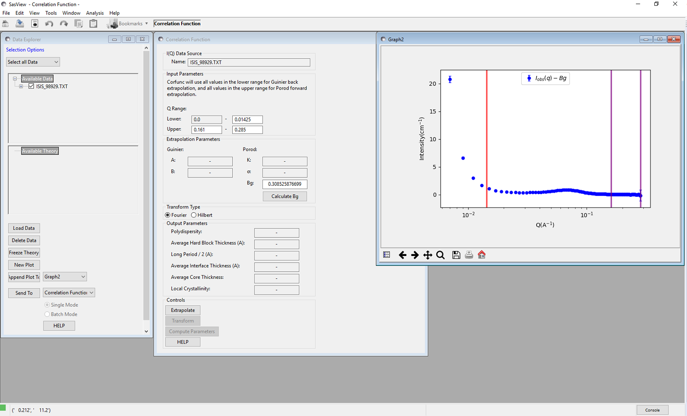

.. corfunc_help.rst

.. _Correlation_Function_Analysis:

Correlation Function Analysis
=============================

Description
-----------

This performs a correlation function analysis of one-dimensional
SAXS/SANS data, or generates a model-independent volume fraction 
profile from the SANS from an adsorbed polymer/surfactant layer.

A correlation function may be interpreted in terms of an imaginary rod moving 
through the structure of the material. Γ\ :sub:`1D`\ (R) is the probability that 
a rod of length R moving through the material has equal electron/neutron scattering 
length density at either end. Hence a frequently occurring spacing within a structure 
manifests itself as a peak.

A volume fraction profile :math:`\Phi`\ (z) describes how the density of polymer segments/surfactant molecules varies with distance from an (assumed locally flat) interface.

Both functions are returned in *real space*.

The analysis is performed in 3 stages:

*  Extrapolation of the scattering curve to :math:`Q = 0` and
   :math:`Q = \infty`
*  Smoothed merging of the two extrapolations into the original data
*  Fourier / Hilbert Transform of the smoothed data to give the correlation
   function / volume fraction profile, respectively
*  (Optional) Interpretation of the 1D correlation function based on an ideal 
   lamellar morphology

.. ZZZZZZZZZZZZZZZZZZZZZZZZZZZZZZZZZZZZZZZZZZZZZZZZZZZZZZZZZZZZZZZZZZZZZZZZZZZZ

Extrapolation
-------------

To :math:`Q = 0`
................

The data are extrapolated to Q = 0 by fitting a Guinier model to the data
points in the low-Q range.

The equation used is:

.. math::
    I(Q) = Ae^{Bq^2}

The Guinier model assumes that the small angle scattering arises from particles
and that parameter :math:`B` is related to the radius of gyration of those
particles. This has dubious applicability to polymer systems. However, the
correlation function is affected by the Guinier back-extrapolation to the
greatest extent at large values of R and so only has a
small effect on the final analysis.

To :math:`Q = \infty`
.....................

The data are extrapolated to Q = :math:`\infty` by fitting a Porod model to
the data points in the high-Q range.

The equation used is:

.. math::
    I(Q) = K Q^{-4}e^{-Q^2\sigma^2} + Bg

Where :math:`Bg` is the background, :math:`K` is the Porod
constant, and :math:`\sigma` (which must be > 0) describes the width of the electron or neutron scattering length density profile at the interface between the crystalline and amorphous
regions as shown below.

.. figure:: fig1.gif
   :align: center

   
Smoothing
---------

The extrapolated data set consists of the Guinier back-extrapolation from Q~0 
up to the lowest Q value in the original data, then the original scattering data, and the Porod tail-fit beyond this. The joins between the original data and the Guinier/Porod fits are smoothed using the algorithm below to avoid the formation of ripples in the transformed data.

Functions :math:`f(x_i)` and :math:`g(x_i)` where :math:`x_i \in \left\{
{x_1, x_2, ..., x_n} \right\}`, are smoothed over the range :math:`[a, b]`
to produce :math:`y(x_i)`, by the following equations:

.. math::
    y(x_i) = h_ig(x_i) + (1-h_i)f(x_i)

where:

.. math::
    h_i = \frac{1}{1 + \frac{(x_i-b)^2}{(x_i-a)^2}}

	
Transform
---------

Fourier
.......

If "Fourier" is selected for the transform type, the analysis will perform a
discrete cosine transform on the extrapolated data in order to calculate the
correlation function

.. math::
    \Gamma _{1D}(R) = \frac{1}{Q^{*}} \int_{0}^{\infty }I(q) q^{2} cos(qR) dq

where Q\ :sup:`*` is the Scattering Invariant.

The following algorithm is applied:

.. math::
    \Gamma(x_k) = 2 \sum_{n=0}^{N-1} x_n \cos{\left[ \frac{\pi}{N}
    \left(n + \frac{1}{2} \right) k \right] } \text{ for } k = 0, 1, \ldots,
    N-1, N

Hilbert
.......

If "Hilbert" is selected for the transform type, the analysis will perform a
Hilbert transform on the extrapolated data in order to calculate the Volume
Fraction Profile.

.. note:: This functionality is not yet implemented in SasView.

Interpretation
--------------

Correlation Function
....................

Once the correlation function has been calculated it may be interpreted by clicking the "Compute Parameters" button.

The correlation function is interpreted in terms of an ideal lamellar
morphology, and structural parameters are obtained from it as shown below.
It should be noted that a small beam size is assumed; ie, no de-smearing is
performed.

.. figure:: fig2.gif
   :align: center

The structural parameters obtained are:

*   Long Period :math:`= L_p`
*   Average Hard Block Thickness :math:`= L_c`
*   Average Core Thickness :math:`= D_0`
*   Average Interface Thickness :math:`\text{} = D_{tr}`
*   Polydispersity :math:`= \Gamma_{\text{min}}/\Gamma_{\text{max}}`
*   Local Crystallinity :math:`= L_c/L_p`

Volume Fraction Profile
.......................

SasView does not provide any automatic interpretation of volume fraction profiles in the same way that it does for correlation functions. However, a number of structural parameters are obtainable by other means:

*   Surface Coverage :math:`=\theta`
*   Anchor Separation :math:`= D`
*   Bound Fraction :math:`= 
`
*   Second Moment :math:`= \sigma`
*   Maximum Extent :math:`= \delta_{\text{h}}`
*   Adsorbed Amount :math:`= \Gamma`

.. figure:: profile1.png
   :align: center
 
.. figure:: profile2.png
   :align: center
   

References
----------

Strobl, G. R.; Schneider, M. *J. Polym. Sci.* (1980), 18, 1343-1359

Koberstein, J.; Stein R. *J. Polym. Sci. Phys. Ed.* (1983), 21, 2181-2200

Baltá Calleja, F. J.; Vonk, C. G. *X-ray Scattering of Synthetic Poylmers*, Elsevier. Amsterdam (1989), 247-251

Baltá Calleja, F. J.; Vonk, C. G. *X-ray Scattering of Synthetic Poylmers*, Elsevier. Amsterdam (1989), 257-261

Baltá Calleja, F. J.; Vonk, C. G. *X-ray Scattering of Synthetic Poylmers*, Elsevier. Amsterdam (1989), 260-270

:ref:`FDR` (PDF format)

.. ZZZZZZZZZZZZZZZZZZZZZZZZZZZZZZZZZZZZZZZZZZZZZZZZZZZZZZZZZZZZZZZZZZZZZZZZZZZZ

Usage
-----
Upon sending data for correlation function analysis, it will be plotted (minus
the background value), along with a *red* bar indicating the *upper end of the 
low-Q range* (used for back-extrapolation), and 2 *purple* bars indicating the range to be used for forward-extrapolation. These bars may be moved my clicking and
dragging, or by entering appropriate values in the Q range input boxes.

Once the Q ranges have been set, click the "Calculate" button to determine the background level. Alternatively, enter your own value into the field. If the box turns yellow this indicates that background subtraction has resulted in some negative intensities.

Click the "Extrapolate" button to extrapolate the data and plot the extrapolation in the same figure. The values of the parameters used for the Guinier and Porod models will also be shown in the "Extrapolation Parameters" section of the window.

.. figure:: tutorial2.png
   :align: center

Now select which type of transform you would like to perform, using the radio
buttons:

*   **Fourier** Perform a Fourier Transform to calculate the correlation
    function
*   **Hilbert** Perform a Hilbert Transform to calculate the volume fraction
    profile

Click the "Transform" button to perform the selected transform and plot
the result in a new graph window.

If a Fourier Transform was performed, the "Compute Parameters" button can now be clicked to interpret the correlation function as described earlier.

 .. figure:: tutorial3.png
    :align: center

	
.. note::
    This help document was last changed by Steve King, 08Oct2016
