.. fitting_help.rst

.. This is a port of the original SasView html help file to ReSTructured text
.. by S King, ISIS, during SasView CodeCamp-III in Feb 2015.

Fitting
=======

.. note:: If some code blocks are not readable, expand the documentation window

.. ZZZZZZZZZZZZZZZZZZZZZZZZZZZZZZZZZZZZZZZZZZZZZZZZZZZZZZZZZZZZZZZZZZZZZZZZZZZZZ

Preparing to fit data
---------------------

To fit some data you must first load some data, activate one or more data sets,
send those data sets to fitting, and select a model to fit to each data set.

Instructions on how to load and activate data are in the section :ref:`Loading_data`.

SasView can fit data in one of three ways:

*  in *Single* fit mode - individual data sets are fitted independently one-by-one

*  in *Simultaneous* fit mode - multiple data sets are fitted simultaneously to
   the *same* model with/without constrained parameters (this might be useful,
   for example, if you have measured the same sample at different contrasts)

*  in *Batch* fit mode - multiple data sets are fitted sequentially to the
   *same* model (this might be useful, for example, if you have performed
   a kinetic or time-resolved experiment and have *lots* of data sets!)

.. ZZZZZZZZZZZZZZZZZZZZZZZZZZZZZZZZZZZZZZZZZZZZZZZZZZZZZZZZZZZZZZZZZZZZZZZZZZZZZ

Selecting a model
-----------------

The models in SasView are grouped into categories. By default these consist of:

*  *Cylinder* - cylindrical shapes (disc, right cylinder, cylinder with endcaps
   etc)
*  *Ellipsoid* - ellipsoidal shapes (oblate,prolate, core shell, etc)
*  *Parellelepiped* - as the name implies
*  *Sphere* - sheroidal shapes (sphere, core multishell, vesicle, etc)
*  *Lamellae* - lamellar shapes (lamellar, core shell lamellar, stacked
   lamellar, etc)
*  *Shape-Independent* - models describing structure in terms of density
   correlation functions, fractals, peaks, power laws, etc
*  *Paracrystal* - semi ordered structures (bcc, fcc, etc)
*  *Structure Factor* - S(Q) models
*  *Plugin Models* - User-created (custom/non-library) Python models

Use the *Category* drop-down menu to chose a category of model, then select
a model from the drop-down menu beneath. A graph of the chosen model, calculated
using default parameter values, will appear. The graph will update dynamically
as the parameter values are changed.

You can decide your own model categorizations using the :ref:`Category_Manager`.

Once you have selected a model you can read its help documentation by clicking
on the *Description* button to the right.

Show 1D/2D
^^^^^^^^^^

Models are normally fitted to 1D (ie, I(Q) vs Q) data sets, but some models in
SasView can also be fitted to 2D (ie, I(Qx,Qy) vs Qx vs Qy) data sets.

*NB: Magnetic scattering can only be fitted in SasView in 2D.*

To activate 2D fitting mode, click the *Show 2D* button on the *Fit Page*. To
return to 1D fitting model, click the same button (which will now say *Show 1D*).

.. ZZZZZZZZZZZZZZZZZZZZZZZZZZZZZZZZZZZZZZZZZZZZZZZZZZZZZZZZZZZZZZZZZZZZZZZZZZZZZ

.. _Category_Manager:

Category Manager
----------------

To change the model categorizations, either choose *Category Manager* from the
*View* option on the menubar, or click on the *Modify* button on the *Fit Page*.

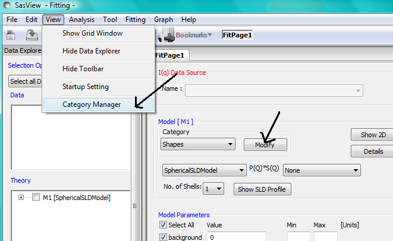

The categorization of all models except the user supplied Plugin Models can be
reassigned, added to, and removed using *Category Manager*. Models can also be
hidden from view in the drop-down menus.

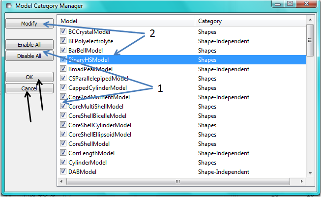

Changing category
^^^^^^^^^^^^^^^^^

To change category, highlight a model in the list by left-clicking on its entry
and then click the *Modify* button. Use the *Change Category* panel that appears
to make the required changes.

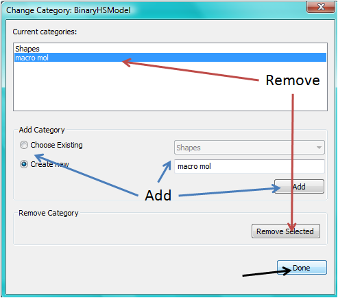

To create a category for the selected model, click the *Add* button. In order
to delete a category, select the category name and click the *Remove Selected*
button. Then click *Done*.

Showing/hiding models
^^^^^^^^^^^^^^^^^^^^^

Use the *Enable All / Disable All* buttons and the check boxes beside each model
to select the models to show/hide. To apply the selection, click *Ok*. Otherwise
click *Cancel*.

*NB: It may be necessary to change to a different category and then back again*
*before any changes take effect.*

.. ZZZZZZZZZZZZZZZZZZZZZZZZZZZZZZZZZZZZZZZZZZZZZZZZZZZZZZZZZZZZZZZZZZZZZZZZZZZZZ

Model Functions
---------------

For a complete list of all the library models available in SasView, see
the `Model Documentation <../../../index.html>`_ .

It is also possible to add your own models.

.. ZZZZZZZZZZZZZZZZZZZZZZZZZZZZZZZZZZZZZZZZZZZZZZZZZZZZZZZZZZZZZZZZZZZZZZZZZZZZZ

.. _Adding_your_own_models:

Adding your own Models
----------------------

There are essentially three ways to generate new fitting models for SasView:

*  Using the SasView :ref:`New_Plugin_Model` helper dialog (best for beginners
   and/or relatively simple models)
*  By copying/editing an existing model (this can include models generated by
   the New Plugin Model* dialog) in the :ref:`Python_shell` or
   :ref:`Advanced_Plugin_Editor` (suitable for all use cases)
*  By writing a model from scratch outside of SasView (only recommended for code
   monkeys!)

Please read the guidance on :ref:`Writing_a_Plugin` before proceeding.

**To be found by SasView your model must reside in the *~\\.sasview\\plugin_models* folder.**

.. ZZZZZZZZZZZZZZZZZZZZZZZZZZZZZZZZZZZZZZZZZZZZZZZZZZZZZZZZZZZZZZZZZZZZZZZZZZZZZ

.. _Plugin_Model_Operations:

Plugin Model Operations
-----------------------

From the *Fitting* option in the menu bar, select *Plugin Model Operations*

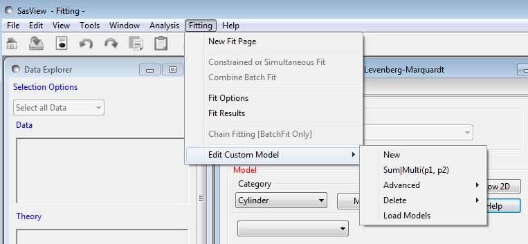

and then one of the sub-options

*  *New Plugin Model* - to create a plugin model template with a helper dialog
*  *Sum|Multi(p1,p2)* - to create a plugin model by summing/multiplying *existing models* in the model library
*  *Advanced Plugin Editor* - to create/edit a plugin model in a Python shell
*  *Delete Plugin Models* - to delete a plugin model
*  *Load Plugin Models* - to (re-)load plugin models

.. _New_Plugin_Model:

New Plugin Model
^^^^^^^^^^^^^^^^

Relatively straightforward models can be programmed directly from the SasView
GUI using the *New Plugin Model Function*.

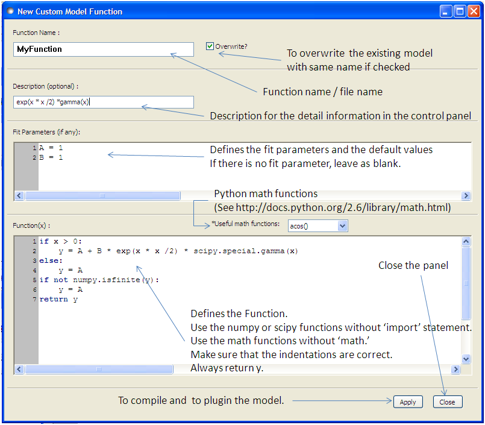

When using this feature, be aware that even if your code has errors, including
syntax errors, a model file is still generated. When you then correct the errors
and click 'Apply' again to re-compile you will get an error informing you that
the model already exists if the 'Overwrite' box is not checked. In this case you
will need to supply a new model function name. By default the 'Overwrite' box is
*checked*\ .

A model file generated by this option can be viewed and further modified using
the :ref:`Advanced_Plugin_Editor` .

Note that the New Plugin Model Feature currently does not allow for parameters
to be polydisperse.  However they can be edited in the Advanced Editor.

**SasView version 4.2** made it possible to specify whether a plugin created
with the *New Plugin Model* dialog is actually a form factor P(Q) or a structure
factor S(Q). To do this, simply add one or other of the following lines under
the *import* statements.

For a form factor::

     form_factor = True

or for a structure factor::

     structure_factor = True

If the plugin is a structure factor it is *also* necessary to add two variables
to the parameter list::

     parameters = [
                     ['radius_effective', '', 1, [0.0, numpy.inf], 'volume', ''],
                     ['volfraction', '', 1, [0.0, 1.0], '', ''],
                     [...],

and to the declarations of the functions Iq and Iqxy:::

     def Iq(x , radius_effective, volfraction, ...):

     def Iqxy(x, y, radius_effective, volfraction, ...):

Such a plugin should then be available in the S(Q) drop-down box on a FitPage (once
a P(Q) model has been selected).

Sum|Multi(p1,p2)
^^^^^^^^^^^^^^^^

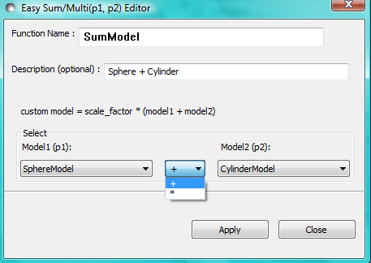

This option creates a custom Plugin Model of the form::

     Plugin Model = scale_factor * {(scale_1 * model_1) +/- (scale_2 * model_2)} + background

or::

     Plugin Model = scale_factor * (model1 * model2) + background

In the *Easy Sum/Multi Editor* give the new model a function name and brief
description (to appear under the *Details* button on the *FitPage*). Then select
two existing models, as p1 and p2, and the required operator, '+' or '*' between
them. Finally, click the *Apply* button to generate and test the model and then click *Close*.

Any changes to a plugin model generated in this way only become effective *after* it is re-selected
from the plugin models drop-down menu on the FitPage. If the model is not listed you can force a
recompilation of the plugins by selecting *Fitting* > *Plugin Model Operations* > *Load Plugin Models*.

**SasView version 4.2** introduced a much simplified and more extensible structure for plugin models
generated through the Easy Sum/Multi Editor. For example, the code for a combination of a sphere model
with a power law model now looks like this::

     from sasmodels.core import load_model_info
     from sasmodels.sasview_model import make_model_from_info

     model_info = load_model_info('sphere+power_law')
     model_info.name = 'MyPluginModel'
     model_info.description = 'sphere + power_law'
     Model = make_model_from_info(model_info)

To change the models or operators contributing to this plugin it is only necessary to edit the string
in the brackets after *load_model_info*, though it would also be a good idea to update the model name
and description too!!!

The model specification string can handle multiple models and combinations of operators (+ or *) which
are processed according to normal conventions. Thus 'model1+model2*model3' would be valid and would
multiply model2 by model3 before adding model1. In this example, parameters in the *FitPage* would be
prefixed A (for model2), B (for model3) and C (for model1). Whilst this might appear a little
confusing, unless you were creating a plugin model from multiple instances of the same model the parameter
assignments ought to be obvious when you load the plugin.

If you need to include another plugin model in the model specification string, just prefix the name of
that model with *custom*. For instance::

     sphere+custom.MyPluginModel

To create a P(Q)*\S(Q) model use the @ symbol instead of * like this::

     sphere@hardsphere

This streamlined approach to building complex plugin models from existing library models, or models
available on the *Model Marketplace*, also permits the creation of P(Q)*\S(Q) plugin models, something
that was not possible in earlier versions of SasView.

.. _Advanced_Plugin_Editor:

Advanced Plugin Editor
^^^^^^^^^^^^^^^^^^^^^^

Selecting this option shows all the plugin models in the plugin model folder, on Windows this is

  *C:\\Users\\{username}\\.sasview\\plugin_models*

You can edit, modify, and save the Python code in any of these models using the
*Advanced Plugin Model Editor*. Note that this is actually the same tool as the :ref:`Python_shell` .

For details of the SasView plugin model format see :ref:`Writing_a_Plugin` .

.. note:: Model files generated with the Sum/Multi option are still using the SasView 3.x model format. Unless you are confident about what you are doing, it is recommended that you only modify lines denoted with the ## <----- comments!

When editing is complete, select *Run* > *Check Model* from the *Advanced Plugin Model Editor* menu bar. An *Info* box will appear with the results of the compilation and model unit tests. The model will only be usable if the tests 'pass'.

.. image:: ../calculator/new_pycrust_example_2.png

To use the model, go to the relevant *Fit Page*, select the *Plugin Models*
category and then select the model from the drop-down menu.

Any changes to a plugin model generated in this way only become effective *after* it is re-selected from the model drop-down menu on the FitPage.

Delete Plugin Models
^^^^^^^^^^^^^^^^^^^^

Simply highlight the plugin model to be removed. The operation is final!!!

*NB: Models shipped with SasView cannot be removed in this way.*

Load Plugin Models
^^^^^^^^^^^^^^^^^^

This option loads (or re-loads) all models present in the
*~\\.sasview\\plugin_models* folder.

.. ZZZZZZZZZZZZZZZZZZZZZZZZZZZZZZZZZZZZZZZZZZZZZZZZZZZZZZZZZZZZZZZZZZZZZZZZZZZZZ

.. _Fitting_Options:

Fitting Options
---------------

It is possible to specify which optimiser SasView should use to fit the data, and
to modify some of the configurational parameters for each optimiser.

From *Fitting* in the menu bar select *Fit Options*, then select one of the following
optimisers:

*  DREAM
*  Levenberg-Marquardt
*  Quasi-Newton BFGS
*  Differential Evolution
*  Nelder-Mead Simplex

The DREAM optimiser is the most sophisticated, but may not necessarily be the best
option for fitting simple models. If uncertain, try the Levenberg-Marquardt optimiser
initially.

These optimisers form the *Bumps* package written by P Kienzle. For more information
on each optimiser, see the :ref:`Fitting_Documentation`.

.. ZZZZZZZZZZZZZZZZZZZZZZZZZZZZZZZZZZZZZZZZZZZZZZZZZZZZZZZZZZZZZZZZZZZZZZZZZZZZZ

Fitting Limits
--------------

By default, *SasView* will attempt to model fit the full range of the data; ie,
across all *Q* values. If necessary, however, it is possible to specify only a
sub-region of the data for fitting.

In a *FitPage* or *BatchPage* change the *Q* values in the *Min* and/or *Max*
text boxes. Vertical coloured bars will appear on the graph with the data and
'theory' indicating the current *Q* limits (red = *Qmin*, purple = *Qmax*).

To return to including all data in the fit, click the *Reset* button.

.. ZZZZZZZZZZZZZZZZZZZZZZZZZZZZZZZZZZZZZZZZZZZZZZZZZZZZZZZZZZZZZZZZZZZZZZZZZZZZZ

Shortcuts
---------

Copy/Paste Parameters
^^^^^^^^^^^^^^^^^^^^^

It is possible to copy the parameters from one *Fit Page* and to paste them into
another *Fit Page* using the same model.

To *copy* parameters, either:

*  Select *Edit -> Copy Params* from the menu bar, or
*  Use Ctrl(Cmd on Mac) + Left Mouse Click on the *Fit Page*.

To *paste* parameters, either:

*  Select *Edit -> Paste Params* from the menu bar, or
*  Use Ctrl(Cmd on Mac) + Shift + Left-click on the *Fit Page*.

If either operation is successful a message will appear in the info line at the
bottom of the SasView window.

Bookmark
^^^^^^^^

To *Bookmark* a *Fit Page* either:

*  Select a *Fit Page* and then click on *Bookmark* in the tool bar, or
*  Right-click and select the *Bookmark* in the popup menu.

.. ZZZZZZZZZZZZZZZZZZZZZZZZZZZZZZZZZZZZZZZZZZZZZZZZZZZZZZZZZZZZZZZZZZZZZZZZZZZZZ

.. _Status_bar:

Status Bar & Console
--------------------

The status bar is located at the bottom of the SasView window and displays
messages, hints, warnings and errors.

At the right-hand side of the status bar is a button marked *Console*. The *Console*
displays available message history and some run-time traceback information.

During a long task the *Console* can also be used to monitor the progress.

.. ZZZZZZZZZZZZZZZZZZZZZZZZZZZZZZZZZZZZZZZZZZZZZZZZZZZZZZZZZZZZZZZZZZZZZZZZZZZZZ

.. _Single_Fit_Mode:

Single Fit Mode
---------------

*NB: Before proceeding, ensure that the Single Mode radio button at the bottom of*
*the Data Explorer is checked (see the section* :ref:`Loading_data` *).*

This mode fits one data set.

When data is sent to the fitting it is plotted in a graph window as markers.

If a graph does not appear, or a graph window appears but is empty, then the data
has not loaded correctly. Check to see if there is a message in the :ref:`Status_Bar`
or in the *Console* window.

Assuming the data has loaded correctly, when a model is selected a green model
calculation (or what SasView calls a 'Theory') line will appear in the earlier graph
window, and a second graph window will appear displaying the residuals (the
difference between the experimental data and the theory) at the same X-data values.
See :ref:`Assessing_Fit_Quality`.

The objective of model-fitting is to find a *physically-plausible* model, and
set of model parameters, that generate a theory that reproduces the experimental
data and minimizes the values of the residuals.

Change the default values of the model parameters by hand until the theory line
starts to represent the experimental data. Then check the tick boxes alongside
the 'background' and 'scale' parameters. Click the *Fit* button. SasView
will optimise the values of the 'background' and 'scale' and also display the
corresponding uncertainties on the optimised values.

.. note::
   If the uncertainty on a fitted parameter is unrealistically large, or if it
   displays as NaN, the model is most likely a poor representation of the data,
   the parameter in question is highly correlated with one or more of the other
   fitted parameters, or the model is relatively insensitive to the value of
   that particular parameter.

In the bottom left corner of the *Fit Page* is a box displaying a normalised
value of the statistical $\chi^2$ parameter (the reduced $\chi^2$,
See :ref:`Assessing_Fit_Quality`) returned by the optimiser.

Now check the box for another model parameter and click *Fit* again. Repeat this
process until all relevant parameters are checked and have been optimised. As
the fit of the theory to the experimental data improves, the value of 'Reduced
Chi2' will decrease. A good model fit should produce values of Reduced Chi2
close to one, and certainly << 100. See :ref:`Assessing_Fit_Quality`.

SasView has a number of different optimisers (see the section :ref:`Fitting_Options`).
The DREAM optimiser is the most sophisticated, but may not necessarily be the best
option for fitting simple models. If uncertain, try the Levenberg-Marquardt optimiser
initially.

.. ZZZZZZZZZZZZZZZZZZZZZZZZZZZZZZZZZZZZZZZZZZZZZZZZZZZZZZZZZZZZZZZZZZZZZZZZZZZZZ

Simultaneous Fit Mode
---------------------

*NB: Before proceeding, ensure that the Single Mode radio button at the bottom of*
*the Data Explorer is checked (see the section* :ref:`Loading_data` *).*

This mode is an extension of the :ref:`Single_Fit_Mode` that allows for some
relatively extensive constraints between fitted parameters in a single *FitPage*
or between several *FitPage*'s (eg, to constrain all fitted parameters to be the
same in a contrast series of *FitPages* except for the solvent sld parameter,
constrain the length to be twice that of the radius in a single *FitPage*,
fix the radius of the sphere in one *FitPage* to be the same as the radius of
the cylinder in a second *FitPage*, etc).

If the data to be fit are in multiple files, load each file, then select each file
in the *Data Explorer*, and *Send To Fitting*. If multiple data sets are in one file,
load that file, *Unselect All Data*, select just those data sets to be fitted, and
*Send To Fitting*. Either way, the result should be that for *n* data sets you have
2\ *n* graphs (*n* of the data and model fit, and *n* of the resulting residuals). But
it may be helpful to minimise the residuals plots for clarity. Also see
:ref:`Assessing_Fit_Quality`.

*NB: If you need to use a custom Plugin Model, you must ensure that model is
available first (see* :ref:`Adding_your_own_models` *).*

Method
^^^^^^

Now go to each *FitPage* in turn and:

  Select the required category and model;

  Unselect all the model parameters;

  Enter some starting guesses for the parameters;

  Enter any parameter limits (recommended);

  Select which parameters will refine (selecting all is generally a bad idea...);

When done, select *Constrained or Simultaneous Fit* under *Fitting* in the menu bar.

In the *Const & Simul Fit* page that appears, select which data sets are to be
simultaneously fitted (this will probably be all of them or you would not have loaded
them in the first place!).

To tie parameters between the data sets with constraints, check the 'yes' radio button
next to *Add Constraint?* in the *Fit Constraints* box.

To constrain all identically named parameters to fit *simultaneously* to the
same value across all the *Fitpages* use the *Easy Setup* drop-down buttons in
the *Const & Simul Fit* page.

*NB: You can only constrain parameters that are set to refine.*

Constraints will generally be of the form

  Mi Parameter1 = Mj.Parameter1

however the text box after the '=' sign can be used to adjust this
relationship; for example

  Mi Parameter1 = scalar \* Mj.Parameter1

A 'free-form' constraint box is also provided.

Many constraints can be entered for a single fit.

When ready, click the *Fit* button on the *Const & Simul Fit* page, NOT the *Fit*
button on the individual *FitPage*'s.

The results of the model-fitting will be returned to each of the individual
*FitPage*'s.

Note that the Reduced Chi2 value returned is the SUM of the Reduced Chi2 of
each fit. To see the Reduced Chi2 value for a specific *FitPage*, click the 
*Compute* button at the bottom of that *FitPage* to recalculate. Note that in
doing so the degrees of freedom will be set to Npts.
See :ref:`Assessing_Fit_Quality`.  Moreover in the case of constraints the
degrees of freedom are less than one might think due to those constraints.

.. ZZZZZZZZZZZZZZZZZZZZZZZZZZZZZZZZZZZZZZZZZZZZZZZZZZZZZZZZZZZZZZZZZZZZZZZZZZZZZ

.. _Batch_Fit_Mode:

Batch Fit Mode
--------------

*NB: Before proceeding, ensure that the Single Mode radio button at the bottom of*
*the Data Explorer is checked (see the section* :ref:`Loading_data` *). The Batch*
*Mode button will be used later on!*

This mode *sequentially* fits two or more data sets *to the same model*. Unlike in
simultaneous fitting, in batch fitting it is not possible to constrain fit parameters
between data sets.

If the data to be fit are in multiple files, load each file in the *Data Explorer*.
If multiple data sets are in one file, load just that file. *Unselect All Data*, then
select a single initial data set to be fitted. Fit that selected data set as described
above under :ref:`Single_Fit_Mode`.

*NB: If you need to use a custom Plugin Model, you must ensure that model is
available first (see* :ref:`Adding_your_own_models` *).*

Method
^^^^^^

Now *Select All Data* in the *Data Explorer*, check the *Batch Mode* radio button
at the bottom of that panel and *Send To Fitting*. A *BatchPage* will be created.

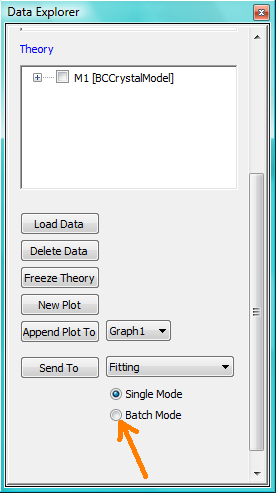

*NB: The Batch Page can also be created by checking the Batch Mode radio button*
*and selecting New Fit Page under Fitting in the menu bar.*

Using the drop-down menus in the *BatchPage*, now set up the *same* data set
with the *same* model that you just fitted in single fit mode. A quick way to
set the model parameter values is to just copy them from the earlier Single
Fit. To do this, go back to the Single Fit *FitPage*, select *Copy Params*
under *Edit* in the menu bar, then go back to the *BatchPage* and *Paste Params*.

When ready, use the *Fit* button on the *BatchPage* to perform the fitting, NOT
the *Fit* button on the individual *FitPage*'s.

Unlike in single fit mode, the results of batch fits are not returned to
the *BatchPage*. Instead, a spreadsheet-like :ref:`Grid_Window` will appear.

If you want to visually check a graph of a particular fit, click on the name of
a *Data set* in the *Grid Window* and then click the *View Fits* button. The
data and the model fit will be displayed. If you select mutliple data sets they
will all appear on one graph.

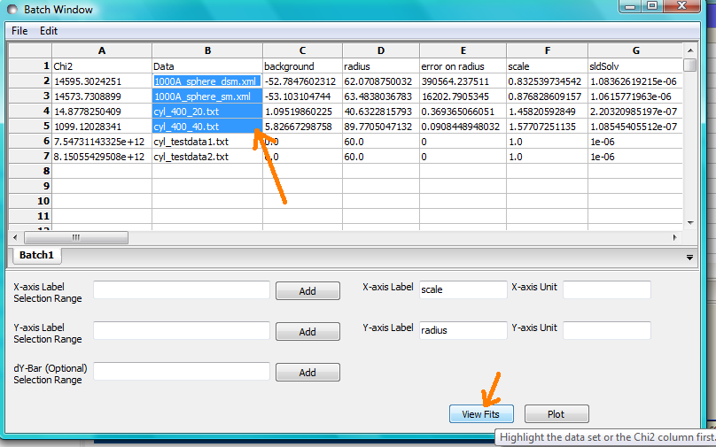

*NB: In theory, returning to the BatchPage and changing the name of the I(Q)*
*data source should also work, but at the moment whilst this does change the*
*data set displayed it always superimposes the 'theory' corresponding to the*
*starting parameters.*

If you select a 'Chi2' value and click the *View Fits* button a graph of the
residuals for that data set is displayed. Again, if you select multiple 'Chi2'
values then all the residuals data will appear on one graph. Also see
:ref:`Assessing_Fit_Quality`.

Chain Fitting
^^^^^^^^^^^^^

By default, the *same* parameter values copied from the initial single fit into
the *BatchPage* will be used as the starting parameters for all batch fits. It
is, however, possible to get *SasView* to use the results of a fit to a preceding
data set as the starting parameters for the next fit in the sequence. This
variation of batch fitting is called *Chain Fitting*, and will considerably speed
up model-fitting if you have lots of very similar data sets where a few parameters
are gradually changing. Do not use chain fitting on disparate data sets.

To use chain fitting, select *Chain Fitting* under *Fitting* in the menu bar. It
toggles on/off, so selecting it again will switch back to normal batch fitting.

.. _Grid_Window:

Grid Window
^^^^^^^^^^^

The *Grid Window* provides an easy way to view the results from batch fitting.
It will be displayed automatically when a batch fit completes, but may be
opened at any time by selecting *Show Grid Window* under *View* in the menu
bar.

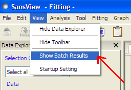

Once a batch fit is completed, all model parameters are displayed but *not*
their uncertainties. To view the uncertainties, click on a given column then
go to *Edit* in the menu bar, select *Insert Column Before* and choose the
required data from the list. An empty column can be inserted in the same way.

To remove a column from the grid, click on the column header and choose
*Remove Column* under *Edit* in the menu bar. The same functionality also
allows you to re-order columns.

*NB: You cannot insert/remove/re-order the rows in the Grid Window.*

All of the above functions are also available by right-clicking on a column
label.

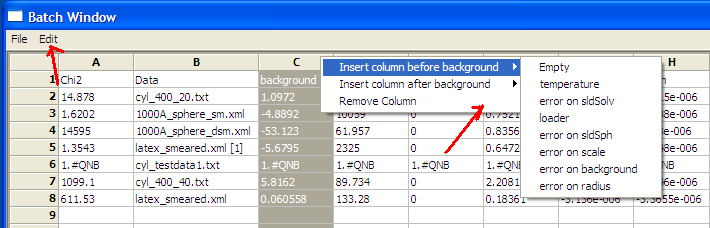

*NB: If there is an existing Grid Window and another batch fit is performed,*
*an additional 'Table' tab will be added to the Grid Window.*

The parameter values in the *currently selected* table of the *Grid Window*
can be output to a CSV file by choosing *Save As* under *File* in the (*Grid*
*Window*) menu bar. The default filename includes the date and time that the
batch fit was performed.

Saved CSV files can be reloaded by choosing *Open* under *File* in the *Grid*
*Window* menu bar. The loaded parameters will appear in a new table tab.

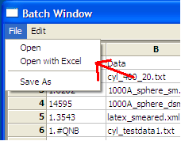

*NB: Saving the Grid Window does not save any experimental data, residuals*
*or actual model fits. Consequently if you reload a saved CSV file the*
*ability to View Fits will be lost.*

Parameter Plots
^^^^^^^^^^^^^^^

Any column of *numeric* parameter values can be plotted against another using
the *Grid Window*. Simply select one column at the time and click the *Add*
button next to the required *X/Y-axis Selection Range* text box. When both
the X and Y axis boxes have been completed, click the *Plot* button.

When the *Add* button is clicked, *SasView* also automatically completes the
*X/Y-axis Label* text box with the heading from Row 1 of the selected table,
but different labels and units can be entered manually.

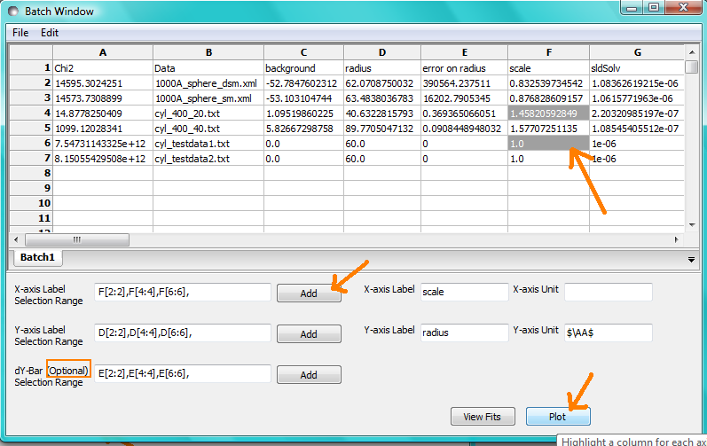

The *X/Y-axis Selection Range* can be edited manually. The text control box
recognises the operators +, -, \*, /, or 'pow', and allows the following
types of expression :

  1) if an axis label range is a function of 1 or more *columns*, write
     this type of expression

     constant1 * column_name1 [minimum row index :  maximum  row index]
     operator constant2 * column_name2 [minimum row index :  maximum  row index]

     Example: radius [2 : 5] -3 * scale [2 : 5]

  2) if only some *values* of a given column are needed but the range between
     the first row and the last row used is not continuous, write this type of
     expression

     column_name1 [minimum row index1 :  maximum  row index1] , column_name1
     [minimum row index2 :  maximum  row index2]

     Example: radius [2 : 5] , radius [10 : 25]

.. ZZZZZZZZZZZZZZZZZZZZZZZZZZZZZZZZZZZZZZZZZZZZZZZZZZZZZZZZZZZZZZZZZZZZZZZZZZZZZ

Combined Batch Fit Mode
-----------------------

The purpose of the Combined Batch Fit is to allow running two or more batch
fits in sequence without overwriting the output table of results.  This may be
of interest for example if one is fitting a series of data sets where there is
a shape change occurring in the series that requires changing the model part
way through the series; for example a sphere to rod transition.  Indeed the
regular batch mode does not allow for multiple models and requires all the
files in the series to be fit with single model and set of parameters.  While
it is of course possible to just run part of the series as a batch fit using
model one followed by running another batch fit on the rest of the series with
model two (and/or model three etc), doing so will overwrite the table of
outputs from the previous batch fit(s).  This may not be desirable if one is
interested in comparing the parameters: for example the sphere radius of set
one and the cylinder radius of set two.

Method
^^^^^^

In order to use the *Combined Batch Fit*, first load all the data needed as
described in :ref:`Loading_data`. Next start up two or more *BatchPage* fits
following the instructions in :ref:`Batch_Fit_Mode` but **DO NOT PRESS FIT**.
At this point the *Combine Batch Fit* menu item under the *Fitting menu* should
be active (if there is one or no *BatchPage* the menu item will be greyed out
and inactive).  Clicking on *Combine Batch Fit* will bring up a new panel,
similar to the *Const & Simult Fit* panel. In this case there will be a
checkbox for each *BatchPage* instead of each *FitPage* that should be included
in the fit.  Once all are selected, click the Fit button on
the *BatchPage* to run each batch fit in *sequence*

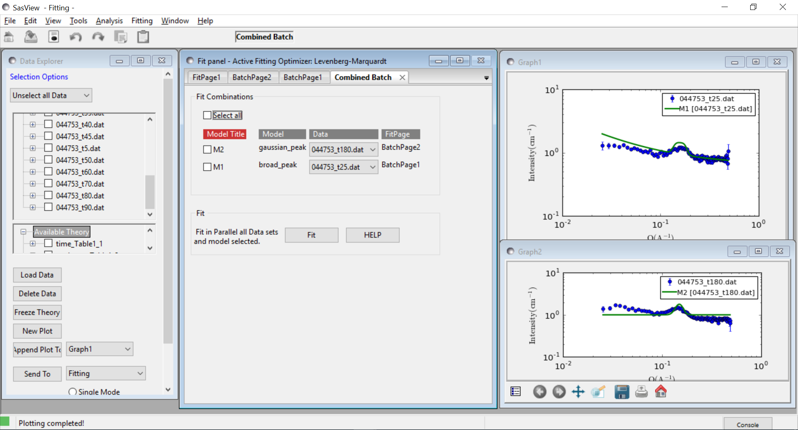

The batch table will then pop up at the end as for the case of the simple Batch
Fitting with the following caveats:

.. note::
   The order matters.  The parameters in the table will be taken from the model
   used in the first *BatchPage* of the list.  Any parameters from the
   second and later *BatchPage* s that have the same name as a parameter in the
   first will show up allowing for plotting of that parameter across the
   models. The other parameters will not be available in the grid.
.. note::
   a corralary of the above is that currently models created as a sum|multiply
   model will not work as desired because the generated model parameters have a
   p#_ appended to the beginning and thus radius and p1_radius will not be
   recognized as the same parameter.

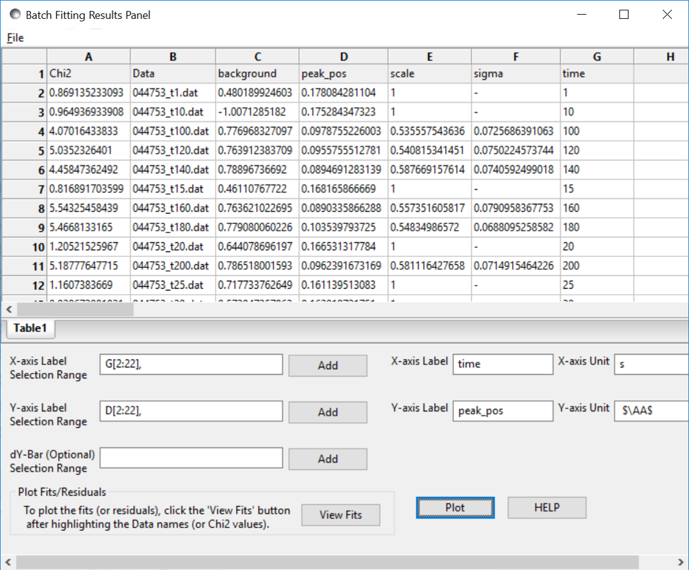

In the example shown above the data is a time series with a shifting peak.
The first part of the series was fitted using the *broad_peak* model, while
the rest of the data were fit using the *gaussian_peak* model. Unfortunately the
time is not listed in the file but the file name contains the information. As
described in :ref:`Grid_Window`, a column can be added manually, in this case
called time, and the peak position plotted against time.

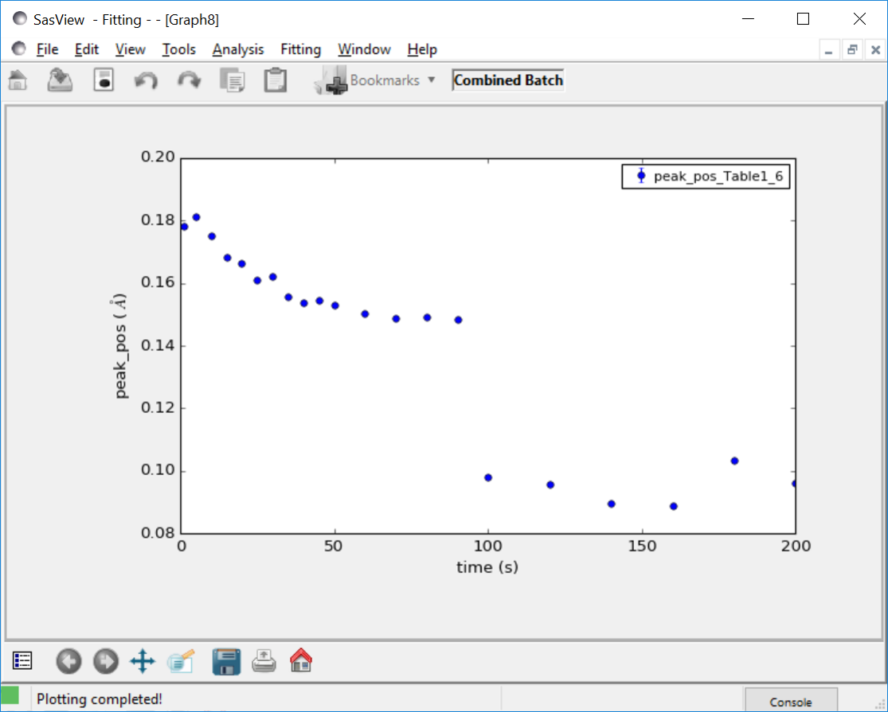

Note the discontinuity in the peak position.  This reflects the fact that the
Gaussian fit is a rather poor model for the data and is not actually
finding the peak.

.. ZZZZZZZZZZZZZZZZZZZZZZZZZZZZZZZZZZZZZZZZZZZZZZZZZZZZZZZZZZZZZZZZZZZZZZZZZZZZZ

.*Document History*

| 2017-09-10 Paul Butler
| 2017-09-15 Steve King
| 2018-03-05 Paul Butler
