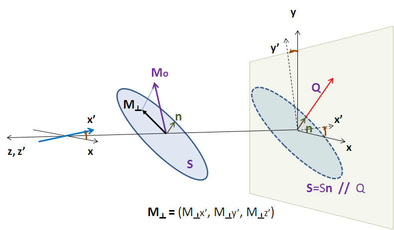
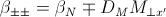
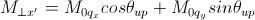
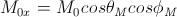
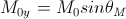
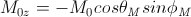

.. mag_help.rst

.. This is a port of text from the original SasView html help file to ReSTructured text
.. by S King, ISIS, during SasView CodeCamp-III in Feb 2015.

.. |inlineimage004| image:: sm_image004.png
.. |inlineimage005| image:: sm_image005.png
.. |inlineimage008| image:: sm_image008.png
.. |inlineimage009| image:: sm_image009.png
.. |inlineimage010| image:: sm_image010.png
.. |inlineimage011| image:: sm_image011.png
.. |inlineimage012| image:: sm_image012.png
.. |inlineimage018| image:: sm_image018.png
.. |inlineimage019| image:: sm_image019.png

.. ZZZZZZZZZZZZZZZZZZZZZZZZZZZZZZZZZZZZZZZZZZZZZZZZZZZZZZZZZZZZZZZZZZZZZZZZZZZZZ

Polarisation/Magnetic Scattering
--------------------------------

Magnetic scattering is implemented in five (2D) models

*  *sphere*
*  *core_shell_sphere*
*  *core_multi_shell*
*  *cylinder*
*  *parallelepiped*

In general, the scattering length density (SLD, = $\beta$) in each region where the
SLD is uniform, is a combination of the nuclear and magnetic SLDs and, for polarised
neutrons, also depends on the spin states of the neutrons.

For magnetic scattering, only the magnetization component, $M_\perp$,
perpendicular to the scattering vector $Q$ contributes to the the magnetic
scattering length.

The magnetic scattering length density is then

.. image:: dm_eq.png

where $\gamma = -1.913$ is the gyromagnetic ratio, $\mu_B$ is the
Bohr magneton, $r_0$ is the classical radius of electron, and $\sigma$
is the Pauli spin.

Assuming that incident neutrons are polarized parallel (+) and anti-parallel (-)
to the *x'* axis, the possible spin states after the sample are then

No spin-flips (+ +) and (- -)

Spin-flips    (+ -) and (- +)

.. image:: M_angles_pic.png

If the angles of the $Q$ vector and the spin-axis (*x'*) to the *x*-axis are $\phi$
and $\theta_\text{up}$, respectively, then, depending on the spin state of the
neutrons, the scattering length densities, including the nuclear scattering
length density ($\beta_N$) are

when there are no spin-flips, and

.. image:: sld2.png

when there are, and

.. image:: myp.png

.. image:: mzp.png

.. image:: mqx.png

.. image:: mqy.png

Here, $M_{0x}$, $M_{0y}$ and $M_{0z}$ are the $x$, $y$ and $z$ components
of the magnetization vector given in the laboratory $xyz$ frame given by

and the magnetization angles $\theta_M$ and $\phi_M$ are defined in
the figure above.

The user input parameters are:

===========   ================================================================
 M0_sld        = $D_M M_0$
 Up_theta      = $\theta_\text{up}$
 M_theta       = $\theta_M$
 M_phi         = $\phi_M$
 Up_frac_i     = (spin up)/(spin up + spin down) neutrons *before* the sample
 Up_frac_f     = (spin up)/(spin up + spin down) neutrons *after* the sample
===========   ================================================================

*Note:* The values of the 'Up_frac_i' and 'Up_frac_f' must be in the range 0 to 1.

.. ZZZZZZZZZZZZZZZZZZZZZZZZZZZZZZZZZZZZZZZZZZZZZZZZZZZZZZZZZZZZZZZZZZZZZZZZZZZZZ

.. note::  This help document was last changed by Steve King, 02May2015
