.. sm_help.rst

.. This is a port of the original SasView html help file to ReSTructured text
.. by S King, ISIS, during SasView CodeCamp-III in Feb 2015.

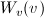
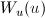
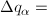
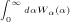
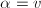
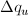
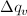
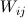
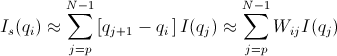

.. ZZZZZZZZZZZZZZZZZZZZZZZZZZZZZZZZZZZZZZZZZZZZZZZZZZZZZZZZZZZZZZZZZZZZZZZZZZZZZ

Smearing Functions
==================

Sometimes the instrumental geometry used to acquire the experimental data has
an impact on the clarity of features in the reduced scattering curve. For
example, peaks or fringes might be slightly broadened. This is known as
*Q resolution smearing*. To compensate for this effect one can either try and
remove the resolution contribution - a process called *desmearing* - or add the
resolution contribution into a model calculation/simulation (which by definition
will be exact) to make it more representative of what has been measured
experimentally - a process called *smearing*. SasView will do the latter.

Both smearing and desmearing rely on functions to describe the resolution
effect. SasView provides three smearing algorithms:

*  *Slit Smearing*
*  *Pinhole Smearing*
*  *2D Smearing*

SasView also has an option to use $Q$ resolution data (estimated at the time of
data reduction) supplied in a reduced data file: the *Use dQ data* radio button.

.. ZZZZZZZZZZZZZZZZZZZZZZZZZZZZZZZZZZZZZZZZZZZZZZZZZZZZZZZZZZZZZZZZZZZZZZZZZZZZZ

dQ Smearing
-----------

If this option is checked, SasView will assume that the supplied $dQ$ values
represent the standard deviations of Gaussian functions.

.. ZZZZZZZZZZZZZZZZZZZZZZZZZZZZZZZZZZZZZZZZZZZZZZZZZZZZZZZZZZZZZZZZZZZZZZZZZZZZZ

Slit Smearing
-------------

**This type of smearing is normally only encountered with data from X-ray Kratky**
**cameras or X-ray/neutron Bonse-Hart USAXS/USANS instruments.**

The slit-smeared scattering intensity is defined by

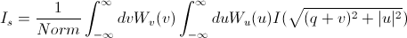

where *Norm* is given by

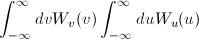

**[Equation 1]**

The functions $W_v(v)$ and $W_u(u)$
refer to the slit width weighting function and the slit height weighting
determined at the given $q$ point, respectively. It is assumed that the weighting
function is described by a rectangular function, such that

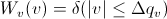

**[Equation 2]**

and

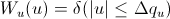

**[Equation 3]**

so that $\Delta q_\alpha = \int_0^\infty d\alpha W_\alpha(\alpha)$
for $\alpha = v$ and $u$.

Here $\Delta q_u$ and $\Delta q_v$ stand for
the slit height (FWHM/2) and the slit width (FWHM/2) in $q$ space.

This simplifies the integral in Equation 1 to

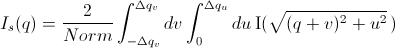

**[Equation 4]**

which may be solved numerically, depending on the nature of
$\Delta q_u$ and $\Delta q_v$.

Solution 1
^^^^^^^^^^

**For $\Delta q_v= 0$ and $\Delta q_u = \text{constant}$.**

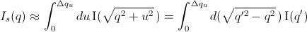

For discrete $q$ values, at the $q$ values of the data points and at the $q$
values extended up to $q_N = q_i + \Delta q_u$ the smeared
intensity can be approximately calculated as

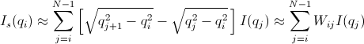

**[Equation 5]**

where |inlineimage018| = 0 for $I_s$ when $j < i$ or $j > N-1$.

Solution 2
^^^^^^^^^^

**For $\Delta q_v = \text{constant}$ and $\Delta q_u= 0$.**

Similar to Case 1

|inlineimage019| for $q_p = q_i - \Delta q_v$ and $q_N = q_i + \Delta q_v$

**[Equation 6]**

where |inlineimage018| = 0 for $I_s$ when $j < p$ or $j > N-1$.

Solution 3
^^^^^^^^^^

**For $\Delta q_u = \text{constant}$ and $\Delta q_v = \text{constant}$.**

In this case, the best way is to perform the integration of Equation 1
numerically for both slit height and slit width. However, the numerical
integration is imperfect unless a large number of iterations, say, at
least 10000 by 10000 for each element of the matrix *W*, is performed.
This is usually too slow for routine use.

An alternative approach is used in SasView which assumes
slit width << slit height. This method combines Solution 1 with the
numerical integration for the slit width. Then

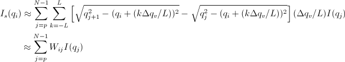

**[Equation 7]**

for *q_p = q_i - \Delta q_v$ and $q_N = q_i + \Delta q_v$
where |inlineimage018| = 0 for *I_s$ when $j < p$ or $j > N-1$.

.. ZZZZZZZZZZZZZZZZZZZZZZZZZZZZZZZZZZZZZZZZZZZZZZZZZZZZZZZZZZZZZZZZZZZZZZZZZZZZZ

Pinhole Smearing
----------------

**This is the type of smearing normally encountered with data from synchrotron**
**SAXS cameras and SANS instruments.**

The pinhole smearing computation is performed in a similar fashion to the slit-
smeared case above except that the weight function used is a Gaussian. Thus
Equation 6 becomes

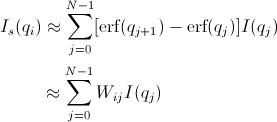

**[Equation 8]**

.. ZZZZZZZZZZZZZZZZZZZZZZZZZZZZZZZZZZZZZZZZZZZZZZZZZZZZZZZZZZZZZZZZZZZZZZZZZZZZZ

2D Smearing
-----------

The 2D smearing computation is performed in a similar fashion to the 1D pinhole
smearing above except that the weight function used is a 2D elliptical Gaussian.
Thus

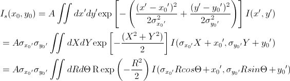

**[Equation 9]**

In Equation 9, $x_0 = q \cos(\theta)$, $y_0 = q \sin(\theta)$, and
the primed axes, are all in the coordinate rotated by an angle $\theta$ about
the z-axis (see the figure below) so that
$x'_0 = x_0 \cos(\theta) + y_0 \sin(\theta)$ and
$y'_0 = -x_0 \sin(\theta) + y_0 \cos(\theta)$.
Note that the rotation angle is zero for a $xy$ symmetric
elliptical Gaussian distribution. The $A$ is a normalization factor.

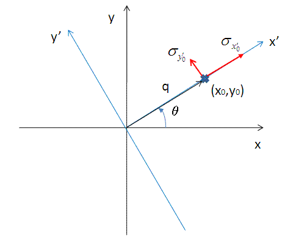

Now we consider a numerical integration where each of the bins in $\theta$ and $R$ are
*evenly* (this is to simplify the equation below) distributed by $\Delta \theta$
and $\Delta R$, respectively, and it is further assumed that $I(x',y')$ is constant
within the bins. Then

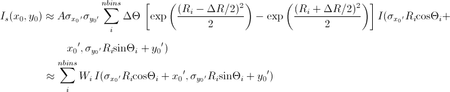

**[Equation 10]**

Since the weighting factor on each of the bins is known, it is convenient to
transform $x'y'$ back to $xy$ coordinates (by rotating it by $-\theta$ around the
$z$ axis).

Then, for a polar symmetric smear

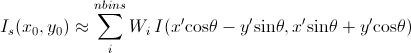

**[Equation 11]**

where

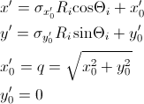

while for a $xy$ symmetric smear

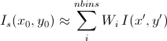

**[Equation 12]**

where

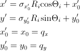

The current version of the SasView uses Equation 11 for 2D smearing, assuming
that all the Gaussian weighting functions are aligned in the polar coordinate.

.. ZZZZZZZZZZZZZZZZZZZZZZZZZZZZZZZZZZZZZZZZZZZZZZZZZZZZZZZZZZZZZZZZZZZZZZZZZZZZZ

Weighting & Normalization
-------------------------

In all the cases above, the weighting matrix $W$ is calculated on the first call
to a smearing function, and includes ~60 $q$ values (finely and evenly binned)
below (>0) and above the $q$ range of data in order to smear all data points for
a given model and slit/pinhole size. The $Norm$  factor is found numerically with the
weighting matrix and applied on the computation of $I_s$.

.. ZZZZZZZZZZZZZZZZZZZZZZZZZZZZZZZZZZZZZZZZZZZZZZZZZZZZZZZZZZZZZZZZZZZZZZZZZZZZZ

.. note::  This help document was last changed by Steve King, 01May2015
