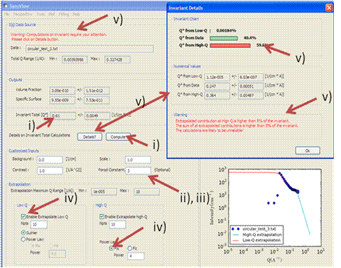

.. invariant_help.rst

.. This is a port of the original SasView html help file to ReSTructured text
.. by S King, ISIS, during SasView CodeCamp-III in Feb 2015.

Invariant Calculation
=====================

Description
-----------

The scattering, or Porod, invariant ($Q^*$) is a model-independent quantity that
can be easily calculated from scattering data.

For two phase systems, the scattering invariant is defined as the integral of
the square of the wavevector transfer ($Q$) multiplied by the scattering cross section
over the full range of $Q$ from zero to infinity, that is

.. math::

    Q^* = \int_0^\infty q^2I(q)\,dq

in the case of pinhole geometry. For slit geometry the invariant is given by

.. math::

    Q^* = \Delta q_v \int_0^\infty qI(q)\,dq

where $\Delta q_v$ is the slit height.

The worth of $Q^*$  is that it can be used to determine the volume fraction and
the specific area of a sample. Whilst these quantities are useful in their own
right they can also be used in further analysis.

The difficulty with using $Q^*$  arises from the fact that experimental data is
never measured over the range $0 \le Q \le \infty$. At best, combining USAS and
WAS data might cover the range $10^{-5} \le Q \le 10$ 1/\ |Ang| . Thus it is usually
necessary to extrapolate the experimental data to low and high $Q$. For this

High-\ $Q$ region (>= *Qmax* in data)

*  The power law function $C/Q^4$ is used where the constant
   $C = 2 \pi \Delta\rho S_v$ is to be found by fitting part of data
   within the range $Q_{N-m}$ to $Q_N$ (where $m < N$).

Low-\ $Q$ region (<= *Qmin* in data)

*  The Guinier function $I_0 exp(-R_g^2 Q^2/3)$ where $I_0$
   and $R_g$ are obtained by fitting as for the high-\ $Q$ region above.
   Alternatively a power law can be used.

.. ZZZZZZZZZZZZZZZZZZZZZZZZZZZZZZZZZZZZZZZZZZZZZZZZZZZZZZZZZZZZZZZZZZZZZZZZZZZZ

Using invariant analysis
------------------------

1) Select *Invariant* from the *Analysis* menu on the SasView toolbar.

2) Load some data with the *Data Explorer*.

3) Select a dataset and use the *Send To* button on the *Data Explorer* to load
   the dataset into the *Invariant* panel.

4) Use the *Customised Input* boxes on the *Invariant* panel to subtract
   any background, specify the contrast (i.e. difference in SLDs - this must be
   specified for the eventual value of $Q^*$  to be on an absolute scale), or to
   rescale the data.

5) Adjust the extrapolation range as necessary. In most cases the default
   values will suffice.

6) Click the *Compute* button.

7) To include a lower and/or higher $Q$ range, check the relevant *Enable
   Extrapolate* check boxes.

   If power law extrapolations are chosen, the exponent can be either held
   fixed or fitted. The number of points, Npts, to be used for the basis of the
   extrapolation can also be specified.

8) If the value of $Q^*$  calculated with the extrapolated regions is invalid, a
   red warning will appear at the top of the *Invariant* panel.

   The details of the calculation are available by clicking the *Details*
   button in the middle of the panel.

.. ZZZZZZZZZZZZZZZZZZZZZZZZZZZZZZZZZZZZZZZZZZZZZZZZZZZZZZZZZZZZZZZZZZZZZZZZZZZZ

Parameters
----------

Volume Fraction
^^^^^^^^^^^^^^^

The volume fraction $\phi$ is related to $Q^*$  by

.. math::

    \phi(1 - \phi) = \frac{Q^*}{2\pi^2(\Delta\rho)^2} \equiv A

where $\Delta\rho$ is the SLD contrast.

.. math::

    \phi = \frac{1 \pm \sqrt{1 - 4A}}{2}

.. ZZZZZZZZZZZZZZZZZZZZZZZZZZZZZZZZZZZZZZZZZZZZZZZZZZZZZZZZZZZZZZZZZZZZZZZZZZZZ

Specific Surface Area
^^^^^^^^^^^^^^^^^^^^^

The specific surface area $S_v$ is related to $Q^*$  by

.. math::

    S_v = \frac{2\pi\phi(1-\phi)C_p}{Q^*} = \frac{2\pi A C_p}{Q^*}

where $C_p$ is the Porod constant.

.. ZZZZZZZZZZZZZZZZZZZZZZZZZZZZZZZZZZZZZZZZZZZZZZZZZZZZZZZZZZZZZZZZZZZZZZZZZZZZ

Reference
---------

O. Glatter and O. Kratky
Chapter 2 in *Small Angle X-Ray Scattering*
Academic Press, New York, 1982

http://web.archive.org/web/20110824105537/http://physchem.kfunigraz.ac.at/sm/Service/Glatter_Kratky_SAXS_1982.zip

.. ZZZZZZZZZZZZZZZZZZZZZZZZZZZZZZZZZZZZZZZZZZZZZZZZZZZZZZZZZZZZZZZZZZZZZZZZZZZZZ

.. note::  This help document was last changed by Steve King, 01May2015
