.. gsc_ex_default_data.rst

.. _gsc_ex_default_data:

Example 1: Default Calculator Data
==================================

In this example we will use the default data in the generic scattering calculator to find 
the scattering intensity of a 60x60x60\ |Ang| cube with constant
scattering length density of 6.97x10\ :sup:`-6`\ |Ang|:sup:`-2`. We begin by 
selecting Tool>Generic Scattering Calculator from the top menu.

Upon loading the calculator we are shown the following interface:

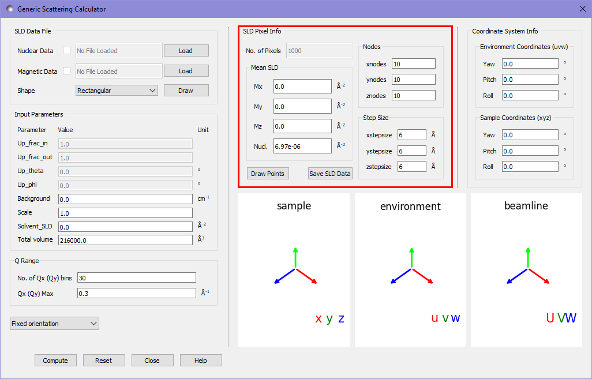

The default data within the generic scattering calculator (highlighted in red) describes a rectangular grid of 10x10x10 pixels, with 
each pixel being 6x6x6\ |Ang|. Each pixel has a constant nuclear SLD of 6.97x10\ :sup:`-6`\ |Ang|:sup:`-2`
and no magnetic SLD.

To calculate the scattering pattern we press the `compute` button, and the following image appears in the main window:

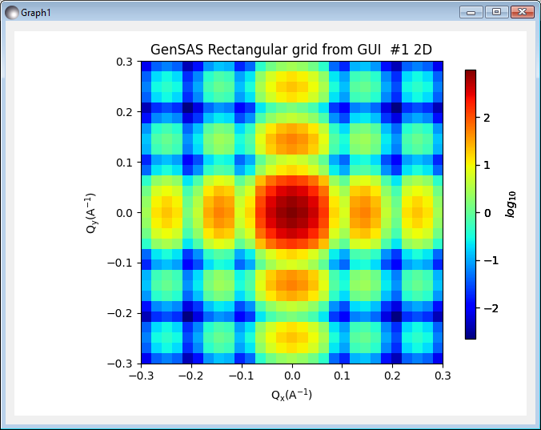

This shows the scattering intensity on a 30x30 grid of pixels, up to a maximum value of 0.3\ |Ang|:sup:`-1` in each axis, as
specified in the Q Range settings in the calculator. In order to see a higher resolution image we can adjust the number of Qx (Qy) bins. For a smooth image here we will set
this value to 100.

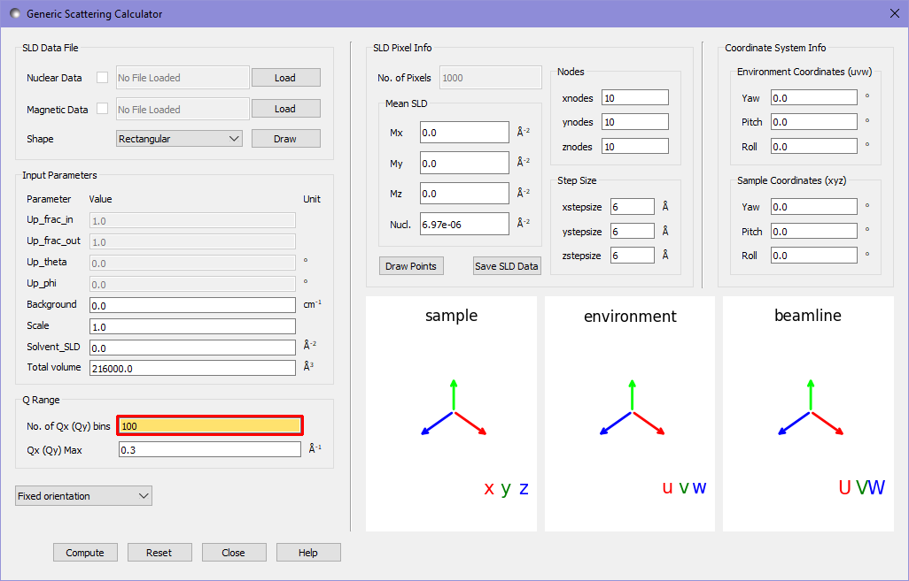

The orange highlight of the textbox informs us that this value is potentially too high. More precisely it is informing us that with the given spacing of
pixels in the realspace data the fourier transform cannot resolve peaks at such fine resolution in Q space. While using more Q bins can produce
nicer images - which more clearly show the overall pattern - we should be aware of this limitation. Pressing compute again gives us a new output:

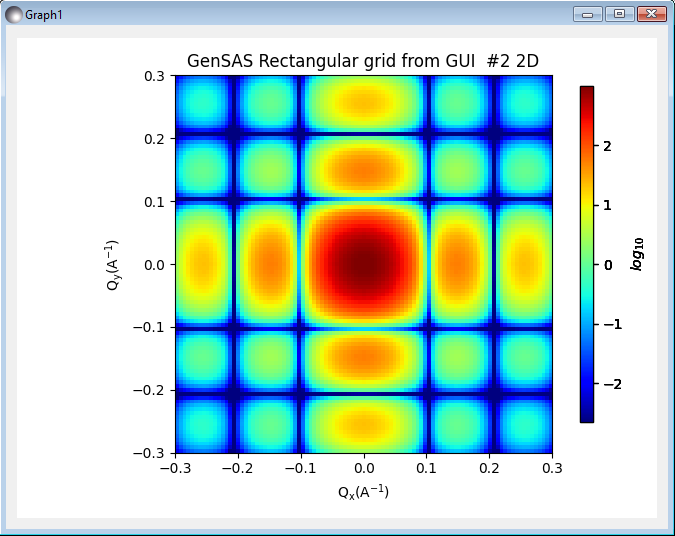

Given that for purely nuclear data the scattering pattern corresponds to a fourier transform, it should not be a suprise that for a cube oriented with
the axes, a sinc pattern appears.

It is often far more useful to know the orientational average at each magnitude $\|\mathbf{Q}\|$ than the result for a single oriented cube. Because the default data
is positioned on a regular grid, and contains only nuclear scattering length densities, we can use the Debye full average option, which uses the Debye formula to
calculate the orientational average:

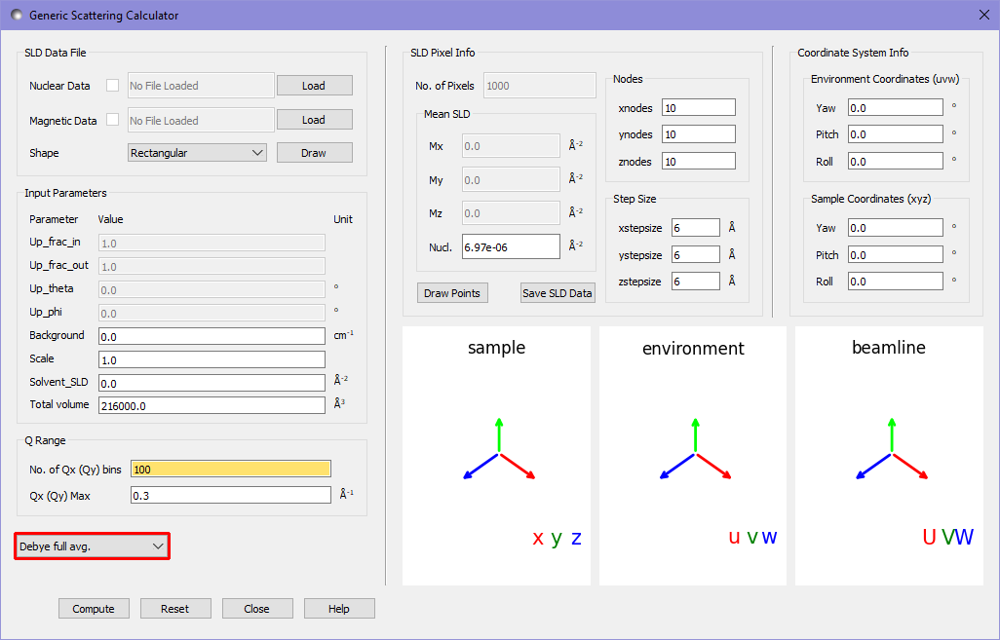

Pressing compute again gives:

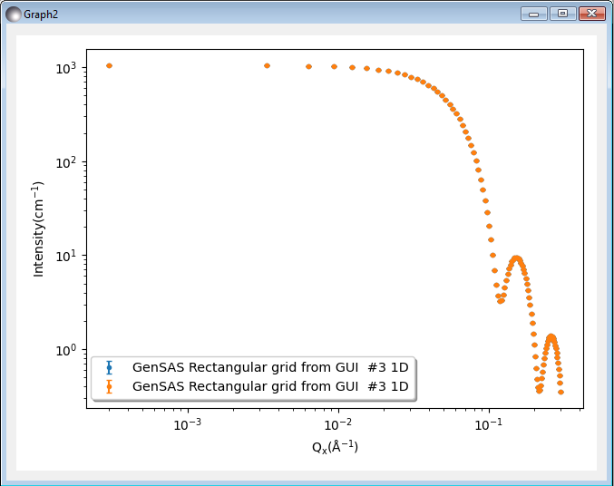

For such a simple structure as a cube, the analytical result is well known, and we can compare the calculator's simulation to the fitting tool. In the main window we select the most
recent dataset (the Debye full average) and select `Send data to` with `Fitting` mode selected in the adjacent drop down. We can now select the `Parallelepiped` model category and then
the `Parallelepiped` model in the fitting window. We also adjust all the paramters in the window to match those of the default data in the scattering calculator. 

 - scale: 1
 - background: 0
 - sld: 6.97 ($\times 10^{-6}$ in units)
 - sld_solvent: 0
 - length_a: 60
 - length_b: 60
 - length_c: 60

If we now press `Compute/Plot` at the bottom of the fitting window we see a plot of our data and the analytical result.

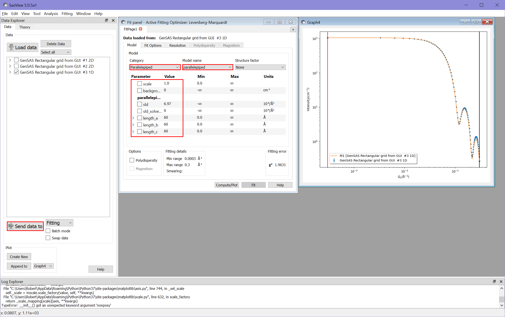
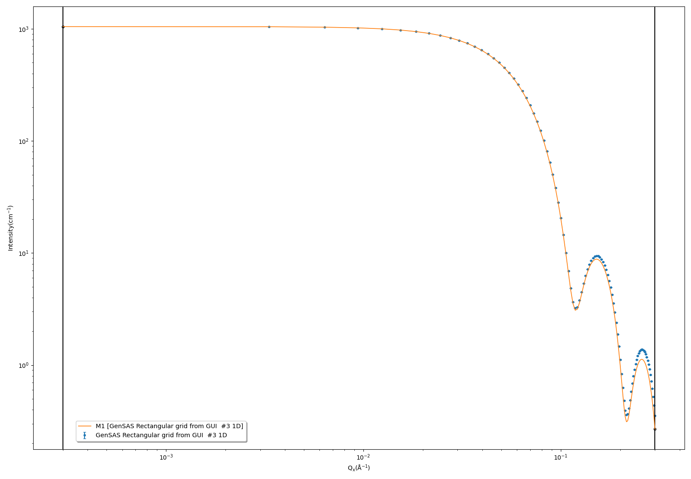

As we would expect, at higher Q values the calculator result deviates from the analytical result, due to the discretisation of the data in the calculator. With a 10x10x10 cube of pixels
we obtain $\chi^2 = 1.96$.

If we adjust the calculator settings to use a 20x20x20 grid of pixels to describe the same sample, we expect to see a much better match. We adjust the settings as follows:

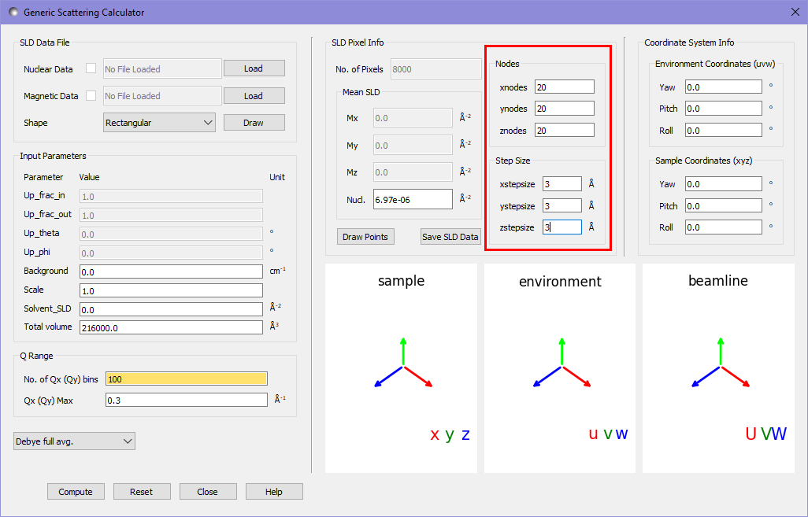

Recomputing the data and comparing it to the fitting calculator as before gives a substantially better fit of $\chi^2 = 0.12$. It is visibly obvious from the graph as well
that this fit is much closer to the analytical result.

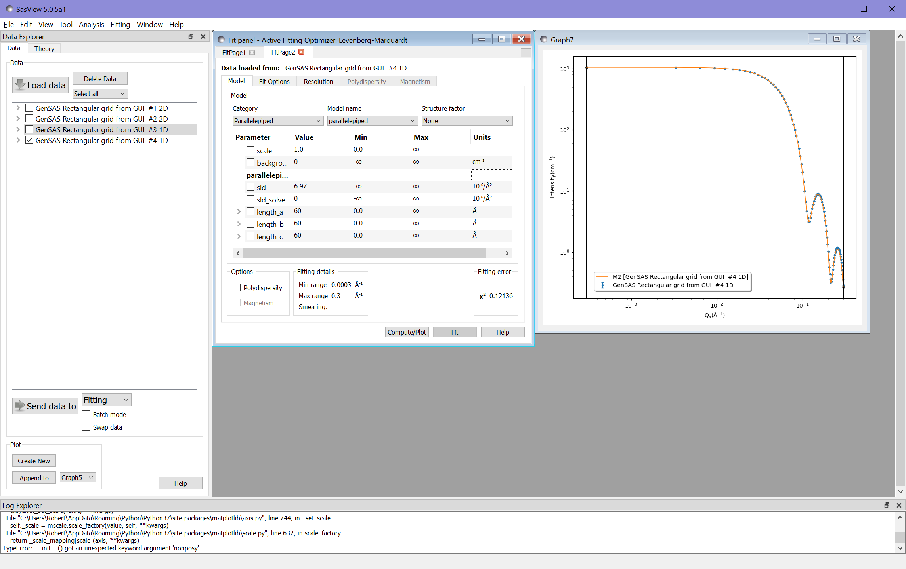
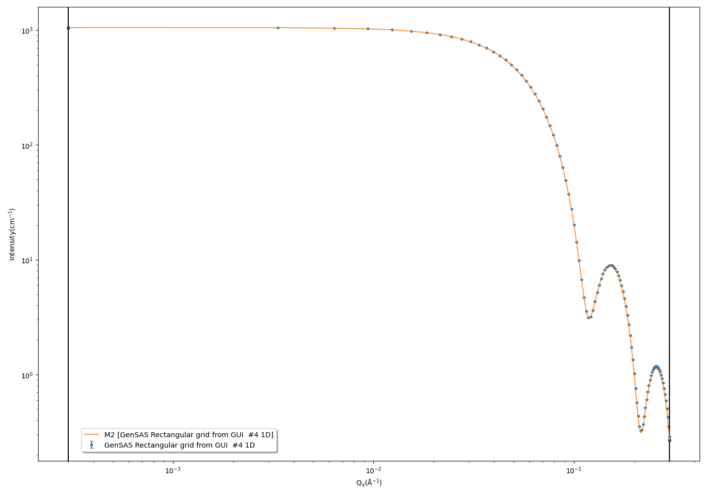

*Document History*

| 2021-09-14 Robert Bourne
