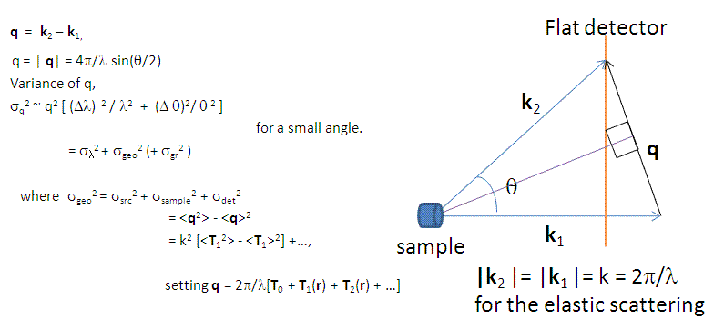
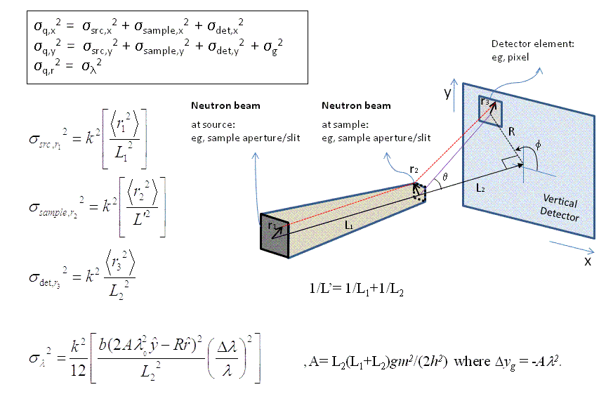

.. resolution_calculator_help.rst

.. This is a port of the original SasView html help file to ReSTructured text
.. by S King, ISIS, during SasView CodeCamp-III in Feb 2015.

Q Resolution Estimator Tool
===========================

Description
-----------

This tool approximately estimates the resolution of $Q$ from SAS instrumental
parameter values assuming that the detector is flat and normal to the
incident beam.

.. ZZZZZZZZZZZZZZZZZZZZZZZZZZZZZZZZZZZZZZZZZZZZZZZZZZZZZZZZZZZZZZZZZZZZZZZZZZZZZ

Using the tool
--------------

1) Select *Q Resolution Estimator* from the *Tool* menu on the SasView toolbar.

2) Select the source and source type (Monochromatic or TOF).

   *NOTE! The computational difference between the sources is only the
   gravitational contribution due to the mass of the particles.*

3) Change the default values of the instrumental parameters as required. Be
   careful to note that distances are specified in cm!

4) Enter values for the source wavelength(s), $\lambda$, and its spread (= $\text{FWHM}/\lambda$).

   For monochromatic sources, the inputs are just one value. For TOF sources,
   the minimum and maximum values should be separated by a '-' to specify a
   range.

   Optionally, the wavelength (BUT NOT the wavelength spread) can be extended
   by adding '; nn' where the 'nn' specifies the number of the bins for the
   numerical integration. The default value is nn = 10. The same number of bins
   will be used for the corresponding wavelength spread.

5) For TOF, the default wavelength spectrum is flat. A custom spectral
   distribution file (2-column text: wavelength (|Ang|\) vs Intensity) can also
   be loaded by selecting *Add new* in the combo box.

6) When ready, click the *Compute* button. Depending on the computation the
   calculation time will vary.

7) 1D and 2D $dQ$ values will be displayed at the bottom of the panel, and a 2D
   resolution weight distribution (a 2D elliptical Gaussian function) will also
   be displayed in the plot panel.

   TOF only: green lines indicate the limits of the maximum $Q$ range accessible
   for the longest wavelength due to the size of the detector.

   Note that the effect from the beam block/stop is ignored. So, in the small $Q$
   region near the beam block/stop

   [i.e., $Q < (2 \pi \cdot \text{beam block diameter}) / (\text{sample-to-detector distance} \cdot \lambda_\text{min})$]

   the variance is slightly under estimated.

8) A summary of the calculation is written to the SasView *Console* at the
   bottom of the main SasView window, below the plot.

.. figure:: resolution_tutor.png

   ..

   1) Define the source. Select *Photon* for X-ray. This selection only affects
      the gravitational contribution of the resolution
   2) Select between *Monochromatic* or *TOF*
   3) For *TOF*, there is the option
      of loading a custom spectral distribution using *Add New* in the combo
      box
   4) *Wavelength* and *wavelength spread*: one value for *Monochromatic*,
      minimum and maximum of range for *TOF*
   5) For *Source* and *Sample Size Aperture*, one value for a circular
      aperture (diameter) and two values separated by a comma (,) for a
      rectangular slit (side lengths)
   6) One value for one ($Qx$, $Qy$) location or more values separated by a
      comma (,) for more locations. *Note: the $Qx$, $Qy$ input boxes should
      have the same number of values.*
   7) Click on *Compute* button to start the calculation
   8) *Sigma_x* and *Sigma_y* are the components of the 2D $dQ$ at the last
      ($Qx$, $Qy$) point of inputs
   9) *Sigma_lamd* is the 2D $dQ_{\lambda}$ at the last point of inputs.
      *Note: $dQ_{\lambda}$ has only the Qr directional component*
   10) *(1D Sigma)* is the 1D $dQ$ at the last ($Qx$, $Qy$) point of inputs
   11) Plot of the result. For *TOF*, a green rectangle marks the limits of
       maximum $Q$  range accessible for the longest wavelength due to the
       size of the detector.

.. ZZZZZZZZZZZZZZZZZZZZZZZZZZZZZZZZZZZZZZZZZZZZZZZZZZZZZZZZZZZZZZZZZZZZZZZZZZZZZ

Theory
------

The scattering wave transfer vector is by definition

In the small-angle limit, the variance of $Q$ is to a first-order
approximation

The geometric and gravitational contributions can then be summarised as

.. image:: sigma_table.png

Finally, a Gaussian function is used to describe the 2D weighting distribution
of the uncertainty in $Q$.

.. ZZZZZZZZZZZZZZZZZZZZZZZZZZZZZZZZZZZZZZZZZZZZZZZZZZZZZZZZZZZZZZZZZZZZZZZZZZZZZ

References
----------

D.F.R. Mildner and J.M. Carpenter
*J. Appl. Cryst.* 17 (1984) 249-256

D.F.R. Mildner, J.M. Carpenter and D.L. Worcester
*J. Appl. Cryst.* 19 (1986) 311-319

.. ZZZZZZZZZZZZZZZZZZZZZZZZZZZZZZZZZZZZZZZZZZZZZZZZZZZZZZZZZZZZZZZZZZZZZZZZZZZZZ

.. note::  This help document was last changed by Steve King, 01May2015
